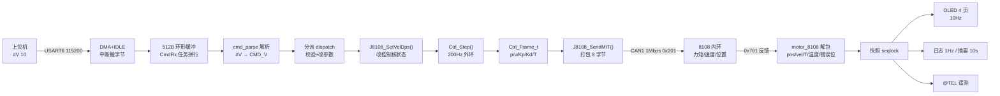

# 00 · 工程总览与阅读指南

> **一句话**：这块 A 板（STM32F427）是一台 **"串口指令 → CAN 力矩" 的关节电机控制器**。上位机用文本命令（`#V 10`）说"我要 10°/s"，A 板自己跑外环控制（200 Hz），把结果打包成 CAN 的 MIT 帧（0x201）发给 8108 关节电机；电机的反馈帧（0x781）回来后再上屏、上日志、上报遥测。
>
> 本文档集 = 把这个工程的代码**逐函数、逐参数**讲清楚，并给出**流程图/时序图**。本文（00）是总纲，其余 7 册按模块深入。

---

## 0. 这套文档怎么读

| 你的目的 | 读什么 |
|---|---|
| 我要**用**它（发命令、看屏幕、测试） | ⑨ `docs/操作手册_串口命令.md` → ⑩ `docs/测试手册_8108串口控制.md` |
| 我要**看懂代码怎么跑** | 本文 00 → ① 启动与任务框架 → ⑤ 控制任务与帧生成 → ② CAN 底层与 8108 驱动 |
| 我要**搞懂控制算法** | ③ 控制核算法（含公式推导与算例） |
| 我要**改/加命令** | ④ 串口协议链 |
| 我要**改显示/按键** | ⑥ 显示按键与监控 |
| 我要**学 CAN 运动控制，将来自己写电机固件** | ⑦ CAN 运动控制学习指南（重点） |
| 我要查"某个函数在哪、干什么" | ⑧ `docs/code/_函数地图.md`（53 文件 / 443 个函数位置 / 428 个唯一名） + `流程图_交互版.html`（可搜索） |
| 我要看**已发现的问题与建议修法** | ⑪ `docs/code/99_交付说明与问题清单.md`（P1×5 / P2×7 / P3×8，全部带证据行号） |

文档集清单（全部在 `fw_rtos_base/docs/`）：

```
docs/
├─ code/
│   ├─ 00_总览与阅读指南.md          ← 本文（总纲：架构、时序、任务表、术语、踩坑）
│   ├─ 01_启动与任务框架.md          ← main.c / freertos.c / stm32f4xx_it.c/中断/版本/崩溃黑匣子
│   ├─ 02_CAN底层与8108驱动.md        ← bsp_can + motor_8108：MIT 帧打包/解包、滤波器、中断
│   ├─ 03_控制核算法.md              ← ctrl_core：FSM、PI+前馈、限幅、保护、事件
│   ├─ 04_串口协议链.md              ← ISR→环形缓冲→拼行→解析→分派→回包
│   ├─ 05_控制任务与帧生成.md         ← J8108_Task：200Hz 帧发生器、握手、看门狗、恢复
│   ├─ 06_显示按键与监控.md           ← Monitor_Task + Oled_Task + OLED 软 I2C + 按键事件机
│   ├─ 07_CAN运动控制学习指南.md      ← 教学：怎么让电机"转得好"、自研固件路线图
│   ├─ 99_交付说明与问题清单.md      ← ★ 入口：交付清单、阅读顺序、验收证据、20 条问题清单（含证据行号）
│   └─ _函数地图.md                  ← 自动生成：文件→行数→函数（行号）清单
├─ 协议_串口控制_v1.md               ← 串口协议定稿（设计文档）
├─ 操作手册_串口命令.md               ← 面向使用者：发什么 → 收什么 → 电机做什么
└─ 测试手册_8108串口控制.md           ← 每次改动后的验收清单（TM-1…TM-7，含逐字预期）
```

---

## 1. 系统全景（方块端口连线图）

```
                    ┌──────────────────────────── PC / 上位机 ────────────────────────────┐
                    │  串口助手 或 tools/serial_bench.py    （115200 8N1，勾“发送新行”）  │
                    └───────────────┬─────────────────────────────────────────────────────┘
                                    │ USB-TTL（3.3V）
          发 "#V 10\n" ─────────────▼──────────── 收 "@OK / @EVT / @TEL / [日志]"
┌───────────────────────────────────────────────────────────────────────────────────────────┐
│ A 板  STM32F427IIH6 @168MHz   FreeRTOS 32KB heap                                          │
│                                                                                           │
│  ┌── USART6 (TX=PG14 / RX=PG9) ─────────────┐   ┌── CAN1 (PD0=RX / PD1=TX, 1Mbps) ───┐   │
│  │ DMA + IDLE 收包 (bsp_usart)              │   │ bsp_can：滤波器 + 注册 + 中断分发   │   │
│  │        │ 中断只搬字节                    │   │        ▲                │          │   │
│  │        ▼                                 │   │        │ 0x781 反馈     │ 0x201    │   │
│  │   [512B 环形缓冲] ──> CmdRx 任务(prio4)  │   │        │                ▼          │   │
│  │        拼行→解析(cmd_parse)→分派         │   │  motor_8108：打包/解包 MIT 帧      │   │
│  │        │                     ▲           │   │        ▲                │          │   │
│  │        │ 调 J8108_* API      │ 回包      │   │        │                │          │   │
│  │        ▼                     │           │   │        │                ▼          │   │
│  │  ┌────────────────────────────────────┐  │   │  J8108_Task (prio5, 200Hz)         │   │
│  │  │  控制核 ctrl_core（纯逻辑）        │◄─┼───┼── Ctrl_Step() 每 5ms 算一次      │   │
│  │  │  模式 FSM + 限幅 + PI/PD + 保护     │  │   │        │                           │   │
│  │  └────────────────────────────────────┘  │   │        │ 快照(seqlock)             │   │
│  │                     │                    │   └────────┼───────────────────────────┘   │
│  │                     │ 共享快照            │            │                               │
│  │  ┌──────────────────▼────────────────┐   │   ┌────────▼───────────────────────────┐   │
│  │  │ Monitor_Task (prio3)              │   │   │ KeyTask (prio4, 10ms 扫描)          │   │
│  │  │ 屏刷10Hz / 日志1Hz / 摘要10s / 遥测│   │   │ 单击=下页 双击=上页 长按=回P0        │   │
│  │  └───────┬───────────────────────────┘   │   └────────┬───────────────────────────┘   │
│  │          │ 局部刷新                       │            │ 事件组（不碰电机）             │
│  │  ┌───────▼────────┐   ┌──────────────┐   │   ┌────────▼───────────────────────────┐   │
│  │  │ SH1106 OLED    │   │ UART10 日志  │   │   │ Oled_Task 渲染器（4 页，无任务）    │   │
│  │  │ 软I2C PB10/PB9 │   │ （与协议同口）│   │   └────────────────────────────────────┘   │
│  │  └────────────────┘   └──────────────┘   │                                            │
└───────────────────────────────────────────────────────────────────────────────────────────┘
                                    │ CAN_H / CAN_L（+共地，两端 120Ω）
                                    ▼
                    ┌─────────────────────────── 8108 关节电机 ───────────────────────────┐
                    │  24V 供电 | 减速比 8:1 | 极对数 21 | 双编码器                       │
                    │  内环：电流/速度/位置（厂商固件，MIT 帧进来直接当“力矩接口”）         │
                    │  使能帧 0x201 ..FC | 反馈帧 0x781 | 命令 ID 0x001                    │
                    └──────────────────────────────────────────────────────────────────────┘
```

渲染版（同一条命令通路的流程图）：



---

## 2. 硬件与接口速查

| 项目 | 值 | 备注 |
|---|---|---|
| MCU | STM32F427IIH6，SYSCLK 168MHz，APB1 42MHz | RoboMaster A 板 |
| CAN1 | **PD0=RX / PD1=TX**，1 Mbps，经典帧 | 收发器 MCP2562，板载 120Ω（R80） |
| CAN2 | 由 `bsp_can` 一并启动，但本工程未注册设备 | CubeMX 生成，遗留 |
| 串口（协议+日志） | **USART6：TX=PG14 / RX=PG9**，115200 8N1 | 日志与协议**同口**，靠 `[tag]` / `@` 前缀区分 |
| OLED | SH1106，**软件 I2C**：SCL=PB10 / SDA=PB9（开漏），地址 0x78 | 无硬件 I2C，靠 DWT 延时打时序 |
| 按键 | **PB2，高有效**（按下=1） | 上电空闲 raw level = 0 |
| 电机 | STACKFORCE 8108，24V，减速比 8:1，**双编码器** | 双编版：POS/VEL 是**输出端**，不除 8 |
| 电机 ID | 0x01（命令） / 0x201（MIT） / 0x781（反馈） | 可改 |
| 波特率/量程 | P ±12.56 rad(±720°) · V ±45 rad/s · T ±18 N·m | 单编版是双编的 8 倍，别混 |

**动力与总线检查（断电测）**：CAN_H–CAN_L ≈ 120Ω；接上电机后 ≈ 60Ω；A 板与电机**必须共地**；电机电源独立 24V。

---

## 3. 任务表（FreeRTOS）

| 任务 | 优先级 | 栈(words) | 周期/触发 | 职责 | 创建处 |
|---|---|---|---|---|---|
| `J8108` | **5** | 640 | 200 Hz（`vTaskDelay(1)`+节拍） | 控制帧发生器、握手、看门狗、保护 => 唯一往 CAN 发帧的任务 | `Task/Src/J8108_Task.c:672` |
| `LedTask` | 5 | 512 | 阻塞延时 | 流水灯（活着指示）；纯 `vTaskDelay`，不抢 CPU | `Task/Src/Led_Task.c:143` |
| `KeyTask` | 4 | 256 | 10 ms | 扫描 PB2、去抖、单击/双击/长按判定 → 事件组 | `mcu_bsp/key/bsp_key.c:161` |
| `CmdRx` | 4 | 640 | 事件驱动（2 ms 轮询） | 串口拼行→解析→分派→回包 `@OK/@ERR` | `Task/Src/CmdRx_Task.c:862` |
| `Monitor` | 3 | 640 | 100/1000/10000 ms 三段 | 屏刷 10Hz、日志 1Hz、10s 摘要、`@TEL` | `Task/Src/Monitor_Task.c:317` |
| `LogTx` | 1 | 512 | 队列/缓冲驱动 | 日志串口发送（懒创建，首次打印时建） | `mcu_bsp/log/bsp_log.c:76` |
| `CliTask` / `SdCard` / `MotorTest` | 3 / - / 5 | 512 / 2048 / 512 | — | **本工程关闭**（`FEATURE_SD_CLI=0` 等） | main.c 内 `#if` |
| IDLE / Tmr | 0 | — | — | 空闲钩子里做栈高水位体检 | — |

> **优先级设计原则**：控制(5) > 协议/按键(4) > 显示(3) > 日志(1) > IDLE(0)。
> 高优先级任务**绝不允许长阻塞/长自旋**——一旦抢占 CPU，低优先级全被饿死（实测过一次"回包被切断、像死机"，根因就是 CAN 邮箱自旋 guard 太长；现改为 ≤50µs）。

---

## 4. 启动时序（`Core/Src/main.c`）

```
HAL_Init()                                        main.c:113
SystemClock_Config()  → 168MHz
MX_GPIO_Init() / MX_DMA_Init()                    main.c:127-128
MX_CAN2_Init()  MX_USART3_UART_Init()             main.c:129-130   ← CubeMX 遗留，未使用
MX_USART6_UART_Init()                             main.c:131      ← 协议+日志口
MX_TIM4_Init()  MX_TIM5_Init()                    main.c:132-133   ← 遗留（PWM 试验）
MX_CAN1_Init()                                    main.c:134      ← ★ 8108 所在总线
POWER1..4_CTRL = 1,1,1,0                          main.c:140-143   ← 板载供电使能
UART10_Init()                                     main.c:147      ← 日志口回调注册（必须最先）
  LOG_I("fw", "=== firmware %s (release %s, built ...) ===")   ← 双版本标识
  LOG_I("fw", "features: J8108=1 KEY=1 OLED=1 LED=1 | SD=0 CLI=0 CAR=0")
report_previous_fault()                           main.c:153      ← ★ 崩溃黑匣子自报（RTC 备份寄存器）
#if FEATURE_OLED_UI
  OLED_Init()                                     main.c:162      ← 软 I2C 初始化 + 清屏
  #if FEATURE_MONITOR_TASK
    Proto_TxInit()                                main.c:164      ← ★ 协议发送互斥锁（先于任何任务）
    Monitor_Task_Init()                           main.c:165
#if FEATURE_J8108
  J8108_Task_Init()                               main.c:175      ← ★ 内部先 J8108_Init(&hcan1) 注册 CAN，再建任务
  #if FEATURE_SERIAL_CTRL
    CmdRx_Task_Init()                             main.c:178
#if FEATURE_KEY
  Key_Task_Init()                                 main.c:182
LOG_I("fw", "task bring-up: active=%u | free heap=%u B / total=%u B")   ← 任务创建自检
SYS_SetState(SYS_STATE_RUNNING)                   main.c:191
osKernelStart()                                   ↓ 调度器接管，J8108 任务开始 200Hz 发帧
```

**两条铁律（踩过坑）**
1. 任何新任务/新外设的初始化都必须放在 `main.c` 的 **USER CODE 2** 区（`main_cpp()` 已停用）——否则被 CubeMX 重新生成时冲掉。
2. `J8108_Task_Init()` 内部**必须先 `J8108_Init(&hcan1)`**（注册 CAN 实例与回调）**再** `xTaskCreate`；曾经漏掉这一步 → 开机 `CAN status -> INIT FAIL`、电机毫无反应。

---

## 5. 四条数据通路（逐跳）

### 通路 A：命令下行（PC → 电机）——"参数是怎么进去的"

```
① PC                                     发 "#V 10\n"
② USART6 RX(DMA)                         字节进 DMA 缓冲，IDLE 线空闲触发中断
③ HAL_UARTEx_RxEventCallback             bsp_usart 记录 recv_len（volatile uint16_t）
④ module_callback → CmdRx_RxIsr()         【中断上下文】只 memcpy 进 512B 环形缓冲 + 字节计数
⑤ cmdrx_task (prio4)                     每 2ms 取字节、拼成一整行（\r 或 \n 都算结束）
⑥ Cmd_ParseLine()                        cmd_parse.h：大小写不敏感分词 → 命令码 CMD_V + 参数 10.0
                                           （畸形数字必须报 BADARG，不能当关键字）
⑦ dispatch()                             CmdRx_Task.c：校验（使能？范围？软限位？）→ 调用
⑧ J8108_SetVelDps(deg/s, kd, tff)         拷进控制核 Ctrl_State/Params（tc_ 临界区）
⑨ 回包 "@OK V target=10.00 dps mode=SPEED"  经 Proto_Send（互斥锁，整行 → 串口）
⑩ J8108 任务 (200Hz) 下一拍                 Ctrl_Step() 算出 T → Ctrl_Frame_t
⑪ J8108_SendMIT()                        打包 p16/v12/kp12/kd12/t12 → 8 字节
⑫ HAL_CAN_AddTxMessage(0x201)            邮箱 → CAN1 1Mbps → 8108
⑬ 8108 内环                              把 MIT 帧当"力矩/位置/速度指令"执行
```
**时延量级**：PC→A板 受串口（115200 下 1 行 ~1ms）；A 板内最多 1 个控制周期（5ms）+ 解析（<1ms）→ **端到端 ≈ 6~10ms**。

### 通路 B：反馈上行（电机 → 屏/日志/遥测）

```
① 8108 发 0x781（8 字节：ERR|POS16|VEL12|T12|TMos8|TMotor8）
② CAN1 FIFO0 中断 → HAL_CAN_RxFifo0MsgPendingCallback
③ bsp_can 分发 → j8108_rx_callback()      【中断】只做：拷贝到 s_rx、计数、new_frame=1（不做 log/snprintf）
④ J8108_Task 每拍 J8108_Update()          解包 → 物理量（deg / deg/s / N·m / ℃）
                                          ＋ ERR 位 → 错误字符串；更新 seqlock 快照
⑤ J8108_CopySnapshot()                    任何读者拿到"同一帧"的一致副本（防撕裂）
⑥ 三个出口，同一数据源：
   ├─ Monitor 任务 100ms → Oled_Task 渲染 4 页 → OLED
   ├─ Monitor 任务 1000ms → LOG_I("Monitor","data: pos=.. vel=.. T=.. Tm=.. err=.. mode=.. age=..")
   └─ Monitor 任务 @TEL 周期 → "@TEL ms=.. mode=.. set=.. pos=.. vel=.. T=.. age=.."
```
**门控铁律**：`age > 200ms` 或从未收到反馈时，**绝不打数值**（只报 `link=DOWN ... values withheld: no fresh frame`；屏上 `AGE never / LINK DOWN`）。原因：早期版本把全 0 缓冲当数据解算，屏上出现 `pos=-719.64 vel=-2578.3` 这种"假数据"，会误导排查。

### 通路 C：保护与事件（安全）

```
心跳：任何控制类命令刷新 s_last_cmd_ms；wd_ms>0 且超时 → Ctrl_Heartbeat 报 CTRL_EV_TIMEOUT → 退 DAMP（保持使能，不失能）
保护：Ctrl_Protect() 每拍检查
      · 电机报错位 err≠0 / 过温（Tm>70℃ 预警，>85℃ 停机，5℃ 滞回）
      · 跟随误差：|目标−实际| > 30° 且持续 500ms → 退 DAMP
      · 堵转：|T|>8N·m 且 |v|<10°/s 持续 1s → 报警 + 退 DAMP
      · 软限位：|pos| 超 ±170° → 限制目标（不硬撞）
事件：置位 → Ctrl_TakeEvents(取走即清) → @EVT 文本（如 "@EVT LIMIT what=trate"）
      · 边沿锁存 + **消退去抖**：条件必须连续消失 ≥1s 才允许重报（否则 200Hz 刷屏，实机踩过）
链路：反馈超时 200ms / 发帧无 ACK → "@EVT LINKLOST what=noack|nofb" + 自动退 DAMP
```

### 通路 D：按键与显示（纯 UI，绝不碰电机）

```
PB2 电平 → KeyTask(10ms) 扫描去抖 → key_core 判定（单击/双击/长按≥2s/卡死10s）→ 事件组
        → Monitor 任务消费 → ui_action.h 决策 → 翻页(下一页/上一页/回 P0) → Oled_Task 渲染
```
> 方案 C（用户决定）：**按键与电机控制彻底解耦**。屏幕只显示状态，按键只翻页。

---

## 6. 时间预算（各任务每周期要干什么）

| 任务 | 周期 | 关键工作 | 预算 | 实测 |
|---|---|---|---|---|
| J8108 | 5 ms | Update 解包 + Protect + Ctrl_Step + SendMIT | <1 ms | `hz=202~204`、`dtmax=1~10ms` |
| CmdRx | 2 ms 轮询 | 取字节/拼行（多数轮次无事） | <1 ms | 命令时 <1ms |
| KeyTask | 10 ms | 2 次 GPIO 读 + 状态机 | ~10 µs | — |
| Monitor | 100/1000/10000 ms | 渲染/格式化 | 屏刷 <10 ms | 屏刷占 10Hz 的 <10% |
| LogTx | 事件 | 串口发送（阻塞 115200：127B ≈ 11 ms） | — | `txdrop=0` |

**关键约束**：控制周期 5 ms 是所有预算的基准。串口最长的回包 127 字节 ≈ 11 ms 发送时间，靠**发送互斥锁 + 有界等待 50 ms** 串行化，避免多任务同时写口。

---

## 7. 关键设计决策与踩过的坑

| # | 决策 | 为什么这么定 | 踩过的坑 / 证据 |
|---|---|---|---|
| 1 | **串口是唯一控制入口**（ASCII 协议） | 免调试器、可脚本化；日志与协议同口靠前缀区分 | `#EN` 不发换行就没反应 → 现已兼容 `\r`/`\n`，并加 `RX nL mB` 计数诊断 |
| 2 | **A 板做外环，8108 内环当"力矩接口"** | 里外分工：电机内环快（电流环 kHz 级），外环在板子上可自由改算法 | 直接用原生速度模式二期再说 |
| 3 | **双编口径：POS/VEL = 输出端，不除 8** | 用户 2026-09-17 确认为双编版；单/双编差 8 倍 | 早期按单编算 → 速度目标差 8 倍 |
| 4 | **按键纯 UI（方案 C）** | 安全：误触不会动电机 | 删掉 `j8108_action.h` 的按键使能/失能逻辑 |
| 5 | **屏幕 4 页 + 三层同源快照** | 屏/日志/遥测必须显示同一帧，否则互相矛盾 | `J8108_CopySnapshot()` seqlock |
| 6 | **数据必须门控**（age/新鲜度） | 绝不播过时/假数据 | `#STAT` 曾打 `pos=-719.64`（全 0 缓冲被解算成量程下限） |
| 7 | **事件必须"锁存 + 消退去抖"** | 纯边沿锁存挡不住抖动式受限 → 刷屏 | 实机 `@EVT LIMIT` 78ms 内几十条 |
| 8 | **力矩斜率限制 `TRATE`** | 小惯量直驱关节上，力矩突变 → 极限环震荡 | `#V 20` 猛抖一下后停（kp_v 过大 + 无限幅） |
| 9 | **高优先级任务禁止长自旋** | prio5 任务抢 CPU → 低优先级全饿死（假死机） | `motor_8108.c` 邮箱自旋 guard 100000 → 改 500（≈50µs） |
| 10 | **崩溃取证写 RTC 备份寄存器** | `.bss` 随复位清零，黑匣子必须掉电才丢 | 开机自报 `PREVIOUS RUN CRASHED: PC=.. CFSR=..` |
| 11 | **协议口有界等待 + 丢行计数** | 串口被占死会让整个系统看起来"死了" | `PROTO_TX_WAIT_MS=50`、`txdrop` 计数打到摘要里 |
| 12 | **版本号双轨**（发布版手写 + dev 自动） | 防止"烧了旧版还在排查" | 开机横幅含 `FW_VERSION_STR + __DATE__/__TIME__` |
| 13 | **修改必同步测试手册** | 每次改动写明"重点+逐字预期"，否则无法验收 | `docs/测试手册_8108串口控制.md` TM-1…TM-7 |
| 14 | **摩擦前馈 TFF + 按方向取号** | 静摩擦 0.25 N·m 远大于比例项 0.03 → 起动必须前馈 | 实测：`#V 10` 前 6 秒不动，积分要 80 s 才攒够 |

---

## 8. 术语表（读代码必备）

| 术语 | 含义（本项目语境） |
|---|---|
| **MIT 帧** | 一帧 8 字节同时携带 位置/速度/Kp/Kd/力矩 五个量，是 8108 的"力矩接口"。位宽 16/12/12/12/12 |
| **双编码器（双编）** | 电机端 + 输出端都有编码器 → 反馈的位置/速度是**输出端**的，减速比 8 已经算好，**不要再除 8** |
| **外环 / 内环** | 外环 = A 板上的 200Hz 控制（本工程自己写）；内环 = 电机内部电流/速度环（厂商固件） |
| **静摩擦 / 动摩擦 / 黏滑** | 静摩擦 0.25 N·m > 动摩擦 0.1 N·m → 卡住→攒力→突然滑动→回粘 = "卡卡的"（stick-slip） |
| **前馈（feedforward）** | 不等误差出现就先把已知的负载/摩擦力矩加上去；`TFF` = 摩擦前馈 |
| **限幅来源** | `@EVT LIMIT what=setpoint|torque|trate` —— 分别是软限位/力矩上限/力矩斜率限制起作用了 |
| **抗积分饱和** | 只在"未被限幅"时才积分，否则积分会攒到反向超调 |
| **消退去抖** | 事件条件连续消失 ≥1s 才允许重新上报（`CTRL_EV_CLEAR_MS`） |
| **快照 / seqlock** | 写入者改序号→写数据→再改序号；读者校验序号一致才采信（防止读到半新半旧的一帧） |
| **门控（gating）** | 数据不新鲜时禁止打数值，只报链路状态 |
| **心跳** | `wd_ms`；超时退 DAMP（保持使能、防坠），不是失能 |
| **ACK** | 使能/失能/清错等握手命令要求"发出去后 20ms 内有反馈帧"才算成功 |
| **邮箱（TxMailbox）** | CAN 发送硬件缓冲（3 个）。总线无 ACK 时帧会一直占着不放（`AutoRetransmission=ENABLE`） |
| **AutoRetransmission** | 自动重传：好处是抗干扰，坏处是"无节点时永不放邮箱" → 必须靠 `HAL_CAN_AbortTxRequest` 兜底 |
| **DAMP 模式** | 阻尼保持：Kd 起作用、力矩由速度误差生成，轴不自由、能防坠 |

---

## 9. 代码地图（目录 → 职责 → 详解分册）

| 目录/文件 | 职责 | 详解见 |
|---|---|---|
| `Core/Src/main.c` `freertos.c` `stm32f4xx_it.c` | 启动、任务创建、中断、崩溃现场 | ① |
| `Core/Inc/feature_config.h` `FreeRTOSConfig.h` `main.h` | 功能裁剪宏、RTOS 配置 | ① |
| `mcu_bsp/sys_status/` | 系统状态机、崩溃黑匣子 | ① |
| `mcu_bsp/can/bsp_can.{c,h}` | CAN 初始化、滤波器、注册分发 | ② |
| `mcu_bsp/Motor/motor_8108.{c,h}` | 8108 驱动：MIT 打包/解包、命令帧、快照 | ② |
| `mcu_bsp/ctrl/ctrl_core.{c,h}` | **控制核**：FSM、PI/PD、限幅、保护、事件（纯逻辑，可 PC 测试） | ③ |
| `mcu_bsp/proto/cmd_parse.h` `proto_tx.{c,h}` | 命令解析、发送互斥 | ④ |
| `Task/Src/CmdRx_Task.c` | 收字节→拼行→分派→回包 | ④ |
| `mcu_bsp/uart/bsp_usart.{c,h}` `uart10_def.c` | DMA+IDLE 收包、日志口回调 | ④ |
| `mcu_bsp/log/bsp_log.{c,h}` | 日志（级别、英文、与协议同口） | ④ |
| `Task/Src/J8108_Task.c` | **200Hz 帧发生器**、握手、看门狗、保护接线、恢复 | ⑤ |
| `Task/Src/Monitor_Task.c` `Oled_Task.c` `ui_status.h` | 屏 10Hz / 日志 1Hz / 摘要 / `@TEL` | ⑥ |
| `mcu_bsp/oled/OLED.{c,h}` | SH1106 软 I2C 驱动 + 显存 | ⑥ |
| `mcu_bsp/key/bsp_key.{c,h}` `key_core.{c,h}` `Motor/ui_action.h` | 按键扫描、事件机、UI 策略 | ⑥ |
| `mcu_bsp/Motor/{dm_j4310,c620,dc_motor,servo}.{c,h}` | 其它电机驱动（本工程未用） | — |
| `mcu_bsp/Math/` `filter/` `system_controller/` `protocol*/` `sd/` `fs/` `cli/` `Device/` | 通用库/小车遗留（多数未启用） | — |
| `tools/verify_dev.py` `serial_bench.py` + 根 `Makefile` | 一键核验（含宿主机单元测试）、台架冒烟 | 见 ⑨⑩ |

---

## 10. 已知注意点 / 待办

| 项 | 说明 | 建议 |
|---|---|---|
| `LedTask` 优先级 = 5（与 J8108 相同） | 目前只做 `vTaskDelay`，不抢 CPU | 若将来在 LED 任务里加耗时活，务必降到 2 |
| 速度模式默认 `KD_DAMP=1.0` | 电机内部阻尼 `T=−Kd×v`，10°/s 时约 0.17 N·m，与摩擦同量级 | 速度模式建议 0.2~0.5（待实测确认） |
| `MX_CAN2_Init` / `MX_USART3_UART_Init` / `MX_TIM4/5_Init` | CubeMX 遗留，未被使用 | 无害，勿删以防重生成问题 |
| SD 卡 / CLI / 小车任务 | `FEATURE_*=0` 关闭（省 RAM/CPU） | 需要时再开 |
| `#SETP` 原始 MIT 直通 | 默认锁死，需 `#SET safety 0` | 用于协议逆向，勿在带载时乱用 |
| `#ZERO` 零点 | 需 `CONFIRM` 二次确认 | 会改电机内部零位，谨慎 |
| **`J8108_CopySnapshot` seqlock 读侧缺陷** | `continue` 会跳过拷贝且读未初始化 `s2`（UB），极端情况返回未填充快照 | 见 ⑪ P1-1（已给 3 行修法） |
| **`#STAT` 回包超 127B 被截断** | 常见情形即 135B（`rx/tx` 6 位数起）→ 尾部 `hold=/set=` 消失 | 见 ⑪ P1-2 |
| **堵转门限 8.0 > 力矩上限 7.5** | SPEED 模式下堵转保护不触发 | 见 ⑪ P1-3 |
| **TFF 在目标为 0 时仍施加** | `set_applied>=0` 取号 → 停车时 +TFF 常值偏置 | 见 ⑪ P1-4 |
| `CANTransmit()` 无界自旋等邮箱 | `bsp_can.c:99`，无 ACK 时永久卡死调用任务（8108 不走它） | 见 ⑪ P1-5 |
| 原生位置/速度模式（0x301/0x101） | 二期 | 目前一切走 MIT 帧 |

---

## 11. 快速入口

```bash
# 一键核验（宿主机单元测试 + 静态断言 + Keil 构建 + MAP 对象核对）
cd "C:\Users\Administrator\Desktop\四轮麦轮小车"
PYTHONPATH= /c/msys64/usr/bin/make verify      # 全部
PYTHONPATH= /c/msys64/usr/bin/make fast        # 跳过构建，秒级
PYTHONPATH= /c/msys64/usr/bin/make build       # 只编译
PYTHONPATH= /c/msys64/usr/bin/make bench PORT=COM3   # 台架冒烟（需 USB-TTL，免电机）

# 串口交互
python fw_rtos_base\tools\serial_bench.py --port COM3 --interactive

# 发命令（串口助手：115200，勾“发送新行”）
#PING   #VER   #STAT   #EN   #SET KP_V 0.005   #V 10   #V 0   #STOP   #DIS
```

**常用参数速查（速度模式起步套）**

```
#LOG 1              #EN                #WD 0              #LIM T 2
#SET KI_V 0.02      #SET TRATE 20      #SET KD_DAMP 0.3   #SET TFF 0.15   ← TFF 需 ≥v0.1.60-dev
#V 10               反之旧固件用 #V 10 0.3 0.15（第 3 参=一次性摩擦前馈）
#V 0 → #STOP → #WD 200                    要松轴再 #DIS
```

---

*本文由工程实测数据 + 源码阅读整理；对应的验收清单与逐字预期见 `docs/测试手册_8108串口控制.md`。*
