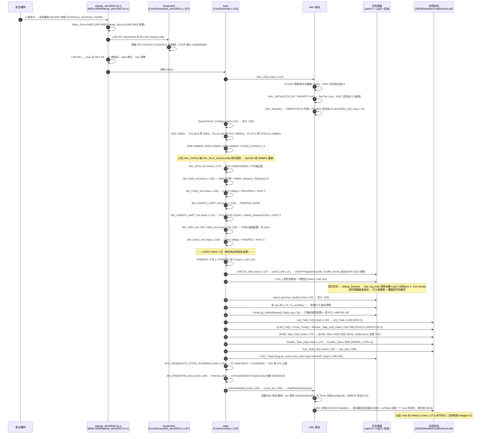

# 01 · 启动与任务框架（逐函数详解）

> 工程：`fw_rtos_base`（STM32F427IIHx / RoboMaster A 板 / Keil MDK 工程 `MDK-ARM/F427IIH6_CAN.uvprojx` / FreeRTOS 10.3.1 + CMSIS-RTOS v1 包装）
> 本文覆盖：从上电复位到调度器启动、任务创建、开机自报、中断向量、FreeRTOS 配置宏、到「200Hz 控制帧在跑」的端到端数据流。
> 写作约束：所有函数、参数、行号均来自**真实代码阅读**（用 `grep -n` / `sed -n` / `read_file` 逐条核对），未编译、未改动任何源码。
> 版本现场：`FW_VERSION_STR = "v0.1.60-dev"`、`FW_RELEASE_STR = "V0.02.1"`（`mcu_bsp/version/version.h:16-19`）。

---

## 1. 一句话职责 + 文件/接口清单

**一句话职责**：`main.c` 负责「把时钟、外设、日志通道、崩溃黑匣子按正确顺序点亮，然后把 6 个应用任务 + 1 个日志任务 + 1 个 CubeMX 占位任务全部建好，最后把 CPU 交给 FreeRTOS 调度器」；`stm32f4xx_it.c` 负责「把所有异步事件（SysTick / CAN 反馈 / 串口 DMA+IDLE）送进内核，并把致命故障（HardFault / 栈溢出）落进可复位后读取的黑匣子」。

### 1.1 本文负责的文件（只读，未修改）

| 文件 | 行数 | 在启动/任务框架里的角色 |
|---|---|---|
| `Core/Src/main.c` | 391 | 启动链唯一编排点：`HAL_Init` → 时钟 → 9 个外设 Init → `USER CODE 2`（供电、日志、黑匣子自报、任务创建自检、状态置 RUNNING）→ `MX_FREERTOS_Init` → `osKernelStart` |
| `Core/Src/freertos.c` | 168 | CubeMX 的 RTOS 壳：`MX_FREERTOS_Init`（创建 `defaultTask`）、Idle 任务静态内存、`vApplicationStackOverflowHook`（栈溢出黑匣子） |
| `Core/Src/stm32f4xx_it.c` | 316 | 全部异常/中断入口（16 个）+ HardFault 现场记录 `s_hf_*` + 黑匣子落盘 + SDIO/DMA 转发 |
| `Core/Inc/FreeRTOSConfig.h` | 143 | 内核裁剪：堆 32 KB、tick 1 kHz、优先级 7 级、栈溢出检查方式 2、syscall 中断优先级边界 5 |
| `Core/Src/can.c` | 225 | CAN1（PD0/PD1，1 Mbps，控制总线）/ CAN2（PB12/PB13，1 Mbps，未使用）初始化 + MSP（GPIO 复用 + NVIC 5） |
| `Core/Src/usart.c` | 215 | USART3（PD8/PD9，115200，未使用）/ USART6（PG14/PG9，115200，**日志+协议同口**）+ USART6 RX 的 DMA2_Stream1/CH5 配置 |
| `Core/Src/dma.c` | 55 | 只做两件事：开 DMA2 时钟 + 使能 `DMA2_Stream1_IRQn`（优先级 5） |
| `Core/Src/gpio.c` | 79 | 上电默认电平：PH2~PH5（POWER1~4 控制）与 PI9 输出低 |
| `Core/Src/tim.c` | 281 | TIM4（PD12~PD15，4 通道 PWM，服务舵机）/ TIM5（PH10~PH12 + PI0，4 通道 PWM，备用）——**本工程均未 start** |
| `Core/Inc/main.h` | 78 | `Error_Handler()` 声明 + POWER1~4 引脚宏 |
| `Task/Inc/feature_config.h` | 30 | 9 个功能开关宏（决定哪些任务真的会被创建） |
| `Task/Inc/stack_probe.h` | 34 | `stack_probe_tick()`：开机 5 s 后每个任务自报一次栈余量 |
| `Task/Inc/Led_Task.h` | 6 | `Led_Task_Init()` 声明 |
| `Task/Src/Led_Task.c` | 144 | 流水灯 + 系统状态指示灯任务（「一眼看出系统在跑」） |
| `mcu_bsp/sys_status/sys_status.{c,h}` | 61 / 29 | 系统状态机 `BOOT → INIT → RUNNING`（+ SD 系列状态），LED/OLED/日志三方共读 |
| `mcu_bsp/sys_status/fault_log.{c,h}` | 85 / 36 | 崩溃黑匣子：RTC 备份寄存器写死因，复位后仍可读 |
| `mcu_bsp/version/version.h` | 21 | 双版本体系 `FW_RELEASE_STR`（发布）/ `FW_VERSION_STR`（开发） |

### 1.2 关键对外接口（本文会逐条详述）

| 接口 | 定义位置 | 谁调用 | 作用 |
|---|---|---|---|
| `void main(void)` | `Core/Src/main.c:103` | 启动代码 `__main` → `Reset_Handler` | 应用入口，启动链编排 |
| `void SystemClock_Config(void)` | `Core/Src/main.c:293`（原型 `:81`） | `main.c:120` | HSE 12 MHz → PLL → **SYSCLK 168 MHz** |
| `void MX_FREERTOS_Init(void)` | `Core/Src/freertos.c:84`（声明 `:61`，`main.c:82` 再声明） | `main.c:263` | 创建 `defaultTask`（CMSIS-OS v1 路径） |
| `osStatus osKernelStart(void)` | `Middlewares/.../CMSIS_RTOS/cmsis_os.c:150` | `main.c:266` | 内部即 `vTaskStartScheduler()`，永不返回 |
| `void report_previous_fault(void)` | `Core/Src/main.c:336` | `main.c:153` | 开机自报上次死因（`.bss` 现场 + RTC 黑匣子） |
| `void Error_Handler(void)` | `Core/Src/main.c:366` | 所有 CubeMX `Init` 失败分支 | 关中断 + 死循环（**无日志**，见坑） |
| `void vApplicationStackOverflowHook(TaskHandle_t, char*)` | `Core/Src/freertos.c:151` | FreeRTOS 内核（`configCHECK_FOR_STACK_OVERFLOW=2`） | 记录溢出任务名 + 写黑匣子 + 红 LED 常亮 + 停机 |
| `void Led_Task_Init(void)` | `Task/Src/Led_Task.c:140` | `main.c:159`（`#if FEATURE_LED_TASK`） | 自建 GPIO + 创建 `LedTask` |
| `void SYS_SetState(uint8_t)` / `uint8_t SYS_GetState(void)` / `const char *SYS_StateText(uint8_t)` | `mcu_bsp/sys_status/sys_status.c:28 / 46 / 54` | `main.c:191`、`Led_Task.c:72`、`SdCard_Task.c:45…`、`sd_fs.c:37/45` | 状态机迁移/读取/取文本 |
| `void FaultLog_Store(uint32_t,uint32_t,uint32_t,uint32_t)` / `void FaultLog_StoreStackOverflow(const char*)` / `void FaultLog_InitAndReport(void)` | `mcu_bsp/sys_status/fault_log.c:12 / 20 / 39` | `stm32f4xx_it.c:110`、`freertos.c:160`、`main.c:356` | 黑匣子写/清/开机报告 |
| `static inline void stack_probe_tick(uint32_t,const char*,uint32_t)` | `Task/Inc/stack_probe.h:22` | `J8108_Task.c:633`、`Monitor_Task.c:229`、`CmdRx_Task.c:789` | 每任务 5 s 后自报一次栈余量（words） |

> 说明：`bsp_log` / `bsp_usart` / `bsp_can` / `bsp_key` / `proto_tx` / `CmdRx` / `J8108` / `Monitor` 属于其它分册的正文范围；本文只在与启动链、任务框架、中断上下文直接相关的接缝处引用它们，并标注 `[文件:行号]`。

---

## 2. 上电到进调度器的完整时序

### 2.1 mermaid 时序图



### 2.2 ASCII 方块箭头图（分层）

```
                          上电 / 复位 (NRST / 上电)
                                    │
                                    ▼
┌──────────────────────────────────────────────────────────────────────────────┐
│ startup_stm32f427xx.s                                                        │
│  向量表[0]=MSP 初值  [1]=Reset_Handler ; Stack_Size=0x800(2KB MSP)           │
│  Heap_Size=0x1000(4KB ARM 库堆，供 bsp_can.c 的 malloc 用)                    │
└──────────────────────────────────────────────────────────────────────────────┘
                                    │ Reset_Handler (startup:175)
                                    ▼
┌────────────────────────────┐   ┌───────────────────────────────────────────┐
│ SystemInit                 │──▶│ FPU CP10/CP11 全权限；VTOR=0x08000000      │
│ system_stm32f4xx.c:167     │   └───────────────────────────────────────────┘
└────────────────────────────┘
                                    │ __main → .data 拷贝/.bss 清零 → main()
                                    ▼
┌──────────────────────────────────────────────────────────────────────────────┐
│ main()  Core/Src/main.c:103                                                   │
│                                                                              │
│  ① HAL_Init() ────────────────▶ SysTick(1ms, NVIC 15) + PendSV(NVIC 15)       │
│  ② SystemClock_Config() ──────▶ HSE12M →168MHz (AHB168/APB1 42/APB2 84)       │
│  ③ MX_GPIO_Init   ────────────▶ PH2~5 POWER 输出低, PI9 输出低                │
│     MX_DMA_Init   ────────────▶ DMA2 clk + DMA2_Stream1_IRQn(5)              │
│     MX_CAN2_Init  ────────────▶ CAN2 1Mbps(PB12/13) + RX0/RX1 IRQ(5) 【无人用】│
│     MX_USART3_UART_Init ──────▶ USART3 115200 (PD8/9) 【无人用】              │
│     MX_USART6_UART_Init ──────▶ USART6 115200 (PG14/PG9) + DMA2_S1/CH5 + IRQ5│
│     MX_TIM4_Init / MX_TIM5_Init ▶ 4+4 路 PWM 配置(未 Start)                   │
│     MX_CAN1_Init  ────────────▶ CAN1 1Mbps(PD0/1) + RX0/RX1 IRQ(5) 【控制总线】│
│                                                                              │
│  ④ USER CODE 2 区（★新任务只能加在这里）                                       │
│     POWER1~3=1, POWER4=0                                                     │
│     UART10_Init()  ───────────▶ uart10 实例绑定 huart6 + 启动 DMA+IDLE 接收    │
│     LOG_I 版本横幅 / LOG_I 特性宏                                             │
│     report_previous_fault() ──▶ .bss 现场 + RTC 黑匣子自报                     │
│     Led_Task_Init() ──────────▶ LedTask(prio5, 512w)                          │
│     OLED_Init(); Proto_TxInit(); Monitor_Task_Init() ─▶ Monitor(3, 640w)      │
│     J8108_Task_Init() ────────▶ J8108_Init(&hcan1) + J8108(5, 640w)           │
│     CmdRx_Task_Init() ────────▶ CmdRx(4, 640w)                                │
│     Key_Task_Init() ──────────▶ KeyTask(4, 256w)                              │
│     LOG_I "task bring-up: active=N | free heap=…"                            │
│     SYS_SetState(RUNNING) ────▶ OLED/LED 看到 RUNNING                          │
│                                                                              │
│  ⑤ MX_FREERTOS_Init() ────────▶ defaultTask(3, 128w) 【CubeMX 占位空转】        │
│  ⑥ osKernelStart() ───────────▶ vTaskStartScheduler() 永不返回                 │
│                                                                              │
│  while(1) at main.c:272 ──────▶ 【死代码，永不执行】                            │
└──────────────────────────────────────────────────────────────────────────────┘
                                    │
                                    ▼
┌──────────────────────────────────────────────────────────────────────────────┐
│ FreeRTOS 内核接管                                                             │
│  创建 Idle(0, 静态 128w) → 选最高优先级就绪任务 → SVC 切栈 → J8108 任务先跑      │
│                                                                              │
│  运行期角色分工（见 §4 / §7）                                                  │
│   ┌───────────────┐  快照(seqlock)  ┌──────────────┐  屏/日志  ┌───────────┐    │
│   │ J8108 (5)     │ ──────────────▶ │ Monitor (3)  │ ────────▶ │ OLED/LED  │    │
│   │ 200Hz 发帧     │                │ 10Hz/1Hz/遥测 │           │ 人眼可见  │    │
│   └──────┬────────┘                └──────────────┘           └───────────┘    │
│          │ CAN1 0x201 MIT 帧            ▲ 只读快照                              │
│          ▼                              │                                     │
│   ┌───────────────┐  0x781 反馈  ┌──────┴───────────┐                        │
│   │ 8108 关节电机 │ ────IRQ5───▶ │ CAN1_RX0 IRQ →    │                        │
│   └───────────────┘              │ j8108_rx_callback│(只 memcpy + 计数)       │
│                                   └──────────────────┘                        │
│   ┌───────────────┐  # 命令行   ┌──────────────────┐   @OK/@ERR/@EVT/@TEL      │
│   │ 上位机 (PC)   │ ──115200──▶ │ USART6 IRQ(IDLE) │ ──▶ CmdRx(4) ──▶ Proto_Send│
│   └───────────────┘              │ → CmdRx_RxIsr    │   (互斥锁整行发)          │
│                                   └──────────────────┘                        │
└──────────────────────────────────────────────────────────────────────────────┘
```

**时序上的三个「必须成立」**（写代码时改顺序会直接炸）：

1. `UART10_Init()` 必须早于任何 `LOG_*`／任务的创建（`main.c:147` 注释已注明「日志串口必须先于 LED 任务」）——否则 `log_out` 里的 `debug_transmit` 写到 `uart10.usart_handle == NULL`，日志进不了环形缓冲（`LogTx` 任务虽然会被惰性创建，但 `log_tx_flush` 发现句柄为空会直接丢弃该段并计数，见 `bsp_log.c:340-347`）。
2. `J8108_Task_Init()` 内部**先做 `J8108_Init(&hcan1)` 注册 CAN 与启动控制器，再创建任务**（`J8108_Task.c:666` 与 `:672`）；顺序反了会让 `s_dev->init_ok=0` → 状态恒为 `INIT FAIL`（2026-09-18 实机踩过，见 `J8108_Task.c:663-665` 注释）。
3. 所有 `xTaskCreate` 都发生在 `osKernelStart()` **之前**，因此是「创建即入就绪表、但不切换上下文」；`bsp_log` 专门利用这一点做到「调度器启动前也能打日志」（`bsp_log.c:192-197` 注释）。

---

## 3. 开机自报：三条必须能背下来的横幅

| 顺序 | 打印位置 | 内容 | 用途 |
|---|---|---|---|
| 1 | `main.c:148-149` | `[fw] I: === firmware v0.1.60-dev (release V0.02.1, built <__DATE__> <__TIME__>) ===` | 双版本体系：确认烧进去的是哪一版（`version.h:16-19`） |
| 2 | `main.c:150-152` | `[fw] I: features: J8108=1 KEY=1 OLED=1 LED=1 | SD=0 CLI=0 CAR=0 | verbose_log=1` | 宏裁剪现场：一眼看出哪些任务被编译进去了（`feature_config.h:14-28`） |
| 3 | `main.c:189-190` | `[fw] I: task bring-up: active=N | free heap=? B / total=32768 B` | `uxTaskGetNumberOfTasks()` + `xPortGetFreeHeapSize()`：**创建失败会静默不跑**，这里显式报数（heap_4） |
| 4 | `main.c:153 → :336` | `[fault] E: PREVIOUS RUN ENDED IN HARD FAULT: PC=… LR=… CFSR=… HFSR=…` 或 `PREVIOUS RUN HIT STACK OVERFLOW in task 'xxx'` 或 `[fault] E: PREVIOUS RUN CRASHED: HardFault survived reset …`（黑匣子） | 上次怎么死的（`.bss` 现场 + RTC BKP 两条路径） |
| 5 | 各任务运行 5 s 后 | `[J8108] I: stack headroom: N words free of 640` / `[Monitor] …` / `[cmd] …` | 栈余量自报（`stack_probe.h:22`，`uxTaskGetStackHighWaterMark`） |
| 6 | `LogTx` 首轮冲刷 | 上面 1~5 条实际出现的时机在**调度器启动后**（启动前入缓冲，运行后一次发出） | 说明「打了没看到」不等于「没打」 |

> **栈余量读法**：单位是 **words（4 字节）**，数值是「开机以来的最小剩余」。`configMINIMAL_STACK_SIZE=128`、控制任务 640 → 若 `J8108` 打出 `stack headroom: 40 words free of 640`，说明最坏时刻只剩 160 字节 → 必须加栈。配合 `configCHECK_FOR_STACK_OVERFLOW=2`（每次任务切换检查栈末端 pattern）与 `vApplicationStackOverflowHook`，形成「提前预警 + 出事可查」两道防线（`stack_probe.h:4-9` 的原始设计说明）。

### 3.1 堆预算（静态算术，实测值以开机打印为准）

`configTOTAL_HEAP_SIZE = 32768`（`FreeRTOSConfig.h:71`），heap 实现在 `heap_4.c`（已确认在工程文件表里）。任务栈合计（words）：

```
J8108 640 + CmdRx 640 + Monitor 640 + LedTask 512 + LogTx 512 + KeyTask 256 + defaultTask 128 = 3328 words
                                                                        → 3328 × 4 = 13312 B
```

另有每个任务的 TCB（含 16 字节任务名，`configMAX_TASK_NAME_LEN=16`）、`Proto_TxInit` 的互斥锁、`Key_Task_Init` 的事件组等内核对象，以及 `bsp_can.c:82` 的 `malloc(sizeof(CANInstance))`（**注意：这个 malloc 走的是 ARM 库堆 4 KB，不是 FreeRTOS 堆**）。因此 `free heap` 开机应在 **18 KB 量级**（13312 B 栈 + TCB/对象）；**以开机横幅实测为准**，本表只用于判断「创建失败是否由堆不足引起」。

---

## 4. 任务表（名称 / 优先级 / 栈 / 周期 / 职责 / 创建位置与行号）

> 全部经 `grep -n "xTaskCreate" Core/ Task/ mcu_bsp/` 核对。**栈的单位是 words**（STM32 上 1 word = 4 B），`xTaskCreate` 第 3 参数即为 words。

### 4.1 当前实际创建的任务（`FEATURE_*` 生效后共 7 个 + Idle）

| 任务名 | 优先级 | 栈 words / bytes | 周期 | 职责 | 创建位置（调用行 → 定义行） |
|---|---|---|---|---|---|
| `J8108` | **5**（最高） | 640 / 2560 B | 1 ms 轮询、5 ms 发帧（200 Hz） | 唯一往 CAN1 发帧者：`Ctrl_Step()` 生成 MIT 帧 + 使能握手 + 心跳看门狗 + 保护 + 快照发布 | `J8108_Task.c:672`（宏 `:35-36`），由 `main.c:175` 调用 `J8108_Task_Init()` |
| `LedTask` | **5** | 512 / 2048 B | 50 ms（`LED_TICK_MS`） | 板载绿/红状态灯 + PG1~PG8 跑马灯（**系统在跑的唯一肉眼证据**） | `Led_Task.c:143`（**行内字面量，无宏**），由 `main.c:159` 调用 |
| `CmdRx` | **4** | 640 / 2560 B | 2 ms 轮询（事件驱动） | USART6 行拼装 → 解析 → 分派 → `@OK/@ERR` 回包；只改状态+发请求，不碰 CAN | `CmdRx_Task.c:862`（宏 `:38-39`），由 `main.c:178` 调用 |
| `KeyTask` | **4** | 256 / 1024 B | 10 ms（`KEY_SCAN_TICK_MS`） | PB2 扫描 → 消抖/单击/双击/长按/卡死 → 事件标志组（纯 UI 翻页） | `mcu_bsp/key/bsp_key.c:161`（宏 `bsp_key.h:26-27`），由 `main.c:182` 调用 |
| `Monitor` | **3** | 640 / 2560 B | 10 ms 节拍：屏 100 ms / 日志 1000 ms / 摘要 10 s / 遥测默认关 | 屏刷 + 日志 + 协议遥测「三层同源快照」，只读 `J8108_CopySnapshot()` | `Monitor_Task.c:317`（宏 `:33-40`），由 `main.c:165` 调用 |
| `defaultTask` | **3** | 128 / 512 B | `osDelay(1)` 空转 | CubeMX 生成的占位任务，本工程无业务（函数体只有 `for(;;) osDelay(1);`） | `freertos.c:107-108`（`osThreadDef(defaultTask,…, osPriorityNormal, 0, 128)`） |
| `LogTx` | **1**（最低） | 512 / 2048 B | 事件驱动（任务通知） | 消费 16 KB 日志环形缓冲 → `USART6` 中断发送（`LOG_UART_CHUNK_SIZE=128` 一段） | `bsp_log.c:76`，由 `bsp_log_init()`（`:71`）在**首次日志**时惰性创建 |
| `IDLE`（内核） | 0 | 128 / 512 B（静态） | 空闲 | 内核空闲任务；本工程**无** Idle Hook、**无** 定时器任务 | 内存由 `freertos.c:70` 的 `vApplicationGetIdleTaskMemory` 提供（`.bss` 里的 `xIdleStack[128]`） |

**CMSIS-RTOS v1 优先级换算（重要）**：`osThreadDef(defaultTask, StartDefaultTask, osPriorityNormal, 0, 128)` 里的 `osPriorityNormal` 是**枚举值 0**，而 `osPriorityIdle = -3`；`cmsis_os.c:103` 的 `makeFreeRtosPriority()` 做的是 `fpriority = tskIDLE_PRIORITY + (priority - osPriorityIdle)` = `0 + (0 - (-3))` = **3**。所以「CMSIS 的 Normal」在这套包装里等于 **FreeRTOS 优先级 3**，不是 1。

### 4.2 「代码里存在但当前不会创建」的任务

| 任务名 | 优先级 | 栈 words | 为什么不创建 | 若启用会从哪来 |
|---|---|---|---|---|
| `CliTask` | 3 | 512 | `FEATURE_SD_CLI=0`（`feature_config.h:23`）→ `main.c:171-173` 的 `#if` 不成立 | `main.c:172` 直接 `xTaskCreate(SD_CLI_TaskEntry, …)`，入口在 `mcu_bsp/cli/sd_cli.c:376` |
| `SdCard` | 3 | 2048 | `FEATURE_SD_CARD=0`（`:22`）→ `main.c:168-170` 不成立；**注释明确记着 512 words 曾栈溢出踩 TCB 致 PendSV HardFault**（`SdCard_Task.c:25`） | `Task/Src/SdCard_Task.c:144`（宏 `:24-25`） |
| `MotorTest` | 5 | 512 | `main.c:146` 该行被注释（阶段 1 停用） | `Task/Src/MotorTest_Task.c:166` |
| `Onmain_Task` / `Servo1_Motor` / `Servo2_Motor` / `remote_contorl` | 6 / 3 / 3 / 5 | 600 / 1000 / 1000 / 500 | `FEATURE_CAR_TASKS=0`（`:24`）→ `main.c:184-186` 不调用 `main_cpp()`；`main_cpp()` 内部还额外注释了 `MotorTest_Task_Init()` | `Core/Src/maincpp.cpp:53-56`（4 条 `xTaskCreate`）；`main_cpp()` 定义在 `:42` |

> **一致性核对（发现偏差，未改代码）**：`docs/1_规则（既定事实）/协议_串口控制_v1.md` §10.1 的任务定稿表把 `Led_Task` 写成 **优先级 2**，但代码事实是 `Task/Src/Led_Task.c:143` → **优先级 5、栈 512 words**（`SdCard_Task.c:24` 的注释也写着「低于 Led(5)/Oled(4)」，与代码一致）。
> 影响：`LedTask` 与 200 Hz 控制任务**同优先级**，只是它每轮 `vTaskDelay(50ms)` 主动让出，实际占用极小（每 50 ms 醒一次，`HAL_GPIO_WritePin` × ~10 次）。这是「文档未随代码更新」而非运行期 bug，但**该偏差应被记录**：`docs/1_规则（既定事实）/协议_串口控制_v1.md` §10.1 表需修改，或代码把优先级改回 2（本文只记录，不改）。


---

## 5. 逐函数详解

阅读约定：
- 每个函数给 **`[文件:行号]`**、原型、参数表（名/类型/单位或取值/谁填/说明）、返回值、上行调用者、下行被调用者、执行步骤、坑与注意。
- 标「旁证」的函数属于其它分册正文，本文只在与启动/任务框架接缝处说明，给出行号便于交叉验证。
- 所有行号均为当前工作区文件的行号（未修改任何文件）。

### 5.1 启动链（`Core/Src/main.c` + `Core/Src/freertos.c` + CMSIS 包装）

#### 5.1.1 `int main(void)` [Core/Src/main.c:103]

**原型**：`int main(void)`
**参数**：无（`argc/argv` 被工程隐式忽略；C 库启动后的调用形式）
**返回**：名义 `int`，实际**永不返回**（`osKernelStart()` 之后不再回到 `main`；死代码 `while(1)` 在 `:272`）
**上行调用者**：Keil C 库启动流程 —— `startup_stm32f427xx.s:175 Reset_Handler` → `__main` → `.data` 拷贝/`.bss` 清零 → `main`（`startup_stm32f427xx.s:177-182` 引入 `SystemInit`/`__main`）
**下行被调用者**（按代码顺序，全部带行号）：

| # | 调用 | 行号 | 说明 |
|---|---|---|---|
| 1 | `HAL_Init()` | `:113` | HAL 基础：Flash 预取/ICache/DCache、`NVIC_PRIORITYGROUP_4`、SysTick 1 ms（优先级 15）、`HAL_MspInit()`（stm32f4xx_hal.c:157-183；分组设置 `:173`；`HAL_InitTick` `:176`；`HAL_MspInit` `:179`） |
| 2 | `SystemClock_Config()` | `:120` | 168 MHz |
| 3 | `MX_GPIO_Init()` | `:127` | POWER/PI9 输出 |
| 4 | `MX_DMA_Init()` | `:128` | DMA2 时钟 + Stream1 IRQ |
| 5 | `MX_CAN2_Init()` | `:129` | CAN2（未用） |
| 6 | `MX_USART3_UART_Init()` | `:130` | USART3（未用） |
| 7 | `MX_USART6_UART_Init()` | `:131` | 日志/协议口 |
| 8 | `MX_TIM4_Init()` | `:132` | TIM4 PWM 配置 |
| 9 | `MX_TIM5_Init()` | `:133` | TIM5 PWM 配置 |
| 10 | `MX_CAN1_Init()` | `:134` | CAN1 控制总线 |
| 11 | `HAL_GPIO_WritePin(POWER1..3,1)` / `POWER4,0` | `:140-143` | 供电使能 |
| 12 | `UART10_Init()` | `:147` | 日志口实例注册 + 启动 DMA+IDLE 接收 |
| 13 | `LOG_I("fw", …)` ×2 | `:148-152` | 双版本 + 特性宏横幅 |
| 14 | `report_previous_fault()` | `:153` | 上次死因自报 |
| 15 | `Led_Task_Init()` | `:159` | `#if FEATURE_LED_TASK` |
| 16 | `OLED_Init()` | `:162` | `#if FEATURE_OLED_UI`（软件 I2C：PB10=SCL/PB9=SDA，地址 0x78） |
| 17 | `Proto_TxInit()` | `:164` | `@`行发送互斥锁（**必须先于三个写协议口的任务**） |
| 18 | `Monitor_Task_Init()` | `:165` | `#if FEATURE_MONITOR_TASK` |
| 19 | `SdCard_Task_Init()` | `:169` | `#if FEATURE_SD_CARD`（当前关） |
| 20 | `xTaskCreate(SD_CLI_TaskEntry,"CliTask",512,NULL,3,NULL)` | `:172` | `#if FEATURE_SD_CLI`（当前关） |
| 21 | `J8108_Task_Init()` | `:175` | `#if FEATURE_J8108` |
| 22 | `CmdRx_Task_Init()` | `:178` | `#if FEATURE_SERIAL_CTRL`（**嵌套在 FEATURE_J8108 内**） |
| 23 | `Key_Task_Init()` | `:182` | `#if FEATURE_KEY` |
| 24 | `main_cpp()` | `:185` | `#if FEATURE_CAR_TASKS`（当前关） |
| 25 | `LOG_I("fw","task bring-up: …")` | `:189-190` | 任务数 + free heap |
| 26 | `SYS_SetState(SYS_STATE_RUNNING)` | `:191` | 状态机迁移（`sys_status.c:28`） |
| 27 | `MX_FREERTOS_Init()` | `:263` | 创建 `defaultTask`（`freertos.c:84`） |
| 28 | `osKernelStart()` | `:266` | → `vTaskStartScheduler()`（`cmsis_os.c:150`） |

**执行步骤**（压缩版）：
1. `HAL_Init()`：Flash 预取 + I/D Cache + 中断优先级分组 4（16 级全为抢占级）+ SysTick 1 ms（NVIC 15）+ `HAL_MspInit()`（PWR/SYSCFG 时钟、PendSV 15）。此刻仍在 HSI 16 MHz 上跑（`stm32f4xx_hal.c:145-147` 注释）。
2. `SystemClock_Config()`：切到 HSE 12 MHz + PLL → 168 MHz；`HAL_RCC_ClockConfig()` 内部会再调一次 `HAL_InitTick(uwTickPrio)`（`stm32f4xx_hal_rcc.c:722`）把 SysTick 重装到 168 MHz 基准。
3. 9 个 `MX_*_Init()`：外设与 GPIO 复用、NVIC 使能、DMA 链接（详见 §5.2）。
4. `USER CODE 2`：供电 → 日志通道 → 横幅 → 黑匣子自报 → 逐个创建任务（顺序见上表，**顺序有语义**）。
5. `SYS_SetState(RUNNING)`：写状态 + 打 `[sys] I: state BOOT -> RUNNING`；`LedTask` 下一轮把它变成绿灯 1 Hz 心跳。
6. `MX_FREERTOS_Init()` → `osKernelStart()` → 调度器接管。

**坑与注意**：
1. **新任务一律加到 `USER CODE 2`（`:135-260`）里**：`main_cpp()` 已停用（`:145` 与 `:185` 双保险注释），任何在 `main_cpp()` 里创建任务的代码当前不会执行——`maincpp.cpp:76-78` 自己写着「M1: J8108_Task_Init()/Key_Task_Init() moved to Core/Src/main.c (main_cpp() is NOT called while FEATURE_CAR_TASKS=0; keep single creation point)」。
2. **`CmdRx_Task_Init()` 被 `FEATURE_J8108` 套住**（`:174-180`）：关掉 `FEATURE_J8108` 会**连带**关掉串口协议，`# 命令` 全部失效。同理 `Proto_TxInit()` + `Monitor_Task_Init()` 嵌在 `FEATURE_OLED_UI` 里：关 OLED 会连带关掉遥测 `@TEL`。
3. **`POWER4` 写的是 0**（`:143`），`gpio.c:59` 初值也是 0 —— 四路供电只有 1/2/3 打开，改动前先确认 4 号是空载/保留通道。
4. 横幅里的 `free heap` 用 `xPortGetFreeHeapSize()`（heap_4）：**任务创建失败不报错**，只会在 bring-up 行看到堆变小而任务数不增（各 `*_Init` 内部各自打 `LOG_E "... xTaskCreate FAILED"`，例如 `J8108_Task.c:675`、`CmdRx_Task.c:866`、`Monitor_Task.c:321`、`bsp_key.c:164`；**`Led_Task.c:143` 没有检查返回值**——这是唯一没有失败告警的任务）。
5. `main.c:91-94` 用 `extern` 直接引用 `stm32f4xx_it.c` / `freertos.c` 里的现场变量 + 前置声明 `static void report_previous_fault(void);`：改动这些变量的名字/类型时必须同步改两处（编译期能发现，不算隐患，但容易漏改 `:91-93`）。
6. `main.c:97` 有一个**重复的 `/* USER CODE END 0 */`**（`:95` 已有）：CubeMX 重新生成时该行有被吞掉的风险，属无害但应收敛的模板噪声。

#### 5.1.2 `void SystemClock_Config(void)` [Core/Src/main.c:293]（原型 `:81`）

**原型**：`void SystemClock_Config(void)`
**参数**：无。全部参数在结构体里硬编码（CubeMX 生成区）：

| 字段 | 值 | 依据 |
|---|---|---|
| `RCC_OscInitStruct.OscillatorType` / `HSEState` | `RCC_OSCILLATORTYPE_HSE` / `RCC_HSE_ON` | `:306-307`（晶体 12 MHz：`Core/Inc/stm32f4xx_hal_conf.h:99 HSE_VALUE=12000000U`；`.ioc` 有 `PH0/OSC_IN=HSE-External-Oscillator`） |
| `PLL.PLLSource` | `RCC_PLLSOURCE_HSE` | `:309` |
| `PLL.PLLM / PLLN / PLLP / PLLQ` | `6 / 168 / DIV2 / 7` | `:310-313` |
| `SYSCLKSource` | `PLLCLK` | `:323` |
| `AHBCLKDivider / APB1 / APB2` | `DIV1 / DIV4 / DIV2` | `:324-326` |
| `FLASH_LATENCY` | `5`（≥150 MHz 档） | `:328` |
| `PWR` 时钟 + 电压档 | `__HAL_RCC_PWR_CLK_ENABLE()` + `PWR_REGULATOR_VOLTAGE_SCALE1` | `:300-301` |

**实际算出来的时钟树**（可自行验算）：

```
HSE 12 MHz ÷ PLLM 6 = 2 MHz  →  × PLLN 168 = VCO 336 MHz  →  ÷ PLLP 2 = SYSCLK 168 MHz
AHB  = 168 MHz   (DIV1)   →  HCLK = 168 MHz
APB1 = 42 MHz    (DIV4)   →  APB1 定时器时钟 = 84 MHz （×2）
APB2 = 84 MHz    (DIV2)   →  APB2 定时器时钟 = 168 MHz（×2）
```
`.ioc:223 RCC.AHBFreq_Value=168000000` 印证；CAN 位时间也印证：`can.c:42 Prescaler=6`，`6 / 42 MHz = 142.857 ns`，`BS1=5 + BS2=1 + SJW/SYNC=1` → `7 × 142.857 ns = 1.0 µs` → **1 Mbps**（`.ioc:7 CAN1.CalculateBaudRate=1000000`，日志里也是 `CAN1 1Mbps`，见 `J8108_Task.c:622`）。

**返回**：无（`void`）；失败路径 `HAL_RCC_OscConfig`/`HAL_RCC_ClockConfig` 不等于 `HAL_OK` 时调 `Error_Handler()`（`:316`、`:330`）→ 死循环。
**上行调用者**：`main.c:120`；CubeMX 生成顺序 `.ioc:221` 把它排在第 1 位。
**下行被调用者**：`HAL_RCC_OscConfig`（`:314`）、`HAL_RCC_ClockConfig`（`:328`，内部再调 `HAL_InitTick` 重装 SysTick）、`Error_Handler`（`:316/:330`）。
**执行步骤**：开 PWR 时钟 → 电压档 1 → 配 HSE+PLL → 等 PLL 锁定（HAL 内部）→ 切 SYSCLK 到 PLL、设分频与 Flash 延迟 → 更新 `SystemCoreClock`（HAL 内部 `SystemCoreClockUpdate`）。
**坑与注意**：
1. **Keil 工程里的 `CLOCK(25000000)`（`.uvprojx <Cpu>` 字段）与固件时钟无关**——那是调试器/ST-Link 用的 XTAL 字段，写错不影响运行，但会误导读者。真值取 `HSE_VALUE=12000000`（hal_conf）与 `.ioc`。
2. `PLLQ=7` 是给 USB/SDIO 提供 48 MHz（336/7=48 MHz）；`.ioc:222 RCC.48MHZClocksFreq_Value=48000000` 证明推导正确。**若把 SD 卡打开（`FEATURE_SD_CARD=1`）而动了 PLL，SDIO 时钟会跟着变**。
3. `NVIC_PRIORITYGROUP_4` 由 `HAL_Init` 设好，本函数**不改分组**；改动 FreeRTOS 中断优先级边界（`configLIBRARY_MAX_SYSCALL_INTERRUPT_PRIORITY=5`）时必须与这里的子优先级 0 约定一致。
4. 失败即 `Error_Handler()`（`:370-373 __disable_irq()` + 死循环）：**此时日志还没初始化，串口上什么都看不到**——时钟没起来时排查只能靠调试器看 `RCC->CR`/`CFGR`。若 HSE 晶振坏，现象就是「上电毫无输出、LED 不闪」。

#### 5.1.3 `static void report_previous_fault(void)` [Core/Src/main.c:336]（前置声明 `:94`）

**原型**：`static void report_previous_fault(void)`
**参数**：无（读全局现场变量）

| 读取的全局量 | 类型 | 定义位置 | 含义 |
|---|---|---|---|
| `s_hf_pc` | `volatile uint32_t` | `stm32f4xx_it.c:95` | HardFault 时压栈的 PC（**出错指令地址**） |
| `s_hf_lr` | `volatile uint32_t` | 同上 | 出错时的 LR（**调用者返回地址**，定位「谁调用了它」） |
| `s_hf_cfsr` / `s_hf_hfsr` | `volatile uint32_t` | `stm32f4xx_it.c:96` | 可配置故障状态寄存器 / 硬故障状态寄存器 |
| `s_overflow_task[16]` | `char[16]` | `freertos.c:146` | 栈溢出任务名（前 15 字符） |
| `s_overflow_cfsr` | `volatile uint32_t` | `freertos.c:149` | 溢出时刻的 CFSR |

**返回**：无
**上行调用者**：`main.c:153`（`UART10_Init()` 之后、任何任务创建之前）
**下行被调用者**：`LOG_E`（`:340`、`:349`，宏展开为 `log_out`，`bsp_log.c:125`）、`FaultLog_InitAndReport()`（`:356`，`fault_log.c:39`）
**执行步骤**：
1. 若 `s_hf_pc != 0` → 打 E 级现场（PC/LR/CFSR/HFSR），然后**把自己清零**（`:342-345`），保证「下次崩溃能重新记录」。
2. 若 `s_overflow_task[0] != '\0'` → 打溢出任务名 + CFSR 并提示「raise that task's stack」，再清零（`:347-353`）。
3. 无条件调用 `FaultLog_InitAndReport()`：开备份域写权限 → 读 `RTC->BKP0R..BKP3R` → 按魔数 `0x5A5A0000`（`fault_log.c:10`）与 kind（1=HardFault / 2=栈溢出）打印对应报告 → 清 `BKP0R`。

**坑与注意**：
1. **两条路径存活时间不同**：`.bss` 现场（`s_hf_*`/`s_overflow_*`）在**任何复位**后都会被启动代码清零（ZI 段清零），只有「崩溃后不按复位、直接看 Watch 窗口」才能读到；RTC 备份寄存器路径（`FaultLog_*`）**软复位/看门狗复位不清**，只有**断电**才丢。所以：**崩溃后请按复位而不是拔电**，才能看到 `black box` 报告（`fault_log.h:15` 原文说明）。
2. 本函数**必须在 `UART10_Init()` 之后**调用：`LOG_E` 依赖 `uart10.usart_handle`（否则日志被 `log_tx_flush` 丢弃，`bsp_log.c:340-347`）。
3. 顺序上它在 `Led_Task_Init()` 之前 → 此时 `LedTask` 还没创建，`fault_log` 报告不会与 LED 状态竞争，但**红灯只在 `HardFault_Handler` 里被点亮**（`stm32f4xx_it.c:112`），自报阶段不会点灯。
4. `FaultLog_InitAndReport()` 内部会重新 `__HAL_RCC_PWR_CLK_ENABLE()` + `HAL_PWR_EnableBkUpAccess()`（`fault_log.c:47-48`）——这两步是**写 BKP 的前提**，缺了会「Black box 永远 clean」。

#### 5.1.4 `void Error_Handler(void)` [Core/Src/main.c:366]

**原型**：`void Error_Handler(void)`；声明在 `Core/Inc/main.h:54`
**参数/返回**：无 / 无（永不返回）
**上行调用者**：所有 CubeMX `Init` 的失败分支（`SystemClock_Config` `:316/:330`、`MX_CAN1_Init` `can.c:55`、`MX_CAN2_Init` `can.c:87`、`MX_USART3/6_UART_Init` `usart.c:53/82`、`HAL_UART_MspInit` 里 `HAL_DMA_Init` 失败 `usart.c:152`、`MX_TIM4_Init`/`MX_TIM5_Init` 各 6 处、以及 `bsp_can` 之外的驱动）
**下行被调用者**：`__disable_irq()`（CMSIS 内联）
**执行步骤**：关全局中断 → `while(1){}` 空转。
**坑与注意**：
1. **不打日志、不点灯、不写黑匣子**——这是 CubeMX 模板原样。若在 `UART10_Init()` 之后进入（例如 CAN 初始化失败），串口上同样没有任何输出，现场只有「LED 全灭、程序不跑」。要诊断只能在调试器里看调用栈。
2. `MX_CAN1_Init` 失败会进这里（`can.c:55`）→ 也就是说 **CAN 控制器配置失败 = 整机死锁，而不是「电机不可用」**。若想降级运行（电机失败但串口/屏仍可用），需要把这里改成打日志 + 继续。
3. 由于关的是 PRIMASK（`__disable_irq`），即便是 SysTick 也停 → `HAL_Delay`/`HAL_GetTick` 全部冻死，`LogTx` 任务不会再被唤醒（即使中断已处理过的数据也发不出去）。

#### 5.1.5 `void assert_failed(uint8_t *file, uint32_t line)` [Core/Src/main.c:384]

**原型**：`void assert_failed(uint8_t *file, uint32_t line)`
**参数**：`file` = 源文件名，`line` = 行号（谁填：HAL 的 `assert_param` 宏，当 `USE_FULL_ASSERT` 打开时）
**返回**：无
**上行调用者**：HAL 驱动里的 `assert_param(...)`（仅当 `USE_FULL_ASSERT` 被定义）
**下行被调用者**：无（函数体是空的，只有一行注释示例）
**执行步骤**：什么都没有（编译进固件但行为为空）。
**坑与注意**：
1. 它被 `#ifdef USE_FULL_ASSERT` 包住（`:376`、`:390`）；本工程 Keil 预定义宏只有 `USE_HAL_DRIVER,STM32F427xx`（`.uvprojx <Define>`）→ **`USE_FULL_ASSERT` 未定义 → 此函数不参与编译**，HAL 的参数检查全部被裁掉（省 Flash/CPU，代价是参数错误不会立刻暴露）。这与 FreeRTOS 的 `configASSERT` 是两套独立机制（后者**是**打开的，见 §6）。
2. 若哪天打开 `USE_FULL_ASSERT`，请同时实现 `printf` 重定向（工程已重写 `fputc`，`bsp_log.c:385`），否则断言信息无处输出（ARM 半主机 `_sys_open`/`_ttywrch` 桩在 `maincpp.cpp:100-115`，但那是 C++ 文件，注意别被 `FEATURE_CAR_TASKS=0` 影响——**该文件仍在编译**，因为工程文件表里是固定条目）。

#### 5.1.6 `int calculate_rpm(float desired_velocity)` [Core/Src/main.c:62]

**原型**：`int calculate_rpm(float desired_velocity)`
**参数**：`desired_velocity`（`float`，单位：任务里注释为「速度」（射击初速 m/s 语境），**谁填**：只有被注释掉的 `main.c:277`）
**返回**：`int`（近似 RPM）
**上行调用者**：无（唯一调用点 `main.c:277` 被注释）
**下行被调用者**：无（纯算术 `A*x+B`，`A=3745, B=-3339.759f`）
**执行步骤**：一次线性换算。
**坑与注意**：
1. **本函数是死代码**（放在 `USER CODE PD` 区，`main.c:59-65`，同一段里还定义了 `fireVelo_low/high` 两个没用的宏）。它是「旧项目残留」，且**非 `static`** → 占符号表、可能引起重名冲突（若别处也定义 `calculate_rpm`）。
2. 留在 USER CODE 区不会被 CubeMX 重生成覆盖，但**不要依赖它**：新代码若需要 RPM 换算，走 `motor_8108.c` 的快照字段（`s_snap.vel_rpm`，`motor_8108.c:237`）。

#### 5.1.7 `void MX_FREERTOS_Init(void)` [Core/Src/freertos.c:84]（声明 `:61`；`main.c:82` 再声明一次）

**原型**：`void MX_FREERTOS_Init(void)`
**参数/返回**：无 / 无
**上行调用者**：`main.c:263`
**下行被调用者**：`osThreadDef`（宏，`:107`）、`osThreadCreate(osThread(defaultTask), NULL)`（`:108` → `cmsis_os.c:202`）→ `xTaskCreate` → 内部的 `makeFreeRtosPriority(osPriorityNormal)`（`cmsis_os.c:103`）
**执行步骤**：
1. `USER CODE BEGIN Init` / `RTOS_MUTEX` / `RTOS_SEMAPHORES` / `RTOS_TIMERS` / `RTOS_QUEUES` 五段**全部为空**（`:85-103`）——本工程的互斥锁/事件组都不在这里建，而是各自模块自己建（`Proto_TxInit`、`Key_Init`）。
2. `osThreadDef(defaultTask, StartDefaultTask, osPriorityNormal, 0, 128)`：`instances=0`（未用）、栈 `128 words = 512 B`。
3. `osThreadCreate` → `xTaskCreate`，优先级换算见 §4.1 说明 = **3**。
4. 结束时已创建任务数 = 1（`defaultTask`）。

**坑与注意**：
1. **不要在这里加业务任务**：CubeMX 重新生成 `freertos.c` 时会保留 `USER CODE BEGIN RTOS_THREADS` 段（`:110-112`），但工程约定是「任务创建统一放 `main.c` 的 USER CODE 2」（`maincpp.cpp:76-78` 的注释也是这条约定）——放两处会导致 `uxTaskGetNumberOfTasks()` 与文档不一致。
2. 该函数名在 `main.c:82` 又被声明一次（`void MX_FREERTOS_Init(void);`），与 `freertos.c:61` 重复；无害，但改动签名要改两处。
3. `configUSE_TIMERS` 未定义（=0）→ **不存在 Timer 服务任务**，`xTimerCreate` 之类 API 不可用（链接会失败）。当前工程不使用软件定时器，所有周期都由 `vTaskDelay` 实现。
4. 本函数不创建 Idle 任务——Idle 由 `vTaskStartScheduler()` 在 `osKernelStart()` 里创建，用的是静态内存（见 5.1.9）。

#### 5.1.8 `void StartDefaultTask(void const *argument)` [Core/Src/freertos.c:123]（声明 `:59`）

**原型**：`void StartDefaultTask(void const *argument)`
**参数**：`argument`（未使用，创建时传 `NULL`）
**返回**：永不返回
**上行调用者**：FreeRTOS 调度器（任务入口）
**下行被调用者**：`osDelay(1)`（`:129`，= `vTaskDelay(1 tick)`）
**执行步骤**：`for(;;) osDelay(1);`
**坑与注意**：
1. 它是**纯占位**：优先级 3 与 `Monitor` 相同，每 1 ms 醒一次。虽然几乎不干活，但它会参与同优先级轮转（时间片），**理论上会与 `Monitor` 抢时间片**。禁用方式：删掉 `freertos.c:107-108`（CubeMX 会在下次生成时恢复）或把优先级降到 0/1。当前不影响 200 Hz 控制，因为 `J8108` 是 5（可抢占它）。
2. 若有人把它的栈从 128 调小（比如 64），`stack_probe` 不会覆盖它（它没有调 `stack_probe_tick`）→ 它是**唯一没有栈余量自报的任务**（除 IDLE/LogTx 外）。

#### 5.1.9 `void vApplicationGetIdleTaskMemory(StaticTask_t **ppxIdleTaskTCBBuffer, StackType_t **ppxIdleTaskStackBuffer, uint32_t *pulIdleTaskStackSize)` [Core/Src/freertos.c:70]（声明 `:64`）

**原型**：见上（FreeRTOS 应用回调，签名由内核固定）

| 参数 | 类型 | 方向 | 谁填 | 说明 |
|---|---|---|---|---|
| `ppxIdleTaskTCBBuffer` | `StaticTask_t **` | 出 | 本函数 | 指向 `static StaticTask_t xIdleTaskTCBBuffer`（`:67`） |
| `ppxIdleTaskStackBuffer` | `StackType_t **` | 出 | 本函数 | 指向 `static StackType_t xIdleStack[configMINIMAL_STACK_SIZE]`（`:68` → 128 words = 512 B） |
| `pulIdleTaskStackSize` | `uint32_t *` | 出 | 本函数 | 写 `configMINIMAL_STACK_SIZE`（=128） |

**返回**：无
**上行调用者**：`tasks.c:1988`（`vTaskStartScheduler` 在 `configSUPPORT_STATIC_ALLOCATION == 1` 时创建 Idle 任务）
**下行被调用者**：无
**执行步骤**：三个出参赋静态对象地址/大小。
**坑与注意**：
1. `configSUPPORT_STATIC_ALLOCATION=1`（`FreeRTOSConfig.h:60`）**要求应用提供此函数**，否则链接报 `undefined symbol vApplicationGetIdleTaskMemory`（`tasks.c:419` 的 extern 声明）。这是「CubeMX 生成 + FreeRTOS 10.3.1」必踩的一步。
2. Idle 栈在 `.bss`（不占 32 KB heap）→ 计算堆预算时**不要**把它算进去（§3.1 未计）。
3. `configUSE_IDLE_HOOK=0`（`:65`）→ 没有 `vApplicationIdleHook`，别指望在 Idle 里放低功耗代码。

#### 5.1.10 `void vApplicationStackOverflowHook(TaskHandle_t xTask, char *pcTaskName)` [Core/Src/freertos.c:151]

**原型**：`void vApplicationStackOverflowHook(TaskHandle_t xTask, char *pcTaskName)`

| 参数 | 类型 | 谁填 | 说明 |
|---|---|---|---|
| `xTask` | `TaskHandle_t` | FreeRTOS 内核（栈检查失败时） | 溢出任务的 TCB 句柄 → 存 `s_overflow_handle` |
| `pcTaskName` | `char *` | 内核 | 任务名（**可能已被踩空**，代码做了容错：最多拷 15 字节且遇 `'\0'` 停，`:155-158`） |

**返回**：永不返回（末尾 `for(;;){}`，`:166`）
**上行调用者**：FreeRTOS `tasks.c` 的栈检查逻辑（`configCHECK_FOR_STACK_OVERFLOW=2`：每次任务切换时检查栈末端 pattern 是否被破坏，见 `FreeRTOSConfig.h:62`）
**下行被调用者**：`FaultLog_StoreStackOverflow(pcTaskName)`（`:160` → `fault_log.c:20`，把任务名前 4 字符打包进 `BKP1R`、CFSR 进 `BKP2R`）、`__get_PSP()`（`:162`）、`SCB->CFSR` 读取（`:163`）、`HAL_GPIO_WritePin(GPIOE, GPIO_PIN_11, RESET)`（`:164`，**红灯常亮**）、`taskDISABLE_INTERRUPTS()`（`:165`）
**执行步骤**：
1. 拷任务名 → `s_overflow_task[16]`（供 `.bss` 路径自报）。
2. 写黑匣子（供复位后路径自报）。
3. 记 `s_overflow_handle` / `s_overflow_psp` / `s_overflow_cfsr`（Keil Watch 一次读全案发现场）。
4. 点红 LED（PE11 低电平点亮）→ 关中断 → 死循环。

**坑与注意**：
1. **红灯常亮 = 栈溢出**（`freertos.c:145` 原始注释）；而 `HardFault_Handler` 也点同一个红 LED（`stm32f4xx_it.c:112`）→ **光看灯分不清是「栈溢出」还是「HardFault」**，必须看复位后的日志（一条写 `STACK OVERFLOW in task 'xxx'`，另一条写 `HardFault survived reset`）。
2. 任务名 `s_overflow_task` 只有 15 字符空间，`configMAX_TASK_NAME_LEN=16`（`:72`）刚好对齐；改名超过 15 字符会被截断。
3. `FaultLog_StoreStackOverflow` 只写 4 个字符进寄存器（`fault_log.c:27-34`）→ 复位后报告里任务名最多 4 个字符（例：`J810`/`cmd`/`Mon`），够区分但别意外。
4. 该钩子在**中断被允许的情况下**调用（栈检查发生在 PendSV 上下文），所以 `HAL_GPIO_WritePin` 是安全的；但要记住它**不返回**、且**不喂狗/不复位** → 系统停在「红灯常亮」状态，需要人工复位。
5. 由于 `s_overflow_*` 是 `.bss`，`configCHECK_FOR_STACK_OVERFLOW=2` 只有在**栈末端两个字被踩**时才会触发；栈溢出到临界值但未越过末端不会报警——所以还是要看 `stack_probe` 的余量自报。

#### 5.1.11 `osStatus osKernelStart(void)` [Middlewares/Third_Party/FreeRTOS/Source/CMSIS_RTOS/cmsis_os.c:150]（旁证）

**原型**：`osStatus osKernelStart(void)`；实现只有一句 `vTaskStartScheduler(); return osOK;`
**上行调用者**：`main.c:266`（**唯一调用点**）
**下行被调用者**：`vTaskStartScheduler()`（`tasks.c:1975`）→ 创建 Idle（用 5.1.9 的内存）→ 若 `configUSE_TIMERS=1` 还会建 Timer 任务（本工程 =0）→ 配置 SysTick/PendSV/SVC → **触发 SVC 启动第一个任务**
**坑与注意**：
1. `osKernelInitialize()` 在本工程**从未被调用**（`cmsis_os.c:141` 只是声明，调用点是空的）——CMSIS-RTOS v1 包装下内核初始化是隐式的，不需要、也不应该在 `main` 里手调。
2. `osKernelStart()` 之后 `main` 的 `while(1)` 是死代码；任何「在 main 里轮询」的调试代码（例如 `main.c:277-284` 那坨注释）都不会执行。
3. FreeRTOS 端口用 `portable/GCC/ARM_CM4F/port.c`（工程文件表如此）：`vPortSVCHandler` `port.c:242`、`xPortPendSVHandler` `:431`、`xPortSysTickHandler` `:488`；三个名字通过 `FreeRTOSConfig.h:131-132` 映射到 `SVC_Handler`/`PendSV_Handler`，SysTick 则**故意注释掉映射**（`:137`），改由 `stm32f4xx_it.c:181` 的 `SysTick_Handler` 统一入口调用 `xPortSysTickHandler()`（HAL 的 `HAL_IncTick` 也在同一处）。

#### 5.1.12 `void HAL_MspInit(void)` [Core/Src/stm32f4xx_it.c 之外的 CubeMX 文件：Core/Src/stm32f4xx_hal_msp.c:62]（旁证，启动链第 1 步就执行）

**原型**：`void HAL_MspInit(void)`
**上行调用者**：`HAL_Init()`（`stm32f4xx_hal.c:179`）
**下行被调用者**：`__HAL_RCC_SYSCFG_CLK_ENABLE()`、`__HAL_RCC_PWR_CLK_ENABLE()`、`HAL_NVIC_SetPriority(PendSV_IRQn, 15, 0)`（`:74`）
**执行步骤**：开 SYSCFG/PWR 时钟；**把 PendSV 设成最低优先级 15**。
**坑与注意**：
1. PendSV 必须是**最低优先级**（15）：它是 FreeRTOS 的上下文切换入口，若被调高会破坏临界区语义（此处与 `configKERNEL_INTERRUPT_PRIORITY = 15<<4 = 0xF0` 一致）。
2. 这里也开了 PWR 时钟，所以后面 `SystemClock_Config`（`:300`）再开一次是幂等的。

---

### 5.2 CubeMX 外设初始化（`gpio.c` / `dma.c` / `can.c` / `usart.c` / `tim.c`）

> 这 5 个文件全部是**生成区**（除 `USER CODE` 段），重新生成会被覆盖；阅读时只需关心「关键参数 + 服务对象」。

#### 5.2.1 `void MX_GPIO_Init(void)` [Core/Src/gpio.c:42]

**参数/返回**：无
**上行调用者**：`main.c:127`（**第一个外设初始化**）
**下行被调用者**：`__HAL_RCC_GPIOx_CLK_ENABLE()` ×6（G/A/D/I/H/B，`:48-53`）、`HAL_GPIO_WritePin` ×2（`:56`、`:59`）、`HAL_GPIO_Init` ×2（`:66`、`:73`）
**配了哪些脚**：

| 引脚 | 方向/模式 | 初始电平 | 服务对象 |
|---|---|---|---|
| `PH2/PH3/PH4/PH5` | `OUTPUT_PP`，NOPULL，`SPEED_FREQ_LOW` | `GPIO_PIN_RESET`（0） | `POWER1~4_CTRL`（`main.h:61-68`）；由 `main.c:140-143` 改成 1/1/1/0 |
| `PI9` | `OUTPUT_PP` | `GPIO_PIN_RESET` | 原理图上用于板上某个使能/指示（工程内无其它引用，**未见过渡代码使用**） |

**坑与注意**：
1. **它不初始化 LED 引脚**（PF14 绿 / PE11 红 / PG1~PG8）：这些由 `Led_Task.c:45 led_gpio_init()` 自包含初始化（`Led_Task.c:13` 注释：「引脚初始化自包含（不依赖 CubeMX 生成代码）」）。同理 PB2（按键）由 `bsp_key.c:26 Key_Init()` 自建，OLED 的 PB9/PB10 由 `OLED_Init()` 自建。**读启动链时要意识到：GPIO 初始化是分散在三个地方的**。
2. `MX_GPIO_Init` 里**没有任何 EXTI 配置**（`:40` 只是模板注释）：按键与 SD 卡检测（PE15）都是**轮询**，见 §5.3 的 EXTI 说明。
3. 上电瞬间 POWER1~3 会先被置 0（`:59`）再在 `main.c:140-142` 被置 1，中间隔了 9 个外设初始化 + 时钟配置的几十 µs ~ ms 级时间——如果被供电的模块对「上电时序」敏感，需要注意这段空档。

#### 5.2.2 `void MX_DMA_Init(void)` [Core/Src/dma.c:39]

**参数/返回**：无
**上行调用者**：`main.c:128`
**下行被调用者**：`__HAL_RCC_DMA2_CLK_ENABLE()`（`:43`）、`HAL_NVIC_SetPriority(DMA2_Stream1_IRQn, 5, 0)` + `HAL_NVIC_EnableIRQ(DMA2_Stream1_IRQn)`（`:47-48`）
**执行步骤**：开 DMA2 时钟（DMA1 不用）→ 使能 USART6_RX 用的 Stream1 中断，优先级 **5**。
**坑与注意**：
1. **DMA 通道本身不在这里配置**：`hdma_usart6_rx` 的实例（Stream1 / Channel5 / PERIPH→MEM / byte / byte / NORMAL）在 `HAL_UART_MspInit` 里配（`usart.c:140-153`）。`MX_DMA_Init` 只负责「时钟 + NVIC」，所以**调用顺序必须是 `MX_DMA_Init()` 先、`MX_USART6_UART_Init()` 后**（`main.c:128 → 131`，CubeMX 已排好）。
2. 优先级 5 与 `configLIBRARY_MAX_SYSCALL_INTERRUPT_PRIORITY=5` **正好相等** → 该中断里**允许**调用 `...FromISR()` 系列（`vTaskNotifyGiveFromISR` 等在 `bsp_log.c` 里确实用到了）。**不要再调高**（数值 <5 就会落在内核临界区之外，会破坏 FreeRTOS 状态）。
3. Stream1 是 `DMA_NORMAL` 模式（`usart.c:147`）：每收一轮要 `HAL_UARTEx_ReceiveToIdle_DMA()` 重新武装（`bsp_usart.c:85-94` 的 `HAL_UARTEx_RxEventCallback` 里做了这件事）。

#### 5.2.3 `void MX_CAN1_Init(void)` [Core/Src/can.c:31]

**参数**：无（参数在 `hcan1.Init` 里硬编码，`:41-52`）

| 字段 | 值 | 说明 |
|---|---|---|
| `Instance` | `CAN1` | PD0=RX / PD1=TX（`can.c:112-122`，`AF9`） |
| `Prescaler` | `6` | `6/42 MHz = 142.857 ns` 每 tq |
| `Mode` | `CAN_MODE_NORMAL` | 正常模式 |
| `SyncJumpWidth` / `TimeSeg1` / `TimeSeg2` | `1TQ` / `5TQ` / `1TQ` | 合计 7 tq = **1 µs → 1 Mbps** |
| `TimeTriggeredMode` | `DISABLE` | 非时间触发 |
| `AutoBusOff` | `ENABLE` | 自动脱离总线关闭（`ABOM`，`.ioc:5`） |
| `AutoWakeUp` | `DISABLE` | — |
| `AutoRetransmission` | `ENABLE` | **NART=ENABLE**（`.ioc:11`）：无人 ACK 会自动重传 → 上层必须主动 `HAL_CAN_AbortTxRequest` 丢帧（`J8108_Task.c` 的 20 ms/100 ms 看门狗正是为此存在） |
| `ReceiveFifoLocked` | `DISABLE` | 新消息覆盖旧消息 |
| `TransmitFifoPriority` | `DISABLE` | 按请求顺序发送 |

**返回**：无；`HAL_CAN_Init` 失败 → `Error_Handler()`（`:55`）
**上行调用者**：`main.c:134`（**最后一个外设 Init**）
**下行被调用者**：`HAL_CAN_Init`（`:53`）→ 内部调 `HAL_CAN_MspInit`（同文件 `:97`）
**执行步骤**：填 `hcan1` → `HAL_CAN_Init`（含 MSP：CAN1 时钟、GPIOD 复用、NVIC 5/0 使能 RX0/RX1）→ 此处**不 Start 控制器**（`HAL_CAN_Start` 由 `bsp_can.c:49 CANServiceInit()` 在第一次 `CANRegister` 时做，也就是 `J8108_Init` 里）。
**坑与注意**：
1. **本函数只把 CAN1 配好但没启动**：如果 `J8108_Task_Init()` 没被调用（例如 `FEATURE_J8108=0`），CAN1 会一直停在初始化态、收不到任何帧。
2. `AutoRetransmission=ENABLE` + 「无 ACK」是这套系统最危险的组合：**帧会一直占着发送邮箱**，所以 `j8108_tx()`（`motor_8108.c:33-40`）里做了 500 次空转保护、`J8108_TxStuck()`（`:248`）做了「连续占用 100 ms 判定无人 ACK」→ 由控制任务主动 abort。改 CAN 参数时**不要关掉这些保护**。
3. NVIC 优先级 5 = syscall 边界：`HAL_CAN_IRQHandler` 会在 ISR 内回调 `j8108_rx_callback`（`motor_8108.c:56`），该回调里用了 `xTaskGetTickCountFromISR()`（`:63`）——**这是合法的，但仅因为优先级是 5**。

#### 5.2.4 `void MX_CAN2_Init(void)` [Core/Src/can.c:63]

**参数**：与 CAN1 完全相同（`Prescaler=6`、`BS1=5TQ`、`BS2=1TQ`、`AutoBusOff=ENABLE`、`AutoRetransmission=ENABLE`），引脚为 `PB12=RX / PB13=TX`（`can.c:145-155`，`AF9`，**`Pull=GPIO_PULLUP`** 与 CAN1 的 NOPULL 不同）。
**上行调用者**：`main.c:129`（在 CAN1 **之前**初始化，CubeMX 顺序 `.ioc:221` 如此）
**下行被调用者**：`HAL_CAN_Init` → `HAL_CAN_MspInit` 的 `CAN2` 分支（`:133-161`；注意 CAN2 还必须开 CAN1 时钟，代码用 `HAL_RCC_CAN1_CLK_ENABLED` 计数保证只开一次，`:139-143`）
**执行步骤**：同 CAN1。
**坑与注意**：
1. **当前无人使用 CAN2**：`bsp_can.c` 的 `CANServiceInit()` 会 `HAL_CAN_Start(&hcan2)` 并使能 FIFO0/FIFO1 通知（`bsp_can.c:49-57`），但**没有任何模块在 CAN2 上注册** → 过滤器 bank 14~27 从未配置 → 按 bxCAN 规则「无匹配过滤器即丢弃」→ `CAN2_RX0/RX1_IRQHandler` 实质不会触发。CAN2 是二期（`docs/1_规则（既定事实）/协议_串口控制_v1.md` §11「多电机：CAN1/CAN2 双总线」）的预留。
2. `MX_CAN2_Init` 在 `MX_CAN1_Init` 之前执行，但 `HAL_CAN_MspInit` 的 CAN2 分支里手动补开了 CAN1 时钟——**若将来删掉 CAN1（改用 CAN2）要小心这两处依赖**。

#### 5.2.5 `void HAL_CAN_MspInit(CAN_HandleTypeDef *canHandle)` [Core/Src/can.c:97]

**参数**：`canHandle`（谁填：`HAL_CAN_Init` 传入 `&hcan1` 或 `&hcan2`）
**返回**：无
**上行调用者**：`HAL_CAN_Init` → `HAL_CAN_MspInit`
**下行被调用者**：
- CAN1 分支（`:101-132`）：`HAL_RCC_CAN1_CLK_ENABLED++` 计数开时钟 → `__HAL_RCC_GPIOD_CLK_ENABLE()` → `HAL_GPIO_Init(GPIOD, PD0|PD1, AF_PP, NOPULL, VERY_HIGH, AF9)` → `HAL_NVIC_SetPriority(CAN1_RX0_IRQn, 5, 0)` + `Enable` → 同 RX1。
- CAN2 分支（`:133-165`）：`__HAL_RCC_CAN2_CLK_ENABLE()` → 开 GPIOB → `HAL_GPIO_Init(GPIOB, PB12|PB13, AF_PP, PULLUP, VERY_HIGH, AF9)` → NVIC RX0/RX1 = 5。
**坑与注意**：
1. **NVIC 优先级 5 是本文反复出现的常数**：CAN1_RX0、CAN1_RX1、CAN2_RX0、CAN2_RX1、DMA2_Stream1、USART6 全部 = 5（`configLIBRARY_MAX_SYSCALL_INTERRUPT_PRIORITY`），SysTick/PendSV = 15。**改任何一个都要重新核对 FreeRTOS 边界**。
2. `HAL_RCC_CAN1_CLK_ENABLED` 是 `static uint32_t`（`:95`），CubeMX 用它做「CAN1 时钟只开一次」的引用计数；`HAL_CAN_MspDeInit` 里对称递减（`:177-180`、`:202-205`）。多实例注册时不要手工改这个变量。
3. **启用的是 RX0/RX1 两个中断**：过滤器把「奇数 `tx_id` 的模块」分到 FIFO0、「偶数」分到 FIFO1（`bsp_can.c:32`）。J8108 的 `tx_id = J8108_MIT_ID = 0x201`（奇数）→ 反馈帧走 **FIFO0 → `CAN1_RX0_IRQHandler`**；`CAN1_RX1_IRQHandler` 当前只是「已准备好但没数据」的对称存在。

#### 5.2.6 `void HAL_CAN_MspDeInit(CAN_HandleTypeDef *canHandle)` [Core/Src/can.c:168]

**上行调用者**：`HAL_CAN_DeInit`（本工程**从不调用** → 死代码）
**执行步骤**：关时钟（引用计数归零才关）、`HAL_GPIO_DeInit` 还原引脚、`HAL_NVIC_DisableIRQ(RX0/RX1)`。
**坑与注意**：属于 CubeMX 模板的「未使用函数」，保留即可；**不要**在运行时调用它来「软复位 CAN」——本工程没有重新初始化的路径（`J8108_Init` 失败即永久 `INIT FAIL`，`motor_8108.c:92` 注释明确「no retry by design」）。

#### 5.2.7 `void MX_USART3_UART_Init(void)` [Core/Src/usart.c:33]

**参数**：`BaudRate=115200`、8N1、`Mode=TX_RX`、无流控、`OVER8` 关闭（`:43-50`）；引脚 `PD8=TX / PD9=RX`（`usart.c:103-112`，`AF7`）。
**上行调用者**：`main.c:130`
**下行被调用者**：`HAL_UART_Init` → `HAL_UART_MspInit` 的 USART3 分支（`:94-117`）
**坑与注意**：
1. **当前工程完全没用 USART3**（没有 `USART3_IRQHandler`，也没有实例注册）。它是旧工程/预留口；`uart10_def.c:4-6` 注释提到「若你在 CubeMX 里改用了其他 USART（如 USART3），把下面的 huart6 换成对应句柄即可」——即它是**日志口的备选**。
2. 若把日志口改到 USART3，必须同步改：`uart10_def.c:24` 的句柄、`proto_tx.c:13`/`bsp_log.c:24` 的 extern（它们都 `extern USARTInstance uart10`，只要改 uart10 绑定即可），以及**确认 USART3 的 NVIC/DMA 是否配置**（当前**没有** USART3 的 DMA 与中断使能 → 需要回 CubeMX 勾选）。

#### 5.2.8 `void MX_USART6_UART_Init(void)` [Core/Src/usart.c:62]

**参数**：`BaudRate=115200`、8N1、`Mode=TX_RX`、无流控、`OVER8` 关闭（`:72-79`）；引脚 `PG14=TX / PG9=RX`（`:131-136`，`AF8`）。
**关键点**：这个口**同时是日志口和协议口**（`# 命令` 进、`@` 行出、`[tag] I:` 日志出），靠前缀隔离。
**上行调用者**：`main.c:131`
**下行被调用者**：`HAL_UART_Init` → `HAL_UART_MspInit` 的 USART6 分支（`:118-163`）；该分支额外做：
- `hdma_usart6_rx`：`DMA2_Stream1` / `Channel5` / `PERIPH→MEMORY` / `PINC=DISABLE` / `MINC=ENABLE` / 双 `BYTE` / `NORMAL` / `PRIORITY_MEDIUM` / `FIFO DISABLE`（`:140-149`）
- `__HAL_LINKDMA(uartHandle, hdmarx, hdma_usart6_rx)`（`:155`）
- `HAL_NVIC_SetPriority(USART6_IRQn, 5, 0)` + `Enable`（`:158-159`）
**执行步骤**：填 `huart6` → `HAL_UART_Init`（含 MSP：USART6 时钟、GPIOG 复用、DMA 实例、DMA 链接、NVIC）→ **此处不启动接收**。
**坑与注意**：
1. **接收是在 `UART10_Init()` 里才启动的**（`main.c:147` → `uart10_def.c:21` → `USARTRegister` → `USARTServiceInit` → `HAL_UARTEx_ReceiveToIdle_DMA`，`bsp_usart.c:19-26`）。**在 `main.c:147` 之前串口收到的字节全丢**（这也解释了为什么开机横幅之前敲命令没用）。
2. `DMA2_Stream1` 与 `USART6` 两个中断都会进接收路径：DMA 传输完成 → `DMA2_Stream1_IRQHandler`；串口 IDLE（一帧结束）→ `USART6_IRQHandler`。两者最终都汇到 `HAL_UARTEx_RxEventCallback`（`bsp_usart.c:80`）。**DMA 半传输中断被显式关闭**（`bsp_usart.c:25` 与 `:92`），否则会重复回调。
3. 日志发送**不走 DMA**：`USARTSend(..., USART_TRANSFER_IT)`（`bsp_log.c:325`），一段 ≤128 字节（`LOG_UART_CHUNK_SIZE`）；协议行走 `USART_TRANSFER_BLOCKING`（`proto_tx.c` 注释，`HAL_UART_Transmit` 超时 100 ms）。**两者共用同一个 USART6 → 日志与 `@` 行可能交错**（`proto_tx.h` 已声明这是已知边界：日志不走协议锁）。
4. 115200 波特率下 1 字节约 87 µs；日志缓冲 16 KB（`bsp_log.h:29`）→ 满一次约 1.4 s 才能吐完，**满时丢弃新日志**（"缓冲满：丢弃本次新日志并计数"，`bsp_log.c:211-216`），计数值可由 `bsp_log_get_drop_count()`（`bsp_log.c:257`）读到。

#### 5.2.9 `void HAL_UART_MspInit(UART_HandleTypeDef *uartHandle)` [Core/Src/usart.c:90]

**参数**：`uartHandle`（`&huart3` 或 `&huart6`，谁填：`HAL_UART_Init`）
**上行**：`HAL_UART_Init` → `HAL_UART_MspInit`；**下行**：见 5.2.7 / 5.2.8 的引脚/时钟/NVIC 配置
**坑与注意**：USART3 分支**没有 DMA、没有 NVIC**（`:94-117`）；USART6 分支**有 DMA2_Stream1 + NVIC 5**。这就是「换日志口要回 CubeMX 重配」的原因。

#### 5.2.10 `void HAL_UART_MspDeInit(UART_HandleTypeDef *uartHandle)` [Core/Src/usart.c:166]

**上行**：`HAL_UART_DeInit`（本工程不调用 → 死代码）；**下行**：关时钟、`HAL_GPIO_DeInit`、`HAL_DMA_DeInit(hdmarx)`、`HAL_NVIC_DisableIRQ(USART6_IRQn)`
**坑与注意**：同 5.2.6，CubeMX 模板未用函数；注意它只对 USART6 分支处理了 DMA（`:202`），USART3 分支没有（因为没配 DMA）。

#### 5.2.11 `void MX_TIM4_Init(void)` [Core/Src/tim.c:31]

**参数**（`:45-50`）：`Prescaler = 90-1`、`Period = 10000-1`、`CounterMode = UP`、`ClockDivision = DIV1`、`AutoReloadPreload = ENABLE`；4 个通道全部 `PWM1`、`Pulse=0`、`OCPolarity=HIGH`、`OCFastMode=DISABLE`（`:70-89`）。
**推算**：TIM4 在 **APB1 → 定时器时钟 84 MHz**；`84 MHz / 90 = 933.3 kHz`；`/10000 = 93.3 Hz` PWM 频率（周期 10.7 ms）。
**上行调用者**：`main.c:132`
**下行被调用者**：`HAL_TIM_Base_Init`（`:51`）→ `HAL_TIM_Base_MspInit`（`:163`，开 TIM4 时钟）→ `HAL_TIM_ConfigClockSource`（`:56`）→ `HAL_TIM_PWM_Init`（`:60`）→ `HAL_TIMEx_MasterConfigSynchronization`（`:66`）→ `HAL_TIM_PWM_ConfigChannel` ×4（`:74-89`）→ **`HAL_TIM_MspPostInit(&htim4)`（`:93`）**（配 PD12~PD15 复用 `AF2_TIM4`，`:198-210`）
**坑与注意**：
1. **PWM 通道配好但没有启动**：`HAL_TIM_PWM_Start` 在本工程里唯一出现在 `motor/servo.c:23`（由小车舵机对象调用）与注释掉的 `main.c:192`。也就是说**当前 TIM4 不输出任何波形**，PD12~PD15 处于复用但空闲状态。
2. 服务对象是**小车舵机**（`maincpp.cpp:47-49` 用 `&htim4, TIM_CHANNEL_1/2/3`，`servo.c:23` 启 PWM）；因为 `FEATURE_CAR_TASKS=0`，这条路径当前不走。
3. 93.3 Hz 不是标准舵机 50 Hz——注释里也没有解释；若将来启用舵机需核对（`servo.c` 的角度映射与脉宽再确认）。

#### 5.2.12 `void MX_TIM5_Init(void)` [Core/Src/tim.c:97]

**参数**：与 TIM4 完全一致（`Prescaler=90-1`、`Period=10000-1`，4 通道 PWM1）。
**上行**：`main.c:133`；**下行**：`HAL_TIM_Base_MspInit`（`:177`，开 TIM5 时钟）→ 通道配置 → `HAL_TIM_MspPostInit(&htim5)`（`:159` → 引脚 `PI0=CH4 / PH12=CH3 / PH11=CH2 / PH10=CH1`，`:222-242`）
**坑与注意**：**完全未被使用**（工程内无 `htim5` 引用，除 `tim.c` 自身）→ 纯预留/旧工程遗留。它开了 GPIOI/GPIOH 时钟并占了 PI0/PH10~PH12。

#### 5.2.13 `void HAL_TIM_Base_MspInit(TIM_HandleTypeDef *tim_baseHandle)` [Core/Src/tim.c:163]

开 TIM4/TIM5 的 APB1 时钟（`:172`、`:183`）。调用者：`HAL_TIM_Base_Init`。
**坑与注意**：本函数**不配 GPIO**——PWM 引脚的复用配置在 `HAL_TIM_MspPostInit` 里，这是 CubeMX 的「Base」与「PostInit」分工（因为 `HAL_TIM_Base_Init` 时还不知道要开哪个通道）。

#### 5.2.14 `void HAL_TIM_MspPostInit(TIM_HandleTypeDef *timHandle)` [Core/Src/tim.c:189]

配 PWM 输出引脚：TIM4 → `PD12~PD15`（`AF2`，`:205-210`）；TIM5 → `PI0` + `PH10~PH12`（`AF2`，`:230-242`）。调用者：`MX_TIM4_Init:93`、`MX_TIM5_Init:159`。
**坑与注意**：这是**唯一**配置 PD12~PD15 / PH10~PH12 / PI0 的地方（`gpio.c` 里没有）——所以查「PWM 脚为什么不动」要来看这里，而不是 `gpio.c`。

#### 5.2.15 `void HAL_TIM_Base_MspDeInit(TIM_HandleTypeDef *tim_baseHandle)` [Core/Src/tim.c:251]

关 TIM4/TIM5 时钟；调用者是 `HAL_TIM_Base_DeInit`（本工程不调用）→ **死代码**。


---

### 5.3 中断向量逐个说明（`Core/Src/stm32f4xx_it.c` 16 个 + 内核 3 个）

**总览（哪些真的在用）**：

| 向量 | NVIC 优先级 | 谁使能 | 本工程是否真的触发 | 干什么 |
|---|---|---|---|---|
| `SysTick_Handler` | 15（`TICK_INT_PRIORITY`，`hal_conf.h:151`） | `HAL_Init`→`HAL_InitTick` | ✅ 每 1 ms | `HAL_IncTick()` + `xPortSysTickHandler()`（内核节拍） |
| `SVC_Handler`（= `vPortSVCHandler`） | —（异常，非 NVIC） | 内核 | ✅ 启动时 1 次 + 运行时（`configUSE_PORT_OPTIMISED` 下的首次启动） | 从 MSP 切到第一个任务的 PSP，启动调度器 |
| `PendSV_Handler`（= `xPortPendSVHandler`） | 15（`hal_msp.c:74`） | 内核 | ✅ 每次上下文切换 | 保存/恢复任务上下文、选下一个任务 |
| `CAN1_RX0_IRQHandler` | 5（`can.c:125`） | `HAL_CAN_MspInit` | ✅ **主数据通路**（J8108 反馈帧 FIFO0） | `HAL_CAN_IRQHandler(&hcan1)` → … → `j8108_rx_callback`（只 memcpy+计数） |
| `CAN1_RX1_IRQHandler` | 5（`can.c:127`） | 同上 | ⚠️ 已使能但**无数据**（无偶数 `tx_id` 模块注册） | 同上（FIFO1） |
| `CAN2_RX0/RX1_IRQHandler` | 5（`can.c:158/160`） | 同上 | ❌ 不触发（CAN2 无过滤器配置、无模块注册） | 转发 `hcan2` |
| `DMA2_Stream1_IRQHandler` | 5（`dma.c:47`） | `MX_DMA_Init` | ✅ 每次 USART6 收满缓冲/传输完成 | `HAL_DMA_IRQHandler(&hdma_usart6_rx)` → `HAL_UARTEx_RxEventCallback` |
| `USART6_IRQHandler` | 5（`usart.c:158`） | `HAL_UART_MspInit` | ✅ 每收到一行（IDLE 事件）/串口错误 | `HAL_UART_IRQHandler(&huart6)` → IDLE → `HAL_UARTEx_RxEventCallback` → `CmdRx_RxIsr` |
| `SDIO_IRQHandler` | 5（`sd_sdio.c:99`，**仅在 SD 初始化时使能**） | `SD_SDIO_*` | ❌ `FEATURE_SD_CARD=0` → 永不使能 | 转发 `SD_SDIO_IRQHandler()` |
| `DMA2_Stream6_IRQHandler` | 5（`sd_sdio.c:103`） | 同上 | ❌ 同上 | `SD_SDIO_DMA_TX_IRQHandler()` |
| `DMA2_Stream3_IRQHandler` | 5（`sd_sdio.c:105`） | 同上 | ❌ 同上 | `SD_SDIO_DMA_RX_IRQHandler()` |
| `NMI_Handler` | —（异常） | — | ❌（除非硬件 NMI） | `while(1)` 裸陷阱 |
| `HardFault_Handler` | —（异常） | — | 只在出错时 | **记录现场 + 黑匣子 + 红灯 + 停机** |
| `MemManage_Handler` / `BusFault_Handler` / `UsageFault_Handler` | —（异常） | 需 `SHCSR` 使能；**工程内没有任何 `SCB->SHCSR` 配置代码** | 基本不独立触发 | `while(1)` 裸陷阱 |
| `DebugMon_Handler` | —（异常） | 需 `DEMCR` 使能（未配） | ❌ | 空函数 |
| `EXTI*_IRQHandler`（启动文件弱定义） | — | **工程内无任何 EXTI NVIC 使能** | ❌ | 不存在于 `stm32f4xx_it.c`；按键（PB2）与 SD 检测（PE15）都是**轮询** |

#### 5.3.1 `void NMI_Handler(void)` [Core/Src/stm32f4xx_it.c:76]

**原型/参数/返回**：`void NMI_Handler(void)` / 无 / 永不返回
**上行**：Cortex-M4 异常向量（不可屏蔽中断，通常由时钟安全系统 CSS 或外部 NMI 触发）；**下行**：无
**执行步骤**：`while(1){}`（`:82-84`）
**坑与注意**：无日志、无黑匣子、无 LED。若 HSE 失效且启用了 CSS（本工程未启用）会进这里，现象是「上电即死」。想取证需要在此加 `FaultLog_Store(FT_*, …)`。

#### 5.3.2 `void HardFault_Handler(void)` [Core/Src/stm32f4xx_it.c:98]

**原型**：`void HardFault_Handler(void)`；**参数/返回**：无 / 永不返回
**现场变量（文件级）**：`s_hf_pc`、`s_hf_lr`、`s_hf_psp`、`s_hf_cfsr`、`s_hf_hfsr`、`s_hf_msp`（`:95-96`，全部 `volatile uint32_t`）
**上行调用者**：Cortex-M4 HardFault 异常（**本工程所有跑飞的最终归宿**）
**下行被调用者**：`__get_MSP()`（`:102`）、`__get_PSP()`（`:106`）、`SCB->CFSR`/`SCB->HFSR` 读（`:107-108`）、`FaultLog_Store(1, pc, lr, cfsr)`（`:110` → `fault_log.c:12`）、`HAL_GPIO_WritePin(GPIOE, GPIO_PIN_11, RESET)`（`:112`）
**执行步骤**：
1. `frame = (uint32_t*)__get_MSP()`：取异常压栈帧（布局在 `:94` 注释里写明：`[0]=R0 [1]=R1 [2]=R2 [3]=R3 [4]=R12 [5]=LR [6]=PC [7]=xPSR`）。
2. `s_hf_pc = frame[6]`（出错指令地址）、`s_hf_lr = frame[5]`（返回地址 → 谁调用的）、`s_hf_msp = (uint32_t)frame`、`s_hf_psp = __get_PSP()`。
3. 读 CFSR/HFSR（**必须在别的地方改它们之前读**：Keil 的 reset+halt 会清掉真实 CFSR，注释 `:91-93` 说明这一点）。
4. `FaultLog_Store(FAULTLOG_KIND_HARDFAULT=1, pc, lr, cfsr)` → 写 `RTC->BKP0R..BKP3R`（复位不清）。
5. 红灯常亮（PE11 低）→ `while(1){}`。

**坑与注意**：
1. **只处理 MSP 帧**（`:102` 硬取 MSP）。若故障发生在任务上下文（用 PSP，绝大多数情况），异常进入时硬件仍把帧压到 **当前栈**（任务 PSP），此时 `__get_MSP()` 拿到的是「异常栈」而不是任务帧 —— 所以 `s_hf_pc/lr` 可能不是真正的出错地址。要精确取证需要检查 `EXC_RETURN`（LR）bit2 判断用的是哪个栈（当前实现没有做）。
2. `HardFault_Handler` 用的是普通 C 函数（**不是 naked**）：编译器在函数开头可能压栈，理论上会扰动 MSP —— 但因为紧接的第一句就是取 MSP 作为帧指针，实际读数通常仍指向压栈帧。风险已知、当前接受。
3. 黑匣子写入**在红灯点亮之前**（顺序不能反：`FaultLog_Store` 之后就没有可能失败的依赖了）。
4. **不要在崩溃路径里加日志/浮点**（`LOG_*` 会 `vsnprintf` + 环形缓冲临界区，崩溃上下文里可能二次崩溃）。
5. `s_hf_*` 在 `.bss`：**任何复位后都被清零**，只有「不复位、直接看 Keil Watch」或「黑匣子路径」能拿到。

#### 5.3.3 `void MemManage_Handler(void)` / `void BusFault_Handler(void)` / `void UsageFault_Handler(void)` [Core/Src/stm32f4xx_it.c:123 / 138 / 153]

**原型/参数/返回**：`void Xxx_Handler(void)` / 无 / 永不返回
**上行**：Cortex-M4 的 MemManage/BusFault/UsageFault 异常（需 `SCB->SHCSR` 中对应使能位；**工程内无任何 SHCSR 配置代码** —— 全仓仅 HAL 的 `HAL_MPU_Enable/Disable` 会写 SHCSR，而它们从未被调用）
**下行**：无
**执行步骤**：`while(1){}`（`:128`/`:143`/`:158`）
**坑与注意**：这三个是 CubeMX 模板的**裸陷阱**：不打日志、不写黑匣子、不点灯 → 现象与「卡死」无异。这类故障若未独立使能会**升级为 HardFault**，从而被 `HardFault_Handler` 统一取证。若想细分取证，应在这三个 handler 里各加一次 `FaultLog_Store(kind,…)`（需要新的 kind 常量）。

#### 5.3.4 `void DebugMon_Handler(void)` [Core/Src/stm32f4xx_it.c:168]

**原型/参数/返回**：`void DebugMon_Handler(void)` / 无 / 返回（函数体空，`:169-176`）
**上行**：DebugMonitor 异常（需 `DEMCR.MON_EN`，未使能）→ 实际不触发。**坑**：无需关注。

#### 5.3.5 `void SysTick_Handler(void)` [Core/Src/stm32f4xx_it.c:181]

**原型**：`void SysTick_Handler(void)`；**参数/返回**：无 / 无
**上行调用者**：SysTick 异常（已由 `HAL_InitTick` 配置为 1 ms 周期、NVIC 优先级 15；`SystemClock_Config` 后由 `HAL_RCC_ClockConfig` 重装为 168 MHz 基准）
**下行被调用者**：
1. `HAL_IncTick()`（`:186`）→ `uwTick` 递增（`HAL_GetTick`/`HAL_Delay` 的时基；
2. `xTaskGetSchedulerState()`（`:188`，受 `INCLUDE_xTaskGetSchedulerState == 1` 保护 —— 本工程 =1，`FreeRTOSConfig.h:96`）；
3. `xPortSysTickHandler()`（`:191`，`port.c:488`）→ 内核节拍：`xTaskIncrementTick()` → 需要时触发 PendSV。

**执行步骤**：增 HAL tick → 若调度器已启动 → 走内核 tick。
**坑与注意**：
1. **HAL tick 与 FreeRTOS tick 共用 SysTick**：`configTICK_RATE_HZ = 1000`（`FreeRTOSConfig.h:68`）= HAL 的 1 kHz，两者天然对齐；`HAL_Delay` 与 `vTaskDelay` 的毫秒数一致。若改 `configTICK_RATE_HZ`，`HAL_Delay` 的换算会错。
2. `HAL_GetTick()` 在本工程是 HAL 的 `__weak` 原版（`stm32f4xx_hal.c:323-326`，返回 `uwTick`）——**没有**新版 HAL 的「ISR 安全回退」逻辑，因此在**优先级高于 15 的中断里调用 `HAL_Delay` 必然死等**（SysTick 被抢占不了）。本工程的 ISR 里都不调 `HAL_Delay`。
3. `#if (INCLUDE_xTaskGetSchedulerState == 1)` 包裹（`:187-194`）：如果哪天把这个宏改成 0，`xPortSysTickHandler` 会被**无条件**调用 —— 在调度器启动前也会进内核 tick，行为改变（`configASSERT` 可能触发）。**不要单独关它**。
4. 优先级 15 是「最低」：HAL 里 `TICK_INT_PRIORITY=15`（`Core/Inc/stm32f4xx_hal_conf.h:151`）不能被改成比 5 更小的高优先级，否则内核节拍会打断 syscall 临界区。

#### 5.3.6 `void CAN1_RX0_IRQHandler(void)` [Core/Src/stm32f4xx_it.c:210]

**原型/参数/返回**：`void CAN1_RX0_IRQHandler(void)` / 无 / 无
**上行**：CAN1 RX FIFO0 有新消息（`bsp_can.c:49-57` 在第一次 `CANRegister` 时 `HAL_CAN_ActivateNotification(&hcan1, CAN_IT_RX_FIFO0_MSG_PENDING)`）
**下行被调用者**：`HAL_CAN_IRQHandler(&hcan1)`（`:215`）→ `HAL_CAN_RxFifo0MsgPendingCallback(hcan)`（`bsp_can.c:170`）→ `CANFIFOxCallback(hcan, CAN_RX_FIFO0)`（`bsp_can.c:135`）→ 匹配 `rx_id` 后 `can_module_callback` = `j8108_rx_callback`（`motor_8108.c:56`）
**执行步骤（ISR 侧完整链）**：
1. `HAL_CAN_IRQHandler` 判中断源 → 回调 `HAL_CAN_RxFifo0MsgPendingCallback`。
2. `CANFIFOxCallback` 循环取空 FIFO（`while (HAL_CAN_GetRxFifoFillLevel(...))`，`bsp_can.c:139`）：`HAL_CAN_GetRxMessage` → 在已注册实例里线性查找 `can_handle + StdId == rx_id`（`:145`）→ 写 `rx_len`、`memcpy` 8 字节进 `rx_buff`、调回调 → **`return`（找到即返回；`while` 每轮只处理一帧）**。
3. `j8108_rx_callback`：`memcpy` 8 字节到 `s_dev.fb.raw`、`rx_count++`、`last_rx_ms = xTaskGetTickCountFromISR()*portTICK_PERIOD_MS`、置 `new_frame=1`（`motor_8108.c:58-65`）。
4. 中断返回；任务侧 `J8108_Update()`（`motor_8108.c:170`）在**临界区**里取走这 8 字节并清零 `new_frame`（`:177-183`）。

**坑与注意**：
1. **ISR 里禁止浮点/日志/CAN 发送**：本回调严格遵守（只有 memcpy + 计数 + `FromISR` 取 tick）。历史上 `bsp_usart.c:88-90` 的注释记录过一次真实事故：在中断里做日志（触发任务级 `xTaskNotifyGive`）导致**死锁/内核状态损坏**。
2. `CANFIFOxCallback` 找到实例就 `return`：也就是说**同一个 ISR 里只会处理「一个实例的一帧」**；FIFO 里积压多帧时，HAL 的中断会再次触发（pending 位保持）—— 但注释 `:139` 说明它其实用 `while` 清空，只是 `return` 提前退出，逻辑上有点微妙：**如果同时有多个实例注册，第 2 个实例的帧会被本次 `return` 跳过，等下次中断**。当前只有 J8108 一个实例，无实际影响。
3. 过滤器是 `FilterScale_16BIT + IDMASK`、**掩码 0**（`bsp_can.c:22` 的 2026-09-15 修正注释说明：原结构体未清零会写入栈随机值）→ 硬件层全通过，真正的 ID 过滤靠 `rxconf.StdId == can_instance[i]->rx_id` 软件比对。
4. 优先级 5 → 允许 `FromISR` API；但**不要在这条链路里加大工作量**（它直接决定反馈帧的实时性）。

#### 5.3.7 `void CAN1_RX1_IRQHandler(void)` [Core/Src/stm32f4xx_it.c:224]

同 5.3.6，但走 `CAN_RX_FIFO1`（`bsp_can.c:180 HAL_CAN_RxFifo1MsgPendingCallback`）。**当前无数据**：FIFO1 只承接「偶数 `tx_id` 的模块」（`bsp_can.c:32`），工程内唯一注册的 J8108 用 `tx_id=0x201`（奇）→ FIFO0。**坑**：将来加第二个电机（例如 `tx_id=0x202`）时，反馈会走这条中断，别忘了它已经使能好了。

#### 5.3.8 `void DMA2_Stream1_IRQHandler(void)` [Core/Src/stm32f4xx_it.c:238]

**原型/参数/返回**：`void DMA2_Stream1_IRQHandler(void)` / 无 / 无
**上行**：DMA2 Stream1 传输完成/出错（`MX_DMA_Init` 使能 NVIC；`USART6_RX` 用该流）
**下行**：`HAL_DMA_IRQHandler(&hdma_usart6_rx)`（`:243`）→ 传输完成 → `UART_DMAReceiveCplt` → `HAL_UARTEx_RxEventCallback(huart6, Size)`（`bsp_usart.c:80`）→ `CmdRx_RxIsr()`（`CmdRx_Task.c:56`）
**坑与注意**：
1. 缓冲只有 128 字节（`uart10_def.c:25 recv_buff_size=128`，实际缓冲数组上限 `USART_RXBUFF_LIMIT=256`，`bsp_usart.h:8`）：**收到 128 字节还没换行就会触发一次回调**，任务侧拼行缓冲 `CMD_LINE_MAX=128`（`CmdRx_Task.c:36`）→ 超长行会被判溢出（`@ERR 2` 路径）。
2. `DMA_IT_HT`（半传输）被显式关闭（`bsp_usart.c:25`、`:92`）：否则会「半缓冲 + 全缓冲 + IDLE」三重回调。
3. 回调结束会**立刻重新武装** `HAL_UARTEx_ReceiveToIdle_DMA`（`bsp_usart.c:94`），所以每帧之间**几乎没有丢字节窗口**——除非回调里耗时过长（这也是 `CmdRx_RxIsr` 只搬字节的原因）。

#### 5.3.9 `void CAN2_RX0_IRQHandler(void)` / `void CAN2_RX1_IRQHandler(void)` [Core/Src/stm32f4xx_it.c:252 / 266]

**上行**：CAN2 FIFO0/FIFO1 通知（`CANServiceInit` 已对 `hcan2` 激活，`bsp_can.c:53-56`）
**下行**：`HAL_CAN_IRQHandler(&hcan2)` → `HAL_CAN_RxFifo0/1MsgPendingCallback` → `CANFIFOxCallback`（遍历实例，**无匹配 → 什么都不发生**）
**执行步骤**：与 CAN1 相同。
**坑与注意**：**当前是「已使能但永不触发」的中断**（CAN2 无过滤器配置、无实例注册）。保留它是有意的（二期双总线）；如果发现它们在跑，说明有人往 CAN2 注册了模块——那时必须核对过滤器的 bank 分配（CAN2 用 bank 14~27，`bsp_can.c:25` 的 `can2_filter_idx = 14`）。

#### 5.3.10 `void USART6_IRQHandler(void)` [Core/Src/stm32f4xx_it.c:280]

**原型/参数/返回**：`void USART6_IRQHandler(void)` / 无 / 无
**上行**：USART6 的 IDLE 线路空闲中断 / 错误中断 / TX 完成（`HAL_UART_Transmit_IT` 的 TC 也走这里）
**下行**：`HAL_UART_IRQHandler(&huart6)`（`:285`）→ 三种去向：
- **IDLE 或 DMA 完成** → `HAL_UARTEx_RxEventCallback`（`bsp_usart.c:80`）→ `recv_len = Size` → `CmdRx_RxIsr()`（只搬字节进 512 字节环形缓冲，`CmdRx_Task.c:56-78`）→ `memset` 清缓冲 → 重新武装 DMA；
- **串口错误**（ORE/FE/PE/NE） → `HAL_UART_ErrorCallback`（`bsp_usart.c:108`）→ 重新武装接收（否则**收一次错就永久收不到**）；
- **TX 完成** → `HAL` 内部清状态（日志任务靠 `gState == HAL_UART_STATE_READY` 判断「上一段发完了」，`bsp_log.c:323/329`）。

**执行步骤**：`USART6_IRQHandler` → `HAL_UART_IRQHandler(&huart6)` → 上述回调。**注意**：日志发送用 `HAL_UART_Transmit_IT`（`bsp_log.c:325`），其完成中断也在这里处理，所以 `LogTx` 任务的 `while (gState != READY) vTaskDelay(1)`（`bsp_log.c:331-343`）实际上是在**等这个中断**。
**坑与注意**：
1. **中断里绝不能打日志**（`bsp_usart.c:85-87` 的死锁修复注释：IDLE 中断里调 `log_raw` → 任务级 `xTaskNotifyGive` → 内核损坏 → 发第一个 `ls` 就全僵）。
2. 协议与日志共用此口：`@` 行用阻塞发送（`proto_tx.c`）、日志用中断发送（`bsp_log.c`）→ 两者可能交错（`proto_tx.h` 已知边界）。
3. 波特率 115200 且 RX 是 128 字节缓冲：**上位机连发超长无换行的数据会导致环形缓冲/拼行缓冲溢出**（有 `@ERR 2` 与 `s_ovf` 计数兜底）。
4. `recv_len` 是在回调**之前**由 `bsp_usart.c:91` 写入实例的（`bsp_usart.h` 的 `volatile uint16_t recv_len` 字段注释说明），`CmdRx_RxIsr` 靠它知道包边界——**这是 2026-09-17 的新增字段，改 bsp_usart 时不要删**。

#### 5.3.11 `void SDIO_IRQHandler(void)` [Core/Src/stm32f4xx_it.c:296]

**原型/参数/返回**：`void SDIO_IRQHandler(void)` / 无 / 无
**上行**：SDIO 中断（NVIC 使能点不在 CubeMX 生成代码里，而在 `mcu_bsp/sd/sd_sdio.c:99-100` 的 SD 初始化函数内）
**下行**：`SD_SDIO_IRQHandler()`（转发给 SD 驱动；`:301`）
**坑与注意**：**`FEATURE_SD_CARD=0` → `SdCard_Task_Init()` 不调用 → SD 初始化不跑 → NVIC 从不使能 → 此 ISR 永不执行**。它被放在 `USER CODE BEGIN 1` 区（`:291-293`）而不是 CubeMX 生成区（因为 CubeMX 里 SDIO 是通过外部 `.c` 引入的），**重新生成不会被覆盖**（这一点比其它外设 ISR 安全）。

#### 5.3.12 `void DMA2_Stream6_IRQHandler(void)` [Core/Src/stm32f4xx_it.c:308] / `void DMA2_Stream3_IRQHandler(void)` [Core/Src/stm32f4xx_it.c:313]

**上行**：SDIO 的 TX/RX DMA 完成（NVIC 在 `sd_sdio.c:103-106`）
**下行**：`SD_SDIO_DMA_TX_IRQHandler()` / `SD_SDIO_DMA_RX_IRQHandler()`
**坑与注意**：**注意这两个 ISR 没有 `USER CODE` 包裹、也没有 `HAL_DMA_IRQHandler`**（对比 `DMA2_Stream1_IRQHandler`）——它们是手写的转发，SD 驱动自己处理标志位。**SD 关闭时同样永不触发**。另外 `DMA2_Stream1`（日志口）与 `Stream3/6`（SD）分属不同流，编号不冲突。

#### 5.3.13 内核侧异常（不在 `stm32f4xx_it.c`，但属于启动框架）

| 符号 | 定义 | 映射宏 | 作用 |
|---|---|---|---|
| `vPortSVCHandler` | `port.c:242` | `FreeRTOSConfig.h:131 #define vPortSVCHandler SVC_Handler` | 调度器首次启动：从 `pxCurrentTCB` 恢复 r4-r11/r14、设 PSP、清 BASEPRI → 进入第一个任务 |
| `xPortPendSVHandler` | `port.c:431` | `FreeRTOSConfig.h:132 #define xPortPendSVHandler PendSV_Handler` | 上下文切换（保存/恢复 + 选任务），`ldr r3, =pxCurrentTCB` 等汇编 |
| `xPortSysTickHandler` | `port.c:488` | **`FreeRTOSConfig.h:137` 被注释掉** | 内核 tick；被 `SysTick_Handler`（`stm32f4xx_it.c:191`）显式调用 —— **这是必须保持注释的原因**：一旦取消注释会与 `stm32f4xx_it.c` 里的同名函数重复定义（CubeMX 的注释 `:134-136` 已写明） |

---

### 5.4 任务与支撑设施逐函数

#### 5.4.1 LED 任务（`Task/Src/Led_Task.c`）——「一眼看出系统在跑」

设计意图（原始注释，`Led_Task.c:1-14`）：板载 **绿=PF14 / 红=PE11（低电平点亮）** 做系统状态指示，外接 **PG1~PG8（8 灯跑马）** 做接线验证/装饰；**GPIO 自包含初始化**，不碰 CubeMX 生成区。

##### (1) `static void led_gpio_init(void)` [Task/Src/Led_Task.c:45]

| 参数/返回 | — | — |
|---|---|---|
**上行调用者**：`Led_Task_Init()`（`:142`，**在创建任务之前**，保证任务第一轮就有灯可用）
**下行被调用者**：`__HAL_RCC_GPIOF/GPIOE/GPIOG_CLK_ENABLE()`（`:47-49`）、`HAL_GPIO_Init` ×3（`:57/:59/:61`）、`LED_OFF(LED_GREEN/LED_RED)`（`:63-64`）、`HAL_GPIO_WritePin(GPIOG, mask, SET)`（`:65-66`）
**执行步骤**：开 F/E/G 三个 GPIO 时钟 → 配 PF14、PE11、PG1~PG8 为推挽输出（`SPEED_FREQ_LOW`，NOPULL）→ 板载双灯**熄灭**、8 灯**全灭**。
**坑与注意**：
1. 宏 `LED_ON(pin)` = 写 `GPIO_PIN_RESET`（低亮），`LED_EXT_ON_LEVEL` 也是 `GPIO_PIN_RESET`（`:36`）→ **板载灯与 8 灯都是低电平点亮**（原始注释 `:12` 说 8 灯是「高电平点亮」，与代码里的 `LED_EXT_ON_LEVEL = GPIO_PIN_RESET` **矛盾**；以代码为准，若实测反了改这一个宏即可）。**这是接线极性唯一开关**。
2. `SPEED_FREQ_LOW` 足够（50 ms 变化一次）；不要误改成 `VERY_HIGH`（EMI 与功耗无意义增加）。
3. 时钟使能写在这里而不是 `gpio.c`：**CubeMX 重新生成不会碰它**，这是刻意的（`bsp_key.c`/`OLED.c` 也是同样策略）。

##### (2) `static void status_led_update(uint32_t tick)` [Task/Src/Led_Task.c:70]

| 参数 | 类型 | 单位 | 谁填 | 说明 |
|---|---|---|---|---|
| `tick` | `uint32_t` | ms（FreeRTOS tick，1 tick = 1 ms） | `led_task`（`:123` 取 `xTaskGetTickCount()`） | 任务时基 |

**返回**：无
**上行调用者**：`led_task`（`:126`，每 50 ms 一次）
**下行被调用者**：`SYS_GetState()`（`:72`）、`HAL_GPIO_WritePin`（各分支）
**执行步骤**：`t = tick / 50`（50 ms 单位）→ `switch(SYS_GetState())`：

| 状态 | 绿 PF14 | 红 PE11 | 含义 |
|---|---|---|---|
| `BOOT`/`INIT`/`RUNNING`（0/1/2） | 1 Hz（`(t/10)&1`，亮 500 ms 灭 500 ms） | 灭 | 系统活着（**当前常态：RUNNING**） |
| `SD_WAIT`（3） | 0.5 Hz（`(t/20)&1`） | 灭 | 等待插卡 |
| `SD_INIT`/`SD_MOUNT`/`SD_FORMAT`（4/5/6） | 4 Hz（`(t/3)&1`） | 灭 | SD 忙（格式化勿断电） |
| `SD_READY`（7） | 常亮 | 灭 | 一切就绪 |
| `FAULT`（8）与默认分支 | 灭 | **常亮** | 异常 |

**坑与注意**：
1. `default:` 与 `FAULT` 同分支（`:107-111`）→ **任何非法状态值也表现为红灯常亮**，这与「真的 FAULT」在肉眼上不可区分（但日志里 `SYS_SetState` 拒绝非法值，`sys_status.c:30-33`）。
2. 红灯常亮还有**第三个来源**：`HardFault_Handler`（`stm32f4xx_it.c:112`）与 `vApplicationStackOverflowHook`（`freertos.c:164`）—— 都是直接写 PE11，**不经过本函数**。因此「红灯常亮 = 崩溃或 FAULT」。
3. 1 Hz 闪烁从 `SYS_STATE_BOOT` 就开始（上电即闪）——**这是「板子活着」的最早可见信号**，比串口日志更早（不需要上位机在线）。

##### (3) `static void led_task(void *arg)` [Task/Src/Led_Task.c:115]

**原型**：`static void led_task(void *arg)`；**参数**：`arg`（未使用，创建传 `NULL`）；**返回**：永不返回
**上行调用者**：FreeRTOS 调度器（任务入口，优先级 **5**）
**下行被调用者**：`xTaskGetTickCount()`（`:123`）、`status_led_update()`（`:126`）、`LED_EXT_OFF/ON`（`:131-132`）、`vTaskDelay(pdMS_TO_TICKS(50))`（`:136`）
**执行步骤**：
1. `tick = xTaskGetTickCount()`（ms）。
2. `status_led_update(tick)` → 板载双灯。
3. 跑马灯步进判据：`(tick % 150) < 50` → 熄灭上一只、点亮当前只、`ext_step++`（`:129-134`）→ **每 150 ms 走一步，8 灯循环**。
4. `vTaskDelay(50ms)`。
**坑与注意**：
1. **跑马灯的判据不是严格周期**：它依赖「50 ms 采样点恰好落在 `tick % 150 < 50` 窗口内」。如果任务被抢占/延迟超过 50 ms（比如高优先级任务长时间占用），**这一步会被跳过**（现象：跑马灯偶发顿一下）——不影响状态指示（它是无条件刷新的）。
2. `ext_step` 不会溢出问题（`uint32_t` 取模 8）。
3. 优先级 5（与 200 Hz 控制任务同级）：靠 `vTaskDelay(50 ms)` 主动让出，**只会在醒来那一瞬间与 J8108 竞争**；10 次 `HAL_GPIO_WritePin` 属纳秒级操作，实测对 200 Hz 节拍无可见影响。**但要记住它与协议文档 §10.1 的「优先级 2」不一致**（见 §4.2 说明）。

##### (4) `void Led_Task_Init(void)` [Task/Src/Led_Task.c:140]（声明 `Task/Inc/Led_Task.h:4`）

**原型/参数/返回**：`void Led_Task_Init(void)` / 无 / 无
**上行调用者**：`main.c:159`（`#if FEATURE_LED_TASK`）
**下行被调用者**：`led_gpio_init()`（`:142`）、`xTaskCreate(led_task, "LedTask", 512, NULL, 5, &s_led_task)`（`:143`）
**执行步骤**：先初始化 GPIO（保证任务首轮就有灯），再创建任务：栈 **512 words = 2048 B**、优先级 **5**、句柄存 `s_led_task`（静态，未被其它代码使用）。
**坑与注意**：
1. **`xTaskCreate` 的返回值没有检查**（`:143`）→ 堆不足时任务静默不跑，而串口 bring-up 行只会显示任务数少 1。**比其它任务少一道告警**（对比 `J8108_Task.c:675`、`bsp_key.c:164`）。
2. **栈 512 words 是硬编码字面量**（没有 `LED_TASK_STACK_WORDS` 宏），与其它任务的「宏集中配置」风格不一致；改的时候别只改注释。
3. 任务没有 `stack_probe_tick` 调用 → LED 任务栈余量**不自报**。
4. `s_led_task` 句柄没有任何消费者（不用 `vTaskDelete`/`PrioritySet`）→ 可视为诊断残留。

#### 5.4.2 栈余量自报：`static inline void stack_probe_tick(uint32_t t_ms, const char *tag, uint32_t stack_words)` [Task/Inc/stack_probe.h:22]

| 参数 | 类型 | 单位/取值 | 谁填 | 说明 |
|---|---|---|---|---|
| `t_ms` | `uint32_t` | ms | 各任务（`now_ms()` 或 `t`） | 任务时基；**> 5000 才触发** |
| `tag` | `const char *` | 字符串 | 各任务：`"J8108"`、`"Monitor"`、`"cmd"` | 日志模块名 |
| `stack_words` | `uint32_t` | words | 各任务：`J8108_TASK_STACK_WORDS` 等 | 打印「总栈深」用于对比 |

**返回**：无
**上行调用者**：`J8108_Task.c:633`、`Monitor_Task.c:229`、`CmdRx_Task.c:789`（每轮主循环）
**下行被调用者**：`uxTaskGetStackHighWaterMark(NULL)`（当前任务）、`LOG_I(tag, "stack headroom: %u words free of %u …")`
**执行步骤**：`static uint8_t done`（**每个 .c 各一份**，因为是 `static inline` 定义在头文件里）→ `if (!done && t_ms > 5000)` → 打印一次 → `done = 1`。
**坑与注意**：
1. **它是 `static inline` + 函数内 `static`**：所以「一次性」标志是**每个翻译单元独立**的，同一任务若在多个文件里调用会打印多次；反之，一个文件里的标志被多个任务共用则会漏报（当前 `Monitor_Task.c`/`CmdRx_Task.c`/`J8108_Task.c` 各只有一个任务调用，安全）。
2. 只在 **5 s 后**报一次：如果任务在前 5 s 内崩溃/卡死，就永远看不到它的余量 → **开机前 5 s 是最危险窗口**。
3. `uxTaskGetStackHighWaterMark` 需要 `INCLUDE_uxTaskGetStackHighWaterMark=1`（`FreeRTOSConfig.h:64`，本工程已开）——**这正是该宏存在的唯一原因**。
4. 单位是 words：`stack headroom: 40 words free of 640` = 最坏时刻只剩 160 字节。经验阈值：**余量 < 64 words（256 B）就该加栈**。
5. **LED / LogTx / defaultTask / IDLE 没有调用它** → 这四个任务的栈余量看不到（`LogTx` 栈 512 words，串口发送链最深，建议补）。

#### 5.4.3 系统状态机（`mcu_bsp/sys_status/sys_status.{c,h}`）

`sys_status.h` 用 **`#define` 常量而不是 `enum`**（`:14-22`）：`SYS_STATE_BOOT=0 → INIT=1 → RUNNING=2`，SD 系列 `3~7`，`FAULT=8`。消费方：LED（`Led_Task.c:72`）、OLED（`Oled_Task.c` 状态行）、日志（自动打迁移）。

##### (1) `void SYS_SetState(uint8_t state)` [mcu_bsp/sys_status/sys_status.c:28]

| 参数 | 类型 | 取值 | 谁填 | 说明 |
|---|---|---|---|---|
| `state` | `uint8_t` | 0..8 | `main.c:191`（RUNNING）、`SdCard_Task.c:45/60/79/83/101/116/127`、`sd_fs.c:37/45` | **> 8 直接 return（不改变状态）** |

**返回**：无
**上行调用者**：见上
**下行被调用者**：`taskENTER_CRITICAL`/`taskEXIT_CRITICAL`、`LOG_I("sys", "state %s -> %s", …)`（仅当变化时，`:40-43`）、`SYS_StateText()` ×2
**执行步骤**：范围校验 → 临界区内读旧值/写新值 → 若变化则打一条 `[sys] I: state X -> Y`。
**坑与注意**：
1. **初始值来自静态初始化**：`static volatile uint8_t s_sys_state = SYS_STATE_BOOT;`（`:10`）——**没有任何人调用 `SYS_SetState(SYS_STATE_BOOT)`**，所以开机第一状态就是 BOOT，且在 `main.c:191` 之前不会有状态日志。想要「INIT → RUNNING」两段日志，需要在外设初始化前手动加一次 `SYS_SetState(SYS_STATE_INIT)`（当前代码里没有，`INIT` 是「定义了但从不进入」的状态）。
2. 在**调度器启动前**调用它也安全（`taskENTER_CRITICAL` 的 BASEPRI 语义在启动前可用；注意 `bsp_log.c:47-53` 记录了「调度器启动前用任务级临界区有坑」的历史——`sys_status.c` 用的是任务级 `taskENTER_CRITICAL`，因为本函数当前只在 `main.c:191`（启动前）和任务里被调用，临界区极短，风险已接受）。
3. 状态迁移会**从任何上下文打日志**——`sd_fs.c` 里的挂载流程会在任务上下文调用它，安全；**不要在 ISR 里调 `SYS_SetState`**（`LOG_I` 在 ISR 里会破坏内核，见 `bsp_usart.c:85-87` 的死锁记录）。

##### (2) `uint8_t SYS_GetState(void)` [mcu_bsp/sys_status/sys_status.c:46] / `const char *SYS_StateText(uint8_t state)` [:54]

`SYS_GetState`：无参，返回临界区保护下的当前状态（LED 每 50 ms 调一次，`:48-51`）。
`SYS_StateText`：入参 `state`（谁填：`SYS_SetState` 的日志、OLED 渲染器）；越界返回 `"?"`（`:56-59`）；查静态表 `s_state_text[]`（`:15-26`，用 C99 指定初始化器 `[SYS_STATE_XX]=`，**表长度必须与 `SYS_STATE_FAULT` 同步**——加新状态忘了加表项会得到 `NULL` 指针 → `%s` 打印 `(null)` 或崩溃）。

#### 5.4.4 崩溃黑匣子（`mcu_bsp/sys_status/fault_log.{c,h}`）

设计要点（`fault_log.h:3-16`）：备份寄存器 `RTC->BKPxR` 在 **VDD/VBAT 保持**时任何复位都不清 → 崩溃瞬间写入、下次开机读出打印，**免调试器拿到死因**；代价是**断电即丢**（崩溃后请复位，不要拔电）。

##### (1) `void FaultLog_Store(uint32_t kind, uint32_t a, uint32_t b, uint32_t c)` [mcu_bsp/sys_status/fault_log.c:12]

| 参数 | 类型 | 取值 | 谁填 | 说明 |
|---|---|---|---|---|
| `kind` | `uint32_t` | 1=`FAULTLOG_KIND_HARDFAULT`、2=`FAULTLOG_KIND_STACKOVF`（`fault_log.h:17-18`） | `stm32f4xx_it.c:110`、`fault_log.c:36` | 只取低 8 位 |
| `a` `b` `c` | `uint32_t` | 任意现场值 | HardFault：`PC / LR / CFSR`；栈溢出：`任务名前4字符(打包) / CFSR / 0` | 分别写 `BKP1R/BKP2R/BKP3R` |

**返回**：无
**上行调用者**：`HardFault_Handler`（`stm32f4xx_it.c:110`）、`FaultLog_StoreStackOverflow`（`fault_log.c:36`）
**下行被调用者**：无（纯寄存器写，**无日志、无临界区、无阻塞**）
**执行步骤**：`RTC->BKP0R = 0x5A5A0000 | (kind & 0xFF)`；`BKP1R=a`；`BKP2R=b`；`BKP3R=c`。
**坑与注意**：
1. **必须在某个更早的时刻（开机时）调用过 `HAL_PWR_EnableBkUpAccess()`**（`fault_log.c:47-48` 在 `FaultLog_InitAndReport` 里做）：否则备份域写保护 → 写入被忽略 → 下次开机打印 `black box: clean`。**注意这意味着「第一次崩溃」可能记录不下来**（如果开机时 `FaultLog_InitAndReport` 还没跑，比如在 `main` 早期崩溃）。
2. 寄存器是 32 位且**没有校验和**：除魔数 `0x5A5A0000` 与 kind 外没有一致性校验；冷启动后寄存器内容随机（因此魔数必需）。
3. `kind` 只有 2 个合法值，其它值会走 `unknown kind` 分支打印（`fault_log.c:78-82`）。

##### (2) `void FaultLog_StoreStackOverflow(const char *task)` [mcu_bsp/sys_status/fault_log.c:20]

**参数**：`task`（`const char*`，谁填：`vApplicationStackOverflowHook` 的 `pcTaskName`；**可能为 NULL**）
**返回**：无
**上行**：`vApplicationStackOverflowHook`（`freertos.c:160`）
**下行**：`FaultLog_Store(KIND_STACKOVF, name, SCB->CFSR, 0)`（`:36`）
**执行步骤**：把任务名**前 4 个字符**按大端打包进 `name`（`:27-34`，遇 `'\0'` 提前结束）→ `FaultLog_Store`。
**坑与注意**：
1. **只保留 4 个字符**：`"CmdRx"` → `"CmdR"`，`"Monitor"` → `"Moni"`，`"J8108"` → `"J810"`。报告里看到 `'Moni'` 别以为打错了。
2. `SCB->CFSR` 在钩子上下文中读取（`:36`），**这一步必须在任何 reset 之前**——实现正确。
3. 与 `.bss` 路径（`s_overflow_task[16]`，满 15 字符）互补：不复位看 Watch 有全名，复位后看黑匣子只有 4 字符。

##### (3) `void FaultLog_InitAndReport(void)` [mcu_bsp/sys_status/fault_log.c:39]

**参数/返回**：无 / 无
**上行调用者**：`report_previous_fault()`（`main.c:356`，开机日志就绪后）
**下行被调用者**：`__HAL_RCC_PWR_CLK_ENABLE()`、`HAL_PWR_EnableBkUpAccess()`（`:47-48`）、`RTC->BKP0R..3R` 读（`:50-53`）、`LOG_I`/`LOG_E`（`:57/63/75/80`）
**执行步骤**：
1. 开 PWR 时钟 + 使能备份域写访问（为「本次运行后续崩溃能写」铺路）。
2. 读 4 个备份寄存器。
3. 若 `(b0 & 0xFFFFFF00) != 0x5A5A0000` → 打 `black box: clean (no crash recorded since power-on)` 并返回（不清寄存器）。
4. 否则按 kind 打印：HardFault（`PC=.. LR=.. CFSR=..`）/ 栈溢出（解包 4 字符任务名 + CFSR）/ 未知 kind（打印原始 4 值）。
5. `RTC->BKP0R = 0`（清标记，让下次崩溃能重新记录）。
**坑与注意**：
1. **只清 `BKP0R`**：`BKP1R~3R` 保留上次内容（无害，因为魔数清了就不会被解读）——但如果有人在别处读这些寄存器做别的用途会冲突。
2. `HAL_PWR_EnableBkUpAccess()` 是**持久生效**的（直到复位）：这解释了「为什么第一次崩溃可能没记录，之后就能记录」——因为开机时这一步已经执行过。
3. 该函数会在**没崩溃**时也打印一行 `black box: clean`（I 级）——这是好设计：**看到这行 = 黑匣子通路正常**；若连这行都没有，说明 `FaultLog_InitAndReport` 没被调到（多半是 `report_previous_fault` 被提前 return 或日志口没起来）。
4. **不要**在这里访问 `RTC` 的时钟/日历（那需要 `HAL_RTC_Init`）：本工程只用备份寄存器，**不需要 LSE/LSI**，`__HAL_RCC_PWR_CLK_ENABLE` 足够。

#### 5.4.5 日志通道接缝（旁证：`mcu_bsp/log/bsp_log.c`、`mcu_bsp/uart/*`、`mcu_bsp/proto/proto_tx.c`）

| 函数 | 行号 | 角色（一行） | 接缝要点 |
|---|---|---|---|
| `void UART10_Init(void)` | `mcu_bsp/uart/uart10_def.c:21` | 绑定 `uart10` 到 `huart6`、注册回调 `CmdRx_RxIsr`、启动 DMA+IDLE 接收 | `main.c:147` 调用；**必须在任何 `LOG_*` 之前** |
| `void USARTRegister(USARTInstance*, USART_Init_Config_s*)` | `mcu_bsp/uart/bsp_usart.c:28` | 填实例 + 存入全局数组 + 调 `USARTServiceInit` | `recv_buff_size=128`（`uart10_def.c:25`） |
| `void USARTServiceInit(USARTInstance*)` | `bsp_usart.c:19` | `HAL_UARTEx_ReceiveToIdle_DMA()` + 关 DMA 半传输中断 | 接收真正的启动点 |
| `void USARTSend(USARTInstance*, uint8_t*, uint16_t, USART_TRANSFER_MODE)` | `bsp_usart.c:42` | 三种发送模式（BLOCKING/IT/DMA） | 日志走 `IT`（`bsp_log.c:325`）；协议走 `BLOCKING`（`proto_tx.c`） |
| `void HAL_UARTEx_RxEventCallback(UART_HandleTypeDef*, uint16_t Size)` | `bsp_usart.c:80` | ISR：写 `recv_len` → 调 `module_callback()` → 清缓冲 → **重新武装** | **禁止在此打日志**（`:86-90` 死锁记录）；`Size` 是本帧真实长度 |
| `void HAL_UART_ErrorCallback(UART_HandleTypeDef*)` | `bsp_usart.c:108` | ISR：串口错误后重新武装接收 | 缺了它「收一次错就永久聋」 |
| `void bsp_log_init(void)` | `bsp_log.c:71` | 幂等创建 `LogTx` 任务（prio 1、栈 512） | 临界区用 `taskENTER_CRITICAL_FROM_ISR()` 版（`:47-53` 解释：任务级临界区在调度器启动前会因 `uxCriticalNesting=0xaaaaaaaa` 永不恢复 BASEPRI → HAL_Delay 卡死） |
| `void log_out(uint8_t level, const char *tag, const char *fmt, ...)` | `bsp_log.c:125` | 栈上 `vsnprintf` 一条 → `debug_transmit` | 128 字节缓冲，超长截断加 `...`；**一次调用 = 一行**，多任务安全 |
| `void debug_transmit(uint8_t *data, uint16_t len)` | `bsp_log.c:192` | 写 16 KB 环形缓冲 + 通知日志任务 | 惰性建任务；**缓冲满整条丢弃并计数**（`:213-219`）；ISR 上下文自动改用 `vTaskNotifyGiveFromISR`（按 `__get_IPSR()` 判别，`:236-250`） |
| `static void log_tx_task(void *arg)` | `bsp_log.c:272` | 等通知 → `log_tx_flush()` | 调度器启动前积压的数据由它**首轮**冲刷 |
| `static void log_tx_flush(void)` | `bsp_log.c:295` | 取缓冲 → `USARTSend(IT)` → 等 `gState==READY`（超时 1 s 强制 abort） | `HAL_UART_AbortTransmit` 是「UART 中断异常」的兜底 |
| `int fputc(int ch, FILE *f)` | `bsp_log.c:385` | `printf` 重定向，行攒发（遇 `\n` 提交） | 与 `log_out` 共缓冲；**并发 printf 会交错**（注释明说） |
| `void Proto_TxInit(void)` | `mcu_bsp/proto/proto_tx.c:24` | 创建 TX 互斥锁 | `main.c:164` **必须早于** J8108/CmdRx/Monitor 三个写协议口的任务 |
| `void Proto_Send(const char *line)` | `mcu_bsp/proto/proto_tx.c:37` | 加锁 → 阻塞发送整行 + `\r\n` → 解锁 | 锁粒度 = 一行；取锁超时 50 ms 则丢弃并计数 |

**这一层与启动链的三个硬关系**：
1. **日志任务在调度器启动前就被创建**（`bsp_log.c:192-197` 注释）：任务是「创建即入就绪表、不切换上下文」，所以启动前打的日志会进环形缓冲，等 `LogTx` 首次运行才吐出来 → **开机横幅可能比 `main` 实际执行时刻晚 0~几十 ms 出现**。
2. **`LogTx` 优先级 1**（`bsp_log.h:33`）——最低的「非 IDLE」任务：即使串口堵住，也不会挤占控制任务；代价是日志在控制任务繁忙时延后。
3. `Proto_Send` 用阻塞发送（最长 127 字节 @115200 ≈ 11 ms，超时 100 ms）：**调用者必须是任务**（CmdRx/J8108/Monitor 都是），ISR 里绝不能调。

#### 5.4.6 其它任务入口（旁证，均为「创建点已知」的对照）

| 任务入口 | 行号 | 优先级/栈 | 循环要点 | 启动链关系 |
|---|---|---|---|---|
| `static void j8108_task(void *arg)` | `Task/Src/J8108_Task.c:602` | 5 / 640 | 开机打 6 行配置横幅（`:608-627`）→ `for(;;)`：`now_ms` → `stack_probe_tick` → 记录 `dt`（上限 100 ms 保护，`:643-645`）→ `J8108_Update()` → `j8108_link_debug()` → `j8108_req_poll()` → `j8108_mode_poll()` → `j8108_frame_poll()` → `vTaskDelay(1)` | `main.c:175` → `J8108_Task_Init()`（`:659`，先 `J8108_Init(&hcan1)` 后建任务） |
| `static void monitor_task(void *arg)` | `Task/Src/Monitor_Task.c:204` | 3 / 640 | `for(;;)`：`now_ms` → `stack_probe_tick` → `J8108_CopySnapshot(&sn)` → 新鲜度判定（`age<200ms`）→ 1 s 窗口算 `fb_hz` → `ui_key_poll` + `ui_fill` → 100 ms 屏刷 `Oled_UiDraw` → 1 s 日志 → 10 s 摘要 →（可选）遥测 `Proto_Send` → `vTaskDelay(10ms)` | `main.c:165` → `Monitor_Task_Init()`（`:315`） |
| `static void cmdrx_task(void *arg)` | `Task/Src/CmdRx_Task.c:775` | 4 / 640 | `for(;;)`：`stack_probe_tick` → `while(ring_pop(&ch))` 拼行（接受 `\n` 与 `\r`，`:795-800`）→ 解析/分派 → `vTaskDelay(2ms)` | `main.c:178` → `CmdRx_Task_Init()`（`:860`）；ISR 侧入口 `CmdRx_RxIsr`（`:56`） |
| `static void key_task(void *arg)` | `mcu_bsp/key/bsp_key.c:138` | 4 / 256 | `Key_Init()`（幂等）→ 打一行「task running (prio 4, stack 256 words)」→ `for(;;)`：`key_scan_once()` → `vTaskDelay(10ms)`；**注释解释为何不用 `vTaskDelayUntil`**（`INCLUDE_vTaskDelayUntil=0`，`:146-151`） | `main.c:182` → `Key_Task_Init()`（`:156`，先 `Key_Init()` 建事件组） |
| `void SD_CLI_TaskEntry(void *arg)` | `mcu_bsp/cli/sd_cli.c:376` | 3 / 512 | 等接收通知 → 解析执行 | `main.c:172`（`FEATURE_SD_CLI=0` → 不创建） |
| `static void sdcard_task(void *arg)` | `Task/Src/SdCard_Task.c:37` | 3 / 2048 | `SYS_SetState(SD_WAIT)` → 200 ms 轮询 PE15 检测 → 初始化/挂载/容量汇报 | `main.c:169`（`FEATURE_SD_CARD=0` → 不创建）；注释记录 **512 words 曾栈溢出踩 TCB 致 PendSV HardFault**（`:25`） |
| `static void motor_test_task(void *arg)` | `Task/Src/MotorTest_Task.c:67` | 5 / 512 | 单电机开环电流斜坡 | `main.c:146` 被注释（阶段 1 停用） |
| `void Onmain_Task` / `OnServo1_Control` / `OnServo2_Control` / `remoteControl` | `Core/Src/maincpp.cpp`（`xTaskCreate` 在 `:53-56`） | 6/3/3/5，栈 600/1000/1000/500 | 舵机 + 遥控 | `FEATURE_CAR_TASKS=0` → `main_cpp()`（`:42`）不被调用 |


---

## 6. `FreeRTOSConfig.h` 关键宏表（只列对本工程有实际影响的）

> 全部来自 `Core/Inc/FreeRTOSConfig.h`（143 行）。「未定义」的宏取 FreeRTOS 默认值，这里也标注了默认行为，因为它们同样影响运行。

| 宏 | 值 | 行号 | 对本工程的实际影响 | 改动后果 |
|---|---|---|---|---|
| `configENABLE_FPU` | `1` | `:56` | 上下文切换时保存/恢复 FPU 寄存器（S16-S31 + FPSCR）；**必需**，因为任务里有大量 `float`（控制环/快照/`snprintf` 浮点） | 改 0 → 任务间浮点状态互相污染，控制量随机跳变 |
| `configENABLE_MPU` | `0` | `:57` | 不用 MPU（Cortex-M4 的 MPU 未启用） | 改 1 需要 MPU 区域配置，本工程没有 |
| `configUSE_PREEMPTION` | `1` | `:59` | **抢占式**：`J8108`(5) 可随时抢占 `Monitor`(3) → 屏刷不会拖慢 200 Hz | 改 0 → 协作式，`Monitor` 不主动让出就饿死控制任务 |
| `configUSE_TIME_SLICING` | 未定义 → 默认 `1`（`FreeRTOS.h:793-794`） | — | **同优先级时间片轮转**：`LedTask`(5)/`J8108`(5) 同优先级，靠这个公平切换；`defaultTask`(3)/`Monitor`(3) 同理 | 改 0 → 同优先级任务可能被独占（`LedTask` 若不让出会饿死 `J8108`） |
| `configSUPPORT_STATIC_ALLOCATION` | `1` | `:60` | **强制要求**应用提供 `vApplicationGetIdleTaskMemory`（`freertos.c:70`），Idle 栈不占 32 KB 堆 | 删掉钩子 → 链接失败 `undefined symbol`（`tasks.c:419`） |
| `configSUPPORT_DYNAMIC_ALLOCATION` | `1` | `:61` | `xTaskCreate` 可用（7 个任务全走 heap_4） | 改 0 → 所有任务必须静态创建，本工程要大改 |
| `configCHECK_FOR_STACK_OVERFLOW` | `2` | `:62` | **方式 2**（每次任务切换检查栈末端 pattern）→ 栈溢出才能触发 `vApplicationStackOverflowHook` | 改 0 → 栈溢出静默踩内存（STM32 无 MMU，最难查的一类问题）；改 1 只查栈指针越界，漏检 |
| `INCLUDE_uxTaskGetStackHighWaterMark` | `1` | `:64` | **唯一目的是 `stack_probe_tick`**（`stack_probe.h:29` 用它打余量） | 改 0 → `stack_probe` 链接失败 |
| `configUSE_IDLE_HOOK` / `configUSE_TICK_HOOK` | `0` / `0` | `:65-66` | 没有 Idle/Tick 回调 → **不要写 `vApplicationIdleHook`** | 改 1 而不实现 → 链接失败 |
| `configCPU_CLOCK_HZ` | `SystemCoreClock` | `:67` | 由 `SystemClock_Config` 更新为 168 MHz；SysTick 重装基准 | 写死错值 → `configTICK_RATE_HZ` 偏差，所有 ms 级周期错 |
| `configTICK_RATE_HZ` | `1000` | `:68` | **1 tick = 1 ms**；与 HAL 的 1 ms `uwTick` 天然同频；`J8108` 的 5 ms 发帧、`LedTask` 的 50 ms、`CmdRx` 的 2 ms 全部按它算 | 改 500/2000 → `pdMS_TO_TICKS` 换算仍对，但 `HAL_Delay` 的毫秒语义会错（同用一个 SysTick） |
| `configMAX_PRIORITIES` | `7` | `:69` | 可用优先级 **0~6**：实际用 1(LogTx)/3(Monitor,defaultTask)/4(Key,CmdRx)/5(J8108,LedTask)；**`maincpp.cpp:53` 的 `Onmain_Task` 用了 6** → 7 正好够，不能降 | 改 5 → 小车任务（优先级 6/5）创建失败；改小还会影响 `configUSE_PORT_OPTIMISED_TASK_SELECTION` |
| `configMINIMAL_STACK_SIZE` | `128` | `:70` | Idle 任务栈 = 128 words（512 B，`.bss`），也是「最小任务栈」惯例值 | — |
| `configTOTAL_HEAP_SIZE` | `32768` | `:71` | **heap_4 堆总大小**；7 个任务栈合计 3328 words = 13312 B，其余给 TCB/互斥锁/事件组/`CANRegister` 里可能的内核对象 | 改小 → `xTaskCreate` 静默失败（除 `Led_Task.c:143`，其它任务都有 `LOG_E … xTaskCreate FAILED`） |
| `configMAX_TASK_NAME_LEN` | `16` | `:72` | 任务名上限；`s_overflow_task[16]`（`freertos.c:146`）正好对齐 | 改大 → 每个 TCB 多占堆（7 个任务 × 增量） |
| `configUSE_16_BIT_TICKS` | `0` | `:73` | 32 位 tick → `xTaskGetTickCount()` 可用很久（49.7 天）不溢出；`now_ms()` 的 `t - last` 差值运算都依赖 32 位不回绕早 | 改 1 → 溢出周期变 65 s，`CmdRx/J8108/Monitor` 的相对时间判断会崩 |
| `configUSE_MUTEXES` | `1` | `:74` | `Proto_TxInit` 的 `xSemaphoreCreateMutex()`（`proto_tx.c:26`）依赖它；另外 `osThreadGetId`（CMSIS 包装）在 `configUSE_MUTEXES==1` 时才走 `xTaskGetCurrentTaskHandle` | 改 0 → 协议锁创建失败 → `Proto_Send` 无锁，`@` 行可能交错 |
| `configQUEUE_REGISTRY_SIZE` | `8` | `:75` | 允许 8 个队列/信号量注册（调试器里可见名字）；本工程未调用 `vQueueAddToRegistry`，属「留着备用」 | 改 0 无功能影响（只是调试不可见） |
| `configUSE_PORT_OPTIMISED_TASK_SELECTION` | `1` | `:76` | 用 `CLZ` 指令选下一个任务（每优先级 1 位图）→ **要求 `configMAX_PRIORITIES ≤ 32`**（7 ✓），且要求「优先级越高数值越大」（本工程就是） | 改 0 → 退化为通用链表查找（更慢但功能相同） |
| `configMESSAGE_BUFFER_LENGTH_TYPE` | `size_t` | `:80` | StreamBuffer（`stream_buffer.c` 已编译）用 32 位长度 | 只是尺寸选择 |
| `configUSE_CO_ROUTINES` / `configMAX_CO_ROUTINE_PRIORITIES` | `0` / `2` | `:84-85` | 协程关闭（`croutine.c` 虽在文件表里但无用） | — |
| `INCLUDE_vTaskPrioritySet` / `INCLUDE_uxTaskPriorityGet` | `1` / `1` | `:89-90` | 允许运行时改优先级/查询（当前无调用，但保留给调试） | 改 0 → CMSIS `osThreadSetPriority` 不可用 |
| `INCLUDE_vTaskDelete` | `1` | `:91` | 允许删除任务（当前无调用；`vTaskDelete` 需要 Idle 回收内存——注意 Idle 栈只有 128 words） | 改 0 → 无法删任务 |
| `INCLUDE_vTaskCleanUpResources` | `0` | `:92` | 关闭「任务退出时清理资源」的旧 API（`vTaskCleanUpResources` 已废弃） | — |
| `INCLUDE_vTaskSuspend` / `INCLUDE_vTaskDelay` | `1` / `1` | `:93/:95` | 挂起/延时可用；`vTaskDelay` 是**所有任务的节拍来源**（每轮循环都调） | 改 0 → 大部分任务链接失败（`vTaskDelay` 无处不调） |
| `INCLUDE_vTaskDelayUntil` | **`0`** | `:94` | **故意关闭**：`key_task` 的注释（`bsp_key.c:148-151`）专门解释「不用 `vTaskDelayUntil`，避免引入该符号去改生成区配置」，改用 `vTaskDelay` 接受 ±5% 抖动 | 改 1 → 需要用它的代码可以编译，但要自己保证周期性 |
| `INCLUDE_xTaskGetSchedulerState` | `1` | `:96` | 两处依赖：`SysTick_Handler` 的守卫（`stm32f4xx_it.c:187`）、`debug_transmit` 判断「调度器是否已启动」（`bsp_log.c:239`）→ 启动前安全写缓冲的关键 | 改 0 → `SysTick_Handler` 会无条件进内核 tick（启动前也进），且日志的启动前保护失效 |
| `configPRIO_BITS` | `__NVIC_PRIO_BITS`（=4，CMSIS） | `:99-104` | STM32F4 的 4 位优先级 → **16 级**；FreeRTOS 的优先级位移计算全部基于它 | 手工改成 8 → 所有中断优先级设置错乱 |
| `configLIBRARY_LOWEST_INTERRUPT_PRIORITY` | `15` | `:108` | 最低优先级（`configKERNEL_INTERRUPT_PRIORITY = 15<<4 = 0xF0`）→ SysTick/PendSV 用它 | — |
| `configLIBRARY_MAX_SYSCALL_INTERRUPT_PRIORITY` | `5` | `:114` | **syscall 边界**（`configMAX_SYSCALL_INTERRUPT_PRIORITY = 5<<4 = 0x50`）：**只有数值 ≥ 5 的中断里才能调 `...FromISR()`**。本工程 CAN/DMA/USART6/SDIO 全部 = 5（正好等于边界，合法） | 改小（如 3）→ 现有优先级 5 的中断不允许调 `FromISR` 却实际上调了（`bsp_log.c` 的 `vTaskNotifyGiveFromISR`、`motor_8108.c` 的 `xTaskGetTickCountFromISR`）→ 内核状态损坏 |
| `configASSERT(x)` | `if(!(x)){taskDISABLE_INTERRUPTS(); for(;;);}` | `:126` | **打开**的断言：内核 API 误用（例如从非法中断调任务级 API、栈没对齐）会直接关中断死循环 | 注释掉 → 误用变成「随机崩」，更难查（建议保留） |
| `vPortSVCHandler` / `xPortPendSVHandler` 映射 | `SVC_Handler` / `PendSV_Handler` | `:131-132` | 把内核汇编入口对到 CMSIS 标准名（`port.c:242/:431`） | — |
| `xPortSysTickHandler` 映射 | **被注释** | `:137` | 必须保持注释：`SysTick_Handler` 由 `stm32f4xx_it.c:181` 提供并在其中显式调用 `xPortSysTickHandler()`；取消注释会重复定义 | 取消注释 → 重复定义/链接失败或中断行为异常 |

**未定义但影响行为的（默认值）**：`configUSE_TIMERS`（默认 0 → **无 Timer 任务**，不能用 `xTimerCreate`）、`configUSE_RECURSIVE_MUTEXES`（0）、`configUSE_COUNTING_SEMAPHORES`（0）、`configUSE_TASK_NOTIFICATIONS`（1，`bsp_log.c` 的任务通知依赖它）、`configUSE_TRACE_FACILITY`（0）、`configUSE_MALLOC_FAILED_HOOK`（0 → **堆耗尽不会回调**，只有 `xTaskCreate` 返回 `pdFAIL`）。

---

## 7. 端到端数据流：从上电到 200 Hz 控制帧在跑

### 7.1 四个阶段（谁先谁后）

**阶段 0 · 上电到调度器（≈ 数十 ms，取决于 HSE 起振与日志量）**

```
Reset → SystemInit(FPU) → __main(.data/.bss) → main
  → HAL_Init(SysTick 1ms@prio15, PendSV prio15)
  → SystemClock_Config(HSE12M→168MHz)
  → MX_GPIO/DMA/CAN2/USART3/USART6/TIM4/TIM5/CAN1  (顺序固定，DMA 必须先于 USART6)
  → POWER1~3=1
  → UART10_Init()          ← 从此刻起 USART6 RX DMA+IDLE 开始收字节（但没人处理协议）
  → 横幅 2 条 + report_previous_fault()（.bss 现场 + RTC 黑匣子）
  → 创建任务：LedTask → Monitor(含 OLED_Init/Proto_TxInit) → J8108(含 CANRegister+CAN Start) → CmdRx → KeyTask
  → bring-up 日志（任务数 + free heap）
  → SYS_SetState(RUNNING)
  → MX_FREERTOS_Init（defaultTask）
  → osKernelStart → vTaskStartScheduler → Idle 静态创建 → SVC → 第一个任务
```
此刻各任务已就绪但**还没有任何 CAN 帧发出**：`J8108` 的 `s_ctrl` 是文件静态变量（`J8108_Task.c:48`），初值由 `J8108_Task_Init` 里的 `Ctrl_Init(&s_ctrl,&s_params)`（`:670`）建立，`enabled` 仍为 0，`j8108_frame_poll` 里 `Ctrl_Step` 返回的 `fr.send = 0` → 不发送。

**阶段 1 · 谁先跑起来（优先级 + 时间片）**

1. 调度器选中**最高优先级就绪**任务：`LedTask`(5) 与 `J8108`(5) 同为 5，创建顺序 `LedTask` 在前（`main.c:159` vs `:175`）→ 通常 `LedTask` 先跑一个 1 ms 时间片，然后 `vTaskDelay(50ms)` 阻塞 → CPU 交给 `J8108`。
2. `J8108` 打 6 行开机配置横幅（`J8108_Task.c:608-627`：放大倍数、CAN ID、200 Hz、限制、安全策略），随后进入 1 ms 循环。
3. `CmdRx`(4)/`KeyTask`(4) 在 `J8108` 让出时跑；`Monitor`(3) 每 10 ms 一轮刷新；`LogTx`(1) 只在有日志时醒。
4. 现象：绿灯 1 Hz 闪（RUNNING），PG1~PG8 每 150 ms 走一步，串口出现开机横幅 + `LogTx` 冲刷。
5. 链路四态（`J8108_Update` 里的 `s_dev.status`，`motor_8108.c:202-218`）：`init_ok=1` 但 `rx_count=0` → `INIT OK`（等节点）；一旦电机上电并回帧 → `READY`（200 ms 内有反馈）。日志只在**边沿**打印（`j8108_link_debug`，`:542-596`）。

**阶段 2 · 上位机 `#EN`：握手 → 开始 200 Hz**

```
上位机发 "#EN\r\n"
  → USART6 收到 → (IDLE 或 DMA 完成) → USART6_IRQHandler → HAL_UART_IRQHandler
  → HAL_UARTEx_RxEventCallback(huart6, Size)            [bsp_usart.c:80, ISR]
      · recv_len = Size
      · CmdRx_RxIsr()                                    [CmdRx_Task.c:56, ISR]  只搬字节进 512B 环形缓冲
      · 清缓冲 + 重新武装 DMA+IDLE
  → CmdRx 任务(4) ring_pop 拼行 → Cmd_ParseLine → 命中 #EN 分支
      · J8108_KeepAlive() 续心跳
      · J8108_ReqStart(J8108_REQ_EN, "#EN")              [J8108_Task.c:87]  只置请求，不碰 CAN
  → J8108 任务(5) 的 j8108_req_poll(t)                   [J8108_Task.c:303]
      阶段1: J8108_SendCmd(J8108_CMD_ENABLE) → j8108_tx(0x001, {FF×7, FC})   [motor_8108.c:102]
      阶段2: 等 ≥20ms (J8108_EN_ACK_MS) → J8108_TxStuck(t, 20) 检查邮箱是否连续占用
               · 未占用 → OK：s_ctrl.enabled=1, estop=0 → Ctrl_SetMode(DAMP) → @EVT ENABLED mode=DAMP
               · 占用   → HAL_CAN_AbortTxRequest(3 个邮箱) → NOACK → @ERR 5（提示查 24V/CAN_H-L/120R/CANID）
  → j8108_frame_poll(t, dt)                              [J8108_Task.c:440]  之后每 5 ms 一帧
      · 帧看门狗：TxStuck>100ms → abort + 计数 s_fail + 退避重试(500ms×n，最多 4 次) → @EVT LINKLOST
      · 无反馈 >500ms → 同上（what=nofb）
      · Ctrl_Step(...) 生成 (p,v,Kp,Kd,t_ff) 或 #SETP 直通
      · 满足 (t - s_tx_ms) ≥ 5ms 且邮箱有空位 → J8108_SendMIT(...) → j8108_tx(0x201, 8 字节)
  → 电机回帧 0x781 → CAN1_RX0(FIFO0, prio5) → HAL_CAN_IRQHandler
      → HAL_CAN_RxFifo0MsgPendingCallback [bsp_can.c:170] → CANFIFOxCallback [:135]
      → j8108_rx_callback [motor_8108.c:56]  只 memcpy 8B + rx_count++ + last_rx_ms(FromISR) + new_frame=1
  → 下一轮 J8108_Update() [motor_8108.c:170] 临界区取帧 → 解算 pos/vel/T/温度/err → 发布 seqlock 快照
  → Monitor(3) J8108_CopySnapshot(&sn) [motor_8108.c:150] → 屏/日志/遥测（同源）
```

**阶段 3 · 稳态（200 Hz 在跑）**

| 周期 | 谁 | 做什么 |
|---|---|---|
| 1 ms | `J8108` 任务循环 | `stack_probe_tick`(仅 5 s 时一次) → `J8108_Update`（解算+快照）→ `j8108_link_debug`（边沿）→ `req_poll` → `mode_poll`（心跳+保护）→ **`frame_poll`（每 5 ms 真正发帧）** |
| 5 ms | `J8108` | 一帧 MIT（`0x201`）：`Ctrl_Step` → 定点编码（pos 16 bit / vel 12 / Kp 12 / Kd 12 / T 12）→ `HAL_CAN_AddTxMessage` |
| 5 ms（异步） | `CAN1_RX0` ISR | `0x781` 反馈帧 → 8 字节进 `s_dev.fb.raw` |
| 2 ms | `CmdRx` | 有整行就解析/分派；无则空转 |
| 10 ms | `KeyTask` | 扫描 PB2 → 事件位（**只产事件，不发电机帧**） |
| 10 ms 节拍 | `Monitor` | 取快照 + 组装 UI；每 100 ms 刷屏、每 1000 ms 打数据日志、每 10 s 摘要（含 `J8108_LoopJitterTake()` 的 `dtmax`）、`#TEL` 开启时每 `tel_period_ms` 发 `@TEL` |
| 事件驱动 | `LogTx` | 消费 16 KB 日志缓冲 → USART6 IT 发送 |
| 200 ms（无命令时） | `J8108` | `Ctrl_Heartbeat` 超时（`p->wd_ms = 200`，`ctrl_core.c:77/228-246`）→ **退 DAMP（不失能）** + `CTRL_EV_TIMEOUT` → `@EVT` |
| 50 ms | `LedTask` | 状态灯 + 跑马灯 |

### 7.2 端到端「一个字节」的完整路径（两向各一条）

**命令向（PC → 电机）**：
`PC 串口` → `PG9(RX)` → `USART6 RX` → `DMA2_Stream1(128B 缓冲)` → (`USART6_IRQn` IDLE / `DMA2_Stream1_IRQn` TC) → `HAL_UART_IRQHandler` → `HAL_UARTEx_RxEventCallback`(**ISR**) → `CmdRx_RxIsr`(**ISR**，搬字节) → 512B 环形缓冲 → `cmdrx_task`(prio 4) 拼行 → `Cmd_ParseLine`（`mcu_bsp/proto/cmd_parse.h:164`，调用点 `CmdRx_Task.c:807`） → `J8108_ReqStart/SetPosDeg/...`（只改状态） → `j8108_req_poll`/`Ctrl_Step`(prio 5) → `J8108_SendMIT` → `HAL_CAN_AddTxMessage` → `CAN1_TX(PD1)` → 电机。

**反馈向（电机 → 屏/上位机）**：
`电机 0x781` → `CAN1_RX(PD0)` → 过滤器(bank0-13, 掩码 0=全通过) → `FIFO0` → `CAN1_RX0_IRQHandler`(prio 5) → `HAL_CAN_IRQHandler` → `HAL_CAN_RxFifo0MsgPendingCallback` → `CANFIFOxCallback`（软件比对 `StdId == 0x781`） → `j8108_rx_callback`（8 字节 + 计数，**ISR 结束**） → `J8108_Update`(prio 5) 解算 → seqlock 快照 → `J8108_CopySnapshot`(prio 3 Monitor / prio 4 CmdRx) → OLED `Oled_UiDraw` / 日志 `LOG_I` / 协议 `Proto_Send("@TEL …")` → USART6 TX(PG14) → PC。

**关键设计约束（违反即失去 200 Hz）**：
1. **ISR 里只做拷贝**（`j8108_rx_callback` / `CmdRx_RxIsr`）：任何 `snprintf`/日志/浮点在 ISR 里都会破坏实时性或直接死锁（`bsp_usart.c:85-87` 的事故记录）。
2. **屏刷/日志/遥测不在控制任务路径上**：`Monitor`(3) 的软 I2C 刷屏是 ms 级阻塞操作，一旦放到 `J8108`(5) 里就会把 5 ms 的帧周期撑爆（协议文档 §10.1 的第一条硬约定）。
3. **单线程访问 CAN**：只有 `J8108` 任务发帧（`J8108_Task.c:18` 注释「本文件是唯一往 CAN 发帧的地方」）；`CmdRx` 只改状态；`Monitor` 只读快照。
4. **快照用 seqlock**（`motor_8108.c:147-168`）：读侧 `s1 != s2` 就重试，保证「8 字节来自同一帧」，不会读到半更新的数据。

---

## 8. 覆盖核对（对照 `docs/code/_函数地图.md`）

> 核对方法：把 `_函数地图.md` 中本文负责的文件逐条列出，与本文出现过的函数名逐一比对。行号为地图中的定义行。

| 文件（地图行数） | 地图函数数 | 本文已覆盖 | 备注 |
|---|---|---|---|
| `Core/Src/can.c` (226) | 4 | **4/4** | `MX_CAN1_Init` `MX_CAN2_Init` `HAL_CAN_MspInit` `HAL_CAN_MspDeInit`（§5.2.3-5.2.6） |
| `Core/Src/dma.c` (56) | 1 | **1/1** | `MX_DMA_Init`（§5.2.2） |
| `Core/Src/freertos.c` (169) | 7 行（含 3 组「原型+定义」重复） | **7/7** | `StartDefaultTask`（`:59` 声明 / `:123` 定义）`MX_FREERTOS_Init`（`:61` / `:84`）`vApplicationGetIdleTaskMemory`（`:64` / `:70`）`vApplicationStackOverflowHook`（§5.1.7-5.1.10） |
| `Core/Src/gpio.c` (80) | 1 | **1/1** | `MX_GPIO_Init`（§5.2.1） |
| `Core/Src/main.c` (392) | 9 行 | **9/9** | `calculate_rpm`（§5.1.6）`SystemClock_Config`（`:81`/`:293`）`MX_FREERTOS_Init`（`:82` 第二处声明，见 §5.1.7 坑 2）`report_previous_fault`（`:94`/`:336`）`main` `Error_Handler` `assert_failed` |
| `Core/Src/stm32f4xx_it.c` (317) | 16 | **16/16** | 全部中断向量（§5.3.1-5.3.12）；其中 `SDIO_IRQHandler`/`DMA2_Stream6`/`DMA2_Stream3` 属「已实现但当前不触发」，已解释原因 |
| `Core/Src/tim.c` (282) | 5 | **5/5** | `MX_TIM4_Init` `MX_TIM5_Init` `HAL_TIM_Base_MspInit` `HAL_TIM_MspPostInit` `HAL_TIM_Base_MspDeInit`（§5.2.11-5.2.15） |
| `Core/Src/usart.c` (216) | 4 | **4/4** | `MX_USART3_UART_Init` `MX_USART6_UART_Init` `HAL_UART_MspInit` `HAL_UART_MspDeInit`（§5.2.7-5.2.10） |
| `Core/Inc/FreeRTOSConfig.h` (144) | 1 | **1/1** | 地图里唯一条目是 `xPortSysTickHandler`（`:54` 的 extern 声明）→ §5.3.13 + §6 的 `xPortSysTickHandler` 映射行已覆盖 |
| `Core/Inc/main.h` (79) | 1 | **1/1** | `Error_Handler`（`:54` 声明）→ §5.1.4 |
| `Task/Src/Led_Task.c` (145) | 4 | **4/4** | `led_gpio_init` `status_led_update` `led_task` `Led_Task_Init`（§5.4.1） |
| `Task/Inc/Led_Task.h` (7) | 1 | **1/1** | `Led_Task_Init`（`:4`） |
| `Task/Inc/stack_probe.h` (35) | 1 | **1/1** | `stack_probe_tick`（§5.4.2） |
| `mcu_bsp/sys_status/sys_status.c` (62) | 3 | **3/3** | `SYS_SetState` `SYS_GetState` `SYS_StateText`（§5.4.3） |
| `mcu_bsp/sys_status/sys_status.h` (29) | 3 | **3/3** | 同上（声明行 `:24-26`） |
| `mcu_bsp/sys_status/fault_log.c` (86) | 3 | **3/3** | `FaultLog_Store` `FaultLog_StoreStackOverflow` `FaultLog_InitAndReport`（§5.4.4） |
| `mcu_bsp/sys_status/fault_log.h` (36) | 3 | **3/3** | 同上（声明行 `:27/:30/:33`） |

**合计：17 个文件、67 条地图条目，全部覆盖（100%）。无遗漏。**

### 8.1 地图中「没有」但本文提到的文件（需说明原因）

| 文件 | 状态 | 原因 |
|---|---|---|
| `Task/Inc/feature_config.h` | **不在 `_函数地图.md` 中** | 该文件**只有 `#define` 宏、没有任何函数定义**（`cat -n` 全文 30 行，`:14-28` 是宏）→ 自动扫描工具（按函数名抓）自然跳过。本文在 §4 / §6 里逐宏解释 |
| `mcu_bsp/version/version.h` | **不在 `_函数地图.md` 中** | 同上：只有 `FW_VERSION_STR`/`FW_RELEASE_STR`/`FW_BUILD_DATE`/`FW_BUILD_TIME` 四个宏（`:16-19`），无函数 |
| `Core/Src/maincpp.cpp` | 不在本文负责范围 | 属 `FEATURE_CAR_TASKS` 分册；本文只在 §2/§4 引用它的 4 个 `xTaskCreate`（`:53-56`）以说明「为什么任务表里有 4 个不存在的任务」 |
| `Core/Src/system_stm32f4xx.c` | 不在本文负责范围 | 启动代码（`SystemInit` `:167`、`SystemCoreClockUpdate` `:220`）由工具生成的固定实现；本文只在时序图里引用 `SystemInit` |

### 8.2 地图中存在、但本文只作「旁证」提到的函数（属其它分册）

`bsp_log.c`（15）`bsp_usart.c`（6）`bsp_can.c`（8）`bsp_key.c`（11）`key_core.c`（2）`proto_tx.c`（4）`CmdRx_Task.c`（15）`J8108_Task.c`（27）`Monitor_Task.c`（8）`motor_8108.c`（12）`ctrl_core.c`（23）`Oled_Task.c`（3）`SdCard_Task.c`（2）`MotorTest_Task.c`（5）`sd_cli.c`（16）—— 本文对其中与启动/任务框架**直接接缝**的函数给出了行号与角色（§5.4.5、§5.4.6、§5.3.6、§5.3.10），完整逐函数分析应在对应分册（02 控制环 / 03 串口协议 / 04 UI 与存储）中完成。

---

## 9. 速查：读启动链时最容易踩的 10 个坑（全部有代码依据）

| # | 坑 | 依据 | 表现 / 处置 |
|---|---|---|---|
| 1 | 新任务没加到 `main.c` USER CODE 2，而是加进 `main_cpp()` | `maincpp.cpp:76-78`、`main.c:185` | 任务永不创建（`FEATURE_CAR_TASKS=0`）；`uxTaskGetNumberOfTasks()` 不增 |
| 2 | 在 `UART10_Init()` 之前打日志 | `main.c:147` 注释、`bsp_log.c:340-347` | 日志进不了缓冲（句柄为空被丢弃），开机看不到横幅 |
| 3 | 改了 `J8108_Task_Init` 的顺序（先建任务后注册 CAN） | `J8108_Task.c:663-666` | 状态恒 `INIT FAIL`，收不到反馈也发不出帧（2026-09-18 实机踩过） |
| 4 | 在 ISR 里打日志/做浮点 | `bsp_usart.c:85-87`（死锁事故记录）、`motor_8108.c:6-8` | 收第一行数据即全僵 / 内核状态损坏 |
| 5 | 中断优先级设得比 5 高（数值 < 5）还调 `FromISR` | `FreeRTOSConfig.h:114`、`can.c:125`/`dma.c:47`/`usart.c:158` | 破坏内核临界区，随机崩 |
| 6 | 栈溢出只看到红 LED 就以为是 HardFault | `freertos.c:164` 与 `stm32f4xx_it.c:112` 点同一个灯（PE11） | 必须看复位后日志：`STACK OVERFLOW in task 'xxx'` vs `HardFault survived reset` |
| 7 | 崩溃后拔电再上电 | `fault_log.h:15` | RTC 备份寄存器被清 → 黑匣子报 `clean`（**应复位而非断电**） |
| 8 | 以为 `LedTask` 是优先级 2（文档这么写） | `Led_Task.c:143` = **5**；协议 §10.1 = 2 | 与 200 Hz 控制任务同级；文档需修（§4.2） |
| 9 | 任务创建失败没发现 | 只有 `Led_Task.c:143` 没检查返回值；其余任务有 `LOG_E` | 看 bring-up 行的 `active=` 与 `free heap=` 是否与预期一致 |
| 10 | 期待 `CAN2`/`SDIO`/`EXTI` 中断有动作 | `CAN2` 无过滤器/无实例（§5.3.9）；SDIO 的 NVIC 只在 SD 初始化里使能（`sd_sdio.c:99-106`）；工程内**无 EXTI 使能** | 这三类中断当前都不触发；按键与卡检测都是轮询 |

---

**本文档的核对痕迹（供复核）**：`grep -n "xTaskCreate" Core/ Task/ mcu_bsp/`（任务清单）、`grep -rn "HAL_NVIC_EnableIRQ" Core/ mcu_bsp/`（中断真启用点）、`grep -n "SYS_SetState" Core/ Task/ mcu_bsp/`（状态机调用点）、`grep -rn "EXTI" Core/ Task/ mcu_bsp/`（工程内无 EXTI 中断）、`grep -n "TICK_INT_PRIORITY" Core/Inc/stm32f4xx_hal_conf.h`（SysTick=15）、`grep -n "HSE_VALUE"`（12 MHz）、`sed -n` 逐段阅读全部 17 个文件。**未运行任何编译命令，未修改任何源码或工程文件。**
