# 02 · CAN 底层与 8108 电机驱动（逐函数详解）

> 适用范围：`fw_rtos_base` 工程的 **CAN 通信层**（`mcu_bsp/can/bsp_can.c` + `Core/Src/can.c`）
> 与 **STACKFORCE 8108 关节电机驱动**（`mcu_bsp/Motor/motor_8108.c`）—— 本文只讲“帧怎么出去、怎么回来”。
> 上层控制律（PID/LQR/保护）见《03 控制律与控制任务》，串口协议见《01 串口协议与控制任务》。

## 版本锚定（本文所有行号对应的源码快照）

| 文件 | 行数 | MD5 |
|---|---|---|
| `mcu_bsp/can/bsp_can.c` | 183 | `d144db6f402894e0058dd49f088b6d41` |
| `mcu_bsp/can/bsp_can.h` | 69 | `c3dc042f7dcf47ea1554b5c2da813312` |
| `mcu_bsp/Motor/motor_8108.c` | 304 | `39a7f6ddfd4a4e66b8deb1eb2c67070f` |
| `mcu_bsp/Motor/motor_8108.h` | 152 | `e0e6e004c45240d341c609b8d50e0f92` |
| `Core/Src/can.c` | 225 | `d5f2c4fcb663fd5e7e4bca415d7e91a1` |
| `Core/Inc/can.h` | 55 | `53b3431d7dfd5a25699e2c793da871c1` |
| `Core/Src/stm32f4xx_it.c` | 317 | `646db010906b0165b31753153f11eead` |

采集时间：2026-09-19 02:48（本机）。**本文所有行号 / 宏 / 位宽 / 量程均为上述快照的原文，未做任何推断性补全**；
凡属“外部协议常识”或“建议”的内容，均在文中显式标注。

> 另注：同目录内的 `mcu_bsp/can/bsp_can.md` 是**旧版本说明**（接口签名仍是
> `void CANRegister(can_instance*, can_instance_config)`、仍有 `CANTransmit(instance, timeout)`），
> 与当前实现不符，**不要按其编程**，以本文为准。

---

## 0 一句话职责

**`bsp_can` 把“CAN 外设 + 滤波器 + 中断分发 + 发送封装”做成模块可注册的公共服务；
`motor_8108` 在此之上实现 8108 双编关节电机的三类报文 —— 命令帧(0x001)、MIT 控制帧(0x201)、
反馈帧(0x781) 的打包/解包，并用“中断只拷贝、任务侧解算 + seqlock 快照”把电机状态无锁、
无阻塞地喂给控制环、OLED 与串口协议。**

---

## 1 文件与导出符号清单

### 1.1 `mcu_bsp/can/bsp_can.c`（CAN 服务实现，8 个函数）

| 行 | 符号 | 可见性 | 一句话职责 |
|---|---|---|---|
| 21 | `CANAddFilter` | static | 为每个注册实例分配一个过滤器 bank（掩码=0 → 过滤层全通过） |
| 43 | `CANServiceInit` | static | **首次注册时**启动 CAN1/CAN2 并开 RX FIFO0/1 的“消息到达”中断 |
| 55 | `CANRegister` | **对外** | 注册一个 CAN 实例：配 tx 头、加过滤器、入表，返回实例指针 |
| 99 | `CANTransmit` | **对外** | 用实例的 `txconf` + `tx_buff` 发帧（**死等邮箱**，8108 不用它） |
| 118 | `CANSetDLC` | **对外** | 改实例发送 DLC（0/8 越界直接死循环） |
| 135 | `CANFIFOxCallback` | static | 从 FIFO 取帧 → 按 (句柄, StdId) 匹配实例 → 拷数据 → 调回调 |
| 170 | `HAL_CAN_RxFifo0MsgPendingCallback` | 重载 HAL 弱符号 | FIFO0 有帧 → 转发给 `CANFIFOxCallback(…, CAN_RX_FIFO0)` |
| 180 | `HAL_CAN_RxFifo1MsgPendingCallback` | 重载 HAL 弱符号 | FIFO1 有帧 → 转发给 `CANFIFOxCallback(…, CAN_RX_FIFO1)` |

### 1.2 `mcu_bsp/can/bsp_can.h`（类型与声明）

| 行 | 符号 | 说明 |
|---|---|---|
| 10 | `CAN_MX_REGISTER_CNT (16)` | 最多注册的 CAN 实例数（**注意与 14 个 bank 的关系**，见 3.1.1 坑 4） |
| 11 | `MX_CAN_FILTER_CNT (2*14)` | 可用过滤器总数（仅注释用，代码未引用） |
| 12 | `DEVICE_CAN_CNT (2)` | 本板 CAN 外设数（F427：CAN1+CAN2） |
| 17–30 | `typedef struct _ {…} CANInstance` | 实例：句柄 / txconf / tx_buff / rx_buff / rx_id / rx_len / 回调 / id |
| 34–41 | `typedef struct {…} CAN_Init_Config_s` | 注册配置：can_handle / tx_id / rx_id / 回调 / id |
| 49 | `CANInstance *CANRegister(CAN_Init_Config_s *)` | 声明 |
| 57 | `void CANSetDLC(CANInstance *, uint8_t)` | 声明 |
| 68 | `uint8_t CANTransmit(CANInstance *)` | 声明（返回 1=失败，0=成功） |

### 1.3 `mcu_bsp/Motor/motor_8108.c`（8108 驱动实现，12 个函数）

| 行 | 符号 | 可见性 | 一句话职责 |
|---|---|---|---|
| 20 | `j8108_tx` | static | **裸 HAL 发送**：邮箱自旋上限 → 填 `CAN_TxHeaderTypeDef` → `HAL_CAN_AddTxMessage` |
| 56 | `j8108_rx_callback` | static | 中断上下文：拷 8 字节 + `rx_count++` + 打时间戳 + `new_frame=1` |
| 69 | `J8108_Init` | **对外** | 填 `CAN_Init_Config_s` → `CANRegister` → 置 `init_ok` / 初始状态 |
| 96 | `J8108_Get` | **对外** | 返回静态设备实例 `&s_dev` |
| 102 | `J8108_SendCmd` | **对外** | 命令帧：`FF×7 + 码`，ID=0x001 |
| 112 | `j8108_f2u` | static | 浮点 → 定长无符号定点（线性映射 + 越界钳位 + 四舍五入） |
| 123 | `J8108_SendMIT` | **对外** | MIT 帧：p16+v12+kp12+kd12+t12 → 8 字节大端位拼装 |
| 150 | `J8108_CopySnapshot` | **对外** | seqlock 读侧（任意任务可调，返回“帧一致”快照） |
| 170 | `J8108_Update` | **对外** | 任务侧解算：取帧→物理量→状态机→发布快照 |
| 248 | `J8108_TxStuck` | **对外** | “TX 邮箱连续占用超限”判据（= 无人 ACK），带迟滞 |
| 268 | `J8108_ErrStr` | **对外** | 报错位短标签（"OK"/"OVERLOAD"/…） |
| 289 | `J8108_StatusStr` | **对外** | 四态短标签（"INIT FAIL"/"INIT OK"/"READY"/"BUS ERR"） |

### 1.4 `mcu_bsp/Motor/motor_8108.h`

| 行 | 符号 | 说明 |
|---|---|---|
| 28 | `J8108_SCALE_OUTPUT_SIDE (1u)` | **口径开关**：1=原始值即输出端（双编，不除减速比） |
| 30 | `J8108_GEAR_RATIO (8.0f)` | 减速比 8:1（**仅兜底口径使用**，当前口径下不参与运算） |
| 31 | `J8108_DIR (+1.0f)` | 正方向符号（输出轴正转 → pos 增大 → +1） |
| 74–86 | `typedef struct {…} J8108_Feedback_t` | 反馈缓存：raw[8]/计数/时间戳/err/pos/vel/torque/温度 |
| 89–95 | `typedef enum {…} J8108_Status_e` | 四态：INIT_FAIL=0 / INIT_OK=1 / READY=2 / BUS_ERR=3 |
| 97–106 | `typedef struct {…} J8108_t` | 设备实例（含 `volatile uint8_t new_frame`） |
| 109–129 | `typedef struct {…} J8108_Snapshot_t` | 快照（含 `seq`、`frame_age_ms`、`raw[8]`、工程单位） |
| 136–146 | 9 条函数声明 | `Init/Get/SendCmd/SendMIT/Update/CopySnapshot/StatusStr/ErrStr/TxStuck` |

### 1.5 `Core/Src/can.c` + `Core/Inc/can.h`（CubeMX 生成的 CAN 外设配置）

| 文件:行 | 符号 | 说明 |
|---|---|---|
| `Core/Inc/can.h:35,37` | `extern CAN_HandleTypeDef hcan1, hcan2` | 全局句柄 |
| `Core/Inc/can.h:43,44` | `MX_CAN1_Init / MX_CAN2_Init` 声明 | — |
| `Core/Src/can.c:31` | `MX_CAN1_Init` | 1 Mbps 位定时 + NORMAL + ABOM + 自动重传 |
| `Core/Src/can.c:63` | `MX_CAN2_Init` | 参数与 CAN1 完全相同（本工程 CAN2 未挂设备） |
| `Core/Src/can.c:97` | `HAL_CAN_MspInit` | GPIO PD0/PD1 = AF9_CAN1、时钟、**NVIC 优先级 5** |
| `Core/Src/can.c:168` | `HAL_CAN_MspDeInit` | 反初始化（只在需要关外设时用） |
| `Core/Src/stm32f4xx_it.c:210/224` | `CAN1_RX0_IRQHandler` / `CAN1_RX1_IRQHandler` | 只调 `HAL_CAN_IRQHandler(&hcan1)` |
| `Core/Src/stm32f4xx_it.c:252/266` | `CAN2_RX0_IRQHandler` / `CAN2_RX1_IRQHandler` | 只调 `HAL_CAN_IRQHandler(&hcan2)` |
| `Core/Src/stm32f4xx_hal_msp.c:62` | `HAL_MspInit` | **与 CAN 无关**（全文件 grep 无 `CAN`）：CAN 的 MSP 在 `can.c:97` |

---

## 2 总体框图

### 2.1 ASCII 方块图（下行命令 + 上行反馈闭环）

```
   上位机 / 串口终端                                ┌─────────────────── STM32F427 (A板) ───────────────────┐
   ┌──────────────┐   文本命令 #EN/#POS/#VEL/...    │  CmdRx_Task (prio 4)   J8108_Task (prio 5, 5ms)     │
   │  PC 串口助手 │ ─────────────────────────────►  │       │ 请求                        │ 200Hz 生成控制帧 │
   └──────────────┘                                 │       ▼                             ▼                  │
          ▲                                         │  J8108_ReqStart()          Ctrl_Step() → (p,v,kp,kd,t)│
          │  遥测 @TLM / 事件 @EVT                   │       │                             │                  │
          └─────────────────────────────────────────│  j8108_req_poll()  J8108_SendCmd()  J8108_SendMIT()│
                                                    │       │  0x001 FF..FC      │  0x201 打包 8 字节     │
                                                    │       └──────────┬─────────┘                        │
                                                    │                  ▼  j8108_tx()  (裸 HAL，自旋≤500) │
                                                    │        HAL_CAN_AddTxMessage(hcan1)  → 3 个 TX 邮箱  │
                                                    │                  │                                 │
                                                    │  ┌─────────── CAN1 (PD0/PD1, AF9, 1 Mbps, 标准帧) ──┼──────┐
   ┌────────────────────────────────────────────────┼──┘                                                │      │
   │  ┌─────── 8108 关节电机 (CANID=0x01, 双编) ──────▼──────────────────┐                                 │      │
   │  │  收 0x001 命令帧 / 0x201 MIT 帧 → 执行                          │                                 │      │
   │  │  以 0x781 反馈帧（1 发 1 收：不发控制帧就不回传）                 │                                 │      │
   │  └───────────────────────┬────────────────────────────────────────┘                                 │      │
   └──────────────────────────┘  反馈 0x781 （8 字节原始数据）                                            │      │
                              │                                                                          │      │
                              ▼                                                                          │      │
        CAN1_RX0_IRQHandler (NVIC prio 5) ──► HAL_CAN_IRQHandler(&hcan1)                                │      │
                                                    │  RF0R.FMP0≠0 才回调                                          │
                                                    ▼                                                             │
                       HAL_CAN_RxFifo0MsgPendingCallback  (bsp_can.c:170)                                        │
                                                    ▼                                                             │
                       CANFIFOxCallback()  (bsp_can.c:135)  ── 扫描实例表，StdId 0x781 == rx_id                │
                                                    ▼                                                             │
                       j8108_rx_callback()  (motor_8108.c:56)   【ISR 上下文：只做 4 件事】                     │
                          memcpy(raw,8) / rx_count++ / last_rx_ms=FromISR tick / new_frame=1                    │
                                                    │                                                             │
   ─────────────────────────────────────────────────┴────────────── 中断返回 ──────────────────────────────────┘
                                                    ▼
                 J8108_Update()  (motor_8108.c:170)  【任务上下文，prio 5】
                     临界区取 8 字节 → 解包 POS16/VEL12/T12/TMos/TMotor
                     → 刷新 status 四态 → seqlock 发布 s_snap
                                                    │
        ┌───────────────────────┬───────────────────┼───────────────────────┐
        ▼                       ▼                   ▼                       ▼
  Ctrl_Step()/保护        Oled_UiDraw()       Monitor 遥测 @TLM        CmdRx 查询回包
  （控制环读 s_dev）      （读快照，10Hz）    （读快照，20Hz）          （读快照）
```

### 2.2 mermaid 流程图（同一条闭环）

```mermaid
flowchart LR
    PC["PC 串口终端<br/>#EN / #POS / #VEL / #TLM"] -->|"USART3/USART6 文本"| RX["CmdRx_Task (prio 4)<br/>解析命令 → J8108_ReqStart/SetPos…"]
    RX --> CTL["J8108_Task (prio 5, 5ms)<br/>Ctrl_Step() → (p,v,kp,kd,t_ff)"]

    CTL -->|"J8108_SendCmd(0xFC/0xFD/0xFE/0xFB/0xFA)<br/>ID=0x001, FFx7+码"| TX["j8108_tx()<br/>邮箱自旋 ≤500 次<br/>HAL_CAN_AddTxMessage"]
    CTL -->|"J8108_SendMIT(p,v,kp,kd,t)<br/>ID=0x201, 8 字节位拼装"| TX
    TX --> BUS(("CAN1 总线<br/>PD0/PD1 · 1 Mbps<br/>标准帧 · 8 字节"))

    BUS -->|"0x781 反馈帧"| IRQ["CAN1_RX0_IRQHandler<br/>(NVIC prio 5)"]
    IRQ --> HF["HAL_CAN_IRQHandler(&hcan1)<br/>RF0R.FMP0≠0 → 回调"]
    HF --> BSP["HAL_CAN_RxFifo0MsgPendingCallback<br/>→ CANFIFOxCallback()<br/>按 (句柄, StdId) 查实例表"]
    BSP --> CB["j8108_rx_callback()（ISR）<br/>只拷贝 + 计数 + 时间戳 + new_frame=1"]
    CB --> UPD["J8108_Update()（任务）<br/>临界区取帧 → 解包 → 状态机 → 发布快照"]
    UPD --> SNAP["s_snap (seqlock)<br/>J8108_CopySnapshot()"]
    SNAP --> CTL
    SNAP --> UI["Oled_UiDraw / Monitor 遥测 / CmdRx 回包"]

    WD["J8108_TxStuck(t, 20/100ms)<br/>+ HAL_CAN_AbortTxRequest()"] -.->|"邮箱连续占用 → 丢帧"| TX
```



### 2.3 三条通路

| 通路 | 方向 | 触发 | 关键函数 | 上下文 |
|---|---|---|---|---|
| A. 命令帧 | 板 → 电机 | 用户 `#EN/#DIS/#ZERO/#CLEAR`（或自动恢复退避） | `J8108_SendCmd` → `j8108_tx` | 任务（prio 5） |
| B. MIT 控制帧 | 板 → 电机 | 200 Hz（每 5 ms 一帧）| `J8108_SendMIT` → `j8108_tx` | 任务（prio 5） |
| C. 反馈帧 | 电机 → 板 | 电机每收到一帧控制帧即回一帧 | ISR → `j8108_rx_callback`；任务侧 `J8108_Update` | 中断 + 任务 |
| D. 快照读 | 板内广播 | 屏 10 Hz / 遥测 20 Hz / 命令查询 | `J8108_CopySnapshot` | 任意任务 |

---

## 3 逐函数详解

---

## 3.1 CAN 服务层（`mcu_bsp/can/bsp_can.c`）

### 3.1.1 `CANAddFilter` — `mcu_bsp/can/bsp_can.c:21`

```c
static void CANAddFilter(CANInstance *_instance)
```
**作用**：给一个刚注册的实例分配过滤器 bank，并把它关心的 `rx_id` 挂到某个 FIFO 上。

| 参数 | 类型 | 单位 | 谁填 | 说明 |
|---|---|---|---|---|
| `_instance` | `CANInstance *` | — | `CANRegister` 内部 | 已填好 `can_handle` / `rx_id` / `tx_id` 的实例 |

**返回值**：无（`HAL_CAN_ConfigFilter` 的返回值被丢弃）。

**上行/下行**：由 `CANRegister`（`bsp_can.c:91`）调用 → 调 `HAL_CAN_ConfigFilter`（HAL）。

**寄存器级要做的事**（逐行）：

| 行 | 代码 | 语义 |
|---|---|---|
| 23 | `CAN_FilterTypeDef can_filter_conf = {0};` | **结构体全清零**（见坑 1） |
| 26 | `FilterMode = CAN_FILTERMODE_IDMASK` | 掩码模式（=0 的位表示“不关心”） |
| 27 | `FilterScale = CAN_FILTERSCALE_16BIT` | 16 位尺度：只用 `FilterIdLow` 这一半字 |
| 28 | `FilterFIFOAssignment = (tx_id & 1) ? FIFO0 : FIFO1` | **按 tx_id 奇偶**决定进哪个 FIFO —— 8108 的 `tx_id=0x201`（奇）→ FIFO0 |
| 29 | `SlaveStartFilterBank = 14` | bank 0–13 归 CAN1，14–27 归 CAN2 |
| 30 | `FilterIdLow = rx_id << 5` | 标准 ID 占 16 位尺度的 bit15:5（低 5 位补 0） |
| 31 | `FilterBank = (hcan==&hcan1) ? can1_filter_idx++ : can2_filter_idx++` | 每次注册自增一个 bank（CAN1 从 0 起，CAN2 从 14 起） |
| 32 | `FilterActivation = CAN_FILTER_ENABLE` | 启用该 bank |
| 34 | `HAL_CAN_ConfigFilter(...)` | 内部会置 `FMR.FINIT` 进过滤器初始化模式，写完清掉（`stm32f4xx_hal_can.c` 的 `HAL_CAN_ConfigFilter`） |

**坑**：

1. **必须清零（已修的现场事故）**：`bsp_can.c:23` 的注释记录 —— 原代码没有 `= {0}`，HAL 会把栈上随机的
   `FilterMaskIdHigh/Low` 写进寄存器，掩码随机 → **收不到帧**（或收到莫名其妙的帧）。源码注释日期 2026-09-15。
2. **掩码 = 0 意味着过滤层“全通过”**：`FilterMaskIdHigh/Low` 都是 0，硬件不比对任何位，
   **总线上所有标准帧都会进该 FIFO**（含其它设备/其它 ID 的帧）。真正的“只收 0x781”是
   **软件层**在 `CANFIFOxCallback` 里按 `rxconf.StdId == instance->rx_id` 做的（`bsp_can.c:144`）。
   → 推论：**ID 不匹配的帧会被取出来然后丢弃**（`CANFIFOxCallback` 扫完所有实例都没匹配就继续取下一帧），
   属于“多花中断时间、不丢自己的数据”。
3. **`tx_id` 奇偶决定 FIFO，而不是 `rx_id`**：8108 的 `tx_id = J8108_MIT_ID = 0x201` → 奇数 → FIFO0 →
   必须开 `CAN1_RX0_IRQn`（`can.c:125-126` 已开，优先级 5）。若将来把 MIT ID 改成偶数，
   反馈帧会改走 FIFO1（`CAN1_RX1_IRQn` 也已开，功能不受影响，但排查时要知道去哪找）。
4. **bank 数量上限**：CAN1 只有 bank 0–13 共 14 个，而 `CAN_MX_REGISTER_CNT` 是 16。
   若在 CAN1 上注册超过 14 个实例，`can1_filter_idx` 会走到 14+，**这些 bank 属于 CAN2 而 CAN1 看不见**
   → 该实例的“过滤器”形同不存在。因为坑 2（掩码=0）让所有 bank 都全通过，**现象上会被掩盖**，
   只在将来有人把掩码改严谨时才会突然变成“某些模块收不到帧”。
5. **多 bank 命中不会重复入队**：多个 bank 同时通过时，bxCAN 按“**编号最小的匹配 bank**”决定报文进哪个 FIFO
   （RM0090 §32.5.3 过滤器优先级规则），所以不会出现同一帧被投两次。

---

### 3.1.2 `CANServiceInit` — `mcu_bsp/can/bsp_can.c:43`

```c
static void CANServiceInit()
```
**作用**：把两个 CAN 控制器从“初始化完成但未运行”拉到“运行 + 收到帧就中断”。

**参数**：无。**返回值**：无。

**上行/下行**：只在 `CANRegister` 中 `if (!idx) CANServiceInit();`（`bsp_can.c:57-60`）时调用一次 →
调 `HAL_CAN_Start` / `HAL_CAN_ActivateNotification`。

| 行 | 代码 | 语义 |
|---|---|---|
| 45 | `HAL_CAN_Start(&hcan1)` | 清 `MSR.INAK`，进入正常模式（同时会清 `ErrorCode`，见 3.1.x 状态说明） |
| 46/47 | `CAN_IT_RX_FIFO0_MSG_PENDING` / `…FIFO1…` | 只开“收到消息”中断（**没有**开 `CAN_IT_ERROR/BUSOFF/LAST_ERROR_CODE`） |
| 48–50 | 对 `hcan2` 同样处理 | 即使本工程 CAN2 未挂设备也照开 |

**坑**：

1. **只执行一次**：`idx` 是文件静态量（`bsp_can.c:4`），首次注册后不再为 0 →
   之后新注册的实例**只有过滤器在加**，控制器不会再被 Start（这没问题，`HAL_CAN_ConfigFilter` 允许在运行态调用）。
2. **前提是 `MX_CAN1_Init / MX_CAN2_Init` 已跑过**（`main.c:129` 与 `main.c:134`，都在任务创建之前）：
   对未 `HAL_CAN_Init` 的句柄调 `HAL_CAN_Start` 会返回错误并置 `ErrorCode |= NOT_INITIALIZED`
   —— 这正好是“BUS_ERR 永久粘滞”的一个可能来源（见 3.3.8 坑 3 与 7.2）。
3. **只开 RX 中断 ⇒ HAL 的错误统计不会更新**：`stm32f4xx_hal_can.c:2007` 的错误分支整体被
   `if ((interrupts & CAN_IT_ERROR) != 0U)` 包住，而 `interrupts = IER` 里没有 `CAN_IT_ERROR`
   → **总线错误（ACK 错误/位错误/Bus-off）不会写进 `hcan->ErrorCode`**。
   这直接决定 `J8108_Update` 里的 `HAL_CAN_GetError(&hcan1)` 判据常常是 0（详见 §7.2）。
4. **从中断优先级角度**：`HAL_CAN_MspInit` 把 CAN1 的 NVIC 优先级设成 5，而
   `FreeRTOSConfig.h:114` 的 `configLIBRARY_MAX_SYSCALL_INTERRUPT_PRIORITY` 也是 5
   → 在 CAN 中断里调 `xTaskGetTickCountFromISR()`（`motor_8108.c:63`）是**合法**的（数值 ≥ 阈值即允许），
   但这是**边界值**：谁把 CAN 优先级改成 4 及以下（数值更小=更紧急），`FromISR` API 就会破坏 FreeRTOS 临界区。

---

### 3.1.3 `CANRegister` — `mcu_bsp/can/bsp_can.c:55`

```c
CANInstance *CANRegister(CAN_Init_Config_s *config)
```
**作用**：模块把自己的 CAN 需求登记进公共服务，拿到一个属于它的实例。

| 参数 | 类型 | 单位 | 谁填 | 说明 |
|---|---|---|---|---|
| `config` | `CAN_Init_Config_s *` | — | 驱动作者（如 `J8108_Init` 里的 `cfg`） | `can_handle` / `tx_id` / `rx_id` / 回调 / `id` |

| 返回 | 类型 | 说明 |
|---|---|---|
| 成功 | `CANInstance *` | `malloc` 出来的实例（供后续发送/反查） |
| 失败 | — | **不会返回 NULL**（只有 `malloc` 返回 NULL 才会，见坑 2） |

**上行/下行**：`J8108_Init`（`motor_8108.c:79`）→ `CANRegister` → `CANServiceInit` / `CANAddFilter` / `malloc`。

**步骤（逐行）**：

1. `57-60`：`!idx` → `CANServiceInit()`（第一次注册才启动控制器）。
2. `61-66`：`idx >= CAN_MX_REGISTER_CNT(16)` → **`while(1){}` 死循环**。
3. `67-75`：遍历已注册表，若 **(同一 `can_handle`) 且 (同一 `rx_id`)** → **`while(1){}` 死循环**。
4. `77-78`：`malloc` + `memset(instance, 0, sizeof(CANInstance))`。
5. `80-83`：填 `txconf`：`StdId=tx_id`、`IDE=CAN_ID_STD`、`RTR=CAN_RTR_DATA`、`DLC=0x08`。
6. `85-89`：保存 `can_handle / tx_id / rx_id / can_module_callback / id`（`id` 指向“拥有该实例的模块对象”）。
7. `91`：`CANAddFilter(instance)`。
8. `92`：`can_instance[idx++] = instance`（入表）。
9. `94`：返回实例指针。

**坑**：

1. **`txconf` 是发送模板，但 8108 不使用它**：8108 走裸 `hdr`（`motor_8108.c:22-47`），
   所以 `txconf.DLC=8` 对 8108 无影响；`CANTransmit` 的模块（c620 / dm_j4310）才依赖它。
2. **失败 = 死循环，不是返回 NULL**：`while(1){}` 会卡在**任务初始化阶段**（`J8108_Task_Init` 里调用），
   表现是“任务再也不跑、屏不刷”，而且**没有任何日志**。
   → 因此 `J8108_Init`（`motor_8108.c:90-93`）里 `CANRegister returned NULL` 那条 `LOG_E`
   **在现实中只能由 `malloc` 失败触发**（工程用 TLSF/堆池，见 `mcu_bsp/Math/tlsf.c`），
   不要把它当成“注册失败”的通用诊断。
3. **重复注册检测只查 `(handle, rx_id)`**：两个模块用同一个 `rx_id` 注册在同一控制器上会死循环；
   不同 `rx_id` 则各自拿到一个 bank。
4. **`id` 字段在当前 8108 驱动里没有被使用**：`j8108_rx_callback` 直接用文件静态 `s_dev`
   （`motor_8108.c:16`），不通过 `inst->id` 反查 —— 单实例设计，够用但不可扩展。

---

### 3.1.4 `CANTransmit` — `mcu_bsp/can/bsp_can.c:99`

```c
uint8_t CANTransmit(CANInstance *_instance)
```
**作用**：把实例 `tx_buff` 里的 8 字节通过 `txconf` 发出去（c620 / dm_j4310 用的通用发送口）。

| 参数 | 类型 | 单位 | 谁填 | 说明 |
|---|---|---|---|---|
| `_instance` | `CANInstance *` | — | 模块 | 发送前必须自己填 `tx_buff[]` |

| 返回 | 说明 |
|---|---|
| `0` | 成功（`HAL_CAN_AddTxMessage` 返回 0） |
| `1` | 失败（`HAL_StatusTypeDef` 非 HAL_OK，函数注释写反了：`return 1` 旁边写的是 “发送成功”） |

**关键实现**：`104-106` 是 `while (HAL_CAN_GetTxMailboxesFreeLevel(...) == 0) { };`
—— **没有超时、没有自旋上限**（旧版签名里的 `timeout` 参数已经不存在了，`bsp_can.md` 里的说明过时）。

**坑**：

1. **这是本工程 CAN 层最大的一颗雷**：`hw 无 ACK（AutoRetransmission=ENABLE，见 3.2.1）`时邮箱永远不空
   → 该函数**永久卡死在调用它的任务里**，而且它是**空循环**，会吃满 CPU（同级/低级任务全部饿死）。
   8108 驱动**刻意不走这条路**（见 3.3.1），但 `c620.c:132`、`dm_j4310.c:108/160` 仍在用它。
   当前 `feature_config.h` 里 `FEATURE_CAR_TASKS=0`、`MotorTest_Task_Init` 在 `main.c` 中已注释，
   所以暂时不会踩到 —— **一旦启用这些模块，必须先给 `CANTransmit` 加自旋上限**。
2. `static uint32_t busy_count;`（`101`）对 `CANTransmit` 是**文件级共享**的失败计数：
   多个模块互不区分，也没有对外接口，仅调试用。
3. 返回值语义反直觉（1=失败），调用点若写成 `if (CANTransmit(...))` 会被误导。

---

### 3.1.5 `CANSetDLC` — `mcu_bsp/can/bsp_can.c:118`

```c
void CANSetDLC(CANInstance *_instance, uint8_t length)
```
**作用**：改实例的发送 DLC。

| 参数 | 类型 | 单位 | 谁填 | 说明 |
|---|---|---|---|---|
| `_instance` | `CANInstance *` | — | 模块 | 要改的实例 |
| `length` | `uint8_t` | 字节 | 模块 | 1–8；**0 或 >8 → `while(1){}` 死循环** |

**返回值**：无。**上行/下行**：8108 驱动**未使用**（它固定 DLC=8）。

**坑**：越界即死循环（`121-122`），无日志；该函数在整个工程里目前无调用点（grep `CANSetDLC` 只出现在声明与定义）。

---

### 3.1.5b 中断分发：`CANFIFOxCallback` / `HAL_CAN_RxFifo0MsgPendingCallback` / `HAL_CAN_RxFifo1MsgPendingCallback`

#### `HAL_CAN_RxFifo0MsgPendingCallback` — `bsp_can.c:170`；`…RxFifo1…` — `bsp_can.c:180`

```c
void HAL_CAN_RxFifo0MsgPendingCallback(CAN_HandleTypeDef *hcan)  { CANFIFOxCallback(hcan, CAN_RX_FIFO0); }
void HAL_CAN_RxFifo1MsgPendingCallback(CAN_HandleTypeDef *hcan)  { CANFIFOxCallback(hcan, CAN_RX_FIFO1); }
```
**作用**：重载 HAL 的 `__weak` 回调。链路：`CAN1_RX0_IRQHandler`（`stm32f4xx_it.c:210`）
→ `HAL_CAN_IRQHandler(&hcan1)` → 判断 `IER` 里有 `CAN_IT_RX_FIFO0_MSG_PENDING` 且 `RF0R.FMP0 != 0`
（`stm32f4xx_hal_can.c:1903-1914`）→ 调本函数。

| 参数 | 类型 | 谁填 | 说明 |
|---|---|---|---|
| `hcan` | `CAN_HandleTypeDef *` | HAL 中断 | 哪个控制器产生了中断（CAN1 或 CAN2） |

#### `CANFIFOxCallback` — `bsp_can.c:135`

```c
static void CANFIFOxCallback(CAN_HandleTypeDef *_hcan, uint32_t fifox)
```
**作用**：把 FIFO 里的报文搬出来，按 **(控制器句柄, 标准 ID)** 找到注册实例，拷进它的 `rx_buff` 并触发回调。

| 参数 | 类型 | 谁填 | 说明 |
|---|---|---|---|
| `_hcan` | `CAN_HandleTypeDef *` | 上面两个回调 | 中断来自哪个控制器 |
| `fifox` | `uint32_t` | 上面两个回调 | `CAN_RX_FIFO0` / `CAN_RX_FIFO1` |

**返回值**：无。**ISR 上下文**：全程在中断里跑（HAL 回调链）。

**步骤**：

| 行 | 代码 | 语义 |
|---|---|---|
| 137 | `static CAN_RxHeaderTypeDef rxconf;` | 静态接收头（省栈；只有一个中断上下文用它） |
| 138 | `uint8_t can_rx_buff[8];` | 临时 8 字节缓冲 |
| 139 | `while (HAL_CAN_GetRxFifoFillLevel(_hcan, fifox))` | FIFO 里还有帧就继续 |
| 141 | `HAL_CAN_GetRxMessage(..., &rxconf, can_rx_buff)` | 取头+数据，硬件自动释放该 FIFO 槽（写 `RFOMx`） |
| 142-154 | 遍历 `can_instance[0..idx)`：`(hcan == instance->can_handle && rxconf.StdId == instance->rx_id)` | 命中 → |
| 148 | `instance->rx_len = rxconf.DLC` | 记录长度（8108 = 8） |
| 149 | `memcpy(instance->rx_buff, can_rx_buff, rxconf.DLC)` | 拷进实例缓冲 |
| 150 | `instance->can_module_callback(instance)` | ← 触发 `j8108_rx_callback` |
| 152 | `return;` | **命中后立刻退出整个函数** |

**坑**：

1. **命中即 `return`，一次中断只处理一帧**：FIFO 里若还有别的帧，不会在这次中断里搬完。
   好在 `RF0R.FMP0` 仍是“FIFO 非空”这一**电平条件**，中断线保持有效 → **退出 ISR 后 NVIC 会立即再次进入**
   —— 现象是“中断次数 ≈ 帧数”，不会丢帧，但要注意别把它当成“一进中断就搬空”。
   如果将来有人把它改成“清一次标志就走”的写法，**就会真丢帧**。
2. **未注册 ID 的帧被丢弃**：因为过滤器掩码=0（见 3.1.1 坑 2），总线上所有帧都进 FIFO；
   匹配不到实例的帧被 `while` 循环取出来扔掉。挂很多设备时这会浪费中断时间。
3. **`rxconf.DLC` 直接当 memcpy 长度**：`HAL_CAN_GetRxMessage` 已经把 DLC 截断到 ≤8
   （`stm32f4xx_hal_can.c:1565-1571` 有 “Truncate DLC to 8” 分支），所以 `memcpy` 不会越界。
4. **回调是在中断里跑的**：所以 `j8108_rx_callback` 才必须“只拷贝不算浮点”（见 3.3.2）。

---

## 3.2 CAN 外设配置（`Core/Src/can.c`）

### 3.2.1 `MX_CAN1_Init` — `Core/Src/can.c:31`

```c
void MX_CAN1_Init(void)
```
| 字段 | 值 | 寄存器/语义 | 对“无节点”的影响 |
|---|---|---|---|
| `Instance` | `CAN1` | — | — |
| `Prescaler` | `6` | `BTR.BRP = 6` | — |
| `Mode` | `CAN_MODE_NORMAL` | 正常模式（非 loopback/silent） | 需要真实 ACK 才能完成发送 |
| `SyncJumpWidth` | `CAN_SJW_1TQ` | `BTR.SJW = 0`（1 TQ） | 位定时容差收紧 |
| `TimeSeg1` | `CAN_BS1_5TQ` | `BTR.TS1 = 4`（5 TQ） | — |
| `TimeSeg2` | `CAN_BS2_1TQ` | `BTR.TS2 = 0`（1 TQ） | 采样点 6/7 = 85.7% |
| `TimeTriggeredMode` | `DISABLE` | `MCR.TTCM = 0` | — |
| **`AutoBusOff`** | **`ENABLE`** | `MCR.ABOM = 1`（`hal_can.c:387-393`） | **进入 Bus-off 后硬件自动恢复**（检测 128×11 隐性位后回错误主动）；关掉的话一旦 Bus-off 就永久离线 |
| `AutoWakeUp` | `DISABLE` | `MCR.AWUM = 0` | 睡眠被唤醒需软件干预；NORMAL 模式不会睡，无影响 |
| **`AutoRetransmission`** | **`ENABLE`** | `MCR.NART = 0`（`hal_can.c:407-413`） | **★ 无 ACK 时无限重传**：报文一直占着邮箱不放 → 邮箱耗尽的根源 |
| `ReceiveFifoLocked` | `DISABLE` | `MCR.RFLM = 0` | FIFO 满时**新帧覆盖旧帧**（置 `FOVR`），不锁；对 200 Hz 反馈无影响 |
| `TransmitFifoPriority` | `DISABLE` | `MCR.TXP = 0` | 三个邮箱按**报文 ID 优先级**决定发送顺序（不是先来先发） |

**位定时核算（工具计算，非估算）**：

```
PCLK1 = SYSCLK/APB1_DIV = 168 MHz / 4 = 42 MHz        （main.c:324 APB1CLKDivider = RCC_HCLK_DIV4）
tq     = Prescaler / PCLK1 = 6 / 42 MHz = 142.857 ns
bit    = (SYNC 1 + BS1 5 + BS2 1) × tq = 7 × 142.857 ns = 1.000 µs
波特率 = 1 / 1.000 µs = 1.000 Mbps（正好 1 Mbps，无误差）
采样点 = (1 + 5) / 7 = 85.71%
```
> 单帧时间（标准帧、8 数据字节、无填充）：`1+11+1+1+1+4+64+15+1+1+1+7+3 = 111 bit` → **111 µs**；
> 最坏填充情况下源码注释按 ~130 µs 估（`Task/Src/J8108_Task.c:38`）。
> 200 Hz 控制帧 + 200 Hz 反馈帧 ≈ 每 5 ms 两帧 ≈ 总线负载 **≈ 4.4 %**。

**坑**：

1. **`AutoRetransmission = ENABLE` + 无节点 = 邮箱永不释放**：这是 `J8108_TxStuck` +
   `HAL_CAN_AbortTxRequest` 存在的**唯一原因**（详见 3.3.10 与 §7.1）。
2. **`AutoBusOff = ENABLE` 让 Bus-off 自愈，但也让故障静默**：屏幕上不会一直显示 BUS ERR
   （因为错误码本来就不更新，见 3.1.2 坑 3）；要靠 `rx_count` 不涨 / 屏上 TEC 计数发现。
3. CubeMX 生成的 `USER CODE` 段内没有任何自定义代码；`hcan1` 是全局对象（`can.c:27`），
   在 `main.c:134` 被初始化，`J8108_Task_Init`（`main.c:175`）晚于它。

### 3.2.2 `MX_CAN2_Init` — `Core/Src/can.c:63`

参数与 CAN1 **逐项相同**（`Prescaler=6`、`BS1=5TQ`、`BS2=1TQ`、`ABOM/自动重传 使能`…），
只是 `Instance = CAN2`。当前工程 CAN2 未挂任何设备，但 `CANServiceInit` 依然会 `HAL_CAN_Start(&hcan2)`
并开它的 FIFO 中断（`bsp_can.c:48-50`）—— 属于“开着但不产生数据”。

### 3.2.3 `HAL_CAN_MspInit` — `Core/Src/can.c:97`

```c
void HAL_CAN_MspInit(CAN_HandleTypeDef* canHandle)
```
| 对象 | 设置 | 依据 |
|---|---|---|
| 时钟 | `__HAL_RCC_CAN1_CLK_ENABLE()`（引用计数 `HAL_RCC_CAN1_CLK_ENABLED`）；CAN2 额外 `__HAL_RCC_CAN2_CLK_ENABLE()` | `can.c:107-110, 139-143` |
| GPIO 时钟 | `__HAL_RCC_GPIOD_CLK_ENABLE()` | `can.c:112` |
| 引脚 | `PD0 = CAN1_RX`，`PD1 = CAN1_TX`，`AF9_CAN1`，`AF_PP`，`NOPULL`，`VERY_HIGH` | `can.c:113-122` |
| NVIC | `CAN1_RX0_IRQn` 与 `CAN1_RX1_IRQn`，抢占优先级 **5**，子优先级 0，使能 | `can.c:125-128` |

**坑**：**PD0/PD1 的 NOPULL** —— bxCAN 的 RX 引脚通常建议内部上拉或由收发器保证隐性电平；
本板用的是板载 CAN 收发器（A 板自带），外部已处理偏置，**实测无问题，但裸接 TTL 测波形时会看到浮空**。
另一个注意事项：STM32F4 的 CAN1 映射到 PD0/PD1 需要**打开 FSMC/其它外设时不冲突**，
A 板的 PD0/PD1 已被 CubeMX 独占分配（`gpio.c` 不再重复初始化它们）。

### 3.2.4 `HAL_CAN_MspDeInit` — `Core/Src/can.c:168`

反向操作：`HAL_RCC_CAN1_CLK_ENABLED--` → 归零才关时钟、`HAL_GPIO_DeInit(GPIOD, PIN0|PIN1)`、
`HAL_NVIC_DisableIRQ(CAN1_RX0/RX1_IRQn)`。**本工程运行期不调用**（没有 CAN 热插拔/休眠逻辑）。

### 3.2.5 CAN 中断服务函数 — `Core/Src/stm32f4xx_it.c:210 / 224 / 252 / 266`

```c
void CAN1_RX0_IRQHandler(void) { HAL_CAN_IRQHandler(&hcan1); }   /* 8108 反馈走这里（FIFO0） */
void CAN1_RX1_IRQHandler(void) { HAL_CAN_IRQHandler(&hcan1); }   /* 本工程 FIFO1 未用 */
void CAN2_RX0_IRQHandler(void) { HAL_CAN_IRQHandler(&hcan2); }
void CAN2_RX1_IRQHandler(void) { HAL_CAN_IRQHandler(&hcan2); }
```
**坑**：`USER CODE` 段为空；不要在里加延时或日志 —— 它是 200 Hz × 2 的必经路径，
里面唯一的用户代码是 `j8108_rx_callback` 的 4 条语句（约 8 字节 memcpy + 3 次赋值）。

### 3.2.6 关键 Init 参数对“无节点时帧会无限重传”的完整解释

```
一个 8 字节标准帧被 HAL_CAN_AddTxMessage() 填进邮箱并置 TXRQ 后：
  ① 硬件在总线上发送 → 需要至少一个节点的 ACK 位（显性）才认为“发送成功”
  ② 没有节点（电机未上电 / CANH-CANL 断 / 无 120Ω 终端） → 无 ACK
     → 记录 ACK 错误（ESR.LEC=011），TEC += 8
  ③ MCR.NART = 0（AutoRetransmission = ENABLE）→ 硬件**立即重发**，永不停
     → 该邮箱 TME = 0（不空），HAL_CAN_GetTxMailboxesFreeLevel() 一直 < 3/3
  ④ TEC 累积到 256 → 进入 Bus-off；MCR.ABOM = 1 会自动恢复 → 继续尝试 → 继续卡
  ⑤ 结果：3 个邮箱全被占住 → 后续 HAL_CAN_AddTxMessage 要么被我们的自旋保护丢弃
     （motor_8108.c:33-40，guard>500 → tx_dropped++），要么在 CANTransmit() 里死等（bsp_can.c:104）
```
对应软件对策（本工程已实现）：

| 机制 | 位置 | 作用 |
|---|---|---|
| 发送自旋上限 500 | `motor_8108.c:33-40` | 不让控制任务（prio 5）被邮箱占死 → 保护低级任务（串口/屏/LED） |
| `tx_dropped` 计数 | `motor_8108.c:37` | 丢帧不静默，屏/摘要可查（`J8108_t.tx_dropped`，`motor_8108.h:103`） |
| `J8108_TxStuck(now, limit)` | `motor_8108.c:248` | “邮箱**连续**占用”判据（区分“正在发送”与“无人 ACK”）|
| `HAL_CAN_AbortTxRequest(…, MB0\|MB1\|MB2)` | `Task/Src/J8108_Task.c:372 / 455` | 主动撤销重传请求，把邮箱放出来 —— **NART=0 下没有它就无法恢复** |

---

## 3.3 8108 驱动（`mcu_bsp/Motor/motor_8108.c`）

### 3.3.1 `j8108_tx` — `motor_8108.c:20`

```c
static void j8108_tx(uint32_t std_id, const uint8_t *data)
```
**作用**：所有 8108 报文的唯一出口。用**裸 HAL** 直接发（不走 `CANTransmit`），
因为要在“命令帧 0x001 / MIT 帧 0x201”两个 ID 之间自由切换，且必须**带自旋上限**。

| 参数 | 类型 | 单位 | 谁填 | 说明 |
|---|---|---|---|---|
| `std_id` | `uint32_t` | — | `J8108_SendCmd`(0x001) / `J8108_SendMIT`(0x201) | 标准帧 11 位 ID（`J8108_CMD_ID` / `J8108_MIT_ID`） |
| `data` | `const uint8_t *` | — | 调用方栈上 8 字节数组 | DLC 固定 8，必须是 8 个有效字节 |

**返回值**：无（丢弃/失败不返回状态，靠 `tx_cnt` / `tx_dropped` 观察）。

**上行/下行**：`J8108_SendCmd`（`motor_8108.c:107`）、`J8108_SendMIT`（`:142`）→ 本函数 →
`HAL_CAN_GetTxMailboxesFreeLevel` / `HAL_CAN_AddTxMessage`（HAL）。

**步骤**：

| 行 | 代码 | 语义 |
|---|---|---|
| 26-27 | `if (!s_inited) return;` | 未初始化直接静默返回（`s_inited` 由 `J8108_Init` 置位） |
| 33-40 | `while (GetTxMailboxesFreeLevel()==0) { if (++guard > 500u) { tx_dropped++; return; } }` | **自旋保护**：最多空转 500 次（源码注释给 ≈50 µs）就丢帧返回 |
| 42-47 | 填 `CAN_TxHeaderTypeDef hdr` | `StdId=std_id`；`ExtId=0`；`IDE=CAN_ID_STD`；`RTR=CAN_RTR_DATA`；`DLC=8`；`TransmitGlobalTime=DISABLE` |
| 49-52 | `HAL_CAN_AddTxMessage(hcan, &hdr, data, &mailbox)==HAL_OK → tx_cnt++` | 成功只表示“**已进邮箱**”，不代表电机 ACK |

**CAN 报文在硬件层的字段（对应本驱动实际填的值）**：

```
标准数据帧（CAN 2.0A）
 ┌──┬───────────┬────┬────┬────┬──────────┬──────────────────┬─────────────┬───┬──────┐
 │SOF│  StdId 11 │RTR │IDE │ r0 │ DLC = 4  │  Data 0..7 (64b) │ CRC 15+del  │ACK│ EOF7 │
 └──┴───────────┴────┴────┴────┴──────────┴──────────────────┴─────────────┴───┴──────┘
  hdr.StdId = 0x001(命令) 或 0x201(MIT)     hdr.DLC = 8（两种帧都是 8 字节）
  数据字节顺序（byte0 … byte7）就是电机文档里的字节序（byte0 先上总线，位域用大端拼装）
```
`HAL_CAN_AddTxMessage` 内部动作（`Drivers/STM32F4xx_HAL_Driver/Src/stm32f4xx_hal_can.c:1252+`）：
选一个空邮箱（`TSR.CODE`）→ 写 `TIR`(`StdId<<21 | RTR`) → 写 `TDTR`(`DLC`) →
写 `TDHR/TDLR`（8 字节）→ 置 `TIR.TXRQ` 请求发送。

**坑**：

1. **自旋上限是“次数”不是“时间”**：`guard` 每次循环做一次
   `HAL_CAN_GetTxMailboxesFreeLevel`（3 次寄存器读）+ 比较，500 次 ≈ 几十 µs 量级，
   源码注释写“≈50µs”。不要把它当精确超时用；它的目的是“**绝不长时间占用 prio 5 任务**”。
2. **`tx_cnt` 语义**：只统计“成功填进邮箱”，**包含**后来因为无人 ACK 被 abort 掉的帧。
   “TX 数在涨” ≠ “电机收到了”。判断“电机收到了”要看 `rx_count`（反馈）在涨。
3. **失败/丢弃路径无返回值**：调用方无法区分“发出去了”“被丢了”“没初始化”。
   需要的诊断信息在 `s_dev.tx_dropped`（`motor_8108.h:103`）与 `s_dev.fb.tx_cnt`。
4. **`hdr.TransmitGlobalTime = DISABLE`**：不启用时间戳捕获（STM32F4 的 bxCAN 支持把时间戳塞进数据尾部，
   这里关闭 → **DLC=8 时不能开**，否则最后两字节会被时间戳覆盖）。
5. **只有一处发送点（by design）**：`Task/Src/J8108_Task.c` 文件头注释写明
   “本文件是唯一往 CAN 发帧的地方”，所以 `j8108_tx` 不存在并发调用（单任务串行），
   邮箱自旋不会与其它任务互相踩。

---

### 3.3.2 `j8108_rx_callback` — `motor_8108.c:56`

```c
static void j8108_rx_callback(CANInstance *inst)
```
**作用**：**中断上下文**的接收回调，只做 4 件“不会错、够快”的事。

| 参数 | 类型 | 单位 | 谁填 | 说明 |
|---|---|---|---|---|
| `inst` | `CANInstance *` | — | `CANFIFOxCallback` | 已把 8 字节拷进 `inst->rx_buff`，`inst->rx_len = DLC` |

**返回值**：无。

**上行/下行**：`CANFIFOxCallback`（`bsp_can.c:150`，中断里）→ 本函数 → 只操作 `s_dev`。

| 行 | 动作 | 为什么放在中断里 |
|---|---|---|
| 58 | `if (inst->rx_len >= 8)` | 长度不足 8 直接忽略（8108 反馈固定 8 字节） |
| 60 | `memcpy(s_dev.fb.raw, inst->rx_buff, 8)` | 只做 8 字节拷贝（无浮点、无 printf、无锁） |
| 61 | `s_dev.fb.rx_count++` | 链路活性计数 |
| 63 | `last_rx_ms = xTaskGetTickCountFromISR() * portTICK_PERIOD_MS` | **用 FromISR 版**取时基（tick=1 ms，`FreeRTOSConfig.h:68`） |
| 64 | `s_dev.new_frame = 1u` | 置位新帧标志，**任务侧在临界区内取走**（保证 8 字节同帧） |

**坑**：

1. **不做任何解算**：浮点、`snprintf`、日志都是“中断里绝对不能有”的东西 —— 这里是设计约束，
   违反会直接拉长 ISR 时间（200 Hz 反馈时更明显）。
2. **无溢出保护**：如果任务侧长时间不调 `J8108_Update`，`raw` 会被后续帧**原地覆盖**（不排队），
   `rx_count` 照样累加 —— 即“帧数是对的，但 `raw` 只保留最新一帧”。这与设计一致（控制律只需要最新值）。
3. **`s_dev.fb.raw` 不是 `volatile`**：靠 `new_frame` 这个 `volatile uint8_t`
   （`motor_8108.h:104`）与任务侧的 `taskENTER_CRITICAL()` 配对来保证可见性/一致性，见 3.3.8。
4. **`inst->id`（模块反查指针）没被使用**：见 3.1.3 坑 4。

---

### 3.3.3 `J8108_Init` — `motor_8108.c:69`

```c
void J8108_Init(CAN_HandleTypeDef *hcan)
```
**作用**：把 8108 挂到 CAN 服务上（注册 + 启动控制器 + 分配过滤器），并置初始状态。

| 参数 | 类型 | 单位 | 谁填 | 说明 |
|---|---|---|---|---|
| `hcan` | `CAN_HandleTypeDef *` | — | `J8108_Task_Init`（`Task/Src/J8108_Task.c:666` 传 `&hcan1`） | 使用哪个 CAN 控制器 |

**返回值**：无。**上行/下行**：`J8108_Task_Init` → 本函数 → `CANRegister`（`bsp_can.c:55`）→ `CANServiceInit` + `CANAddFilter`。

**步骤**：

| 行 | 代码 | 语义 |
|---|---|---|
| 71 | `CAN_Init_Config_s cfg = {0};` | 配置清零 |
| 73 | `cfg.can_handle = hcan` | 控制器 |
| 74 | `cfg.tx_id = J8108_MIT_ID`（0x201） | **注意：这个 tx_id 决定过滤器进 FIFO0（奇数）** |
| 75 | `cfg.rx_id = J8108_FB_ID`（0x781） | 只对 0x781 感兴趣（软件层精确匹配） |
| 76 | `cfg.can_module_callback = j8108_rx_callback;` | 中断回调 |
| 77 | `cfg.id = &s_dev;` | 模块反查指针（当前未被使用） |
| 79 | `s_dev.can_instance = CANRegister(&cfg);` | 注册（第一次注册会顺带 `CANServiceInit`） |
| 80-81 | `init_ok = (can_instance != NULL) ? 1 : 0; s_inited = init_ok;` | 初始化标志（令 `j8108_tx` 生效） |
| 82-83 | `bus_err = 0; status = init_ok ? INIT_OK : INIT_FAIL` | 初始状态（`s_scn`：`J8108_ST_INIT_OK=1`） |
| 87-88 | `LOG_I("J8108", "CAN init OK (rx_id=0x%03X registered, controller started) …")` | 成功日志（屏上语义：CAN INIT OK / WAITING） |
| 92 | `LOG_E("J8108", "CAN init FAILED (CANRegister returned NULL) …")` | 失败日志（**现实触发条件见坑 1**） |

**坑**：

1. **NULL 分支几乎不可达**：`CANRegister` 走的是 `while(1){}`（表满/重复注册）而不是返回 NULL（3.1.3 坑 2），
   所以这条日志只在 `malloc` 失败时出现。
2. **`J8108_Init` 必须在任何发送之前调用**（否则 `s_inited=0` → `j8108_tx` 静默丢弃）；
   历史坑：`Task/Src/J8108_Task.c:664-666` 的注释明确记录“2026-09-18 重写时漏掉这一步导致实机 INIT FAIL”。
3. **硬编码耦合**：驱动内部有一处硬编码 `&hcan1`（`motor_8108.c:206` 的 `HAL_CAN_GetError(&hcan1)`），
   若把电机换到 CAN2，这一行仍然查 CAN1 的错误码 —— 单实例假设的副产品。
4. **不做重试**：`J8108_Task.c:666` 注释“no retry by design” —— 初始化失败就保持 INIT_FAIL，
   由人排查（屏上显示 “INIT FAIL”）。

---

### 3.3.4 `J8108_Get` — `motor_8108.c:96`

```c
J8108_t *J8108_Get(void);
```
返回静态设备实例 `&s_dev`（`motor_8108.c:16`）。调用点：`Task/Src/J8108_Task.c:668`（缓存为 `s_dev`）。
**返回值**：永不为 NULL。**坑**：返回的是**可变内部状态**（不是快照）——跨任务读写请用 `J8108_CopySnapshot`。

---

### 3.3.5 `J8108_SendCmd` — `motor_8108.c:102`

```c
void J8108_SendCmd(uint8_t cmd_code)
```
**作用**：发**命令帧**：`ID = 0x001`，`DLC = 8`，数据 `FF FF FF FF FF FF FF <码>`。

| 参数 | 类型 | 单位 | 谁填 | 说明 |
|---|---|---|---|---|
| `cmd_code` | `uint8_t` | — | `Task/Src/J8108_Task.c:342/349/354/359` | `J8108_CMD_ENABLE(0xFC)` / `DISABLE(0xFD)` / `ZERO(0xFE)` / `REBOOT(0xFB)` / `CLEAR_ERR(0xFA)` |

**返回值**：无。**上行/下行**：`j8108_req_poll`（任务）→ 本函数 → `j8108_tx(0x001, d)`。

```c
uint8_t d[8] = {0xFF,0xFF,0xFF,0xFF,0xFF,0xFF,0xFF,0x00};   /* :104 */
d[7] = cmd_code;                                           /* :106 */
j8108_tx(J8108_CMD_ID, d);                                 /* :107 */
```

**坑**：

1. **0x001 与 DJI 电调体系不冲突**（`motor_8108.h:16` 原文），但见 §4.4 的 ID 冲突说明 ——
   **冲突的是 MIT 帧 0x201，不是命令帧**。
2. **命令帧也是 8 字节**：别按“1 字节命令”写别的格式；电机按最后一字节（byte7）解码命令。
3. **发送不保证到达**：`j8108_tx` 可能因邮箱满而丢帧（本函数的调用方用
   `J8108_ReqStart/ReqClear` + `s_req` 状态机 + `J8108_TxStuck` 来确认结果，见《03》）。

---

### 3.3.6 `j8108_f2u` — `motor_8108.c:112`（★ MIT 打包的数学核心）

```c
static uint16_t j8108_f2u(float v, float min, float max, uint8_t bits)
```
**作用**：把物理量线性映射到 `bits` 位无符号整数（**越界钳位 + 四舍五入**）。

| 参数 | 类型 | 单位 | 谁填 | 说明 |
|---|---|---|---|---|
| `v` | `float` | 视用途 | `J8108_SendMIT` | 待编码物理量（rad / rad·s⁻¹ / N·m / 无量纲） |
| `min` | `float` | 同上 | 同上 | 量程下限（如 `J8108_P_LO=-12.56`） |
| `max` | `float` | 同上 | 同上 | 量程上限（如 `J8108_P_HI=+12.56`） |
| `bits` | `uint8_t` | 位 | 同上 | 16（位置）或 12（速度/Kp/Kd/力矩） |

**返回值**：`uint16_t`，范围 `0 … (1<<bits)-1`。

**算法（原文语义）**：

```c
float r = (v - min) / (max - min);          /* :114 归一化到 [0,1] */
if (r < 0.0f) r = 0.0f;                     /* :116-117 下限钳位 */
if (r > 1.0f) r = 1.0f;                     /* :118-119 上限钳位 */
return (uint16_t)(r * (float)((1u << bits) - 1u) + 0.5f);   /* :120 量化 + 四舍五入 */
```

**位数/量程/分辨率对照（工具计算）**：

| 用途 | bits | 满量程范围 | 原始值范围 | **1 LSB 表示** |
|---|---|---|---|---|
| 位置 p | 16 | −12.56 … +12.56 rad | 0 … 65535 | 3.833e-4 rad = **0.02196°** |
| 速度 v | 12 | −45 … +45 rad/s | 0 … 4095 | 0.021978 rad/s = **1.259 °/s** |
| Kp | 12 | 0 … 500（无量纲） | 0 … 4095 | 0.12210 |
| Kd | 12 | 0 … 5（无量纲） | 0 … 4095 | 0.0012210 |
| 力矩 t | 12 | −18 … +18 N·m | 0 … 4095 | 0.008791 N·m |

**坑**：

1. **越界是钳位，不是报错**：`kp=600` 会被悄悄截成 500（`0xFFF`），
   调用方拿不到任何反馈 —— 上层必须自己限幅（`Ctrl_Protect`/`Ctrl_Step` 负责，见《03》）。
2. **`+0.5f` 是四舍五入（round-half-up）**：所以 `(max+min)/2` 映射到
   `(2^bits-1)/2 ≈ 0.5×max_raw`。**16 位零位 = 0x8000（32768）而不是 32767**，
   反解出来是 `+1.916e-4 rad`（约 +0.011°）而不是精确 0 —— 见 §6 例 F1。
3. **`(1u<<bits)-1` 用最大码值**：`0xFFFF`/`0xFFF` 都刚好落在满量程端点，没有“半码浪费”。
4. **`bits=16` 时 `1u<<16` 合法**（unsigned int 至少 32 位）；但别把 `bits` 传 32。
5. **不处理 NaN/Inf**：`v=NaN` 时 `r=NaN`，两个 `if` 都不成立（比较为假），
   `(uint16_t)(NaN+0.5)` 是**未定义行为**（C 标准：越界浮点转整数 UB）。
   当前上游 `Ctrl_Step` 保证不会给出 NaN（见《03》），但这是“靠上游守规矩”的接口。

---

### 3.3.7 `J8108_SendMIT` — `motor_8108.c:123`（★ MIT 帧打包）

```c
void J8108_SendMIT(float p, float v, float kp, float kd, float t)
```
**作用**：把 5 个物理量按 `p16 | v12 | kp12 | kd12 | t12 = 64 bit` 拼成 8 字节，走 `ID=0x201` 下发。

| 参数 | 类型 | 单位（**输出端**口径） | 谁填 | 说明 |
|---|---|---|---|---|
| `p` | `float` | rad | `j8108_frame_poll`（`Task/Src/J8108_Task.c:537` 的 `fr.p_rad`） | 目标位置；内部先乘 `J8108_DIR`（=+1.0） |
| `v` | `float` | rad/s | 同上 `fr.v_rps` | 目标速度（阻尼/速度模式用） |
| `kp` | `float` | 无量纲 | 同上 | 位置刚度，0…500 |
| `kd` | `float` | 无量纲 | 同上 | 阻尼，0…5 |
| `t` | `float` | N·m | 同上 `fr.t_nm` | 前馈力矩，±18 |

**返回值**：无。**上行/下行**：`j8108_frame_poll`（prio 5 任务，200 Hz）→ 本函数 → `j8108_tx(0x201, d)`。

**打包步骤（逐行，位域全为大端 MSB-first）**：

```c
pu  = f2u(p*DIR, P_LO,  P_HI,  16);   /* :126 16 bit */
vu  = f2u(v*DIR, V_LO,  V_HI,  12);   /* :127 12 bit */
kpu = f2u(kp,    KP_LO, KP_HI, 12);   /* :128 12 bit */
kdu = f2u(kd,    KD_LO, KD_HI, 12);   /* :129 12 bit */
tu  = f2u(t,     T_LO,  T_HI,  12);   /* :130 12 bit */

d[0] = pu  >> 8;                                  /* :133 p[15:8]            */
d[1] = pu  & 0xFF;                                /* :134 p[7:0]             */
d[2] = (vu >> 4) & 0xFF;                          /* :135 v[11:4]            */
d[3] = ((vu & 0x0F) << 4) | ((kpu >> 8) & 0x0F);  /* :136 v[3:0] | kp[11:8]  */
d[4] = kpu & 0xFF;                                /* :137 kp[7:0]            */
d[5] = (kdu >> 4) & 0xFF;                         /* :138 kd[11:4]           */
d[6] = ((kdu & 0x0F) << 4) | ((tu >> 8) & 0x0F);  /* :139 kd[3:0] | t[11:8]  */
d[7] = tu & 0xFF;                                 /* :140 t[7:0]             */
```

**位图（64 位，bit63 先上总线）**：

```
 byte0      byte1      byte2      byte3      byte4      byte5      byte6      byte7
┌──────────┬──────────┬──────────┬──────────┬──────────┬──────────┬──────────┬──────────┐
│ p[15:8]  │  p[7:0]  │ v[11:4]  │v[3:0]│kp │  kp[7:0] │ kd[11:4] │kd[3:0]│t │  t[7:0]  │
│          │          │          │   [11:8] │          │          │  [11:8]  │          │
└──────────┴──────────┴──────────┴──────────┴──────────┴──────────┴──────────┴──────────┘
   ← 16 bit 位置 →      ← 12 bit 速度 →  ← 12 bit Kp →  ← 12 bit Kd →  ← 12 bit 力矩 →
```
（对应 `motor_8108.h:9` 的原文：“`p_des16 | v_des12 | Kp12 | Kd12 | t_ff12`（大端位拼装）”）

**坑**：

1. **拼装顺序 ≠ 反馈解包顺序**：下发是 `p,v,kp,kd,t`，反馈只有 `POS,VEL,T`（没有 kp/kd，也没在反馈里回显目标）——
   写解析代码时很容易把 byte3/4 的归属搞混（反馈 byte3/4 是 **VEL|T**，MIT 的 byte3/4 是 **v|kp / kp**）。
2. **`p`/`v` 乘 `DIR`，`kp/kd/t` 不乘**：`J8108_DIR=+1.0f`（`motor_8108.h:31`，实验 B3 结论“输出轴正转 pos 增大”），
   当前是恒等变换；若将来改成 `-1.0f`，**力矩方向不会跟着翻转**（力矩落在“电机坐标系”里），
   需要时得单独处理 `t`。
3. **入参必须是“输出端”口径**（`motor_8108.h:139-140` 注释）：双编电机输出的 POS/VEL 就是输出端，
   所以下发也直接用输出端 —— **不要**在这里再乘/除减速比 8（见 §4.3）。
4. **DLC 恒为 8**：MIT 帧 64 位刚好占满，没有留 timestamp 位（`TransmitGlobalTime` 已关，见 3.3.1 坑 4）。
5. **`J8108_SendMIT` 不做限幅**：钳位只在 `f2u` 内部悄悄发生；`kp=600`、`t=-30` 会被静默钳成
   `0xFFF`(=500) 与 `0x000`(=-18 N·m)（§6 例 M3）。上层限幅缺失时会出现“命令与期望不符”的迷惑现象。
6. **“一发一收”**（`motor_8108.h:14` 原文）：电机**必须持续收到控制帧**才持续回传反馈；
   停发控制帧 → 反馈也停 → 屏上 `AGE` 增大 → `status` 掉回 INIT_OK（见 3.3.8 状态机）。

---

### 3.3.8 `J8108_Update` — `motor_8108.c:170`（★ 任务侧解算 + 状态机 + 快照发布）

```c
void J8108_Update(void)
```
**作用**：控制任务每个周期调一次；取最新一帧 → 解算物理量 → 刷新链路状态 → 发布快照。

**参数**：无。**返回值**：无。
**上行/下行**：`j8108_task`（`Task/Src/J8108_Task.c:649`）→ 本函数 → 读 `s_dev.fb.raw`、
`HAL_CAN_GetError(&hcan1)`，写 `s_dev.*` 与 `s_snap`。

#### (a) 取帧（同帧一致性）

```c
if (s_dev.new_frame != 0u) {                 /* :177 */
    taskENTER_CRITICAL();                    /* :179 关中断（与接收 ISR 互斥） */
    memcpy(d, s_dev.fb.raw, 8u);             /* :180 */
    s_dev.new_frame = 0u;                    /* :181 消费掉标志 */
    taskEXIT_CRITICAL();                     /* :182 */
} else {
    memcpy(d, (const void *)s_dev.fb.raw, 8u);   /* :186 无新帧：沿用上一帧 */
}
```
**为什么需要临界区**：`raw[8]` 的写入发生在 ISR（`j8108_rx_callback`）。
若任务在 `memcpy` 中途被接收中断打断，就会拼出“前 4 字节旧帧 + 后 4 字节新帧”的**跨帧混合数据**
（位置来自一帧、力矩来自另一帧）→ 保护逻辑会算出无意义的突变。
关中断 + `new_frame` 标志一起，保证“**取走的 8 字节一定来自同一帧**”。

#### (b) 解包（反馈帧 0x781 的位布局）

```c
pos_raw = (uint16_t)((d[1] << 8) | d[2]);                /* :189 POS16  → 大端 */
vel_raw = (uint16_t)((d[3] << 4) | (d[4] >> 4));         /* :190 VEL12  → 高位在 byte3 */
t_raw   = (uint16_t)(((d[4] & 0x0F) << 8) | d[5]);       /* :191 T12    → 低位在 byte5 */
```

```
 byte0      byte1      byte2      byte3      byte4           byte5      byte6      byte7
┌──────────┬──────────┬──────────┬──────────┬───────────────┬──────────┬──────────┬──────────┐
│  ERR     │ POS[15:8]│  POS[7:0]│ VEL[11:4]│VEL[3:0]│T[11:8]│  T[7:0]  │  T_MOS   │ T_ROTOR  │
│ 报错位   │      POS16 大端       │    12 bit 速度        │ 12 bit 力矩         │  0-255   │  0-255   │
└──────────┴──────────┴──────────┴──────────┴───────────────┴──────────┴──────────┴──────────┘
   bit7..bit2 见 §4.2                    量程 ±45 rad/s     量程 ±18 N·m    → 0-100 °C
   量程 ±12.56 rad（输出端）                                 （输出端）
```

物理量映射（`motor_8108.c:194-199`）：

| 行 | 表达式 | 说明 |
|---|---|---|
| 194 | `s_dev.fb.err = d[0];` | byte0 报错位（0=无错） |
| 195 | `pos = P_LO + pos_raw/65535.0f*(P_HI-P_LO)` | `P_LO/HI = -12.56/+12.56`（双编口径）→ **输出端 rad** |
| 196 | `vel = V_LO + vel_raw/4095.0f*(V_HI-V_LO)` | ±45 rad/s（输出端） |
| 197 | `torque = T_LO + t_raw/4095.0f*(T_HI-T_LO)` | ±18 N·m |
| 198 | `t_mos = (float)d[6]*100.0f/255.0f` | MOS 温度 °C（每 LSB ≈ 0.3922 °C，**上限 100.0 °C**） |
| 199 | `t_rotor = (float)d[7]*100.0f/255.0f` | 线圈温度 °C（同上） |

#### (c) 状态机刷新（`J8108_Status_e` 四态的判据与更新位置）

| 优先级 | 判据（原文行号） | 置为 | 屏上文字（`Oled_Task.c:70`） |
|---|---|---|---|
| 1 | `init_ok == 0`（`:202`） | `J8108_ST_INIT_FAIL`(0) | `INIT FAIL` |
| 2 | `(bus_err = HAL_CAN_GetError(&hcan1)) != 0`（`:206`） | `J8108_ST_BUS_ERR`(3) | `BUS ERR` |
| 3 | `rx_count > 0 && (t - last_rx_ms) < 200`（`:210-213`） | `J8108_ST_READY`(2) | `READY` |
| 4 | 其余（含 `rx_count == 0`、或 200 ms 无反馈） | `J8108_ST_INIT_OK`(1) | `INIT OK WAIT` |

- `t` 来自任务上下文 `xTaskGetTickCount()*portTICK_PERIOD_MS`（`:174`，tick=1 ms），
  与 ISR 写入的 `last_rx_ms` 同源同单位。
- 唯一更新点是 `J8108_Update`（每 5 ms 一次）；初始化时由 `J8108_Init` 先置 INIT_OK/INIT_FAIL。
- 状态含义（`motor_8108.h:89-95` 原文注释）：INIT_FAIL=CAN 注册或启动失败；
  INIT_OK=CAN 已启动但总线上还没收到任何帧（等待节点）；READY=收到反馈 → 通道建立、随时可发数据；
  BUS_ERR=总线故障（无应答/接线/终端电阻）。

#### (d) 发布快照（seqlock 写侧）

```c
s_snap_seq++;                        /* :221 变奇数 = "正在写" */
memcpy(s_snap.raw, d, 8u);           /* :222 与解算值同帧的原始字节 */
s_snap.valid = (rx_count > 0) ? 1 : 0;   /* :223 */
s_snap.status / init_ok / err / bus_err / rx_count / tx_cnt / frame_age_ms;   /* :224-230 */
s_snap.pos / vel / torque;                     /* :231-233 */
s_snap.pos_deg = pos * J8108_RAD2DEG;          /* :235 双编口径：不除减速比 */
s_snap.vel_dps = vel * J8108_RAD2DEG;          /* :236 */
s_snap.vel_rpm = vel * 9.54930f;               /* :237 */
s_snap.t_mos / t_rotor;                        /* :238-239 */
s_snap.seq = s_snap_seq + 1u;        /* :240 预告“写完后的偶数序号” */
s_snap_seq++;                        /* :241 变偶数 = "发布完成" */
```
`frame_age_ms`（`:230`）就是“发布时刻 − 最近一帧时刻”，**读侧不用自己算新鲜度** ——
`Oled_Task.c:108`、`Monitor_Task.c:233`、`CmdRx_Task.c:336` 都用它 `< 200` 判“数据新鲜”。

**坑**：

1. **else 分支（无新帧沿用时）不关中断**（`:186`）：若正好被接收中断打断，`d` 可能是跨帧混合数据。
   影响有限（`d` 只用于“沿用”，下一帧到达就自愈；且此时 `new_frame` 已被置位，
   下一周期必走临界区分支），但这是**已知的不严格点**，写在这里以免后人误以为“永远同帧”。
2. **BUS_ERR 判据脆弱（重点）**：
   `HAL_CAN_GetError()` 返回 `hcan->ErrorCode`（`stm32f4xx_hal_can.c:2413-2416`），
   该变量**是粘滞的**（只在 `HAL_CAN_Init`/`HAL_CAN_Start`/`HAL_CAN_ResetError` 里清零，
   `hal_can.c:444/492/1068/2434`；错误中断里 `|=` 累加，`hal_can.c:2088`）。
   - 工程里**没有任何地方调用 `HAL_CAN_ResetError`**（grep 全工程为空）→ 一旦非 0 就**永久 BUS_ERR**；
   - 而 `j8108_req_poll`（`Task/Src/J8108_Task.c:321-326`）在 BUS_ERR 时**直接拒绝**所有 `#EN/#DIS` 请求
     （`LOG_E "request rejected: CAN not ready"`）→ 表现为“**怎么发使能都没反应**”；
   - 反过来，因为 `CANServiceInit` 没开 `CAN_IT_ERROR`（见 3.1.2 坑 3），
     **“没人 ACK / 总线错误”这类故障通常不会让 `ErrorCode` 变非 0** → BUS_ERR 又常常“该亮不亮”。
   → **正确判据**：无 ACK 用 `J8108_TxStuck` + `rx_count` 不涨；总线物理层用 ESR 的 TEC/REC/LEC（见 §7.2）。
3. **`t - last_rx_ms` 是无符号减法**（`:213`）：tick 回绕（49.7 天）时结果依然正确，无需担心；
   但若 `last_rx_ms` 是“未来值”（不可能，只有 ISR 写）才会误判。
4. **`memcpy(s_snap.raw, d, 8u)` 用的是 `d` 而不是 `s_dev.fb.raw`**：保证 `raw` 与解算值同帧（设计意图）。
5. **快照里有 `rx_count/tx_cnt/bus_err` 但没 `tx_dropped`**：`tx_dropped` 只能通过 `J8108_Get()->tx_dropped`
   读到（`motor_8108.h:103`），屏/遥测目前拿不到 —— 排查“邮箱被占死”时别忘了它。
6. **浮点运算在任务里做**（`:195-199`）：F427 有 FPU，且这是 200 Hz、每次 ~10 条浮点指令，
   开销可忽略；这也正是“中断只拷贝”的收益。

---

### 3.3.9 `J8108_CopySnapshot` — `motor_8108.c:150`（seqlock 读侧）

```c
void J8108_CopySnapshot(J8108_Snapshot_t *out)
```
**作用**：任意任务上下文拿一份“帧一致”的快照（读侧无锁，失败自旋重试）。

| 参数 | 类型 | 单位 | 谁填 | 说明 |
|---|---|---|---|---|
| `out` | `J8108_Snapshot_t *` | — | 调用者 | 输出缓冲；`NULL` 直接返回（`:154-157`） |

**返回值**：无。**调用点**：`Oled_Task.c`（经 `Monitor_Task.c:75/232`）、`CmdRx_Task.c:335`。

```c
do {
    s1 = s_snap_seq;                      /* :160 读序号 */
    if ((s1 & 1u) != 0u) { continue; }    /* :161-164 正在写 → 重试 */
    memcpy(out, (const void *)&s_snap, sizeof(J8108_Snapshot_t));   /* :165 */
    s2 = s_snap_seq;                      /* :166 再读序号 */
} while (s1 != s2);                       /* :167 写侧动过 → 重来 */
```

**为什么需要 seqlock**（而不是普通 memcpy 或互斥量）：

| 方案 | 问题 |
|---|---|
| 裸 memcpy | 写侧在 8 字节 + 十几个字段的拷贝中被抢占 → 读侧拿到“半新半旧”的混合结构（位置新、力矩旧）|
| 互斥量/关中断 | 读侧（屏 10 Hz、遥测 20 Hz）会在控制任务（prio 5）里制造不确定的阻塞/关中断时间 |
| **seqlock** | 写侧只在首尾各加一次自增（`++` 是单条读改写，天然原子），读侧发现序号变化就重试 —— 读侧零阻塞、写侧零等待 |

**坑**：

1. **★真实缺陷：`continue` 会跳过 `s2` 的赋值**。首次循环若恰好读到奇序号，
   `continue` 直接跳到 `while (s1 != s2)`，而 `s2`（`:152` 声明未初始化）此刻**尚未被赋值**
   → 读未初始化变量（C 标准：未定义行为）。后果：极端情况下**循环直接退出，`out` 里是上一次的旧内容或半截数据**，
   且不报错。窗口很窄（写侧奇数窗口 ≈ 8~20 条指令 + 一次 memcpy），200 Hz × 10 Hz 的调用密度下极难复现，
   但**正确写法**是 `if (odd) { s2 = s1; continue; }`（或把奇偶判断移到 `while` 条件里，让 `s2` 先被赋值）。
   → 记录在此，**建议后续修**（本文只写文档，不改码）。
2. **读侧自旋要求写侧能继续运行**：读侧若优先级**高于**控制任务(5)，撞上奇序号时会占着 CPU 等写侧 ——
   而死循环上不来 → 短时活锁。当前所有读侧（Monitor prio 3 / CmdRx / Oled）都 ≤ 5，安全。
   后人加高优先级读任务时要重新评估。
3. **`s_snap_seq` 是 `volatile` 但 `s_snap` 不是**（`:147-148`）：跨任务可见性靠“序号一致”这一**逻辑校验**
   （不是内存屏障）保证 —— 在单核 Cortex-M4 上，编译器对 `s_snap` 的 memcpy 不会重排到 `volatile` 自增之外，
   实测可靠；严格意义上应加 `__DMB()`/把 `s_snap` 声明为 volatile。同一节拍下的工程折中。
4. **快照是“最后一次 `J8108_Update` 的结果”**，不是“调用瞬间的总线状态”：
   新鲜度必须看 `snap.frame_age_ms`（设计如此，读侧已统一使用）。

---

### 3.3.10 `J8108_TxStuck` — `motor_8108.c:248`（丢帧保护判据）

```c
uint8_t J8108_TxStuck(uint32_t now_ms, uint32_t limit_ms)
```
**作用**：判断“TX 邮箱是否**连续**被占用超过 `limit_ms`” —— 即“无人 ACK”，而不是“正在发送”。

| 参数 | 类型 | 单位 | 谁填 | 说明 |
|---|---|---|---|---|
| `now_ms` | `uint32_t` | ms | 调用者（`Task/Src/J8108_Task.c:370` 传 `t`；`:453` 传 `t`） | 单调时基（`xTaskGetTickCount()*portTICK_PERIOD_MS`） |
| `limit_ms` | `uint32_t` | ms | `J8108_EN_ACK_MS(20)` 或 `J8108_TX_STUCK_MS(100)` | 超过则判“卡住” |

| 返回 | 说明 |
|---|---|
| `0` | 未初始化 / 邮箱有空位 / 连续占用时间还没到 `limit_ms` |
| `1` | **连续占用 ≥ limit_ms → 判定无人 ACK** |

**实现（带迟滞的边沿计时）**：

```c
if (!s_inited) return 0u;                                        /* :250-253 */
if (HAL_CAN_GetTxMailboxesFreeLevel(hcan) < 3u) {                /* :254 只要有一个邮箱被占 */
    if (s_tx_busy == 0u) { s_tx_busy = 1u; s_tx_busy_ms = now_ms; }   /* :256-260 记录"开始占用"时刻 */
    return ((uint32_t)(now_ms - s_tx_busy_ms) >= limit_ms) ? 1u : 0u; /* :261 连续够久 → 卡住 */
}
s_tx_busy = 0u;   /* :263 三个邮箱全空 → 清迟滞 */
return 0u;
```

- **为什么是“连续占用”而不是“瞬时占用”**：正常发送时该邮箱会短暂 `TME=0`（约 111 µs），
  这点时间远小于 20/100 ms → 不会误报（`:244` 注释“相位 1=正在发送，不算”）。
- **调用点与后果**（`Task/Src/J8108_Task.c`）：

| 调用点 | limit | 判定后的动作 |
|---|---|---|
| `:370`（`j8108_req_poll` 阶段 2：等使能 ACK）| `J8108_EN_ACK_MS`=20 ms | `HAL_CAN_AbortTxRequest(h, MB0\|MB1\|MB2)` → `s_res = NOACK` → `LOG_W "no ACK in 20ms -> TX aborted. check 24V / CAN_H-L / 120R / CANID=0x01"` |
| `:453`（`j8108_frame_poll` 帧看门狗，每 `J8108_WD_POLL_MS`=20 ms 查一次）| `J8108_TX_STUCK_MS`=100 ms | abort 三个邮箱 → 若在控则退阻尼/失能 → 指数退避重试（`J8108_RETRY_MS`=500 ms × 失败次数，`J8108_RETRY_MAX`=4 后放弃并 `Proto_Send("@EVT LINKLOST what=noack")`） |

**坑**：

1. **必须配合 `HAL_CAN_AbortTxRequest`**：`AutoRetransmission=ENABLE`（NART=0）下，
   被判“卡住”的邮箱**不会自己松开** —— 只判不 abort 等于永远卡住（这正是
   `Task/Src/J8108_Task.c:5-7` 注释所说的“无人应答会无限重传 → 必须主动 abort 丢帧”）。
2. **abort 的粒度是“三个邮箱全撤”**（`CAN_TX_MAILBOX0|1|2`）：因为 HAL 没提供“哪个邮箱是我的”信息
   （`j8108_tx` 拿到过 `mailbox` 但没保存，`motor_8108.c:23` 局部变量），
   所以会把同时刻其它邮箱里的帧也撤销 —— 当前 8108 是唯一发送方（3.3.1 坑 5），无副作用。
3. **`now_ms` 必须单调且同源**：传 `xTaskGetTickCount` 系的时间；传混了会让 `now_ms - s_tx_busy_ms` 变得很大，
   直接误报“卡住”。
4. **`s_tx_busy_ms` 在“首次占用”时记录**：如果邮箱是一次次交替占用（有 ACK 的正常发送），
   `s_tx_busy` 会被频繁清 0，所以“连续”语义成立。
5. **它是“发送侧”判据，不覆盖接收**：接收侧失灵（电机不回）用 `rx_count`/`frame_age_ms` 判（§7.4）。

---

### 3.3.11 `J8108_ErrStr` — `motor_8108.c:268`

```c
const char *J8108_ErrStr(uint8_t err)
```
**作用**：把 byte0 报错位翻译成 ASCII 短标签（**按位优先级顺序**返回第一个命中的）。

| 入参 | 判据（原文） | 返回 | 含义 |
|---|---|---|---|
| `0x00` | `err == 0`（`:270`） | `"OK"` | 无错 |
| bit7 | `err & 0x80`（`:274`） | `"OVERLOAD"` | 过载 |
| bit6 | `err & 0x40`（`:276`） | `"T-COIL"` | 电机线圈过温 |
| bit5 | `err & 0x20`（`:278`） | `"T-MOS"` | MOS 过温 |
| bit4 | `err & 0x10`（`:280`） | `"OVERCUR"` | 过流 |
| bit3 | `err & 0x08`（`:282`） | `"OVERVOLT"` | 过压 |
| bit2 | `err & 0x04`（`:284`） | `"UNDERVOLT"` | 欠压 |
| 其它位 | 无命中（`:286`） | `"ERR?"` | 未知/保留位 |

**调用点**：`Oled_Task.c:120/124`（P0 页 ERR 行）、`Task/Src/J8108_Task.c:292-293`（`@EVT ERR=0x.. what=..`）。

**坑**：**只返回第一位命中的标签**（例：`err=0x30`（过流+MOS 过温）→ 返回 `"OVERCUR"`，
bit5 信息丢失）。要看完整位图请直接看 `err` 的十六进制（屏上 `ERR 0x30 OVERCUR` 会把两样都显示出来）。
另外 `motor_8108.h:144` 的注释写 “"OK"/"OVL,OC,..."” 与实现不符（实现不拼接逗号串）。

### 3.3.12 `J8108_StatusStr` — `motor_8108.c:289`

```c
const char *J8108_StatusStr(uint8_t status)
```
| 入参 | 返回 |
|---|---|
| `J8108_ST_INIT_FAIL`(0) | `"INIT FAIL"` |
| `J8108_ST_INIT_OK`(1) | `"INIT OK"` |
| `J8108_ST_READY`(2) | `"READY"` |
| `J8108_ST_BUS_ERR`(3) | `"BUS ERR"` |
| 其它 | `"?"` |

**调用点**：`Task/Src/J8108_Task.c:325`（拒绝请求时的日志）。屏上用的是另一份同义表
`bus_state_str()`（`Oled_Task.c:70`，把 INIT_OK 显示成 `"INIT OK WAIT"`）—— 两处字符串**不同源但同义**，
改文案时记得两处都改。

---

## 4 关键常量宏表

### 4.1 CAN ID 与命令码（`motor_8108.h:53-64`）

| 宏 | 值 | 方向 | 说明 |
|---|---|---|---|
| `J8108_CAN_ID` | `0x01` | — | **电机侧**的 CANID（要与电机参数区一致） |
| `J8108_CMD_ID` | `0x000 + 0x01 = 0x001` | 板 → 电机 | 命令帧 |
| `J8108_MIT_ID` | `0x200 + 0x01 = 0x201` | 板 → 电机 | MIT 控制帧，**同时决定过滤器进 FIFO0**（奇数） |
| `J8108_FB_ID` | `0x780 + 0x01 = 0x781` | 电机 → 板 | 反馈帧（注册的 `rx_id`） |
| `J8108_CMD_ENABLE` | `0xFC` | 板 → 电机 | 使能 |
| `J8108_CMD_DISABLE` | `0xFD` | 板 → 电机 | 失能 |
| `J8108_CMD_ZERO` | `0xFE` | 板 → 电机 | 位置零点（掉电保持） |
| `J8108_CMD_REBOOT` | `0xFB` | 板 → 电机 | 重启 |
| `J8108_CMD_CLEAR_ERR` | `0xFA` | 板 → 电机 | 清除错误位（双编新增） |

### 4.2 byte0 报错位（`motor_8108.h:66-72`）

| 宏 | 值 | 位 | 含义 |
|---|---|---|---|
| `J8108_ERR_OVERLOAD` | `0x80` | bit7 | 过载 |
| `J8108_ERR_TP_COIL` | `0x40` | bit6 | 电机线圈过温 |
| `J8108_ERR_TP_MOS` | `0x20` | bit5 | MOS 过温 |
| `J8108_ERR_OC` | `0x10` | bit4 | 过流 |
| `J8108_ERR_OV` | `0x08` | bit3 | 过压 |
| `J8108_ERR_UV` | `0x04` | bit2 | 欠压 |
| — | bit1/bit0 | — | 双编文档未定义（`J8108_ErrStr` 里落到 `"ERR?"`） |

### 4.3 量程与口径（`motor_8108.h:26-51`）★双编口径

| 宏 | 值 | 单位 | 说明 |
|---|---|---|---|
| `J8108_SCALE_OUTPUT_SIDE` | `1u` | — | **1 = 原始值即输出端**（双编，文档口径，**不除减速比**） |
| `J8108_GEAR_RATIO` | `8.0f` | — | 减速比 8:1，**仅兜底口径使用**（当前编译分支不参与运算） |
| `J8108_DIR` | `+1.0f` | — | 正方向符号（实验 B3：输出轴正转 → pos 增大） |
| `J8108_P_LO / P_HI` | `-12.56 / +12.56` | rad（**输出端**） | ±2 圈输出行程；双编文档 PMAX 默认值 |
| （单编兜底分支） | `-25.12 / +25.12` | rad（电机端） | `#else` 分支，仅当实验判为单编才用 |
| `J8108_V_LO / V_HI` | `-45.0 / +45.0` | rad/s（输出端） | |
| `J8108_KP_LO / KP_HI` | `0.0 / 500.0` | — | 位置刚度上限 500 |
| `J8108_KD_LO / KD_HI` | `0.0 / 5.0` | — | 阻尼上限 5 |
| `J8108_T_LO / T_HI` | `-18.0 / +18.0` | N·m（输出端） | |
| `J8108_RAD2DEG` | `57.29578` | — | rad → deg |
| `J8108_DEG2RAD` | `0.017453292` | — | deg → rad |

#### 为什么“不除减速比 8”（单编 vs 双编差异）

- **双编版（本机，`motor_8108.h:5` 用户 2026-09-17 确认）**：电机内部有两个编码器，
  对外**直接给出输出端（减速机之后）的角度/速度**。所以 16 位 POS 的满量程就是输出端的 ±12.56 rad，
  **驱动的解算不再做任何除法**：`pos = -12.56 + raw/65535 × 25.12`（`motor_8108.c:195`）。
- **单编兜底口径**（`J8108_SCALE_OUTPUT_SIDE=0` 时）文档口径变为**电机端** ±25.12 rad，
  输出端角度需要 ÷`GEAR_RATIO(8)`。两者**相差 8 倍**，选错口径的典型症状：
  手转输出轴 90° → 屏上显示 11.25°（错把输出端当电机端又除了 8），或反过来显示 720°。
- 另一种“错法”是量程用错：若 `P_LO/HI` 用 ±25.12（单编）去解双编的原始值，
  读到的角度会**只有真实值的一半**（量程大了一倍）。
- 三个“口径必须一致”的地方（改口径时同步改）：`motor_8108.h:28`（开关）、
  `motor_8108.h:33-39`（P 量程）、`motor_8108.c:193` 与 `:234` 的注释/换算（pos/vel 直接当输出端用）。
- 工程单位换算全部集中在一处（`J8108_Update`，`:235-237`）：`pos_deg = pos × 57.29578`、
  `vel_dps = vel × 57.29578`、`vel_rpm = vel × 9.54930`（**都没有 ÷8**）。

### 4.4 ID 冲突提醒（本文件名下的“外部协议常识”标注）

`motor_8108.h:16` 原文：“与 DJI 电调（0x200 命令帧体系）ID 不冲突；0x01 命令帧电调会忽略”。
- ✅ **命令帧** `0x001`：不在 DJI 体系的控制帧（0x1FF/0x200/0x2FF）里，确实不冲突。
- ⚠️ **MIT 帧** `0x201`：按 DJI 电调（C620/C610）的**反馈帧**编码规则，反馈 ID = `0x200 + 电机ID`
  → 1 号电调反馈就是 `0x201`，**与 0x201 MIT 帧同 ID**。
  → 结论：**8108 与 DJI 电调不要挂同一条总线**；若必须共存，需改 `J8108_CAN_ID`（同时改电机参数区）
  且注意 MIT 帧是“广播式”语义（同 ID 的电调会把 MIT 帧当电流指令解析）。
  （这一段属外部协议常识，不在本工程源码内，标注以免误当源码事实。）

### 4.5 任务/时基常量（调用方，`Task/Src/J8108_Task.c`）

| 宏（行） | 值 | 说明 |
|---|---|---|
| `J8108_TASK_PRIORITY`（`:35`） | `5` | 控制任务优先级（最高；屏蔽了读侧自旋风险） |
| `J8108_TASK_STACK_WORDS`（`:36`） | `640` | 栈字数（Word） |
| `J8108_CTRL_PERIOD_MS`（`:37`） | `5` | 200 Hz 控制帧周期 |
| `J8108_EN_ACK_MS`（`:38`） | `20` | 命令帧等 ACK 时长（也用作 `TxStuck` 的 limit） |
| `J8108_WD_POLL_MS`（`:39`） | `20` | 帧看门狗轮询周期 |
| `J8108_TX_STUCK_MS`（`:40`） | `100` | MIT 帧“邮箱连续占用”判死阈值 |
| `J8108_RETRY_MS / J8108_RETRY_MAX`（`:43-44`） | `500 / 4` | 掉线后的指数退避基数与次数 |
| `configTICK_RATE_HZ`（`Core/Inc/FreeRTOSConfig.h:68`） | `1000` | 1 tick = 1 ms（`portTICK_PERIOD_MS = 1`） |
| `configLIBRARY_MAX_SYSCALL_INTERRUPT_PRIORITY`（`:114`） | `5` | 与 CAN NVIC 优先级 5 相等（边界合法） |

---

## 5 端到端数据流

### 5.1 下行：命令字节 → CAN 帧 → 电机

```
用户串口输入 "#EN"                   （CmdRx_Task 解析 → J8108_ReqStart(J8108_REQ_EN)，Task/Src/CmdRx_Task.c:147）
        │
        ▼  j8108_req_poll (Task/Src/J8108_Task.c:303, prio 5 任务)
   J8108_SendCmd(J8108_CMD_ENABLE)            motor_8108.c:102
        │  d[8] = {FF,FF,FF,FF,FF,FF,FF,FC}   motor_8108.c:104-106
        ▼
   j8108_tx(0x001, d)                         motor_8108.c:20
        │  ① 自旋等空邮箱（≤500 次；满了 → tx_dropped++ 并丢弃）
        │  ② hdr = { StdId=0x001, ExtId=0, IDE=CAN_ID_STD, RTR=CAN_RTR_DATA,
        │            DLC=8, TransmitGlobalTime=DISABLE }      motor_8108.c:42-47
        ▼
   HAL_CAN_AddTxMessage(&hcan1,&hdr,d,&mailbox)   → 写 TIR/TDTR/TDHR/TDLR + TXRQ
        │  成功 → s_dev.fb.tx_cnt++（motor_8108.c:51）
        ▼
   CAN1 收发器 → 差分对 CANH/CANL（1 Mbps，标准帧，11 位 ID=0x001，8 数据字节）
        │  需总线有节点给出 ACK 位；无 ACK → 由 NART=0 反复重发（§3.2.6）
        ▼
   8108 电机（CANID=0x01）：ID 命中 0x001 → 读 byte7=0xFC → **使能**
        │
        └──► 电机开始接受 0x201 MIT 帧，并开始回 0x781 反馈帧（"一发一收"）
```

MIT 帧同理，只是打包在 `J8108_SendMIT`（`motor_8108.c:123-142`），
字节内容见 §3.3.7 的位图与 §6 的手算例。

### 5.2 上行：反馈帧 → 物理量 → 快照

```
8108 电机发出 0x781（8 字节，见 §3.3.8(b) 的字段表）
        │
        ▼  硬件：bank 命中（掩码=0 全通过）→ FIFO0（因为 tx_id=0x201 是奇数）→ RF0R.FMP0≠0
   CAN1_RX0_IRQHandler()             Core/Src/stm32f4xx_it.c:210     （NVIC 优先级 5）
        ▼
   HAL_CAN_IRQHandler(&hcan1)        Drivers/.../stm32f4xx_hal_can.c:1727
        │  IER 有 RX_FIFO0_MSG_PENDING 且 FMP0≠0（hal_can.c:1903-1914）才回调
        ▼
   HAL_CAN_RxFifo0MsgPendingCallback(&hcan1)   bsp_can.c:170
        ▼
   CANFIFOxCallback(&hcan1, CAN_RX_FIFO0)      bsp_can.c:135
        │  取头取数据（HAL_CAN_GetRxMessage 释放 FIFO 槽）
        │  扫实例表：StdId(0x781) == instance->rx_id → 命中（bsp_can.c:144）
        │  instance->rx_len = 8；memcpy(rx_buff)；调回调
        ▼
   j8108_rx_callback(inst)           motor_8108.c:56      【仍在 ISR】
        │  memcpy(s_dev.fb.raw, rx_buff, 8)          :60
        │  s_dev.fb.rx_count++                       :61
        │  s_dev.fb.last_rx_ms = xTaskGetTickCountFromISR()*1ms   :63
        │  s_dev.new_frame = 1                       :64
        ▼ （中断返回）
   J8108_Update()                    motor_8108.c:170     【prio 5 任务，每 5ms】
        │  taskENTER_CRITICAL → 拷 8 字节 → new_frame=0 → EXIT   :177-183
        │  pos_raw/vel_raw/t_raw 位拆解                          :189-191
        │  pos/vel/torque/t_mos/t_rotor 物理量                    :195-199
        │  status 四态                                            :202-218
        │  seqlock 发布（s_snap_seq++ … 写字段 … s_snap_seq++）     :221-241
        ▼
   J8108_CopySnapshot(&sn)           motor_8108.c:150     【任意任务】
        ├── Oled_UiDraw（Monitor_Task.c:75，10 Hz）：LINK/RX/TX/ERR/AGE/POS/VEL/T/温度
        ├── Monitor 遥测（Monitor_Task.c:232，20 Hz @TLM）
        └── CmdRx 查询（CmdRx_Task.c:335）：frame_age_ms 判新鲜后回文本
```

---

## 6 手算示例（全部由 Python 复算校验，非手推）

### 6.1 MIT 打包（`J8108_SendMIT`）

**例 M1 — “零位 + Kd=1.0 阻尼”帧**：`p=0, v=0, kp=0, kd=1.0, t=0`

| 量 | 计算 | raw |
|---|---|---|
| p | `(0 − (−12.56))/25.12 = 0.5` → `0.5×65535 + 0.5 = 32768.0` | `0x8000` |
| v | `(0+45)/90 = 0.5` → `0.5×4095 + 0.5 = 2048.0` | `0x800` |
| kp | `0/500 = 0` | `0x000` |
| kd | `1.0/5 = 0.2` → `0.2×4095 + 0.5 = 819.5 → 819` | `0x333` ← 与任务书给的例子一致 |
| t | `(0+18)/36 = 0.5` → `2048` | `0x800` |

拼装：`d0=0x80, d1=0x00, d2=(0x800>>4)=0x80, d3=(0x800&0xF)<<4 | (0x000>>8) = 0x00,
d4=0x00, d5=(0x333>>4)=0x33, d6=((0x333&0xF)<<4)|(0x800>>8 & 0xF)= (0x3<<4)|0x8 = 0x38, d7=0x00`

```
>>> 下发帧： 80 00 80 00 00 33 38 00   （ID=0x201, DLC=8）
```

**例 M2 — “15° 位置 + Kp=60 / Kd=0.5”帧**：`p=15°=0.261799 rad, v=0, kp=60, kd=0.5, t=0`

| 量 | 计算 | raw |
|---|---|---|
| p | `(0.261799+12.56)/25.12 = 0.510422` → `×65535+0.5 = 33451.5 → 33451` | `0x82AB` |
| v | `2048` | `0x800` |
| kp | `60/500 = 0.12` → `0.12×4095+0.5 = 491.9 → 491` | `0x1EB` |
| kd | `0.5/5 = 0.1` → `410.0` | `0x19A` |
| t | `2048` | `0x800` |

```
>>> 下发帧： 82 AB 80 01 EB 19 A8 00
（d3 = 0x0<<4 | 0x1 = 0x01； d4 = 0xEB； d5 = 0x19； d6 = (0xA<<4)|0x8 = 0xA8； d7 = 0x00）
```

**例 M3 — 越界钳位（坑演示）**：`kp=600（>500）, kd=9（>5）, t=-30（<−18）, p=v=0`

| 量 | 计算 | raw |
|---|---|---|
| kp | `600/500 = 1.2 → 钳到 1.0` → `4095` | `0xFFF` ← 本意 600，实际只能给到 500 |
| kd | `9/5 = 1.8 → 钳到 1.0` → `4095` | `0xFFF` ← 本意 9，实际 5 |
| t | `(-30+18)/36 = -0.333 → 钳到 0` → `0` | `0x000` ← 本意 −30 N·m，实际 **−18 N·m**（负向满力） |

```
>>> 下发帧： 80 00 80 0F FF FF F0 00    （对比例 M1，肉眼可见 kp/kd 段变全 1、力矩段全 0）
```

**例 M4 — 纯力矩（零刚度/零阻尼）**：`kp=kd=p=v=0, t=1.5 N·m`

| 量 | 计算 | raw |
|---|---|---|
| t | `(1.5+18)/36 = 0.541667` → `×4095+0.5 = 2218.1 → 2218` | `0x8AA` |

```
>>> 下发帧： 80 00 80 00 00 00 08 AA    （d6 = (0<<4)|(0x8AA>>8 & 0xF) = 0x08）
```

### 6.2 反馈解包（`J8108_Update`）

**例 F1 — 零位静止、无错、25 °C**：原始帧 `00 80 00 80 08 00 40 40`

| 字段 | 位拆解 | raw | 换算 | 结果 |
|---|---|---|---|---|
| ERR=0x00 | — | — | `J8108_ErrStr(0)` | `"OK"` |
| POS | `(0x80<<8)\|0x00` | 32768 (`0x8000`) | `−12.56 + 32768/65535×25.12` | **+0.000192 rad = +0.0110°**（零位不是精确 0，差 1/2 LSB） |
| VEL | `(0x80<<4)\|(0x08>>4=0)` | 2048 (`0x800`) | `−45 + 2048/4095×90` | **+0.01099 rad/s = +0.105 rpm** |
| T | `((0x08&0x0F)<<8)\|0x00` | 2048 (`0x800`) | `−18 + 2048/4095×36` | **+0.0044 N·m** |
| T_MOS | byte6=0x40=64 | — | `64×100/255` | **25.10 °C** |
| T_ROTOR | byte7=0x40=64 | — | `64×100/255` | **25.10 °C** |

```
>>> 屏上（P1 页）应接近：POS +0.01°  VEL +0.1rpm  T +0.00Nm  MOS 25.1C  COIL 25.1C  ERR OK
```

**例 F2 — 过载 + 大位置/负转速/正力矩/高温**：原始帧 `80 C0 00 40 0C 00 50 64`

| 字段 | 位拆解 | raw | 换算 | 结果 |
|---|---|---|---|---|
| ERR=0x80 | bit7 | — | `J8108_ErrStr(0x80)` | **`"OVERLOAD"`（过载）** |
| POS | `(0xC0<<8)\|0x00` | 49152 (`0xC000`) | `−12.56 + 49152/65535×25.12` | **+6.28029 rad = +359.83°** |
| VEL | `(0x40<<4)\|(0x0C>>4=0)` | 1024 (`0x400`) | `−45 + 1024/4095×90` | **−22.4945 rad/s = −214.81 rpm** |
| T | `((0x0C&0x0F)<<8)\|0x00` | 3072 (`0xC00`) | `−18 + 3072/4095×36` | **+9.0066 N·m** |
| T_MOS | byte6=0x50=80 | — | `80×100/255` | **31.37 °C** |
| T_ROTOR | byte7=0x64=100 | — | `100×100/255` | **39.22 °C** |

**温度换算反例（上限饱和）**：`byte = 温度×255/100` → 85 °C 编码成 `217 (0xD9)`，
解回 `217×100/255 = 85.10 °C`；**100 °C 对应 255（0xFF），再热也只能读到 100.0 °C**
（字节只有 8 位）→ 用温度做保护时要知道“**读数顶到 100.0 就是 ≥100 °C**”，不能当精确值。

**量化台阶（用于判断“读数抖动是否正常”）**：

| 量 | 1 LSB |
|---|---|
| 位置 | 0.000383 rad = **0.02196°** |
| 速度 | 0.02198 rad/s = **1.259 °/s** |
| 力矩 | **0.008791 N·m** |
| Kp | **0.1221** |
| Kd | **0.001221** |
| 温度 | **0.3922 °C** |

---

## 7 排查清单

> 判据优先级建议：**先看 `rx_count` 有没有涨**（链路层），再看 `tx_cnt`/`tx_dropped`（发送层），
> 最后看 `status`/`err`（语义层）。日志里 `[J8108]` 前缀的就是本模块。

### 7.1 无 ACK（最常见：电机没上电 / 线序 / 终端电阻 / CANID 不符）

| 现象 | 证据（原文） | 结论 | 处理 |
|---|---|---|---|
| 发 `#EN` 后 20 ms 收到 `no ACK in 20ms -> TX aborted. check 24V / CAN_H-L / 120R / CANID=0x01` | `Task/Src/J8108_Task.c:374`（`LOG_W`），返回 `s_res=J8108_RES_NOACK` | 命令帧没人应答 | 查 24 V 供电、CANH/CANL 是否接反、总线终端电阻、电机 CANID 是否为 0x01 |
| 运行中周期出现 `TX not ACKed (mailbox stuck 100ms) -> aborted; check 24V/CAN_H-L/120R/CANID` | `J8108_Task.c:457`（`LOG_W`） | 控制帧已占死邮箱 100 ms | 同上；随后会退阻尼 + 指数退避重试（500 ms×n），4 次后 `@EVT LINKLOST what=noack` |
| 屏上 `RX` 计数不动、`AGE` 持续增大 | 快照 `rx_count`/`frame_age_ms`（`motor_8108.c:228/230`） | 通道单向断（收不到反馈） | 见 7.4 |
| `J8108_Get()->tx_dropped > 0` | `motor_8108.h:103` | 曾经有帧因为“邮箱长时间无空位”被丢弃 | 一定是 ACK 问题（NART=0 的副作用）；先解决无 ACK |

**为什么必须 `HAL_CAN_AbortTxRequest`**：`AutoRetransmission = ENABLE`（`can.c:50`，`MCR.NART=0`）
→ 无 ACK 时硬件无限重传 → 邮箱永不空 → 后续帧要么被 `j8108_tx` 的自旋保护丢掉（`motor_8108.c:33-40`），
要么（若用 `CANTransmit`）让任务死等。**只判不断，故障永远不会自愈**（3.3.10 坑 1）。

### 7.2 总线错误（BUS ERR / ESR）

| 现象 | 证据 | 说明 |
|---|---|---|
| 屏上 `BUS ERR` + `TEC/REC/LEC` 行 | `Oled_Task.c:127-134`（直接读 `hcan1.Instance->ESR`：TEC/REC/最后错误码 LEC） | 这三个计数才是“物理层实况”：TEC 增长=发送错误累积，LEC=011 是 ACK 错误 |
| 屏上 `BUS OK (HAL 0x....)` 但其实总线不正常 | `Oled_Task.c:138` | **因为 `bus_err` 常常是 0**：错误分支被 `CAN_IT_ERROR` 拦住、工程未开该中断、也无人调 `HAL_CAN_ResetError`（见 3.3.8 坑 2） |
| 发使能“完全没反应”，日志 `request rejected: CAN not ready (status=BUS ERR)` | `Task/Src/J8108_Task.c:325`（`LOG_E`）；拒绝条件是 `init_ok==0 \|\| status==BUS_ERR`（`:321`） | **BUS_ERR 会永久锁死所有 `#EN/#DIS`**（粘滞错误码）；此时只能复位板子，或后续在代码里加 `HAL_CAN_ResetError` |
| LEC 值对照（RM0090 的 ESR.LEC） | 硬件寄存器，非源码 | `000`=无错 / `001`=填充错误 / `010`=格式错误 / **`011`=ACK 错误（无人应答）** / `100`=隐性位错误 / `101`=显性位错误 / `110`=CRC 错误 |
| Bus-off 会自动恢复 | `can.c:48` `AutoBusOff = ENABLE`（`MCR.ABOM=1`） | 所以“恢复后又能发”并不代表问题消失；要盯 TEC/REC |

**建议（不改码，仅记录）**：把 `Oled_Task.c:127` 的判断改成无条件读 ESR，
并考虑在 `J8108_Update` 的 BUS_ERR 分支后加 `HAL_CAN_ResetError()` —— 否则 BUS_ERR 一旦置位就永久锁死请求。

### 7.3 INIT FAIL（`J8108_ST_INIT_FAIL`）

| 现象 | 证据 | 结论 / 处理 |
|---|---|---|
| 屏上 `INIT FAIL`，串口 `CAN init FAILED (CANRegister returned NULL) ...` | `motor_8108.c:83/92`；屏文见 `Oled_Task.c:70` | 现实中只可能是 `malloc` 失败（3.3.3 坑 1） |
| 屏上 `INIT FAIL` 但**没有** `CAN init FAILED` 日志 | `J8108_Init` 没被调用或没跑到 `LOG_E` | 检查 `main.c:175 J8108_Task_Init()` 是否会被裁剪/异常；历史事故见 `J8108_Task.c:664-666`（漏调 `J8108_Init` → 实机 INIT FAIL） |
| 任务初始化阶段直接卡死、无任何日志 | `CANRegister` 的 `while(1){}`（`bsp_can.c:63-65` 表满 16 个 / `:71-74` 同 `rx_id` 重复注册） | 数一数注册了几个 CAN 实例、有没有重复的 `rx_id`；注意 CAN1 只有 bank 0–13（3.1.1 坑 4） |
| `s_inited == 0` → 发帧被静默丢弃（无日志、`tx_cnt` 不动） | `motor_8108.c:26-27` | `J8108_Init` 未执行成功 |

### 7.4 数据不新鲜（链路活着但数据旧）

| 现象 / 判据 | 证据 | 说明 |
|---|---|---|
| `frame_age_ms >= 200` → 屏上 `LINK DOWN`、`status` 从 `READY` 掉回 `INIT OK WAIT` | `motor_8108.c:213`（状态）、`Oled_Task.c:108/151`、`Monitor_Task.c:233`、`CmdRx_Task.c:336` | 200 ms 是**工程统一的“不新鲜”阈值**（四处一致） |
| `rx_count` 完全不涨 | `motor_8108.h:77` | 一帧都没收到：查电机是否使能/是否在收控制帧（**“一发一收”：停发控制帧 ⇒ 电机不回传**，`motor_8108.h:14`） |
| `rx_count` 在涨但 `AGE` 抖动 | 正常（200 Hz 反馈，5 ms 周期，屏 10 Hz 采样） | 抖动 ±5 ms 属正常；持续 >50 ms 值得看示波器 |
| 速度/位置读数跳变但 `err==0` | 量化台阶（§6.2 表） | 1 LSB = 0.022°/1.26 dps；如果跳变远大于此，检查是否 `J8108_Update` 的 else 分支（无新帧沿用）在混合帧（3.3.8 坑 1）或电机确实在抖 |
| 遥测/屏/串口三处数据不一致 | 设计上**必须一致**（三者都从 `J8108_CopySnapshot` 取值：`Monitor_Task.c:75/232`、`CmdRx_Task.c:335`） | 若不一致，说明有人绕过快照直接读了 `J8108_Get()->fb`（不是快照，可能撕裂） |

### 7.5 本文核实到的代码级风险清单（只记录，未改码）

| # | 位置 | 风险 | 触发条件 | 建议 |
|---|---|---|---|---|
| R1 | `motor_8108.c:161-164` | seqlock 读侧 `continue` 跳过 `s2` 赋值 → `while (s1 != s2)` 读未初始化变量（UB），极端情况返回半截数据 | 首次读取恰逢奇序号 | `if (odd) { s2 = s1; continue; }` |
| R2 | `bsp_can.c:104-106` | `CANTransmit` 死等邮箱（无上限）→ 任务永久卡死 + 吃满 CPU | 用它发帧且总线无 ACK（NART=0） | 加自旋上限/超时；或改走带保护的发送 |
| R3 | `bsp_can.c:63-65 / 71-74 / 121-122` | `while(1){}` 死循环（表满、重复注册、DLC 越界）——**无日志、无返回值** | 配置错误 | 改成返回错误码 + `LOG_E` |
| R4 | `motor_8108.c:206` | `HAL_CAN_GetError(&hcan1)` 硬编码 + 错误码粘滞且工程无 `ResetError` → BUS_ERR 既可能“该亮不亮”又可能“永久锁死 `#EN`” | 任何一次 PARAM/NOT_INITIALIZED 错误 | 换 `s_dev.can_instance->can_handle`；在合适位置 `HAL_CAN_ResetError()`；或取消 BUS_ERR 对请求的一票否决 |
| R5 | `Oled_Task.c:127-134` | TEC/REC/LEC 只在 `bus_err != 0` 时显示 → 结合 R4，基本看不到 | 同上 | 改为无条件读 ESR（对诊断价值最大） |
| R6 | `motor_8108.c:186` | 无新帧分支的 memcpy 未加临界区（可跨帧混合） | 恰在 ISR 中被打断 | 与 `:177-183` 一样进临界区 |
| R7 | `motor_8108.c:120` | `f2u` 对 NaN/Inf 是 UB（越界浮点转整数） | 上游给出 NaN | 加 `if (!isfinite(v)) v = min;` |
| R8 | `bsp_can.h:10` vs `can.c:29` | `CAN_MX_REGISTER_CNT=16` > CAN1 的 14 个 bank | CAN1 注册 >14 个实例 | 把上限降到 14，或显式校验 `can1_filter_idx < 14` |
| R9 | `motor_8108.h:144` / `motor_8108.h:16` | 注释与实现/外部协议不完全一致（`ErrStr` 不拼接多标签；`0x201` 与 DJI 反馈 ID 重合） | 阅读/共存 DJI 设备 | 以本文为准，必要时改注释 |

---

## 8 覆盖核对（对照 `docs/code/_函数地图.md`）

### 8.1 逐文件覆盖情况

| 文件（地图行数） | 地图函数数 | 本文覆盖 | 覆盖明细 |
|---|---|---|---|
| `mcu_bsp/can/bsp_can.c`（184 行） | 8 | **8/8** | 3.1.1 `CANAddFilter` / 3.1.2 `CANServiceInit` / 3.1.3 `CANRegister` / 3.1.4 `CANTransmit` / 3.1.5 `CANSetDLC` / 3.1.5b `CANFIFOxCallback`、`HAL_CAN_RxFifo0MsgPendingCallback`、`HAL_CAN_RxFifo1MsgPendingCallback` |
| `mcu_bsp/can/bsp_can.h`（70 行） | 3 | **3/3** | 1.2 表（`CANRegister` :49 / `CANSetDLC` :57 / `CANTransmit` :68）+ 结构体 1.2 |
| `mcu_bsp/Motor/motor_8108.c`（305 行） | 12 | **12/12** | 3.3.1 `j8108_tx` / 3.3.2 `j8108_rx_callback` / 3.3.3 `J8108_Init` / 3.3.4 `J8108_Get` / 3.3.5 `J8108_SendCmd` / 3.3.6 `j8108_f2u` / 3.3.7 `J8108_SendMIT` / 3.3.9 `J8108_CopySnapshot` / 3.3.8 `J8108_Update` / 3.3.10 `J8108_TxStuck` / 3.3.11 `J8108_ErrStr` / 3.3.12 `J8108_StatusStr` |
| `mcu_bsp/Motor/motor_8108.h`（153 行） | 9 | **9/9** | 1.4 表 + §4 宏表（`Init/Get/SendCmd/SendMIT/Update/CopySnapshot/StatusStr/ErrStr/TxStuck` 的语义在 §3.3 逐函数附注） |
| `Core/Src/can.c`（226 行） | 4 | **4/4** | 3.2.1 `MX_CAN1_Init` / 3.2.2 `MX_CAN2_Init` / 3.2.3 `HAL_CAN_MspInit` / 3.2.4 `HAL_CAN_MspDeInit` |
| `Core/Inc/can.h`（56 行） | 2 | **2/2** | 1.5 表（`MX_CAN1_Init` :43 / `MX_CAN2_Init` :44 + `hcan1/hcan2` 声明 :35/37） |
| `Core/Src/stm32f4xx_it.c`（317 行） | 16 | **4/16**（**CAN 相关 4/4**） | 3.2.5：`CAN1_RX0_IRQHandler` :210 / `CAN1_RX1_IRQHandler` :224 / `CAN2_RX0_IRQHandler` :252 / `CAN2_RX1_IRQHandler` :266。其余 12 个（NMI/HardFault/MemManage/BusFault/UsageFault/DebugMon/SysTick/DMA×3/USART6/SDIO）**不属于 CAN 通路**，归《其它》文档 |
| `Core/Src/stm32f4xx_hal_msp.c`（84 行） | 1（`HAL_MspInit` :62） | **0/1（明确不覆盖）** | 该文件内 `grep -n CAN` **无任何匹配**：CAN 的 MSP 在 `Core/Src/can.c:97 HAL_CAN_MspInit`（见 1.5）。此处显式记录，避免“遗漏”误判 |

**合计**：本文责任范围内 **8+3+12+9+4+2+4 = 42 个符号全部覆盖**；`stm32f4xx_it.c` 的 12 个非 CAN 中断与
`stm32f4xx_hal_msp.c` 的 1 个非 CAN 函数**按范围排除并说明原因**，无其它遗漏。

### 8.2 地图与本快照的行数差异说明

| 文件 | 地图行数 | 本快照行数 | 说明 |
|---|---|---|---|
| `mcu_bsp/can/bsp_can.c` | 184 | 183 | 地图生成时刻与本次读数差 1 行（末尾换行），函数定义行号**完全一致** |
| `mcu_bsp/Motor/motor_8108.c` | 305 | 304 | 同上，函数定义行号完全一致（`j8108_tx` :20 … `J8108_StatusStr` :289） |
| `mcu_bsp/Motor/motor_8108.h` | 153 | 152 | 同上，声明行号一致（:136–:146） |
| `Core/Src/stm32f4xx_it.c` | 317 | 317 | 一致 |

> 结论：地图中的**函数定义行号可直接引用**；本文所有行号均与地图吻合（抽查 `motor_8108.c` 12/12、
> `bsp_can.c` 8/8、`can.c` 4/4 全部一致）。

### 8.3 与其它文档的边界

| 内容 | 归谁 |
|---|---|
| MIT 帧位打包/解包、CAN 帧字段、滤波器、位定时、seqlock、丢帧保护 | **本文（02）** |
| `Ctrl_Step` 控制律、模式切换、跟随误差/堵转/过温保护阈值、`#EN/#POS/#VEL` 命令语义 | 《03 控制律与控制任务》 |
| 串口文本协议格式（`#命令`、`@TLM`、`@EVT`）、CmdRx 解析 | 《01 串口协议与控制任务》 |
| OLED 4 页布局、按键交互 | 《04 监护界面与按键》 |
| 工程整体启动顺序、任务表、heap/栈 | 《00 总览》 |

---

*本文档由源码逐行核对生成，未修改任何源码；风险清单（§7.5）仅记录，供后续修复排期。*
