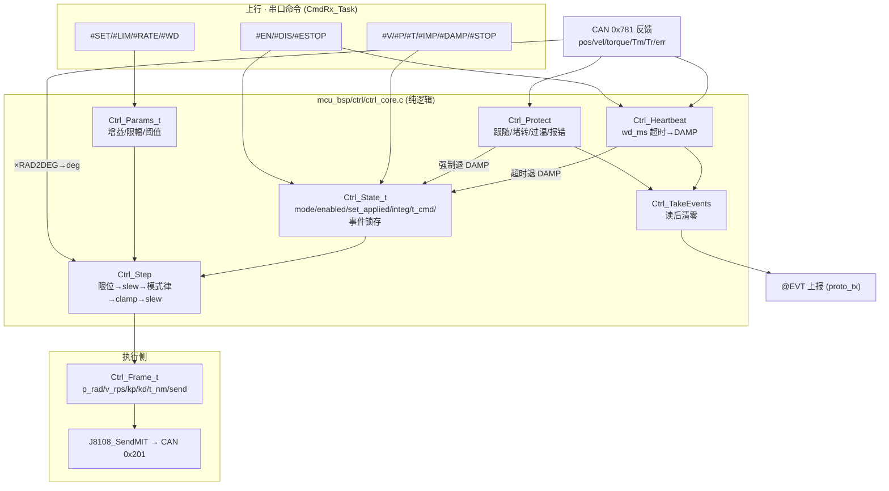
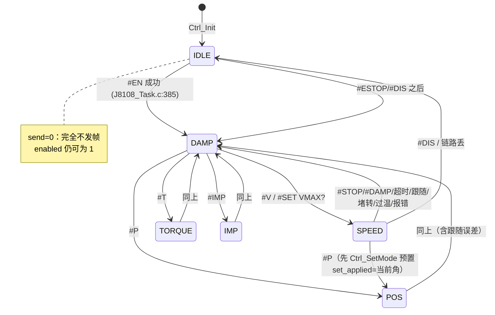

# 03 · 控制核算法（`mcu_bsp/ctrl/ctrl_core`）

> 对象：`mcu_bsp/ctrl/ctrl_core.h`（164 行）+ `mcu_bsp/ctrl/ctrl_core.c`（555 行，**23 个函数**）
> 上游调用方：`Task/Src/J8108_Task.c`（200Hz 控制任务，唯一发 CAN 帧的地方）、`Task/Src/CmdRx_Task.c`（串口命令 → 参数/设定点）
> 覆盖核对表：`docs/code/_函数地图.md` §`mcu_bsp/ctrl/ctrl_core.c` / `.h`
> 本文所有数值算例均在宿主机用 gcc 编译**本文件源码副本**实测得出（不改工程、不编译工程），见 §7。
>
> 一句话：`ctrl_core` 是"外环大脑"——它把上位机的 **deg / deg·s⁻¹ / N·m** 目标，经过**速率限制 → 限幅 → PI/PD → 力矩斜率限制 → 保护判定**，变成一帧 **rad / rad·s⁻¹ / N·m** 的 MIT 参数交给 8108 关节电机执行；
> 它自己**不做闭环执行**，执行（电流环/位置环）在电机内部，A 板只是"写目标 + 加前馈 + 兜安全"。

---

## 0 一句话职责

| 项 | 内容 |
|---|---|
| 职责 | 把串口下发的模式与目标（deg / deg·s⁻¹ / N·m），逐周期（200Hz，`dt=5ms`）换算成 8108 的 MIT 帧参数（`p_rad / v_rps / kp / kd / t_nm`），并在此过程中完成**速率限制、软限位、力矩限幅、速度环 PI、库仑摩擦前馈、到位判定、心跳与四类保护** |
| 不是职责 | 不发 CAN（调用方 `J8108_SendMIT`）、不做单位换算的输入侧（反馈 rad→deg 由调用方 `J8108_RAD2DEG` 做）、不碰 HAL/FreeRTOS/`math.h`（**纯逻辑，可宿主机穷举测试**） |
| 状态量 | `Ctrl_State_t`（1 份，调用方静态分配）；参数 `Ctrl_Params_t`（1 份，独立于状态，`#SET` 可改） |
| 周期 | `J8108_CTRL_PERIOD_MS = 5`（200Hz）；`dt_ms` 由调用方传入并**夹在 1..100ms**（`J8108_Task.c:640-647`） |
| 安全性 | 任何异常/超时/报错都退 `DAMP`（阻尼保持，**不失能**——本电机无抱闸，失能会自由坠落）；只有 `#ESTOP` 才失能停帧 |

---

## 1 接口清单

### 1.1 公开 API（`ctrl_core.h:129-158`，共 18 个声明）

| # | 原型（h 行号） | 类别 | 调用方 |
|---|---|---|---|
| 1 | `void Ctrl_ParamsDefault(Ctrl_Params_t *p)` (129) | 初始化 | `J8108_Task_Init` (`J8108_Task.c:669`) |
| 2 | `void Ctrl_Init(Ctrl_State_t *s, const Ctrl_Params_t *p)` (130) | 初始化 | `J8108_Task.c:670` |
| 3 | `void Ctrl_SetMode(Ctrl_State_t *s, Ctrl_Mode_e m, float fb_pos_deg, float fb_vel_dps)` (133) | 设定 | `J8108_Task.c:162/172/179/191/199/385` |
| 4 | `void Ctrl_SetPos(Ctrl_State_t *s, float deg)` (134) | 设定 | `J8108_Task.c:173`（`#P`） |
| 5 | `void Ctrl_SetVel(Ctrl_State_t *s, float dps)` (135) | 设定 | `J8108_Task.c:180`（`#V`） |
| 6 | `void Ctrl_SetTorque(Ctrl_State_t *s, float nm)` (136) | 设定 | `J8108_Task.c:192`（`#T`） |
| 7 | `void Ctrl_SetTff(Ctrl_State_t *s, float tff)` (137) | 设定 | `J8108_Task.c:185`（`#V` 第 3 参） |
| 8 | `void Ctrl_SetImp(Ctrl_State_t *s, Ctrl_Params_t *p, float kp, float kd, float tff)` (138) | 设定 | `J8108_Task.c:200`（`#IMP`） |
| 9 | `void Ctrl_SetDamp(Ctrl_State_t *s, Ctrl_Params_t *p, float kd)` (139) | 设定 | `J8108_Task.c:206`（`#DAMP`） |
| 10 | `void Ctrl_Release(Ctrl_State_t *s)` (140) | 安全 | `J8108_Task.c:211`（`#STOP`）、保护内部 |
| 11 | `void Ctrl_Ping(Ctrl_State_t *s, uint32_t now_ms)` (141) | 心跳 | `J8108_Task.c:137/386`（每条命令续命） |
| 12 | `void Ctrl_Estop(Ctrl_State_t *s)` (142) | 安全 | `J8108_Task.c:217`（`#ESTOP`） |
| 13 | `uint8_t Ctrl_TakeEvents(Ctrl_State_t *s)` (143) | 事件 | `J8108_Task.c:431` |
| 14 | `uint8_t Ctrl_Heartbeat(Ctrl_State_t *s, const Ctrl_Params_t *p, uint32_t now_ms)` (146) | 看门狗 | `J8108_Task.c:418` |
| 15 | `uint16_t Ctrl_Protect(Ctrl_State_t *s, const Ctrl_Params_t *p, float pos_deg, float vel_dps, float t_nm, float t_mos, float t_rotor, uint8_t motor_err, uint32_t dt_ms)` (150) | 保护 | `J8108_Task.c:425` |
| 16 | `void Ctrl_Step(Ctrl_State_t *s, const Ctrl_Params_t *p, float fb_pos_deg, float fb_vel_dps, uint32_t dt_ms, Ctrl_Frame_t *out)` (154) | 控制 | `J8108_Task.c:526` |
| 17 | `const char *Ctrl_ModeStr(Ctrl_Mode_e m)` (157) | 文本 | 遥测/屏/日志多处 |
| 18 | `const char *Ctrl_LimitWhat(const Ctrl_State_t *s)` (158) | 文本 | `J8108_Task.c:268`（`@EVT LIMIT what=`）|

### 1.2 内部工具（`static`，`ctrl_core.c`，共 5 个）

| # | 函数（行） | 作用 |
|---|---|---|
| 19 | `f_abs` (13) | 浮点绝对值（免 `math.h`） |
| 20 | `clampf` (18) | 区间夹紧（`lo > hi` 未防御，见 §4.2 坑） |
| 21 | `slew` (28) | **速率限制**（每周期最大增量 = `rate × dt`） |
| 22 | `ctrl_t_slew` (365) | 力矩斜率限制（`slew` 的力矩专用包装 + 受限标志 + 状态回写） |
| 23 | `ctrl_lim_update` (377) | 限幅事件：边沿锁存 + 1000ms 消退去抖 |

### 1.3 编译期常量

| 常量 | 位置 | 值 | 含义 |
|---|---|---|---|
| `CTRL_RAD2DEG` | `.c:10` | `57.29578f` | rad→deg。**本文件内未被使用**（反馈换算在 `motor_8108.h:J8108_RAD2DEG`，调用方做）；属历史遗留定义 |
| `CTRL_DEG2RAD` | `.c:11` | `0.017453292f` | deg→rad，**输出帧的唯一换算点**（`ctrl_core.c:475`、`:499`） |
| `CTRL_EV_CLEAR_MS` | `.h:49` | `1000u` | 事件消退去抖窗口（§6.3） |

---

## 2 总体框图

### 2.1 ASCII（数据流 + 单位）

```
                ┌───────────────── 上行：串口命令（CmdRx_Task，prio 4） ─────────────────┐
                │ #EN/#DIS  #V <dps> [kd] [tff]   #P <deg> [kp] [kd]   #T <Nm>          │
                │ #IMP <kp> <kd> [tff]   #DAMP [#STOP]  #ESTOP                           │
                │ #SET <K> <V>（KD_DAMP KP_POS KD_POS KP_V KI_V KP_IMP KD_IMP INPOS      │
                │               FOLLOW RATE TFF TRATE WD VMAX TMAX AUTODAMP SETP）       │
                │ #LIM P/V/T  #RATE  #WD   #ESTOP                                        │
                └───────────────┬──────────────────────────────┬──────────────────────────┘
                                │ 写设定点/切模式              │ 写参数（J8108_Params() 指针）
                                ▼                              ▼
                     Ctrl_State_t（s_ctrl）            Ctrl_Params_t（s_params）
                     mode/enabled/set/set_applied     增益/限幅/保护阈值/开关
                     integ/t_cmd/imp_ref/事件锁存…     （Ctrl_State_t 内不保存参数副本）
                                │                              │
   ┌──────── 反馈（CAN 0x781，motor_8108 解算） ────────┐        │
   │ pos[rad] vel[rad/s] torque[N·m] Tm/Tr[℃] err[byte0]│        │
   │ ↓ ×J8108_RAD2DEG（唯一 rad→deg 点）                │        │
   └───────────┬──────────────────────────┬─────────────┘        │
               │ fb_pos_deg/fb_vel_dps    │ t_mos/t_rotor/err    │
               ▼                          ▼                      ▼
        ┌──────────────────────────────────────────────────────────────┐
        │  Ctrl_Step（控制律，200Hz）        Ctrl_Protect（保护，200Hz） │
        │  ① 软限位/限速 clamp              跟随误差累计 ≥follow_ms      │
        │  ② set_applied = slew(...)        堵转累计 ≥stall_ms          │
        │  ③ 模式分支算 (p,v,Kp,Kd,t)        过温（预警/停机+滞回）      │
        │  ④ 力矩 clamp(TMAX) → slew(TRATE) 电机报错位（去抖）          │
        │  ⑤ deg→rad 换算                                             │
        └───────────────┬──────────────────────────┬────────────────────┘
                        ▼                          ▼
                 Ctrl_Frame_t              事件位 ev（CTRL_EV_*）
           p_rad/v_rps/kp/kd/t_nm/send             │
                        │                          ├→ Ctrl_TakeEvents（取走即清）
                        │ send==1 才发              └→ @EVT …（proto_tx）
                        ▼
        J8108_SendMIT(p,v,kp,kd,t) → CAN 0x201（1Mbps，200Hz）
        T_motor = Kp·(p_des−p) + Kd·(v_des−v) + t_ff   ← 电机内环执行
```

### 2.2 mermaid



---

## 3 数据结构详解

### 3.1 `Ctrl_Mode_e`（`.h:22-30`）—— 6 态 FSM

枚举**序关系被代码利用**：所有"是否在运动模式"的判断都写成 `s->mode > CTRL_MODE_DAMP`（`ctrl_core.c:267/293/337`），因此**不得重排** IDLE/DAMP 的顺序。

| 值 | 名字 | 每周期帧（`Ctrl_Step`） | 设计理由 |
|---|---|---|---|
| 0 | `CTRL_MODE_IDLE` | `send=0`（**一帧不发**，只监听） | 上电默认。链路未建立时**不能**发帧（一发一收的电机需要先使能握手） |
| 1 | `CTRL_MODE_DAMP` | `Kp=0, Kd=kd_damp, v_des=0, t=0` → `T=−Kd·ω` | **安全态**：软住、可外力拖动、不主动发力。所有异常都退这里（不失能，因为无抱闸） |
| 2 | `CTRL_MODE_SPEED` | `Kp=0, Kd=kd_damp, t=PI(e)+tff±TFF` | 速度是**外环 PI 自己算力矩**；MIT 帧在速度目标上不够用（v_des 只做阻尼），所以用"力矩接口" |
| 3 | `CTRL_MODE_POS` | `p_des=set_applied, Kp=kp_pos, Kd=kd_pos, v_des=0, t=0` | 位置**不自己算**，把 PD 交给电机内环（电机 200Hz~1kHz 跑位置环，比 A 板稳） |
| 4 | `CTRL_MODE_TORQUE` | `Kp=0, Kd=0, t=slew(clamp(set))` | 纯力矩；**无阻尼**（调用方需自负负载） |
| 5 | `CTRL_MODE_IMP` | `p_des=imp_ref_deg（进入时锁定）, Kp=kp_imp, Kd=kd_imp, t=slew(clamp(tff))` | 柔顺/阻抗：参考角锁死，外力把它推开时按 Kp/Kd 回推 |



> **模式切换规则（实现口径）**：`J8108_SetMode`（`J8108_Task.c:150-164`）要求运动模式必须已使能（否则 `@ERR 3`），切 `IDLE` 只改 `mode`（**保留 enabled**），其余模式先经 `Ctrl_SetMode` 把 `set_applied` 预置为**当前实际值**。协议 §4 说的"任何模式切换先经 DAMP"在实现上退化为"set_applied 从当前实际值起步"，不用真过一帧 DAMP。

### 3.2 事件位 / 限幅来源 / 去抖常量（`.h:33-49`）

| 位 | 值 | 触发者 | 含义与动作 |
|---|---|---|---|
| `CTRL_EV_TIMEOUT` | `1<<0` | `Ctrl_Heartbeat` | `wd_ms` 内无命令 → **强制退 DAMP**（不失能） |
| `CTRL_EV_LIMIT` | `1<<1` | `ctrl_lim_update` | 设定点/力矩被夹紧（细节看 `lim_what`） |
| `CTRL_EV_FOLLOW` | `1<<2` | `Ctrl_Protect` | 位置模式跟随误差 > `follow_deg` 累计 ≥ `follow_ms` |
| `CTRL_EV_STALL` | `1<<3` | `Ctrl_Protect` | 大力矩 + 低转速累计 ≥ `stall_ms` |
| `CTRL_EV_TEMP` | `1<<4` | `Ctrl_Protect` | 过温预警或停机 |
| `CTRL_EV_MOTERR` | `1<<5` | `Ctrl_Protect` | 反馈帧 byte0 报错位 ≠ 0 |
| `CTRL_EV_ESTOP` | `1<<6` | `Ctrl_Estop` | 硬急停（同时 `enabled=0` → 停发帧 + 调方发失能帧） |

| `lim_what` | 值 | `Ctrl_LimitWhat()` 文本 | 含义 |
|---|---|---|---|
| `CTRL_LIM_NONE` | 0 | `"none"` | 无 |
| `CTRL_LIM_SETPOINT` | 1 | `"setpoint"` | 设定点被软限位（POS）或限速（SPEED）夹紧 |
| `CTRL_LIM_TORQUE` | 2 | `"torque"` | 力矩被 `TMAX` 夹紧 |
| `CTRL_LIM_TRATE` | 3 | `"trate"` | 力矩被**斜率限制**（`TRATE`）夹住——**不是撞上限幅，只是 ramp 被限速**（最容易被误读的一条） |

### 3.3 `Ctrl_Params_t`（`.h:52-85`）逐字段

单位一律"输出端（关节端）"：位置 deg、速度 deg/s、力矩 N·m、温度 ℃、时间 ms。
"谁写"：`#SET`（`CmdRx_Task.c:185-296` 的 `set_one`）、`#LIM`/`#RATE`/`#WD`（`CmdRx_Task.c:631-730`）写；`Ctrl_ParamsDefault` 给默认值；控制核只读（`Ctrl_SetImp`/`Ctrl_SetDamp` 例外，它们会写增益 3/4/9）。

| 字段（行） | 类型 | 单位/量程 | 默认 | `#SET` 键（范围） | 含义 |
|---|---|---|---|---|---|
| `kd_damp` (55) | float | 0~5 | `1.0` | `KD_DAMP`（0..5） | 阻尼系数：DAMP/SPEED 模式帧里的 `Kd`，`T=−Kd·ω`。太大→嗡嗡抖/发热 |
| `kp_pos` (56) | float | 0~500 | `20.0` | `KP_POS`（0..500） | 位置刚度（**电机侧口径 N·m/rad**）。⚠ 必须配 `kd_pos`，`Kp≠0&Kd=0` 会震荡/失控（厂商文档警告） |
| `kd_pos` (57) | float | 0~5 | `1.0` | `KD_POS`（0..5） | 位置阻尼（N·m/(rad/s)，电机侧口径） |
| `kp_v` (58) | float | N·m per (deg/s) | `0.005` | `KP_V`（0..10） | 速度环 P。**实机教训：0.05 就已过大**（200Hz 下每步全力矩→极限环） |
| `ki_v` (59) | float | N·m per (deg/s·s) | `0.0005` | `KI_V`（0..1） | 速度环 I。抗静摩擦靠它 + `tff_nm` |
| `kp_imp` (60) | float | 0~500 | `10.0` | `KP_IMP`（0..500） | 阻抗刚度（`Ctrl_SetImp` 会夹到 0..500） |
| `kd_imp` (61) | float | 0~5 | `0.5` | `KD_IMP`（0..5） | 阻抗阻尼（夹到 0..5） |
| `inpos_deg` (63) | float | ≥0 | `1.0` | `INPOS`（0.1..90） | 到位判定带 `|set_applied − fb| ≤ inpos_deg` |
| `pmin_deg` (64) | float | deg | `-170.0` | `#LIM P` | 软限位下限（只夹**设定点**，不夹反馈） |
| `pmax_deg` (65) | float | deg | `170.0` | `#LIM P` | 软限位上限。±170° = ±2.967 rad，在电机量程 ±12.56 rad 内 |
| `vmax_dps` (66) | float | deg/s | `300.0` | `VMAX`（1..4500） | 速度设定点上限 |
| `tmax_nm` (67) | float | N·m | `7.5` | `TMAX`（0.1..18） | 力矩限幅（同时是积分器的饱和界） |
| `rate_dps2` (68) | float | 见下 | `3000.0` | `RATE`（10..100000） | 设定点速率限制。**同一字段两种量纲**：POS 模式下是"设定点最大速度 deg/s"（`max Δ=3000deg/s×dt`）；SPEED 模式下才是"加速度 deg/s²"。名字里的 `dps2` 只在 SPEED 语义下严格成立 |
| `tff_nm` (69-70) | float | N·m，0~18 | `0.0` | `TFF`（0..18） | **库仑摩擦前馈**：按 `set_applied` 符号自动取号；静摩擦大的关节必须垫 |
| `trate_nm_s` (71-72) | float | N·m/s，0~1000 | `20.0` | `TRATE`（0..1000） | **力矩变化率上限**。0=不限（跳变）。200Hz 下 20 N·m/s → 每周期 ≤0.1 N·m |
| `follow_deg` (74) | float | deg | `30.0` | `FOLLOW`（1..720） | 跟随误差阈值 |
| `follow_ms` (75) | uint16 | ms | `500` | —（无 `#SET` 键） | 跟随误差**累计**时长（≤0 视为关闭判据） |
| `stall_nm` (76) | float | N·m | `8.0` | —（无 `#SET` 键） | 堵转力矩阈值。⚠ 默认 8.0 **高于** `tmax_nm=7.5`，见 §6.4 |
| `stall_dps` (77) | float | deg/s | `10.0` | — | 堵转转速阈值 |
| `stall_ms` (78) | uint16 | ms | `1000` | — | 堵转累计时长 |
| `temp_warn_c` (79) | float | ℃ | `70.0` | — | 过温预警（只报事件，不停机） |
| `temp_stop_c` (80) | float | ℃ | `85.0` | — | 过温停机（报事件 + 退 DAMP） |
| `wd_ms` (81) | uint16 | ms | `200` | `WD`（0..5000） | 心跳超时；**0=关闭**。200ms = 40 个控制周期 |
| `autodamp_on_err` (83) | uint8 | 0/1 | `1` | `AUTODAMP` | 电机报错位 ≠0 → 自动退 DAMP |
| `setp_unlocked` (84) | uint8 | 0/1 | `0` | `SETP` | `#SETP` 原始直通解锁（**控制核不用它**，只被 `CmdRx_Task.c:610` 检查） |

### 3.4 `Ctrl_State_t`（`.h:88-111`）逐字段

| 字段（行） | 类型 | 单位 | 谁写 | 谁读 | 含义 |
|---|---|---|---|---|---|
| `mode` (90) | `Ctrl_Mode_e` | — | `Ctrl_SetMode`/`Ctrl_SetDamp`/`Ctrl_Release`/`Ctrl_Estop`/`Ctrl_Heartbeat`/`Ctrl_Protect`/`J8108_SetMode`(IDLE) | `Ctrl_Step`、Monitor、OLED | 当前模式 |
| `enabled` (91) | uint8 | — | `J8108_Task` 使能握手成功→1；`#DIS`/`#ESTOP`/链路丢→0 | `Ctrl_Step`（`send`）、UI | 使能态。**不由控制核改**（除 `Ctrl_Estop` 置 0） |
| `set` (92) | float | deg / deg·s⁻¹ / N·m（按模式） | `Ctrl_SetPos/SetVel/SetTorque`、`Ctrl_SetMode` | `Ctrl_Step` | 上位机**原始**目标（未限幅、未限速） |
| `set_applied` (93) | float | 同上 | `Ctrl_Step`（每周期 slew 一次）、`Ctrl_SetMode`/`SetDamp`/`Release`/`Heartbeat`/`Estop` | `Ctrl_Step`、`Ctrl_SetImp`、`Ctrl_Protect` | **已应用**设定点：限幅 + 速率限制之后的值，是真正进帧/进 PI 的量 |
| `tff` (94) | float | N·m | `Ctrl_SetTff`（`#V` 第 3 参）、`Ctrl_SetImp`、`Ctrl_Release` | `Ctrl_Step` | **显式**附加前馈（一次性、不随方向变号）——与 `tff_nm` 正交 |
| `t_cmd` (95) | float | N·m | `ctrl_t_slew`、`Ctrl_SetMode`(=0)、DAMP/POS 每周期(=0) | `ctrl_t_slew` | 上一次**实际下发**的力矩，是力矩斜率限制的积分状态 |
| `integ` (96) | float | N·m | 速度环（仅未受限时累加）、多处清零 | 速度环 | 速度环积分累积（被夹在 `±tmax_nm`） |
| `imp_ref_deg` (97) | float | deg | `Ctrl_SetMode`(IMP: =当前角)、`Ctrl_SetImp`(=set_applied) | `Ctrl_Step`(IMP) | 阻抗参考角（进模式时锁定） |
| `inpos` (98) | uint8 | — | `Ctrl_Step`(POS)、`Ctrl_SetMode`(POS 置 1) | Monitor→UI | 到位标志（只在 POS 模式更新） |
| `lim_latched` (100) | uint8 | — | `ctrl_lim_update` | 同左 | 限幅事件已报（条件连续消失 1s 后重新武装） |
| `lim_what` (101) | uint8 | — | `ctrl_lim_update` | `Ctrl_LimitWhat` | 本次夹紧来源（`CTRL_LIM_*`）。**清除时只在来源匹配才抹掉**，故无事件期间可能残留上一次的值（不影响 `@EVT`，见 §4.20 坑） |
| `temp_warn_latched` (102) | uint8 | — | `Ctrl_Protect` | 同左 | 过温事件已报（回落至 `warn−5℃` 以下复位；**预警与停机共用同一锁存**） |
| `moterr_latched` (103) | uint8 | — | `Ctrl_Protect` | 同左 | 电机报错已报（连续 1s 无报错后复位） |
| `lim_clear_ms` (104) | uint16 | ms | `ctrl_lim_update` | 同左 | "受限条件连续消失"计时（饱和到 1000 即 `CTRL_EV_CLEAR_MS`） |
| `moterr_clear_ms` (105) | uint16 | ms | `Ctrl_Protect` | 同左 | "报错位连续为 0"计时 |
| `last_cmd_ms` (106) | uint32 | ms | `Ctrl_Ping` | `Ctrl_Heartbeat` | 最近一次"续命"时刻（每条串口命令都会 ping） |
| `ev` (107) | uint16 | 位域 | 各保护/限幅/急停 | `Ctrl_TakeEvents` | 事件位累积（取走即清） |
| `follow_acc_ms` (108) | uint32 | ms | `Ctrl_Protect` | 同左 | 跟随误差累计时长（误差回到带内立即清零） |
| `stall_acc_ms` (109) | uint32 | ms | `Ctrl_Protect` | 同左 | 堵转累计时长（条件消失立即清零） |
| `estop` (110) | uint8 | — | `Ctrl_Estop`(=1)、`J8108_Task.c:382` 使能成功(=0) | UI/遥测 | 硬急停已置位；**只有 `#EN` 成功才会清** |

### 3.5 `Ctrl_Frame_t`（`.h:114-122`）—— 出参（**输出端口径**）

| 字段（行） | 类型 | 单位 | 来源（`Ctrl_Step`） | 去向 |
|---|---|---|---|---|
| `p_rad` (116) | float | rad | POS：`set_applied×DEG2RAD`；IMP：`imp_ref_deg×DEG2RAD`；其余 0 | MIT 帧 p_des（16bit，±12.56 rad） |
| `v_rps` (117) | float | rad/s | **恒为 0**（所有模式均写 0） | MIT 帧 v_des（12bit，±45 rad/s） |
| `kp` (118) | float | —（电机侧 N·m/rad） | POS：`kp_pos`；IMP：`kp_imp`；SPEED/DAMP/TORQUE：0 | MIT 帧 Kp（12bit，0..500） |
| `kd` (119) | float | —（电机侧 N·m/(rad/s)） | DAMP/SPEED：`kd_damp`；POS：`kd_pos`；IMP：`kd_imp`；TORQUE：0 | MIT 帧 Kd（12bit，0..5） |
| `t_nm` (120) | float | N·m | SPEED：PI+前馈经 clamp+slew；TORQUE/IMP：`set/tff` 经 clamp+slew；其余 0 | MIT 帧 t_ff（12bit，±18 N·m） |
| `send` (121) | uint8 | 0/1 | `enabled && mode!=IDLE` | 调用方 `if (fr.send && …) J8108_SendMIT(...)` |

> **`v_rps` 恒 0 是本设计的关键假设**：所有模式都不发速度目标，只发位置目标（PD）或力矩（t_ff）。于是电机内部一律 `T = Kp·(p_des−p) − Kd·ω + t_ff`——阻尼项永远作用在**实际速度**上。

---

## 4 逐函数详解

### 4.1 `f_abs` — `ctrl_core.c:13`

```c
static float f_abs(float v) { return (v < 0.0f) ? -v : v; }
```
| 项 | 内容 |
|---|---|
| 参数 | `v` 任意 float |
| 返回 | `|v|` |
| 下行 | `Ctrl_Protect`（跟随误差、堵矩力矩）、`Ctrl_Step`（到位判定） |
| 坑 | 不处理 NaN（NaN 比较恒 false → 返回原值 NaN，会一路传到比较里；上游 NaN 由协议解析层挡）。不用 `math.h` 是为了宿主机可编译（**无 libm 依赖**） |

### 4.2 `clampf` — `ctrl_core.c:18`

```c
static float clampf(float v, float lo, float hi)
```
| 项 | 内容 |
|---|---|
| 参数 | `v` 待夹紧值；`lo` 下限；`hi` 上限 |
| 返回 | `v` 夹到 `[lo, hi]` |
| 上行 | `Ctrl_SetImp`（kp 0..500 / kd 0..5 / tff ±tmax）、`Ctrl_SetDamp`（kd 0..5）、`Ctrl_Step`（软限位、限速、力矩限幅、积分饱和） |
| 坑 | ① **不防御 `lo > hi`**：若 `#LIM P 100 -100` 造成 `pmin>pmax`，`clampf` 会先返回 `lo`（因为 `v<lo` 成立），行为变成"永远等于 pmin"——调用方 `CmdRx_Task.c:656` 写限位时未做 `min<max` 校验；② 不抗 NaN（`<=` 全 false → 原值返回） |

### 4.3 `slew` — `ctrl_core.c:28`（速率限制的数学核心）

```c
static float slew(float cur, float target, float rate, uint32_t dt_ms)
{
    if (rate <= 0.0f) return target;
    max_d = rate * ((float)dt_ms * 0.001f);
    d = target - cur;
    if (d >  max_d) return cur + max_d;
    if (d < -max_d) return cur - max_d;
    return target;
}
```

**数学定义**：
```
max_d = rate · dt[s]                       （本周期允许的最大增量）
y[n] = clamp( y[n-1] + (u[n] − y[n-1]),  … )
     = y[n-1] + sign(u−y)·min(|u−y|, rate·dt)
```
即"在目标方向以最多 `rate` 单位/秒的斜率逼近，到点即停"（一阶斜率限制器，等价于给阶跃输入加一阶滤波 `dy/dt = sat(u−y, ±rate)`）。

| 项 | 内容 |
|---|---|
| 参数 | `cur` 当前已应用值；`target` 目标；`rate` 速率（单位/秒，**单位随调用场景而变**）；`dt_ms` 周期 ms |
| 返回 | 本周期允许到达的值 |
| `rate ≤ 0` | 直接返回 `target`（**不限速 = 跳变**）：`rate_dps2=0` 与 `trate_nm_s=0` 都是这个语义 |
| 三处调用 | ① `Ctrl_Step` SPEED：`set_applied = slew(set_applied, tgt, rate_dps2, dt)`（单位 dps，斜率=dps/s=**加速度**）② `Ctrl_Step` POS：同函数，但量是 deg（斜率=**deg/s**，即设定点最大速度）③ `ctrl_t_slew`：`slew(t_cmd, t_des, trate_nm_s, dt)`（单位 N·m，斜率=N·m/s） |
| 算例 | `rate_dps2=3000, dt=5ms → max_d=15 dps/周期`；`trate_nm_s=20, dt=5ms → 0.1 N·m/周期` |
| 坑 | ① **`max_d` 与 `dt` 成正比**：调度卡顿（`dt` 被夹到 100ms）时 `max_d` 放大 20 倍 → 力矩可能一周期跳 2 N·m（实测输出见 §7.6），这是"dt 上限 100ms"存在的意义；② 它是**状态量驱动**的（`cur` 必须是上一周期的输出），若调用方忘了回写状态就会退化成"恒速移动"；③ 与 `clampf` 的顺序是**先限幅后限速**（见 §5.5），栅栏作用不同：限幅保证不超软限位，限速保证变化柔顺 |

### 4.4 `Ctrl_ParamsDefault` — `ctrl_core.c:44`

```c
void Ctrl_ParamsDefault(Ctrl_Params_t *p)
```
| 项 | 内容 |
|---|---|
| 参数 | `p` 目标参数块（`NULL` → 直接返回，**不崩**） |
| 步骤 | `memset(p,0,sizeof(*p))` → 逐字段赋默认（§3.3 表） |
| 上行 | `J8108_Task_Init`（`J8108_Task.c:669`），在任务创建前调用 |
| 默认值要点 | `kp_v=0.005`、`ki_v=0.0005`（**不是**协议 §4 表里的 0.05/0.002——实机震荡后下调，见 `协议_串口控制_v1.md` §14.6）；`trate_nm_s=20`；`tff_nm=0`（**默认不补偿摩擦，需显式 `#SET TFF`**）；`wd_ms=200`；`autodamp_on_err=1`；`setp_unlocked=0` |
| 坑 | 全部字段一次性复位 → **`#SET` 的改动在重启后丢失**（无持久化，"二期 #SAVE 存 Flash"）；`ParamsDefault` 与 `Ctrl_Init` 都会 `memset`，若在运行中误调会清掉 `#SET` 结果 |

### 4.5 `Ctrl_Init` — `ctrl_core.c:83`

```c
void Ctrl_Init(Ctrl_State_t *s, const Ctrl_Params_t *p)
{
    if (s == NULL) return;
    memset(s, 0, sizeof(*s));
    s->mode = CTRL_MODE_IDLE;
    s->enabled = 0u;
    s->last_cmd_ms = 0u;
    (void)p;
}
```
| 项 | 内容 |
|---|---|
| 参数 | `s` 状态（NULL 安全）；`p` **被忽略**（`(void)p`） |
| 步骤 | 全清零 → `IDLE` + `enabled=0`（上电绝不自动动）+ 心跳基准 0 |
| 下行 | `Ctrl_Step`（`send=0`，因为 `mode==IDLE`） |
| 坑 | **状态里不保存参数副本**：参数由调用方单独持有并逐周期传入。好处（可热改参、RAM 省一份）；代价是任何需要参数的 API（`SetImp`/`SetDamp`）都得显式传 `p`，调用方传错参数块不会报错。另外 `last_cmd_ms=0` + `now` 很大 → **上电第一次心跳检查就会判超时**，但因 `mode==IDLE` 不报（`Ctrl_Heartbeat` 只在运动模式才动作），`#EN` 成功后 `Ctrl_Ping` 立刻续命 |

### 4.6 `Ctrl_SetMode` — `ctrl_core.c:94`（切模式 + 防跳变）

```c
void Ctrl_SetMode(Ctrl_State_t *s, Ctrl_Mode_e m, float fb_pos_deg, float fb_vel_dps)
```
| 项 | 内容 |
|---|---|
| 参数 | `m` 目标模式；`fb_pos_deg` 当前实际角（deg）；`fb_vel_dps` **未使用**（`(void)fb_vel_dps`，保留给未来"DAMP→SPEED 按当前速度起步"） |
| 返回 | void |
| 无条件重置 | `integ=0`（防旧积分突然发力）、`t_cmd=0`（**力矩从 0 起爬**，配合 `trate`）、`lim_latched=0`、`lim_clear_ms=0`、`moterr_clear_ms=0`、`follow_acc_ms=0`、`stall_acc_ms=0` |
| 按模式设置 | SPEED：`set=set_applied=0`（从"当前=0"起步，不会按旧目标冲）；POS：`set=set_applied=fb_pos_deg`、`inpos=1`；IMP：`imp_ref_deg=set=set_applied=fb_pos_deg`；TORQUE：`set=set_applied=0`、`tff=0`；DAMP/IDLE：`set=set_applied=0` |
| **不重置** | `enabled`、`estop`、`ev`（已有事件保留，等 `TakeEvents` 取）、`moterr_latched`、`temp_warn_latched`、`tff`（**切模式不抹掉已设的显式前馈**）、`inpos`（非 POS 模式保留旧值 → 屏上可能显示上一次的到位状态） |
| 上行 | `J8108_SetMode/SetPosDeg/SetVelDps/SetTorqueNm/SetImp`、`#EN` 成功、链路恢复 |
| 坑 | ① **POS 必须先经过 `Ctrl_SetMode`**：`J8108_SetPosDeg`（`J8108_Task.c:166-174`）的注释写得很清楚——若直接写 `set`，`set_applied` 还停留在上个模式的值（如 DAMP 的 0），`slew` 从 0 爬 → PD 误差 = 真实角 − 0 → **猛冲**（审查抓到的安全问题）；② `fb_vel_dps` 传了没用，别指望"带速度切换"；③ 切到 POS 时 `inpos` 被置 1（视为"起点即到位"），第一次真实判定要等下一周期 `Ctrl_Step` |

### 4.7 `Ctrl_SetPos` — `ctrl_core.c:141`

```c
void Ctrl_SetPos(Ctrl_State_t *s, float deg) { if (s != NULL) s->set = deg; }
```
| 项 | 内容 |
|---|---|
| 参数 | `deg` 绝对目标角（输出端，deg） |
| 返回 | void（**不校验软限位**） |
| 下行 | `Ctrl_Step` POS 分支：`tgt = clampf(set, pmin_deg, pmax_deg)` |
| 坑 | 超出软限位**不报错**，只在核内被夹紧并报一次 `@EVT LIMIT what=setpoint`。真正的越界拦截在协议层（`CmdRx_Task.c:559` 检查 `f[0] ∈ [pmin,pmax]`，否则 `@ERR 7`），**协议层是唯一的越界拒绝点** |

### 4.8 `Ctrl_SetVel` — `ctrl_core.c:147`

```c
void Ctrl_SetVel(Ctrl_State_t *s, float dps) { if (s != NULL) s->set = dps; }
```
| 项 | 内容 |
|---|---|
| 参数 | `dps` 目标速度（deg/s，带符号表示方向） |
| 下行 | SPEED 分支：`tgt = clampf(set, ±vmax_dps)`，再 `slew` 到 `set_applied` |
| 坑 | 连同 `Ctrl_SetMode(SPEED)` 一起用才有意义（`J8108_SetVelDps` 就是这么做的）。单独调它而模式不是 SPEED → `set` 被写但无人读（下一次 `Ctrl_SetMode` 会把它覆盖成 0）。**`dps` 的符号串起了整条链**：限速夹紧方向 → `set_applied` 方向 → 库仑摩擦前馈取号 → PI 误差符号 |

### 4.9 `Ctrl_SetTorque` — `ctrl_core.c:153`

```c
void Ctrl_SetTorque(Ctrl_State_t *s, float nm) { if (s != NULL) s->set = nm; }
```
| 项 | 内容 |
|---|---|
| 参数 | `nm` 目标力矩（N·m） |
| 下行 | TORQUE 分支：`t_des = clampf(set, ±tmax_nm)` → `ctrl_t_slew` |
| 坑 | ① 力矩模式**没有阻尼项**（帧 `Kd=0`），空载时"给了力矩就一直加速"（`#T` 回包里的提示语原文）；② 越界拦截在协议层（`CmdRx_Task.c:579`），核内只夹紧 + 报 `@EVT LIMIT what=torque` |

### 4.10 `Ctrl_SetTff` — `ctrl_core.c:160`（显式前馈，不切模式）

```c
void Ctrl_SetTff(Ctrl_State_t *s, float tff) { if (s != NULL) s->tff = tff; }
```
| 项 | 内容 |
|---|---|
| 参数 | `tff` 附加前馈（N·m），由 `#V <dps> [kd] [tff]` 的第 3 参设置 |
| 特性 | **不切模式、不夹紧、不随方向变号**（原样加进速度环输出） |
| 与 `tff_nm` 的区别 | `tff`（状态）= 一次性、显式、调用方负责正确性；`tff_nm`（参数）= 长期有效的**库仑摩擦补偿**，按 `set_applied` 符号自动取号。两者**在同一加法里同时生效**（`ctrl_core.c:448`） |
| 坑 | 只在 SPEED 模式被读取；`Ctrl_SetMode(TORQUE)` 与 `Ctrl_Release` 会把它清零，`Ctrl_SetDamp` **不清**（保持） |

### 4.11 `Ctrl_SetImp` — `ctrl_core.c:166`

```c
void Ctrl_SetImp(Ctrl_State_t *s, Ctrl_Params_t *p, float kp, float kd, float tff)
```
| 项 | 内容 |
|---|---|
| 参数 | `kp` 阻抗刚度（夹 0..500）；`kd` 阻抗阻尼（夹 0..5）；`tff` 附加力矩（夹 ±`tmax_nm`） |
| 副作用 | **写参数块**（`p->kp_imp/kd_imp` 被就地改掉）+ 把 `imp_ref_deg` 锁为**当前 `set_applied`** |
| 顺序要求 | 必须**先** `Ctrl_SetMode(IMP, …)`（把 `set_applied` 预置为当前角）**再** `Ctrl_SetImp`，否则参考角锁在上一个模式的残留值。`J8108_SetImp`（`J8108_Task.c:195-201`）正是这个顺序 |
| 坑 | 参考角只能通过重进 IMP 模式来改（`Ctrl_SetImp` 每次调用都会**重锁**为 `set_applied`）——想"边阻塞边改目标点"做不到，需要上层先 `SetPos` 更新 `set_applied` 再调它 |

### 4.12 `Ctrl_SetDamp` — `ctrl_core.c:176`

```c
void Ctrl_SetDamp(Ctrl_State_t *s, Ctrl_Params_t *p, float kd)
```
| 项 | 内容 |
|---|---|
| 参数 | `kd` 阻尼系数（夹 0..5），写入 `p->kd_damp` |
| 副作用 | `mode=DAMP`、`set=set_applied=0`、`integ=0`（**保留 `tff`**，与 `Ctrl_Release` 不同） |
| 用途 | `#DAMP [kd]` 调阻尼强度；阻尼模式是"软住"状态，可外力拖动 |

### 4.13 `Ctrl_Release` — `ctrl_core.c:187`

```c
void Ctrl_Release(Ctrl_State_t *s)
{ s->mode = CTRL_MODE_DAMP; s->set = 0; s->set_applied = 0; s->integ = 0; s->tff = 0; }
```
| 项 | 内容 |
|---|---|
| 用途 | **通用"退安全"入口**：`#STOP`（`J8108_StopSoft`）、跟随误差、堵转、过温、电机报错（`autodamp_on_err`）全走它 |
| 步骤 | 模式→DAMP、目标与积分清零、显式前馈清零 |
| 不碰 | `enabled`（**不失能**）、`ev`（不吞事件）、`t_cmd`（DAMP 分支下一周期会把它清零） |
| 坑 | 它**不清 `ev` 也不写事件**——"报事件"由调用方（`Ctrl_Protect`）负责，`#STOP` 路径下用户不会收到任何 `@EVT`。另外它把 `set_applied` 清 0，于是 `Ctrl_Protect` 里跟随误差判据 `|set_applied−pos|` 在退 DAMP 的同一拍就被改写为 `|0−pos|`（实测见 §7.3 打印：退 DAMP 那拍的 set_applied 已是 0.0） |

### 4.14 `Ctrl_Ping` — `ctrl_core.c:198`

```c
void Ctrl_Ping(Ctrl_State_t *s, uint32_t now_ms) { if (s != NULL) s->last_cmd_ms = now_ms; }
```
| 项 | 内容 |
|---|---|
| 用途 | **心跳续命**：每收到一条串口命令（任何命令）都调用一次（`J8108_Task.c:135-138` 的 `J8108_KeepAlive`，`Ctrl_Ping` 在 `:137`），`#EN` 成功后也会 ping（`:386`） |
| 下行 | `Ctrl_Heartbeat` 用 `now − last_cmd_ms` 判超时 |
| 坑 | 它是"命令级"心跳，不是"控制帧级"：只要上位机在发命令，哪怕目标不变也不会超时。台架测试必须先 `#WD 0`，否则 200ms 没敲命令就退 DAMP（`协议_串口控制_v1.md` §14.6 的"停转"现象根源） |

### 4.15 `Ctrl_Estop` — `ctrl_core.c:204`（唯一会失能的路径）

```c
void Ctrl_Estop(Ctrl_State_t *s)
{ s->estop=1; s->enabled=0; s->mode=CTRL_MODE_DAMP; s->set=0; s->set_applied=0; s->integ=0; s->ev|=CTRL_EV_ESTOP; }
```
| 项 | 内容 |
|---|---|
| 步骤 | 置标志 → **失能（`enabled=0`）** → 模式回 DAMP → 目标/积分清零 → 置 `CTRL_EV_ESTOP` |
| 实际效果 | `Ctrl_Step` 的 `send=0` → **下一周期开始不再发控制帧**；调用方 `J8108_StopHard`（`J8108_Task.c:214-221`）随后请求发失能帧（`…FD`）|
| 复位 | **只有 `#EN` 握手成功**才会 `estop=0`、`enabled=1`（`J8108_Task.c:382`） |
| 坑 | 失能 = 输出轴**自由**（日志原文 `output shaft will be FREE - no brake!`）。⚠ 悬臂/竖直安装时 `#ESTOP` 会让负载直接掉下来——必须先机械支撑或改小 `kd_damp` 后走 `#STOP`（软停） |

### 4.16 `Ctrl_TakeEvents` — `ctrl_core.c:217`（读后清零）

```c
uint8_t Ctrl_TakeEvents(Ctrl_State_t *s)
{ uint8_t e = (uint8_t)s->ev; s->ev = 0u; return e; }
```
| 项 | 内容 |
|---|---|
| 返回 | `s->ev` 的低 8 位（**截断**：`ev` 是 `uint16`，当前只用了 bit0..bit6，安全；但若未来加 bit8+ 会静默丢失——注意 `Ctrl_Protect` 返回的是 `uint16`，调用方按 `uint8` 收） |
| 语义 | **取走即清**（唯一清零点）；调用方 `J8108_Task.c:431` 把它与 `Ctrl_Protect` 的返回值按位或后上报 |
| 坑 | ① 单消费者假设：两个任务同时取会互相偷事件；② 调用方需保证"取走即上报"，否则事件丢失（`J8108_Task` 里 `s_ev_latch |= ev` 做了二层锁存供屏/遥测读） |

### 4.17 `Ctrl_Heartbeat` — `ctrl_core.c:228`（看门狗）

```c
uint8_t Ctrl_Heartbeat(Ctrl_State_t *s, const Ctrl_Params_t *p, uint32_t now_ms)
```
| 项 | 内容 |
|---|---|
| 参数 | `now_ms` 单调时基（`xTaskGetTickCount()*portTICK_PERIOD_MS`） |
| 返回 | `1` = **本次刚超时**（已退 DAMP，应打日志/上报）；`0` = 未超时 / 已是非运动模式 / 看门狗关闭 |
| 判据 | `(uint32_t)(now_ms − last_cmd_ms) > wd_ms`（**无符号差值**，天然抗计时器回绕；实测：`last=0xFFFFFF00, now=0x100` 差 512ms → 正确判超时） |
| 动作 | 仅当 `mode ∉ {DAMP, IDLE}`：`mode=DAMP`、`set=set_applied=0`、`integ=0`、`ev|=CTRL_EV_TIMEOUT` |
| `wd_ms == 0` | 直接返回 0（**看门狗关闭**，台架/调试用） |
| 为什么"退 DAMP 而不是失能" | 本机 8108 **无抱闸**：失能 → 关节自由坠落/负载砸下。DAMP 仍通电、提供 `−Kd·ω` 阻尼，是"可控的软停" |
| 重复超时 | 第二次调用返回 0（模式已是 DAMP）→ **不重复报**（实测 §7.5） |
| 上行 | 调用方仅在 `enabled != 0` 时调用（`J8108_Task.c:416`）——未使能时没必要管心跳 |

### 4.18 `Ctrl_Protect` — `ctrl_core.c:249`（四类保护，单一入口）

```c
uint16_t Ctrl_Protect(Ctrl_State_t *s, const Ctrl_Params_t *p, float pos_deg, float vel_dps,
                      float t_nm, float t_mos, float t_rotor, uint8_t motor_err, uint32_t dt_ms)
```
| 参数 | 单位 | 来源 |
|---|---|---|
| `pos_deg` / `vel_dps` | deg / deg·s⁻¹ | `fb.pos×RAD2DEG` / `fb.vel×RAD2DEG` |
| `t_nm` | N·m | **电机反馈力矩**（`fb.torque`，量程 ±18），不是指令力矩 |
| `t_mos` / `t_rotor` | ℃ | `byte6/byte7 × 100/255`（1 LSB ≈ 0.39℃） |
| `motor_err` | 位域 | 反馈帧 byte0（bit7 过载 / bit6 线圈过温 / bit5 MOS 过温 / bit4 过流 / bit3 过压 / bit2 欠压） |
| `dt_ms` | ms | 调用方夹紧后的周期（**累计器都用它**） |

| 返回 | 本轮**新增**事件位（供"是否打日志"判断）；同时 `s->ev` 也累积了这些位 |

四类判据与动作（逐行实现，行号见 §6.1）：

| 保护 | 判据（代码行） | 累计器 | 动作 |
|---|---|---|---|
| 电机报错位 | `motor_err != 0`（258） | `moterr_clear_ms`：报错时清零；连续为 0 累加至 1000ms → `moterr_latched=0` 重新武装（274-281） | 首次：`ev|=MOTERR`；若 `autodamp_on_err` 且运动模式 → `Ctrl_Release`（267-270） |
| 过温 | `t_mos ≥ stop ∨ t_rotor ≥ stop`（285）；否则 `≥ warn`（298）；否则两者都 `< warn−5` → 解锁（307） | `temp_warn_latched`（**预警与停机共用**；唯一复位条件是"都低于 warn−5℃"） | 首次：`ev|=TEMP`；`≥ stop` 时（**无论锁存与否**）运动模式 → `Ctrl_Release`（293-296） |
| 跟随误差 | 仅 POS 模式：`|set_applied − pos_deg| > follow_deg`（315） | `follow_acc_ms`：条件真累加 `dt_ms`，条件假**立即清零**（321）；达 `follow_ms` → 动作并清零（323-329） | `ev|=FOLLOW` + `Ctrl_Release`（"跟随不上：退阻尼，别硬顶"） |
| 堵转 | 运动模式（`mode > DAMP`）：`|t_nm| > stall_nm ∧ |vel_dps| < stall_dps`（339） | `stall_acc_ms`：同上，条件假立即清零（345） | 达 `stall_ms` → `ev|=STALL` + `Ctrl_Release`（347-353） |

| 坑 | 说明 |
|---|---|
| 累计器"一票否决"式清零 | 只要有一拍条件不满足（比如跟随误差中途缩回带内、堵转时转速偶尔超过 10dps）**累计立刻归零**，计时重新开始。对有周期性抖动的负载可能永远攒不满 → 保护不动作（要更灵敏应调小 `follow_ms`/`stall_ms`，而不是指望累计器容错） |
| 过温预警后不会再报停机 | 两者共用 `temp_warn_latched`：先报 70℃ 预警，再升到 85℃，**没有第二条 `@EVT TEMP`**（但退 DAMP 的动作照做）。运维上要按"收到 TEMP 就要查到底"处理 |
| 堵转用**反馈**力矩 | 默认 `stall_nm=8.0 > tmax_nm=7.5` → SPEED/TORQUE 模式下力矩上限只有 7.5 N·m，永远够不到 8.0 → **堵转保护在这两个模式下不会触发**；位置模式（电机内环 PD，最大 ±18 N·m）才可能触发。建议 `stall_nm ≤ tmax_nm − 20%`（如 6.0）|
| `dt_ms` 驱动累计 | 调用方把 `dt` 夹在 100ms 以内，所以"卡顿"不会一次跳满 500ms，但会**加速**累计（1 次 100ms 调用 = 20 次 5ms） |
| `p->follow_ms == 0` / `stall_ms == 0` | 判据被关闭（代码显式判 0） |

### 4.19 `ctrl_t_slew` — `ctrl_core.c:365`（力矩斜率限制）

```c
static float ctrl_t_slew(Ctrl_State_t *s, const Ctrl_Params_t *p, float t_des, uint32_t dt_ms, uint8_t *limited)
{
    float t_app = slew(s->t_cmd, t_des, p->trate_nm_s, dt_ms);
    *limited = (t_app != t_des) ? 1u : 0u;
    s->t_cmd = t_app;
    return t_app;
}
```
| 项 | 内容 |
|---|---|
| 参数 | `t_des` 本周期目标力矩（已 clamp）；`limited` 出参：本周期是否被斜率限制 |
| 返回 | **实际下发**的力矩（同时写入 `s->t_cmd` 作为下周期的起点） |
| 语义 | `trate_nm_s = 0` → 直接跳变（`slew` 的 `rate<=0` 分支，实测 §7.6：一拍到 5.0 N·m）；`trate > 0` → 每周期增量 ≤ `trate×dt` |
| 为什么必须有 | 小惯量直驱关节上，"一周期一个大力矩步"= 一周期一个大的速度增量：`Δv = (T/J)·dt`。取 `J≈0.01 kg·m²`、`T=7.5 N·m`、`dt=5ms` → `Δv≈3.75 rad/s ≈ 215 dps/周期`（估算示例）。这种"每秒 200 次、每次能改变 200 dps"的力矩接口，足以把一个 20 dps 的目标在**一个周期内冲过头**并反向饱和 → **极限环震荡**（表现为"猛抖一下"）。加上 20 N·m/s 的斜率后，每周期最多改变 0.1 N·m，等效于把"力矩接口"改造成了准连续量 |
| 坑 | 它把"受限"标志用于**事件与抗饱和**（`Ctrl_Step` SPEED 分支里 `lim_t` 同时参与两处判断）——若 `limited` 传 NULL 会空指针崩溃（当前三个调用点都传了局部变量地址） |

### 4.20 `ctrl_lim_update` — `ctrl_core.c:377`（限幅事件：边沿锁存 + 消退去抖）

```c
static void ctrl_lim_update(Ctrl_State_t *s, uint8_t clamped, uint8_t what, uint32_t dt_ms)
{
    if (clamped) { s->lim_clear_ms = 0;
        if (!s->lim_latched) { s->lim_latched = 1; s->lim_what = what; s->ev |= CTRL_EV_LIMIT; } }
    else {
        if (s->lim_clear_ms < CTRL_EV_CLEAR_MS) s->lim_clear_ms += dt_ms;
        if (s->lim_clear_ms >= CTRL_EV_CLEAR_MS) { s->lim_latched = 0;
            if (s->lim_what == what) s->lim_what = CTRL_LIM_NONE; } }
}
```
| 项 | 内容 |
|---|---|
| 参数 | `clamped` 本周期是否受限；`what` 受限来源（仅当 `clamped!=0` 时被写入） |
| 状态机 | 未锁存 + 受限 → **报一次**并锁存；锁存后持续受限 → 不再报、并把"消失计时"清零；受限消失 → 累计 `lim_clear_ms`，**必须连续消失 ≥1000ms** 才解锁（重新武装） |
| 为什么（实机教训） | 斜率限制会**时紧时松**地抖：PI 输出变化快慢交替 → 某拍未受限（解锁）→ 下拍又受限（再报）→ 200Hz 刷屏。2026-09-18 实机 `#SET KP_V 0.01` 后 `@EVT LIMIT what=torque` 刷屏，纯边沿锁存挡不住 → 加入消退去抖（`CTRL_EV_CLEAR_MS`，`协议_串口控制_v1.md` §14.7）|
| 效果 | 同一抖动 episode 只报 1 条；真正的新 episode（中间正常 ≥1s）仍会报 |
| 坑 | ① `lim_clear_ms` 是 `uint16`，饱和逻辑（`< CLEAR` 才加）避免溢出；② 解锁分支里的 `lim_what` 只在"当前 `what` 与记录相同"时才抹掉，否则**保留旧来源** → 无事件期间 `Ctrl_LimitWhat()` 可能返回上一次的 `"trate"`（仅影响调试阅读，因为 `@EVT` 只在事件拍打印）；③ POS 模式恒定传 `CTRL_LIM_SETPOINT`，因此 POS 模式下"上一次是 trate"的记录会一直留着（同上，无害） |

### 4.21 `Ctrl_Step` — `ctrl_core.c:406`（控制核一步，全部模式）

```c
void Ctrl_Step(Ctrl_State_t *s, const Ctrl_Params_t *p, float fb_pos_deg, float fb_vel_dps,
               uint32_t dt_ms, Ctrl_Frame_t *out)
```
**前置**（411-421）：三个指针任一 `NULL` 立即返回（`out` 不被写——调用方须自备初值）；先把 `out` 全清零，`send = (enabled!=0 && mode!=IDLE)`；`send==0` 时**提前返回**（不更新任何状态，包括 `set_applied`！）。

逐模式分支：

| 模式 | 行 | 步骤（含变量） | 输出 |
|---|---|---|---|
| DAMP | 425-429 | 无计算，`kd=kd_damp`，`t_cmd=0`（力矩模式下次从 0 起爬） | `kd=1.0, 其余 0` → `T=−Kd·ω` |
| SPEED | 431-470 | ① `tgt=clampf(set,±vmax)`，夹紧则 `clamped=1` ② `set_applied=slew(set_applied,tgt,rate_dps2,dt)` ③ `e=set_applied−fb_vel_dps` ④ `t = kp_v·e + integ + tff + (±tff_nm)` ⑤ `tcl=clampf(t,±tmax)`，夹紧则 `clamped=1` ⑥ `t_app=ctrl_t_slew(…tcl…)`，受限则 `clamped=1` ⑦ **抗饱和**：`(tcl==t && !lim_t)` 才积分并夹紧 ⑧ `out->t_nm=t_app; out->kd=kd_damp` | `t_nm`（+ `Kd=kd_damp` 的额外阻尼） |
| POS | 472-481 | ① `tgt=clampf(set,pmin,pmax)` ② `set_applied=slew(…,rate_dps2,dt)` ③ `p_rad=set_applied×DEG2RAD` ④ `kp=kp_pos, kd=kd_pos` ⑤ `inpos=(|set_applied−fb|≤inpos_deg)` ⑥ `t_cmd=0`（位置模式不由 A 板出力矩）⑦ 事件：仅当 `tgt!=set`（越限位） | PD 目标（t=0） |
| TORQUE | 483-492 | `t_des=clampf(set,±tmax)` → `t_nm=ctrl_t_slew(...)`；事件来源 `TORQUE`/`TRATE` | `t_nm`（无 Kp/Kd） |
| IMP | 494-506 | `p_rad=imp_ref_deg×DEG2RAD`、`kp_imp/kd_imp`、`t_nm=ctrl_t_slew(clampf(tff,±tmax))` | PD 目标 + 前馈 |
| IDLE / 非法值 | 508-511 | `out->send=0`（**即使进来时 `send=1`** 也会被改回 0） | 不发帧 |

**抗积分饱和细则（459-464）**：
```c
if ((tcl == t) && (lim_t == 0u)) {           /* 力矩既没撞限幅，也没被斜率限制 */
    s->integ += p->ki_v * e * (dt_ms*0.001f);
    s->integ = clampf(s->integ, -p->tmax_nm, p->tmax_nm);
}
```
即**条件积分（conditional integration）**：一旦输出饱和（或被斜率限制卡住），误差再大也不积分 → 不会"绕死"出来一个巨大积分量。积分器自身也被夹在 `±tmax_nm`（双保险）。

**限幅顺序**：`clampf` **先**、`slew` **后**（449→454）。理由：先保证"目标本身合法（不超软限位/TMAX）"，再保证"到目标的路径柔顺"。若反过来，`slew` 的中间值可能落在合法域外的历史轨迹上，且 `clamped` 判定会混乱。

| 坑 | 说明 |
|---|---|
| `send==0` 时状态冻结 | 未使能/IDLE 时 `set_applied` 不推进；重新 `#EN` 后由 `Ctrl_SetMode` 重新预置，正是这个设计让"停帧期间的目标变化"不会攒成一次猛冲 |
| POS 模式不写 `t_nm` | `out->t_nm` 恒 0；位置保持完全靠电机内环 `Kp·(p_des−p) − Kd·ω`。所以 `kp_pos/kd_pos` 的单位是**电机侧口径**（N·m/rad），不是 A 板 deg 口径（§5.7 的换算） |
| SPEED 的 `kd_damp` 是"额外的" | 帧里 `Kd=kd_damp` 与 `t_nm` **同时**存在 → 实际输出 `T = t_nm − kd_damp·ω`。阻尼大小随速度线性增长（100 dps = 1.745 rad/s → −1.75 N·m），大速度下会明显吃掉 PI 的输出 |
| `inpos` 每周期重算 | 它不是"锁存的到位事件"，是**实时电平**；跨模式会保留旧值（非 POS 分支不更新） |

### 4.22 `Ctrl_LimitWhat` — `ctrl_core.c:515`

```c
const char *Ctrl_LimitWhat(const Ctrl_State_t *s)   /* "setpoint" / "torque" / "trate" / "none" */
```
| 项 | 内容 |
|---|---|
| 返回 | 常量字符串（**不要 free/改**）；`NULL` 或未知值 → `"none"` |
| 上行 | `@EVT LIMIT what=%s`（`J8108_Task.c:268`） |
| 坑 | 见 §4.20 坑②：值可能残留在无事件期间 |

### 4.23 `Ctrl_ModeStr` — `ctrl_core.c:536`

```c
const char *Ctrl_ModeStr(Ctrl_Mode_e m)   /* IDLE/DAMP/SPEED/POS/TORQUE/IMP，非法 → "?" */
```
| 项 | 内容 |
|---|---|
| 用途 | 遥测/屏/日志统一文本（`@OK MODE`、`@STAT`、`@EVT`、OLED 多处） |
| 坑 | 只覆盖 0..5；`?` 表示越界枚举（屏上看到 `?` = 状态被写坏或内存越界） |

---

## 5 控制律数学

### 5.1 单位与量纲：入参 / 内部 / 输出

| 环节 | 位置 / 单位 |
|---|---|
| 串口命令入参 | `#V <dps>` `#P <deg>` `#T <Nm>` `#IMP <kp> <kd> [Nm]` —— **deg / deg·s⁻¹ / N·m**（协议 §3.1 关节端口径） |
| 反馈入参 | 电机反馈帧是 **rad / rad·s⁻¹ / N·m**（输出端，双编版不除 8），由调用方乘 `J8108_RAD2DEG(57.29578f)` 转成 deg 后传入（**唯一 rad→deg 点**） |
| 状态与内部计算 | **全程 deg / deg·s⁻¹ / N·m**（`set/set_applied/integ/t_cmd/tff/imp_ref_deg` 与其比较阈值同口径） |
| 输出帧 | `p_rad = set_applied × CTRL_DEG2RAD(0.017453292f)`（`ctrl_core.c:475`、`:499`）——**唯一 deg→rad 点，仅位置**；速度 `v_rps` 恒 0；力矩 `t_nm` 两侧同单位，不换算 |

> 设计要点：**力矩不换算**（N·m 进出同口径），只有位置需要换算。速度入参是 deg/s，但因为只用于比较误差/取号，从未进帧，所以**速度也不换算**。这也解释了为什么 `CTRL_RAD2DEG` 在本文件里是死定义（反馈换算在驱动层）。

量纲校验（§5.4 公式用）：

| 量 | 单位 | 说明 |
|---|---|---|
| `kp_v` | N·m / (deg·s⁻¹) | 误差 1 dps → 0.005 N·m（默认） |
| `ki_v` | N·m / (deg·s⁻¹·s) = N·m / deg | 误差 1 dps 持续 1s → 0.0005 N·m |
| `rate_dps2` | deg·s⁻¹（POS）/ deg·s⁻²（SPEED） | 同一字段两种语义（见 §4.3） |
| `trate_nm_s` | N·m·s⁻¹ | 每周期增量 = N·m/s × s |
| `kp_pos` / `kd_pos` | 电机侧 N·m/rad、N·m/(rad·s⁻¹) | 与 `kp_v` **不同口径**：前者作用在 rad 上的位置误差 |

### 5.2 MIT 帧语义（电机内环）

8108 的 MIT 帧（`motor_8108.c:123-142`，`0x201`，每字段定标：p 16bit/±12.56rad、v 12bit/±45rad/s、Kp 12bit/0..500、Kd 12bit/0..5、t 12bit/±18N·m）在电机内部被解释为：

```
τ_motor = Kp · (p_des − p) + Kd · (v_des − v) + t_ff                      (N·m)
```

因为本核**恒定 `v_des = 0`**（§3.5），所以：

```
τ_motor = Kp·(p_des − p) − Kd·ω + t_ff      其中 ω = 实际速度(rad/s)
```

- **A 板要"出位置力"，就把 `p_des/Kp/Kd` 填好、`t_ff` 留 0**（POS/IMP）；
- **A 板要"出速度力/力矩"，就把 `Kp=0`、`t_ff` 填好**（SPEED/TORQUE），必要时用 `Kd` 加阻尼。

每个模式的等效控制律（`ω`、`θ` 为电机实际量；A 板的 deg 量经换算后进入内环）：

| 模式 | A 板输出 | 电机侧总力矩 |
|---|---|---|
| DAMP | `Kd=kd_damp, t_ff=0` | `τ = −kd_damp·ω` |
| SPEED | `Kd=kd_damp, t_ff=u_PI` | `τ = −kd_damp·ω + u_PI` |
| POS | `Kp=kp_pos, Kd=kd_pos, p_des=θ*` | `τ = kp_pos·(θ*−θ) − kd_pos·ω` |
| TORQUE | `t_ff=τ*` | `τ = τ*` |
| IMP | `Kp=kp_imp, Kd=kd_imp, p_des=θ_ref, t_ff=τ_ff` | `τ = kp_imp·(θ_ref−θ) − kd_imp·ω + τ_ff` |

### 5.3 速率限制（`slew`）的数学与三处用法

```
一阶斜率限制器：  ẏ = sat( u − y , ±rate )        （连续形式，sat = 饱和）
离散（每周期）：  y[k] = y[k−1] + sign(u−y[k−1])·min(|u−y[k−1]|, rate·Δt)
                                         ↑
                              每周期最大增量 = rate × Δt
```

| 用法 | 调用点 | 被限的量 | 单位 | 默认值 → 每周期增量 |
|---|---|---|---|---|
| ① POS 设定点 | `ctrl_core.c:474` | `set_applied`（deg） | 斜率 = deg/s | `rate_dps2=3000` → **15 deg/周期**（100° 目标 7 周期≈35ms 走完；见 §7.1） |
| ② SPEED 设定点 | `ctrl_core.c:445` | `set_applied`（dps） | 斜率 = dps/s = deg/s² | `rate_dps2=3000` → **15 dps/周期**；到 `vmax=300 dps` 需 0.1s |
| ③ 力矩斜率 | `ctrl_core.c:454/488/502`（经 `ctrl_t_slew`） | `t_cmd`（N·m） | 斜率 = N·m/s | `trate_nm_s=20` → **0.1 N·m/周期**；0→7.5 N·m 需 75 周期 = 375ms |

**为什么小惯量关节必须限力矩斜率**：把关节近似为惯量 `J`，一个周期内力矩增量 `Δτ` 造成的转速增量是 `Δω = (Δτ/J)·Δt`。
以 `J ≈ 0.01 kg·m²`、`Δt = 5ms` 估算：一步 7.5 N·m → `Δω ≈ 3.75 rad/s ≈ 215 dps`。也就是说，**不加限制时，"一个周期的力矩"就足够让关节跳过任何合理的目标速度**，控制量直接跨过零点反向饱和 → 极限环（实机表现为"猛抖一下"、"抖得停不下来"）。
加上 `trate=20 N·m/s` 后每周期最多 0.1 N·m → `Δω ≈ 0.05 rad/s ≈ 2.9 dps/周期`，**把"阶跃力矩"变成了准连续量**，PI 才有机会工作。

### 5.4 速度环 PI（SPEED 模式）

**参考量**：`r = set_applied`（经限速的 deg/s），**反馈量**：`y = fb_vel_dps`。
**误差**：`e = r − y`（deg/s）。

**连续形式**：

```
u_PI(t) = kp_v·e(t) + ∫ ki_v·e(τ)dτ                     [N·m]
u(t)    = clamp( u_PI(t) + tff + sgn(r)·tff_nm , ±TMAX ) [N·m]
τ(t)    = slew_rate( u(t), trate )                       [N·m]   ← 每周期 |Δτ| ≤ trate·Δt
```

**离散实现（`ctrl_core.c:445-465`，Δt = dt_ms·1e-3）**：

```
e[k]    = set_applied[k] − fb_vel_dps[k]
u_raw   = kp_v·e[k] + integ + tff + (set_applied ≥ 0 ? +tff_nm : −tff_nm)
u_cl    = clamp(u_raw, −TMAX, +TMAX)
t_app   = t_cmd + sign(u_cl−t_cmd)·min(|u_cl−t_cmd|, trate·Δt)
t_cmd   = t_app
if (u_cl == u_raw) and (t_app == u_cl):        # 既没撞限幅也没被斜率卡
    integ += ki_v · e[k] · Δt ;  integ = clamp(integ, ±TMAX)
```

**单位推导**：

| 项 | 推导 | 结果 |
|---|---|---|
| `kp_v·e` | [N·m/(deg/s)] × [deg/s] | N·m ✓ |
| `ki_v·e·Δt` | [N·m/(deg/s·s)] × [deg/s] × [s] | N·m ✓ |
| 每周期积分增量（默认） | `0.0005 × e × 0.005` = `2.5e−6 × e` | N·m/周期；`e=10 dps` → **2.5e−5 N·m/周期**，即 **0.005 N·m/s** |

**抗积分饱和（条件积分）**：只有"输出既未被 `TMAX` 夹紧、又未被 `TRATE` 限速"时才积分。理由：
- 若被 `TMAX` 夹紧还继续积分，`integ` 会一路涨到 ±7.5，等误差反向时得先"退积分"才动 → 典型 windup（大超调、迟滞）。
- 若被 `TRATE` 限速还继续积分，等效于"命令已经跑在物理斜坡后面了"，再积分只是让 `u_raw` 越跑越远，一解除限制就是一次猛冲。**这条是 2026-09-18 抖动问题的直接修法之一**（`协议_串口控制_v1.md` §14.6）。
- 双保险：`integ` 自身夹在 `±tmax_nm`，即使出现异常路径也不会积累出荒谬值。

**限幅顺序**：`clamp`（449）→ `slew`（454）。`clamp` 决定"这一拍想要多少"，`slew` 决定"这一拍允许变多少"。二者都触及时 `clamped` 只记录一次（事件去抖保证不刷屏），而 `lim_what` 的优先级是 **TORQUE > TRATE > SETPOINT**（`ctrl_core.c:468` 的三元表达式）。

### 5.5 库仑摩擦前馈（`tff_nm`）

```
摩擦补偿项 = (set_applied ≥ 0) ? +tff_nm : −tff_nm
```

- **为什么按符号取号**：库仑摩擦力方向**永远与运动方向相反**。
  - 若写成固定的 `+tff_nm`：正向运动时它帮忙，**反向运动时它变成"拖拽"**——把目标速度往下压，PI 必须额外攒力矩去抵消它，稳态误差反而变大，且方向切换瞬间有一个反向的力冲击。
  - 按 `set_applied` 取号后，`T = kp_v·e + integ + tff + sgn(r)·TFF` 中的 `sgn(r)·TFF` 永远"顶着摩擦"，理想情况下再补一点 `ki_v` 残差就够，`integ` 不用长期扛着摩擦量（也就不会在方向反转时"带着一身积分"出问题）。
- **零点处理**：`set_applied >= 0` 判据 → **设定点为 0 时取 `+tff_nm`**（实测 §7.4：`set_applied=+0.000 → t_nm=+0.1000`）。后果：静止/零速目标时关节会**始终受一个 `+TFF` 的常值偏置**（库仑摩擦模型在零速处的不连续）。补偿 0.25 N·m 时，这个偏置对位置保持模式无影响（POS 不读它），但在 SPEED 模式把目标设 0 时会让关节"往正方向慢慢爬"——要绝对静止应改用 DAMP 模式或把目标设成极小负值前先确认方向。
- **与 `#V` 第 3 参（`s.tff`）的区别**：

| | `tff_nm`（参数，`#SET TFF`） | `tff`（状态，`#V` 第 3 参） |
|---|---|---|
| 生命周期 | 长期有效，直到再设 | 一次性；`Ctrl_Release`/`SetMode(TORQUE)` 清零 |
| 方向 | 自动按 `set_applied` 取号 | 原样加入（不随方向变） |
| 量程 | 0..18（`#SET` 校验），核内不夹 | 核内不夹（`Ctrl_SetTff` 不校验；`Ctrl_SetImp` 路径会夹 ±TMAX） |
| 用途 | 补偿**静摩擦/库仑摩擦**（物理常数） | 显式注入一个已知力矩（比如已经知道需要的负载力矩、做辨识实验） |
| 效果叠加 | 同一加法里两项都生效（`ctrl_core.c:448`） | |

- **为什么需要（实机证据）**：空载 `#V 10` 实测轴静止时需 **T≈0.25 N·m** 才起转，而动摩擦只有 ~0.1 N·m（静/动摩擦比 ≈2.5:1）。比例项 `kp_v·e = 0.003×10 = 0.03 N·m` 差了 8 倍，只能靠积分：`ki_v=0.0003` 时每秒只攒 `0.003 N·m` → 攒到 0.25 需要 **~83s**（日志实证"pos 停在 676.13° 达 6s 以上、T 从 0.03 爬到 0.26"，`协议_串口控制_v1.md` §14.9）。加上 `TFF=0.25` 后起步是"瞬间"的；`KI_V` 从 0.0003 提到 0.02 后残差 1~2s 补平（0.25/0.2 = 1.25s，与实测吻合）。
- **正向推论（带负载）**：静止起转所需的力矩 = 静摩擦 + 负载力矩，所以带负载必须**重估 TFF**（取 1Hz 日志里 `T` 的中位数，`协议_串口控制_v1.md` §14.9 的"推论"）。

### 5.6 位置模式（纯 PD 交给电机内环）

```
A 板：p_des = set_applied × DEG2RAD  (+软限位 +限速)， Kp = kp_pos, Kd = kd_pos, t_ff = 0
电机：τ = kp_pos·(p_des − p) − kd_pos·ω
```

- **纯 PD 的取舍**：位置环跑在电机内部（1kHz 级），A 板只提供"目标 + 增益"。好处：A 板不参与高频稳定性，200Hz 抖动不影响位置精度；代价：A 板看不到"实际下发的力矩"（堵转/过载只能靠反馈力矩判断）。
- **预置 `set_applied` 防猛冲**（`Ctrl_SetMode` POS 分支）：若不复位为"当前实际角"，`slew` 会从 0 爬到目标 → 每个周期 `p_des` 都离真实位置很远，`kp_pos=20 N·m/rad` 下误差 90°（1.571 rad）就是 **31.4 N·m**（超电机 18 N·m 量程 → 饱和猛冲）。
- **到位判定**：`inpos = (|set_applied − fb_pos_deg| ≤ inpos_deg)`，默认 `inpos_deg=1.0` → 即 ±1°。单位：A 板 deg 口径，**与 `kp_pos` 的 rad 口径无关**（判定用的是 A 板的 deg 量）。
- **软限位**：只夹**设定点**（`tgt = clampf(set, pmin_deg, pmax_deg)`），不夹反馈；夹紧时 `ctrl_lim_update(clamped = (tgt != set))` → 一次 `@EVT LIMIT what=setpoint`。⚠ 传感器/机械侧已经越界的情况（例如手动搬过界）软限位**管不到**，它只会把目标拉回带内。
- **`t_cmd = 0`（479）**：位置模式下 A 板不介入力矩，把力矩斜率状态归零 → 之后切到 TORQUE/SPEED 时力矩从 0 起爬，不会带着位置模式下"残留的 t_cmd"。

### 5.7 增益的物理意义与调参方向

| 增益 | 物理意义 | 调大 → | 调小 → | 本机实测建议 |
|---|---|---|---|---|
| `kp_v` | 速度误差 → 力矩的"刚度"（N·m/(deg/s)）。折算到 rad 口径 ×57.3：`0.005 → 0.286 N·m/(rad/s)` | 响应快、抗扰强；**但小惯量关节极易极限环**（0.05 就炸） | 稳态误差大、起步慢 | 起步 `0.002`，逐步加到"不抖"为止；默认 `0.005` |
| `ki_v` | 消除稳态速度误差 / 补摩擦残差（N·m/deg） | 补得快；太大→低频摆动/来回蹭 | 起步慢（攒摩擦要几十秒） | 已垫 `TFF` 后 `0.02`；纯靠积分时 `0.0005` 起步 |
| `tff_nm` | 库仑摩擦补偿（N·m） | 起步快；过大会"自己往一个方向冲"（尤其零目标点） | 起步慢、黏滑 | 取"维持匀速所需力矩"的中位数；空载实测 **0.25**（另见动摩擦 0.1） |
| `trate_nm_s` | 力矩变化率上限（N·m/s） | 响应快；大→退化成阶跃→震 | 太慢→跟不动位置/速度指令（等效延迟） | **5~50**；默认 20（0.1 N·m/周期） |
| `kd_damp` | 速度阻尼（SPEED/DAMP 帧里的 Kd） | 抑制振荡明显；过大→发热、"嗡嗡"、手动拖不动 | 振荡压不住 | 1.0（阻尼力矩在 100dps 时约 1.75 N·m） |
| `kp_pos` | 位置刚度（电机侧 N·m/rad，`20 → 1146 N·m/rad`） | 硬、抗扰；过大→过冲/振荡 | 软、静差大 | 20；**必须配 kd_pos** |
| `kd_pos` | 位置阻尼（电机侧 N·m/(rad/s)） | 过冲小、停得稳 | 到达时抖动/来回 | 1.0 |
| `rate_dps2` | 设定点变化率（POS: deg/s；SPEED: deg/s²） | 追得凶；过大→冲击 | 太慢→动作拖沓 | 3000 |
| `inpos_deg` / `follow_deg` | 到位带 / 跟随保护阈 | 判定松/保护迟钝 | 判定严/保护敏感（误报退 DAMP） | inpos 1.0；follow 30 |

---

## 6 保护与事件

### 6.1 判定条件表（`Ctrl_Protect`，`ctrl_core.c:249-361`）

| # | 保护 | 条件（代码原文） | 行 | 累计/去抖 | 动作 |
|---|---|---|---|---|---|
| 1 | 电机报错位 | `motor_err != 0u` | 258 | `moterr_clear_ms`：报错时清 0；为 0 时累加，≥1000ms → `moterr_latched=0`（重新武装） | `ev`|=`MOTERR`（每次"报错 episode"一条）；`autodamp_on_err && mode>DAMP` → `Ctrl_Release` |
| 2 | 过温停机 | `t_mos ≥ temp_stop_c \|\| t_rotor ≥ temp_stop_c` | 285 | 共用 `temp_warn_latched`；解锁条件：**两者都 < warn−5℃**（滞回） | `ev`|=`TEMP`（首次）；**无条件**（运动模式）→ `Ctrl_Release` |
| 3 | 过温预警 | 否则 `t_mos ≥ temp_warn_c \|\| t_rotor ≥ temp_warn_c` | 298 | 同上 | 只报 `ev`|=`TEMP`，**不停机** |
| 4 | 过温复位 | `t_mos < warn−5 && t_rotor < warn−5` | 307 | `temp_warn_latched=0` | 重新武装（防边界抖动反复报） |
| 5 | 跟随误差 | `mode==POS && \|set_applied − pos_deg\| > follow_deg` | 313-315 | `follow_acc_ms += dt_ms`；条件假 → **立即清 0**；达 `follow_ms`（500）→ 动作并清 0 | `ev`|=`FOLLOW` + `Ctrl_Release` |
| 6 | 堵转 | `mode > DAMP && \|t_nm\| > stall_nm && \|vel_dps\| < stall_dps` | 337-339 | `stall_acc_ms += dt_ms`；条件假 → 立即清 0；达 `stall_ms`（1000）→ 动作并清 0 | `ev`|=`STALL` + `Ctrl_Release` |
| — | （非 POS 模式） | `follow_acc_ms = 0`（离开位置模式就清计时） | 331-334 | | |
| — | （非运动模式） | `stall_acc_ms = 0` | 355-358 | | |

### 6.2 动作表（谁把模式改成什么）

| 触发 | 谁执行 | 结果 |
|---|---|---|
| 心跳超时（`wd_ms`，默认 200ms） | `Ctrl_Heartbeat` | `mode=DAMP`，`set/set_applied/integ=0`，`enabled` **保持 1**（不失能）→ `@EVT TIMEOUT mode=DAMP` |
| 跟随误差 / 堵转 / 过温停机 / 电机报错 | `Ctrl_Protect` → `Ctrl_Release` | 同上（`tff` 也清 0）→ `@EVT FOLLOW/STALL/TEMP/ERR…mode=DAMP` |
| `#STOP`（软停） | `J8108_StopSoft` → `Ctrl_Release` | 回 DAMP，不失能，**无 `@EVT`** |
| `#ESTOP`（硬急停） | `J8108_StopHard` → `Ctrl_Estop` + 请求失能帧 | `enabled=0`、`mode=DAMP`、`ev`|=`ESTOP` → **停发帧** + `…FD` 失能；输出轴自由（无抱闸！）。只有 `#EN` 成功才复位 |
| 链路丢（无 ACK / 500ms 无反馈） | `J8108_Task` 帧看门狗（**不在控制核内**） | `enabled=0`、`mode=IDLE`、退避重试 `#EN`（最多 4 次）→ `@EVT LINKLOST` |

### 6.3 事件系统：为什么必须"边沿锁存 + 消退去抖"

**问题（实机 2026-09-18）**：`#SET KP_V 0.01` 后 `@EVT LIMIT what=torque` 在 200Hz 上刷屏。
**根因**：力矩**斜率限制**会时紧时松——PI 输出上升期被 `TRATE` 卡住（受限），输出稳定或下降期不受限；于是"受限 → 不受限 → 受限"以控制周期为尺度翻转。**纯边沿锁存**（只在 0→1 报一次）挡不住它：任何一拍未受限就把锁存解开，下一拍又报一次 → 每秒几百条 `@EVT`，把串口（以及屏刷、日志）全占满。
**修法**（`CTRL_EV_CLEAR_MS = 1000ms`，`ctrl_core.c:377-404`）：重新武装必须"条件**连续消失** ≥1s"。

```
                     ┌── 持续受限：只报第一条（lim_latched=1，clear_ms 反复清 0）
受限 episode ────────┤
                     └── 受限消失：clear_ms 累加；<1s 内又受限 → 仍算同一 episode（不报）
                                                      ≥1s 未受限 → 解锁 = 新 episode（下次再报）
```

| 事件 | 锁存变量 | 重新武装条件 | 说明 |
|---|---|---|---|
| `CTRL_EV_LIMIT` | `lim_latched` | 连续 **1000ms** 不受限 | §6.3 的主角；实测 §7.2 的 `ev=0x02` 只出现一次 |
| `CTRL_EV_TEMP` | `temp_warn_latched` | **温度都回落到 `warn−5℃` 以下**（5℃ 滞回） | 防"在 70℃ 上下抖动"反复报；预警与停机共用锁存 |
| `CTRL_EV_MOTERR` | `moterr_latched` | 连续 **1000ms** 报错位为 0 | 抖动/断续报错只通知一次 |
| `CTRL_EV_FOLLOW` / `STALL` / `TIMEOUT` | 无锁存 | 动作后本身已退 DAMP → 条件自然消失；累计器清零 | 若用户立刻又 `#V` 起速，可以合法地再报一次（真事件） |
| `CTRL_EV_ESTOP` | 无 | 只有 `#EN` 清 `estop` | |

`ev` 的读取语义：**取走即清**（`Ctrl_TakeEvents`）；调用方把 `Ctrl_Protect` 的返回值与 `TakeEvents` 按位或后上报（`J8108_Task.c:425-436`），并另存 `s_ev_latch` 供遥测/屏读取（不清）。

### 6.4 已知边界（文档化，不修）

1. **堵转门限不可达**：默认 `stall_nm=8.0 > tmax_nm=7.5`；SPEED/TORQUE 模式反馈力矩 ≈ 指令力矩 ≤ 7.5 → **堵转保护不会触发**。要它有效，请把 `stall_nm` 设到 `tmax_nm` 的 60~80%（且有 `#SET` 键缺失——见第 2 条）。
2. **六个保护阈值没有 `#SET` 键**：`follow_ms`、`stall_nm`、`stall_dps`、`stall_ms`、`temp_warn_c`、`temp_stop_c` 只能改代码（`set_one` 的白名单共 17 个键，不含它们）。`#SET FOLLOW` 改的是 `follow_deg`，**不是** `follow_ms`；`#LIM P/V/T` 改的是 `pmin_deg/pmax_deg/vmax_dps/tmax_nm`。
3. **`inpos` 没有 `@EVT`**：协议 §4 规则 4 说的"首次进入到位带时发一次 `@EVT INPOS`"尚未实现；`inpos` 只作为状态位出现在屏/遥测（`ui_status.h:30`、`Oled_Task.c:197`）。
4. **`v_rps` 永远 0**：协议 §4 表里 DAMP/SPEED 写的 `v_des=0` 与实现一致；但"速度设定点"实际是通过 `t_ff` 实现的，**没有任何模式把目标速度写进 MIT 的 v 字段**。
5. **`ev` 只用了 7 位**：`Ctrl_TakeEvents` 返回 `uint8` 而 `ev` 是 `uint16`，当前安全，扩展 bit8+ 前必须先改返回类型。

---

## 7 数值算例（宿主机 gcc 实测输出）

> 方法：把 `ctrl_core.c/.h` 复制到临时目录（**不动工程**），用 `gcc -std=c99 -Wall -Wextra` 与本文件源码同源编译，`Ctrl_ParamsDefault` 默认参数下运行。以下为程序**原始输出**（有删节，只保留本节的证据行）。

### 7.1 `slew` 速率限制（POS：`rate_dps2=3000, dt=5ms → 15 deg/周期`）

```
step01 set_applied= 15.000  p_rad=0.261799 kp=20.0 kd=1.0 send=1
step02 set_applied= 30.000  p_rad=0.523599 kp=20.0 kd=1.0 send=1
…
step06 set_applied= 90.000  p_rad=1.570796 kp=20.0 kd=1.0 send=1
step07 set_applied=100.000  p_rad=1.745329 kp=20.0 kd=1.0 send=1
step08 set_applied=100.000  p_rad=1.745329 kp=20.0 kd=1.0 send=1
90deg->rad = 1.570796 (DEG2RAD=0.017453292)
```
→ 校验：`3000 deg/s × 0.005 s = 15 deg`；100° 目标 **7 周期 = 35ms** 走完（第 7 周期精确落在目标上）；`p_rad` 与 `deg` 的换算 `90°=1.570796 rad` 一致。

### 7.2 速度环比例/积分项（`kp_v=0.005, ki_v=0.0005, e=10 dps`）

```
斜坡到 10dps 用 1 步 (5 ms)  set_applied=10.0000
+1步: t_nm=0.050025 integ=0.00005000  (raw=0.050050)
+2步: t_nm=0.050050 integ=0.00007500  (raw=0.050075)
满 1s(200步)后 integ=0.005025 t_nm=0.055000
2s 后 integ=0.010000 t_nm=0.059975
```
→ 校验：`kp_v·e = 0.005×10 = 0.05 N·m` ✓（`t_nm≈0.0500` 前几拍因 `trate` 限制少了 2.5e−5~1.25e−4）；每周期积分增量 `0.0005×10×0.005 = 2.5e−5 N·m` ✓；1s 后 `integ = 200×2.5e−5 = 0.005 N·m` ✓（即 0.005 N·m/s）。
→ **推论**：靠积分攒"起转所需的 0.25 N·m"要 `0.25/0.005 = 50 s`（默认 `ki_v`）；把 `ki_v` 提到 0.02 → 0.2 N·m/s → **1.25 s**。

### 7.3 抗积分饱和（`kp_v=0.05, e=300 dps → 未限幅 15 N·m > TMAX 7.5`）

```
step01 t_nm=0.1000 integ=0.00000000 ev=0x02 lim_what=trate
step03 t_nm=0.3000 integ=0.00000000 ev=0x02 lim_what=trate
2s 后（持续限幅） integ=0.00000000 t_nm=7.5000  ← 积分未涨=抗饱和生效
```
→ 校验：2 秒（400 周期）后积分仍为 0，力矩停在 `TMAX=7.5`；`t_nm` 按 0.1 N·m/周期爬升（前 3 拍 0.1/0.2/0.3）✓；`lim_what` 先是 `trate`（斜率还没爬到限幅值），到位后转为 `torque`。
→ 事件只报一次：`ev=0x02`（`CTRL_EV_LIMIT`）持续被锁存，不再重复。

### 7.4 库仑摩擦前馈的取号（`tff_nm=+0.25, kp_v=0, ki_v=0`）

```
+目标 10dps step1: set_applied=+10.000 t_nm=+0.1000
+目标 10dps step3: set_applied=+10.000 t_nm=+0.2500     ← 稳定在 +TFF
目标翻到 -10dps step1: set_applied=-5.000 t_nm=+0.1500  ← 目标已反向，力矩尚在正侧（ramp 中）
目标翻到 -10dps step3: set_applied=-10.000 t_nm=-0.0500
目标翻到 -10dps step5: set_applied=-10.000 t_nm=-0.2500 ← 稳定在 -TFF
慢斜坡（rate=500 → 2.5 dps/步）：
  先爬到 set_applied=+5.000 t_nm=+0.2500
  慢斜坡 step4: set_applied=-5.000 t_nm=-0.0500
  慢斜坡 step6: set_applied=-5.000 t_nm=-0.2500
设定点=0: set_applied=+0.000 t_nm=+0.1000 (>=0 取 + 号)
```
→ 校验：摩擦补偿项 `sgn(set_applied)·0.25` 随设定点方向翻号 ✓；力矩的跟随受 `TRATE=20`（0.1 N·m/周期）限制，从 +0.25 走到 −0.25 需 5 拍 ✓；**`set_applied = 0` 时取 `+` 号**（零速偏置，见 §5.5）。

### 7.5 心跳（`wd_ms=200`, `last_cmd_ms=1000`）

```
t-last=200ms: ret=0 mode=SPEED
t-last=201ms: ret=1 mode=DAMP ev=0x01 enabled=1 set=+0.0 integ=0.0000
再超时一次(mode 已是 DAMP): ret=0 ev=0x01
回绕 (last=0xFFFFFF00, now=0x00000100, 差=512ms): ret=1 mode=DAMP
Ctrl_Ping(5000) 后 t=5199: ret=0 mode=SPEED
再 +2ms: ret=1 mode=DAMP
已 DAMP 时超时: ret=0 ev=0x00 (不重复报)
```
→ 校验：边界 `=200` 不算超时（`>` 判据）；超时后 `enabled` 仍为 **1**（不失能）✓；`ev=0x01` 只报一次 ✓；无符号差值抗回绕 ✓；`Ctrl_Ping` 续命有效 ✓。

### 7.6 力矩斜率与调度卡顿

```
20 N*m/s * 5ms = 0.1000 N*m/周期；0->7.5N*m 需 75 步 = 375 ms
step01 t_cmd=0.1000 t_nm=0.1000
step03 t_cmd=0.3000 t_nm=0.3000
trate=0 → 一拍到位: t_nm=5.0000
trate=20 且 dt=100ms: t_nm=2.0000 = 20*0.1        ← dt 被夹到 100ms 时的单周期增量
```
→ 校验：每周期增量的 `rate×dt` 关系 ✓；`trate=0` 是"不限速"（跳变）✓；**`dt=100ms`（调度卡顿上限）时单周期可跳 2 N·m**——这是把 `dt` 夹在 100ms 的原因（否则 5 秒的卡顿会一次跳 100 N·m）。

### 7.7 保护判定（实测）

```
跟随误差（follow_deg=30, follow_ms=500，POS 模式，误差持续 100deg）：
  累计 495ms（99 次）new_ev 累计=0x00 mode=POS      ← 未到 500ms 不动作
  第 100 次 (500ms) new_ev=0x04 mode=DAMP            ← 0x04 = CTRL_EV_FOLLOW
  第1次 TakeEvents=0x04，第2次=0x00（读后清零）
  误差回落到 5deg 后 follow_acc_ms=0（归零重新计）

过温（warn=70, stop=85, 滞回 -5℃）：
  Tm=72 → ev=0x10 ;  Tm=72 再来 → ev=0x00 (锁存)
  Tm=64 持续1.5s（<65 重新武装）→ 再 Tm=72: ev=0x10, mode=SPEED
  Tm=86(>=stop): ev=0x10 mode=POS                    ← 事件位已在上一 episode 报过
堵转（stall_nm=8.0, stall_dps=10, stall_ms=1000）：
  第 200 步(1000 ms) |T|=8.5>8.0 且 |v|=5<10 → ev=0x08 mode=DAMP
电机报错位（autodamp_on_err=1）：
  err=0x01: ev=0x20 mode=POS                          （模式被强制改 DAMP）
```
→ 校验：累计时限精确到拍（500ms = 100×5ms）✓；累计器"条件假立即清零" ✓；过温 5℃ 滞回与"预警/停机共用锁存"（`Tm=86` 那次 `ev` 只在锁存首次报）✓；`ev=0x08`=`STALL`、`0x20`=`MOTERR` ✓。

### 7.8 位置模式与到位判定（`inpos_deg=1.0`）

```
|100-99.5|=0.5 → inpos=1
|100-99.0|=1.0 → inpos=1（<= 判据，边界算到位）
|100-98.0|=2.0 → inpos=0
set=999 超软限位 170: set_applied 被夹到 15.0（首拍），ev=0x02 what=setpoint
rate_dps2=0 → 不限速: set_applied=100.0
```

### 7.9 帧参数汇总（DAMP / 未使能 / IDLE）与 PD 增益折算

```
DAMP send=1 p=0.0 v=0.0 kp=0.0 kd=1.0 t=0.0  → 电机 τ = -kd_damp·ω
未使能 send=0 ; IDLE send=0
IMP: kp 夹到 500.0 kd 夹到 5.00 p_rad=0.523599(30deg) t_nm=0.1000(受 trate 限制)
```
位置增益折算（电机侧 rad 口径）：
| 误差/速度 | 力矩 |
|---|---|
| `kp_pos=20`，误差 1° (0.01745 rad) | 0.349 N·m |
| `kp_pos=20`，误差 10° | 3.49 N·m |
| `kp_pos=20`，误差 30° | 10.5 N·m（接近 `TMAX=7.5`，也就是跟随误差保护线就是"电机开始饱和"的附近） |
| `kp_pos=20`，误差 90° | 31.4 N·m → **超电机量程 ±18 N·m，饱和**（猛冲） |
| `kd_pos=1`，速度 10 dps (0.1745 rad/s) | 0.175 N·m |
| `kd_pos=1`，速度 100 dps | 1.75 N·m |

---

## 8 与实机现象对应的调参经验

> 现场记录来源：`docs/协议_串口控制_v1.md` §14.6（v0.1.54）、§14.7（v0.1.55）、§14.9（v0.1.60），以及 `protocol` 文档 §2.4 的"调参铁律"。

| 实测现象 | 机制（本文对应节） | 处置 |
|---|---|---|
| `#V 20` → **猛抖一下 → 200ms 后停**，78ms 内刷几十条 `@EVT LIMIT` | ① `kp_v=0.05` 太大：20 dps 误差 → 1 N·m；200Hz 下一步足以把关节加速上百 dps → 极限环（§5.3、§5.7）。② 78ms 后"停"= `wd=200ms` 心跳超时退 DAMP（**设计行为**，§4.17） | `#SET KP_V 0.002` 起调；`#SET TRATE 5~50`；台架先 `#WD 0` |
| `@EVT LIMIT what=torque` **刷屏** | 斜率限制"时紧时松"翻转 + 纯边沿锁存（§6.3） | 已修：`CTRL_EV_CLEAR_MS=1000ms` 消退去抖。无需用户操作 |
| `#V 10` **起步要等十几~几十秒才转**，日志 `T` 从 0.03 缓慢爬到 0.26，pos 长时间不动 | 静摩擦 ≈0.25 N·m，而动摩擦只有 ≈0.1 N·m（静/动 ≈2.5:1）；`kp_v·e=0.03` 差 8 倍，`ki_v=0.0003` 每秒只攒 0.003 N·m → 需 ~83s（§5.5 实测算例） | `#SET TFF 0.25`（库仑摩擦前馈，按方向自动取号）+ `#SET KI_V 0.02`（残差 1~2s 补平）+ `#SET TRATE 20`（放开爬升速度） |
| **黏滑振荡**：一动起来速度 4~18 dps 纹波，或"一顿一顿" | 摩擦的负斜率特性 + 增益偏大：起步瞬间 `T>静摩擦` → 冲一下 → 速度超调 → `T` 掉到动摩擦以下 → 停 → 再攒。`trate` 太大也会加剧（§5.3） | 先把 `TFF` 垫到"维持匀速"的量（消除"攒力矩"过程），再降 `kp_v`/`ki_v`；必要时降 `trate` |
| 位置模式 `#P` 一发就**猛冲** | `set_applied` 未预置（从上个模式的 0 开始 slew）→ PD 误差 = 真实角 → 大 `kp_pos` 饱和（§4.6、§5.6） | 已修：`J8108_SetPosDeg` 先 `Ctrl_SetMode(POS, 当前角)`。**自定义调用顺序时必须遵守"先 SetMode 再 SetPos"** |
| 位置**停不稳 / 到位附近来回抖** | 内环阻尼不足：`kd_pos` 太小，或只用 `kp_pos` 忘了 `kd_pos`（厂商文档明确 `Kp≠0&Kd=0` 会震荡失控） | `#SET KD_POS 0.5~2`；`#SET KP_POS` 从 10 起加；看反馈力矩是否在饱和附近 |
| 速度模式下**大速度时力矩上不去** | SPEED 帧里 `Kd=kd_damp` 始终存在：100 dps 时阻尼吃掉 −1.75 N·m；450 dps 时 −7.86 N·m（几乎吃满 `TMAX`）（§4.21） | 提高 `VMAX`/`TMAX` 前先确认不是阻尼项吃掉的；或临时 `#SET KD_DAMP 0.2` |
| `#T <Nm>` **空载一给就一直加速** | TORQUE 模式 `Kd=0`，无阻尼、无回调（§4.9） | 用 IMP（带 `kp_imp/kd_imp`）或 SPEED；纯力矩只用于辨识/标定 |
| 悬臂/竖直关节上 `#ESTOP` 后**负载掉下来** | `#ESTOP` 是"失能"（`enabled=0`），输出轴自由，**无抱闸**（§4.15） | 先机械支撑；需要"停住但保持力矩"就用 `#STOP`（退 DAMP，仍通电给阻尼）或 IMP |
| 台架测试时"发一条命令转一下，过 200ms 就停" | `wd_ms=200` 的心跳语义：**没有任何命令**就退 DAMP（§4.17） | `#WD 0` 关看门狗；真实运行由上位机以 ≤100ms 周期持续发命令（或周期性 `#PING`） |
| 堵转保护**没反应** | 默认 `stall_nm=8.0 > tmax_nm=7.5`，SPEED/TORQUE 下够不到门限（§6.4） | 改代码 `stall_nm≈6.0`（或增加 `#SET` 键）；也可先用"跟随误差"（POS 模式）当兜底 |
| 上电后 `#STAT` 显示 `mode=IDLE` 且 `enabled=0`，命令全 `@ERR 3` | 设计如此：上电**不自动使能**（`Ctrl_Init` → IDLE，`boot_enable=0`） | 先 `#EN`，等 `@EVT ENABLED mode=DAMP` 再发运动命令 |

**"永远从小目标 + 小增益起"铁律（协议文档 §2.4 原文）**：速度/位置模式先 `#V 5`、`#SET KP_V 0.002`、`#SET TRATE 5~50`，确认不抖再逐档加；每次只改一个参数，用串口日志里的 `T`/`vel` 观察 10s 以上。

---

## 9 覆盖核对（对照 `docs/code/_函数地图.md`）

### 9.1 `mcu_bsp/ctrl/ctrl_core.c`（地图记 556 行 / 23 函数；实文件 555 行——地图行数含尾行空行差 1，函数表一致）

| # | 地图行 | 函数 | 本文位置 | 覆盖 |
|---|---|---|---|---|
| 1 | 13 | `f_abs` | §4.1 | ✅ |
| 2 | 18 | `clampf` | §4.2 | ✅ |
| 3 | 28 | `slew` | §4.3、§5.3、§7.1 | ✅ |
| 4 | 44 | `Ctrl_ParamsDefault` | §4.4、§3.3 | ✅ |
| 5 | 83 | `Ctrl_Init` | §4.5 | ✅ |
| 6 | 94 | `Ctrl_SetMode` | §4.6、§3.1 | ✅ |
| 7 | 141 | `Ctrl_SetPos` | §4.7 | ✅ |
| 8 | 147 | `Ctrl_SetVel` | §4.8 | ✅ |
| 9 | 153 | `Ctrl_SetTorque` | §4.9 | ✅ |
| 10 | 160 | `Ctrl_SetTff` | §4.10、§5.5 | ✅ |
| 11 | 166 | `Ctrl_SetImp` | §4.11 | ✅ |
| 12 | 176 | `Ctrl_SetDamp` | §4.12 | ✅ |
| 13 | 187 | `Ctrl_Release` | §4.13、§6.2 | ✅ |
| 14 | 198 | `Ctrl_Ping` | §4.14、§4.17 | ✅ |
| 15 | 204 | `Ctrl_Estop` | §4.15、§6.2 | ✅ |
| 16 | 217 | `Ctrl_TakeEvents` | §4.16、§6.3 | ✅ |
| 17 | 228 | `Ctrl_Heartbeat` | §4.17、§6.2、§7.5 | ✅ |
| 18 | 249 | `Ctrl_Protect` | §4.18、§6.1、§7.7 | ✅ |
| 19 | 365 | `ctrl_t_slew` | §4.19、§5.3 | ✅ |
| 20 | 377 | `ctrl_lim_update` | §4.20、§6.3 | ✅ |
| 21 | 406 | `Ctrl_Step` | §4.21、§5、§7 | ✅ |
| 22 | 515 | `Ctrl_LimitWhat` | §4.22 | ✅ |
| 23 | 536 | `Ctrl_ModeStr` | §4.23 | ✅ |

**覆盖：23 / 23（100%）**

### 9.2 `mcu_bsp/ctrl/ctrl_core.h`（地图记 165 行 / 18 函数；实文件 164 行）

| # | 地图行 | 声明 | 本文位置 | 覆盖 |
|---|---|---|---|---|
| 1 | 129 | `Ctrl_ParamsDefault` | §1.1 #1 | ✅ |
| 2 | 130 | `Ctrl_Init` | §1.1 #2 | ✅ |
| 3 | 133 | `Ctrl_SetMode` | §1.1 #3 | ✅ |
| 4 | 134 | `Ctrl_SetPos` | §1.1 #4 | ✅ |
| 5 | 135 | `Ctrl_SetVel` | §1.1 #5 | ✅ |
| 6 | 136 | `Ctrl_SetTorque` | §1.1 #6 | ✅ |
| 7 | 137 | `Ctrl_SetTff` | §1.1 #7 | ✅ |
| 8 | 138 | `Ctrl_SetImp` | §1.1 #8 | ✅ |
| 9 | 139 | `Ctrl_SetDamp` | §1.1 #9 | ✅ |
| 10 | 140 | `Ctrl_Release` | §1.1 #10 | ✅ |
| 11 | 141 | `Ctrl_Ping` | §1.1 #11 | ✅ |
| 12 | 142 | `Ctrl_Estop` | §1.1 #12 | ✅ |
| 13 | 143 | `Ctrl_TakeEvents` | §1.1 #13 | ✅ |
| 14 | 146 | `Ctrl_Heartbeat` | §1.1 #14 | ✅ |
| 15 | 150 | `Ctrl_Protect` | §1.1 #15 | ✅ |
| 16 | 154 | `Ctrl_Step` | §1.1 #16 | ✅ |
| 17 | 157 | `Ctrl_ModeStr` | §1.1 #17 | ✅ |
| 18 | 158 | `Ctrl_LimitWhat` | §1.1 #18 | ✅ |

**覆盖：18 / 18（100%）**

### 9.3 数据结构与常量覆盖

| 项 | 声明位置 | 本文位置 | 覆盖 |
|---|---|---|---|
| `Ctrl_Mode_e`（6 成员） | `.h:22-30` | §3.1 | ✅ |
| `CTRL_EV_*`（7 位） | `.h:33-39` | §3.2 | ✅ |
| `CTRL_LIM_*`（4 枚举） | `.h:42-45` | §3.2 | ✅ |
| `CTRL_EV_CLEAR_MS` | `.h:49` | §1.3、§6.3 | ✅ |
| `Ctrl_Params_t`（25 字段） | `.h:52-85` | §3.3 | ✅ |
| `Ctrl_State_t`（20 字段） | `.h:88-111` | §3.4 | ✅ |
| `Ctrl_Frame_t`（6 字段） | `.h:114-122` | §3.5 | ✅ |
| `CTRL_DEG2RAD` / `CTRL_RAD2DEG` | `.c:10-11` | §1.3、§5.1 | ✅ |

### 9.4 跨文件引用（本文提到的外部符号，均已核对存在）

| 符号 | 位置 | 用途（本文引用点） |
|---|---|---|
| `J8108_SendMIT` | `mcu_bsp/Motor/motor_8108.c:123` | §2.1 帧出参去向 |
| `J8108_RAD2DEG` / `J8108_P_HI/V_HI/T_HI/KP_HI/KD_HI` | `mcu_bsp/Motor/motor_8108.h:35-50` | §5.1 单位换算、§5.2 MIT 量程 |
| `J8108_SetMode/SetPosDeg/SetVelDps/SetVelTff/SetTorqueNm/SetImp/SetDamp/StopSoft/StopHard/KeepAlive/State/Params` | `Task/Src/J8108_Task.c:150-231` | §1.1 上行、§4.6 坑 |
| `Ctrl_Step/Protect/Heartbeat/TakeEvents` 调用点 | `Task/Src/J8108_Task.c:418-436, 526` | §4.17/4.18/4.21 |
| `set_one`（`#SET` 键与范围） | `Task/Src/CmdRx_Task.c:185-296` | §3.3 表 |
| `#LIM`/`#RATE`/`#WD` 写参数 | `Task/Src/CmdRx_Task.c:631-730` | §3.3 表 |
| `#V/#P/#T/#IMP` 命令分派 | `Task/Src/CmdRx_Task.c:497-604` | §1.1、§4.7~4.11 坑 |
| `ui_status.h:30 inpos` / `Oled_Task.c:197` | — | §6.4（`inpos` 无 `@EVT`） |
| `J8108_FB_LOST_MS/TX_STUCK_MS/RETRY_*` | `Task/Src/J8108_Task.c:40-44` | §6.2 链路丢（核外看门狗） |

---

### 附：本文验证方式（可复现，不影响工程）

```bash
# 1) 复制源码到临时目录（不修改工程文件）
mkdir -p "$LOCALAPPDATA/Temp/ctrlcore_doc" && cd "$LOCALAPPDATA/Temp/ctrlcore_doc"
cp "<工程>/mcu_bsp/ctrl/ctrl_core.c" . && cp "<工程>/mcu_bsp/ctrl/ctrl_core.h" .
# 2) 写一个 main.c（构造状态、按固定 dt 调 Ctrl_Step/Ctrl_Protect/Ctrl_Heartbeat，打印每拍输出）
# 3) 编译运行（mingw gcc 13.1，-Wall -Wextra 无告警）
gcc -std=c99 -Wall -Wextra -O0 -o t main.c ctrl_core.c && ./t.exe
```
控制核**无 HAL / FreeRTOS / math.h 依赖**，因此上述做法可用于回归测试（改算法 → 宿主机跑通 → 再上板）。
