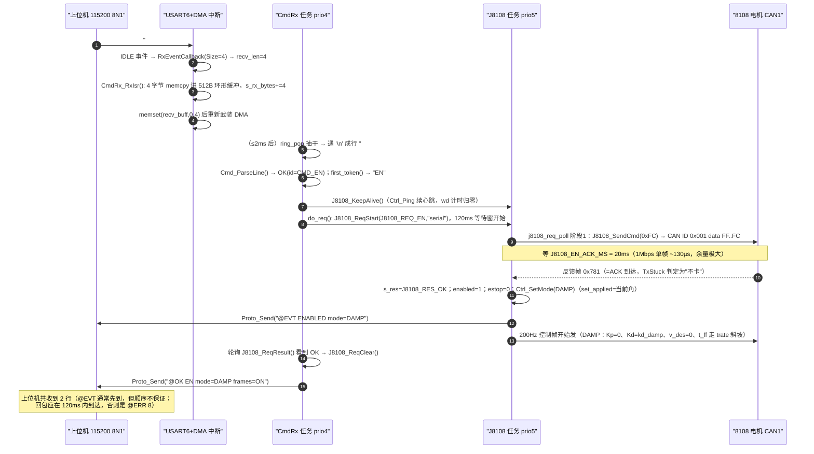

# 04 · 串口协议链：从 USART6 的一个字节到一次电机动作

> **本文基准**：固件 `FW_VERSION_STR = "v0.1.60-dev"`（`mcu_bsp/version/version.h:16`），工程 `fw_rtos_base`。
> **物理链路**：上位机 ↔ USB-TTL ↔ USART6（PG9=RX / PG14=TX，**115200 8N1**，`Core/Src/usart.c:62` `MX_USART6_UART_Init`）——**与日志同一个口**。
> **协议**：上行 `#<CMD> [args...]`（行尾 `\n` 或 `\r` 都接受）；下行 `@OK` / `@ERR` / `@EVT` / `@TEL`。
> **产出性质**：只读分析文档。**未修改任何源码、未编译工程**；文中所有命令、回包文本均从源码逐字提取（提取与核对方式见 §9）。
> 生成日期：2026-09-19。

涉及文件（本文只讲这几个，别的文件只在被调用处点名）：

| 文件 | 行数 | 在本链里的角色 |
|---|---|---|
| `mcu_bsp/uart/bsp_usart.h` / `.c` | 74 / 119 | 串口实例注册、DMA+IDLE 收包、`module_callback` 派发、发送封装 |
| `mcu_bsp/uart/uart10_def.c` | 33 | 定义 `uart10`（=USART6）并把回调注册成 `CmdRx_RxIsr` |
| `Task/Src/CmdRx_Task.c` / `Task/Inc/CmdRx_Task.h` | 888 / 24 | 15 个函数：ISR 搬字节、环形缓冲、拼行、解析调用、分派 25 条命令、回包 |
| `mcu_bsp/proto/cmd_parse.h` | 278 | 纯逻辑解析器（表驱动 `cmd_lookup` / `cmd_atof` / `Cmd_ParseLine` / `cmd_word_is`） |
| `mcu_bsp/proto/proto_tx.c` / `.h` | 85 / 23 | 跨任务 TX 串行化：一把互斥锁 + 整行发送 + 有界等待 |
| `mcu_bsp/log/bsp_log.{c,h}` | 420 / 84 | 日志输出（**与协议共口**）：`log_out`/`log_raw`/运行时级别/发送环形缓冲 |
| `Task/Inc/ui_status.h` | 54 | 协议与 UI 共享的状态视图（`Ui_Status_t`，Monitor 填充、屏只读） |
| 参考（不在本文展开） | — | `Task/Src/J8108_Task.c`（唯一发 CAN 者）、`mcu_bsp/ctrl/ctrl_core.c`（外环核）、`Task/Src/Monitor_Task.c`（@TEL） |

---

## 0. 一句话职责

**CmdRx 这条链负责把 USART6 上的 ASCII 字节流，安全地变成「控制状态改动 + @ 回包」：中断里只搬字节，任务里拼行/解析/分派；凡是要动 CAN 的事，一律以异步握手交给 J8108 任务；所有 `@` 行经 `proto_tx` 的一把互斥锁串行化后从同一个 USART6 发出。**

三句边界（这三句决定了后面所有设计细节）：

1. **它绝不直接发 CAN**——发帧只有 `J8108_Task.c` 一个地方（`Task/Inc/J8108_Task.h:6-12` 的线程约定），使能/失能/零点/清错走 `J8108_ReqStart → J8108_ReqResult → J8108_ReqClear` 异步握手。
2. **它绝不在中断里干活**——ISR 只做 `memcpy` + 计数，没有 `snprintf`、没有日志、没有浮点（`Task/Src/CmdRx_Task.c:6` 的历史教训）。
3. **它绝不打印不新鲜的数值**——数据不新鲜时 `#STAT` 只报链路状态，`@TEL` 只报 `link=DOWN`（`CmdRx_Task.c:345-346`）。

---

## 1. 接口清单

### 1.1 对外函数（谁被谁调）

| 函数 | 定义 | 谁调用 | 作用 |
|---|---|---|---|
| `CmdRx_Task_Init()` | `CmdRx_Task.c:860` | `Core/Src/main.c:178` | 建 `CmdRx` 任务（prio 4，栈 640 words） |
| `CmdRx_RxIsr()` | `CmdRx_Task.c:56` | `bsp_usart.c:91`（经 `uart10.module_callback`，**中断上下文**） | 把 `uart10.recv_buff` 里本次收到的字节搬进 512B 环形缓冲 |
| `CmdRx_RxLines()` | `CmdRx_Task.c:870` | `Monitor_Task.c:131`（`ui_fill`） | 累计收到并成行的**命令行**条数（屏 P2 `RX nL`） |
| `CmdRx_RxBytes()` | `CmdRx_Task.c:875` | `Monitor_Task.c:133` | 累计收到的**原始字节**数（屏 P2 `mB`）——分清「没字节」和「有字节没换行」 |
| `CmdRx_LastCmd()` | `CmdRx_Task.c:880` | `Monitor_Task.c:135` | 最近一条命令名（大写，屏 P2 `LAST #…`） |
| `CmdRx_LastErr()` | `CmdRx_Task.c:885` | `Monitor_Task.c:134` | 最近一次 `@ERR` 码（0=无，屏 P2 `PROTO ERR n`） |
| `Proto_TxInit()` | `proto_tx.c:24` | `main.c:164` | 建 TX 互斥锁（**必须在任何任务之前**） |
| `Proto_Send()` | `proto_tx.c:37` | `CmdRx`（全部回包）、`J8108_Task`（`@EVT`）、`Monitor`（`@TEL`） | 加锁 → 发 `line + "\r\n"` → 解锁；行 ≤127 字节 |
| `Proto_TxLines()` | `proto_tx.c:77` | `Monitor_Task.c:132`（屏 P2 `TX kL`）、`#STAT` | 累计发出的 `@` 行数 |
| `Proto_TxBusyDrops()` | `proto_tx.c:82` | Monitor 10s 摘要（`txdrop=`） | 取 TX 锁超时被丢弃的行数 |
| `log_set_level()` | `bsp_log.c:112` | `CmdRx`（`#LOG`） | 运行时日志级别（**协议口降噪的唯一手段**） |
| `log_get_level()` | `bsp_log.c:120` | 诊断用 | 读回当前级别 |
| `log_out()` / `log_raw()` | `bsp_log.c:125` / `:99` | 全工程 | 一行日志（自动 CRLF）/ 原始字节直发 |
| `USARTRegister()` | `bsp_usart.c:28` | `UART10_Init`（`uart10_def.c:31`） | 注册实例 + 启动接收 |
| `USARTServiceInit()` | `bsp_usart.c:19` | `USARTRegister` | `HAL_UARTEx_ReceiveToIdle_DMA` + 关 DMA 半传输中断 |
| `HAL_UARTEx_RxEventCallback()` | `bsp_usart.c:80` | HAL（USART6 IRQ / DMA IRQ） | 写 `recv_len` → 调 `module_callback`（函数指针字段）→ 清 buffer → 重启接收 |
| `HAL_UART_ErrorCallback()` | `bsp_usart.c:108` | HAL | 出错后重启接收（**唯一的自愈路径**） |
| `USARTSend()` | `bsp_usart.c:42` | `proto_tx.c:67`（BLOCKING）、`bsp_log.c:321`（IT） | 发送封装（BLOCKING/IT/DMA） |
| `USARTIsReady()` | `bsp_usart.c:61` | 备用 | 注意：实现是 `gState \| BUSY_TX`（见 §3.1 坑） |
| `UART10_Init()` | `uart10_def.c:21` | `main.c:147` | 绑定 USART6 + `recv_buff_size=128` + 注册 `CmdRx_RxIsr` |

### 1.2 数据面（缓冲/结构体）

| 名字 | 位置 | 类型/大小 | 谁写 | 谁读 |
|---|---|---|---|---|
| `uart10.recv_buff[]` | `bsp_usart.h:25` | `uint8_t[256]`（`USART_RXBUFF_LIMIT`），**DMA 目标** | DMA 硬件 | `CmdRx_RxIsr` |
| `uart10.recv_len` | `bsp_usart.h:27` | `volatile uint16_t` | HAL 回调（ISR） | `CmdRx_RxIsr` |
| `s_ring[]` | `CmdRx_Task.c:43` | `volatile uint8_t[512]` | **只有 ISR**（`s_w`） | **只有任务**（`s_r`） |
| `s_w` / `s_r` / `s_ovf` / `s_rx_bytes` | `CmdRx_Task.c:44-47` | `volatile uint16_t/uint32_t` | ISR | 任务/诊断接口 |
| `line[129]` | `CmdRx_Task.c:778`（栈上） | `char[CMD_LINE_MAX+1]` | 任务 | 解析器 |
| `Cmd_t` | `cmd_parse.h:64` | `id + f[6] + w[2][10]` | `Cmd_ParseLine` | `dispatch` |
| `Ctrl_Params_t` | `ctrl_core.h:52` | 结构体（J8108 任务私有） | **CmdRx 经 `J8108_Params()` 指针直接写** | `Ctrl_Step` |
| `Ctrl_State_t` | `ctrl_core.h:88` | 结构体（J8108 任务私有） | J8108 任务 | CmdRx（`#STAT` 只读） |
| `Ui_Status_t` | `ui_status.h:21` | 结构体 | Monitor（唯一填充者） | 屏 / 诊断 |
| `s_line[130]` | `proto_tx.c:20` | `char[127+3]` | `Proto_Send` | — |
| `s_log_tx_buf[16384]` | `bsp_log.c:28` | 环形缓冲 | 任意任务（临界区） | `log_tx_task` |

### 1.3 关键常量

| 常量 | 值 | 位置 | 含义 |
|---|---|---|---|
| `CMD_RING_SIZE` | 512 | `CmdRx_Task.c:35` | 收字节环形缓冲（2 的幂，取模可优化但未优化） |
| `CMD_LINE_MAX` | 128 | `:36` | 单行最长 128 字节（**超出即丢行并回 `@ERR 2`**） |
| `CMD_POLL_MS` | 2 | `:37` | 任务节拍：每 2ms 把环形缓冲抽干一次 |
| `CMD_TASK_PRIORITY` | 4 | `:38` | CmdRx 优先级（控制任务 5 > CmdRx 4 > Monitor 3 > LogTx 1） |
| `CMD_TASK_STACK_WORDS` | 640 | `:39` | 栈（含 `snprintf` 浮点 + 快照 + `b[256]`） |
| `CMD_REQ_WAIT_MS` | 120 | `:40` | 使能类握手的**任务侧**等待窗 |
| `J8108_EN_ACK_MS` | 20 | `J8108_Task.c:38` | 控制任务等 ACK 的窗口 |
| `PROTO_LINE_MAX` | 127 | `proto_tx.c:16` | 协议单行上限（**超出静默截断**） |
| `PROTO_TX_WAIT_MS` | 50 | `proto_tx.c:17` | 取 TX 锁最长等待（**有界，防协议口被永久占死**） |
| `USART_RXBUFF_LIMIT` | 256 | `bsp_usart.h:8` | 实例接收缓冲上限（实际注册 128） |
| `LOGBUF` | 16384 / chunk 128 | `bsp_log.h:31-32` | 日志发送缓冲 / 单段 IT 发送上限 |
| `configTICK_RATE_HZ` | 1000 | `FreeRTOSConfig.h:68` | 1 tick = 1ms，`now_ms()` 由此换算 |
| NVIC prio | USART6=5, DMA2_Stream1=5 | `usart.c:158`, `dma.c:47` | = `configLIBRARY_MAX_SYSCALL_INTERRUPT_PRIORITY`，**允许在其中调 `FromISR` API** |

---

## 2. 框图

### 2.1 ASCII 总览（收 / 回 / 日志三条线）

```
 ┌──────────────────────────── 上位机 (PC) ────────────────────────────┐
 │ 串口助手 / pyserial    115200 8N1，行尾 '\n' 或 '\r'（CRLF 也行）    │
 │ 发:  "#PING\n"   "#SET KP_V 0.01\n"   "#EN\n"                        │
 │ 收:  只信 '@' 开头且完整的行（日志行会插进来，见 §6.4）              │
 └───────────────┬─────────────────────────────────────────────────────┘
                 │  USB-TTL 3.3V；交叉接线：PC-TX→PG9，PC-RX←PG14；必须共地
                 ▼
 ┌──────────────────────────── USART6 (115200 8N1) ───────────────────────────┐
 │ RX PG9 ──► USART6 ──► DMA2_Stream1/CH5 (NORMAL,MINC,BYTE) ──► uart10.recv_buff[256]
 │                          │
 │   IDLE 事件(USART6_IRQn,prio5) 或 DMA 满 128B(DMA2_Stream1_IRQn,prio5)
 │                          ▼
 │   HAL_UART_IRQHandler() → HAL_UARTEx_RxEventCallback(&huart6, Size)   [bsp_usart.c:80]
 │        ├─ uart10.recv_len = Size          （先给长度，回调才知道包边界）
 │        ├─ uart10.module_callback  ▶ CmdRx_RxIsr()              [CmdRx_Task.c:56]
 │        │        └─ memcpy 进 512B 环形缓冲 + s_rx_bytes/s_ovf 计数   ← 中断里只做这些
 │        ├─ memset(recv_buff, 0, Size)      （★ 在回调之后才清 → 回调内数据完整）
 │        └─ HAL_UARTEx_ReceiveToIdle_DMA() 重新武装 + 关 DMA_IT_HT
 └──────────────────────────────────────────────────────────────────────────────┘
                 │  s_ring[512]（s_w 只有 ISR 写 / s_r 只有任务写）
                 ▼
 ┌──────────────────────── CmdRx 任务 (prio 4, 每 2ms) ────────────────────────┐
 │ cmdrx_task()  [CmdRx_Task.c:776]                                            │
 │  while (ring_pop(&ch)) {                                                    │
 │     ch=='\n'||'\r' 且 len>0 → line[len]='\0'                                │
 │        ├─ 前 3 行原样 LOG_I("cmd","rx line %u: \"%s\"")   ← 联调诊断         │
 │        ├─ first_token() 取命令名（大写）                                     │
 │        ├─ Cmd_ParseLine() [cmd_parse.h:164]                                 │
 │        │     NOTCMD → 静默丢弃（行不以 '#' 开头：回显/噪声）                 │
 │        │     UNKNOWN → @ERR 1 <NAME> unknown command (try #HELP)            │
 │        │     BADARG  → @ERR 2 <NAME> bad arguments                          │
 │        │     OK      → J8108_KeepAlive()（合法命令=上位机活着）              │
 │        │               └─ dispatch() [CmdRx_Task.c:306]  25 条命令分支      │
 │        └─ len = 0                                                           │
 │     len==CMD_LINE_MAX 仍无行尾 → len=0 + @ERR 2 ? line too long (max 128 bytes)
 │  }                                                                          │
 │  s_ovf 变化 → @ERR 2 ? rx overflow (host sent too fast)                      │
 └──────────────┬───────────────────────────────────────┬──────────────────────┘
                │ 改状态（直接写指针）                   │ 发请求（异步握手）
                ▼                                       ▼
   ┌────────────────────────────┐        ┌─────────────────────────────────────┐
   │ Ctrl_Params_t / Ctrl_State_t│       │ J8108_ReqStart(req,"serial")        │
   │ （J8108 任务私有，经        │        │  … 等 J8108_ReqResult() ≤120ms …    │
   │  J8108_Params()/State() 访问）│      │ J8108_ReqClear() → @OK/@ERR         │
   └─────────────┬──────────────┘        └───────────────┬─────────────────────┘
                 │  Ctrl_Step() 200Hz                     │ 由 J8108 任务执行
                 ▼                                        ▼
   ┌──────────────────── J8108 任务 (prio 5) ───────────────────────────────────┐
   │ j8108_req_poll(): 发 0x001 …FC/FD/FE/FA → 等 20ms → 查 ACK → 写 s_res     │
   │ j8108_frame_poll(): Ctrl_Step() → J8108_SendMIT() → CAN 0x201 (200Hz)      │
   └───────────────────────────┬───────────────────────────────────────────────┘
                               ▼
                    8108 关节电机（CAN1；反馈帧 0x781）

 ────────────────────────────── 下行：@ 行的公共出口 ──────────────────────────────
   CmdRx reply_ok/reply_err/Proto_Send ┐
   J8108 ev_report / LINKLOST          ├─► Proto_Send() [proto_tx.c:37]
   Monitor  @TEL / #TEL 1              ┘        │
                                                ├─ 取锁（≤50ms，超时→丢弃并计数）
                                                ├─ 整行 + "\r\n" 一次 USARTSend(BLOCKING)
                                                └─ HAL_UART_Transmit(..., 100ms 超时)
                                                          │
   ★ 日志旁路（不走 TX 锁）: log_out/log_raw → debug_transmit() → s_log_tx_buf[16KB]
        → log_tx_task (prio 1) → log_tx_flush() → USARTSend(IT, ≤128B/段) ──► 同一个 USART6
```

### 2.2 mermaid：一次 `#EN` 的完整时序（含 CAN 握手与两条回包）



### 2.3 任务与优先级

| 任务 | 优先级 | 栈(words) | 周期 | 与本链的关系 |
|---|---|---|---|---|
| `J8108` | 5 | — | 200Hz(5ms) | **唯一发 CAN 者**；执行握手、发帧、写 `Ctrl_State_t` |
| `CmdRx` | 4 | 640 | 2ms | 本链主角：拼行/解析/分派/回包 |
| `Monitor` | 3 | 640 | 10ms 节拍（屏 10Hz / 日志 1Hz / `@TEL` 可调） | 造 `@TEL`、填 `Ui_Status_t`（屏 P2 的 RX/TX 计数来自本链） |
| `LogTx` | 1 | 512 | 事件驱动 | 消费日志环形缓冲 → `USART6` IT 发送（**与协议行抢口**） |

---

## 3. 逐函数详解

> 每个函数给：原型 → 参数表 → 返回值 → 上行（谁调我）/ 下行（我调谁）→ 步骤 → 坑。
> 中断上下文函数标 `[ISR]`。

### 3.1 中断与串口层（`mcu_bsp/uart/`）

#### 3.1.1 `USARTRegister(USARTInstance *instance, USART_Init_Config_s *init_config)` — `bsp_usart.c:28`

```c
void USARTRegister(USARTInstance *instance, USART_Init_Config_s *init_config);
```

| 参数 | 说明 |
|---|---|
| `instance` | 模块自己的实例（本工程只有 `uart10`，定义在 `uart10_def.c:19`） |
| `init_config` | `{recv_buff_size, usart_handle, module_callback}` |

- 上行：`UART10_Init()`（`uart10_def.c:31`）。
- 下行：`memset` 清零实例 → 拷 3 个字段 → 存进 `usart_instance[]` 表（`bsp_usart.c:8-9`，`idx` 递增，上限 `DEVICE_USART_CNT=3`）→ `USARTServiceInit()`。
- 坑：**`recv_buff_size` 是 `uint8_t`**（`bsp_usart.h:26`），写成 256 会溢出成 0；本工程用 128。`idx` 无越界保护，注册第 4 个实例就写飞了（本工程只注册 1 个，`FEATURE_SD_CLI=0`）。

#### 3.1.2 `USARTServiceInit(USARTInstance *_instance)` — `bsp_usart.c:19`

```c
HAL_UARTEx_ReceiveToIdle_DMA(_instance->usart_handle, _instance->recv_buff, _instance->recv_buff_size);
__HAL_DMA_DISABLE_IT(_instance->usart_handle->hdmarx, DMA_IT_HT);
```

- 上行：`USARTRegister`，以及 `HAL_UARTEx_RxEventCallback` 尾部（重启接收）。
- 作用：把 DMA 收包挂起来（NORMAL 模式、DMA2_Stream1/CH5，`usart.c:132-152`），并**关掉 DMA 半传输中断**——HAL 的设计缺陷会让「DMA 半满 / 全满 / IDLE」三种事件都进同一个回调，关掉半满可少一半无谓中断（注释见 `bsp_usart.c:22-24`）。
- 坑：DMA 是 **NORMAL 而非 CIRCULAR**，所以「满 128 字节」后必须重启，否则不再收（重启在回调里做，见下）。

#### 3.1.3 `HAL_UARTEx_RxEventCallback(UART_HandleTypeDef *huart, uint16_t Size)` — `bsp_usart.c:80` `[ISR]`

```c
void HAL_UARTEx_RxEventCallback(UART_HandleTypeDef *huart, uint16_t Size);
```

| 参数 | 来源 | 说明 |
|---|---|---|
| `huart` | HAL | 中断里传进来的句柄（本工程 `&huart6`） |
| `Size` | HAL | **本次实际收到的字节数**：IDLE 路径 = `RxXferSize - RxXferCount`（HAL 在 IDLE 分支先 `HAL_DMA_Abort` 并把 NDTR 差写回 `RxXferCount`，`stm32f4xx_hal_uart.c:2508-2534`）；DMA 满路径 = 全部（`:3109`） |

- 上行：HAL —— 由 `USART6_IRQHandler`（`stm32f4xx_it.c:280` → `HAL_UART_IRQHandler` 里判 IDLE 标志）或 `DMA2_Stream1_IRQHandler`（`stm32f4xx_it.c:238` → 传输完成）触发。
- 步骤（**顺序是设计出来的，别改**）：
  1. 在 `usart_instance[]` 里按 `huart` 找实例；
  2. `usart_instance[i]->recv_len = Size;`（`bsp_usart.c:90`，**先写长度**）；
  3. 调 `usart_instance[i]->module_callback`（`bsp_usart.c:91` → `CmdRx_RxIsr`）——回调**无参数**，靠 `recv_len` 知道边界；
  4. `memset(recv_buff, 0, Size);`（`:92`，**回调之后才清**，所以回调里读到的数据完整）；
  5. `HAL_UARTEx_ReceiveToIdle_DMA(...)` 重启 + 关 `DMA_IT_HT`（`:94-95`）→ `return`（只服务一个实例）。
- 坑（三条，都在源码注释里写死了）：
  - **禁止在此放日志**：中断上下文里 `log_raw → debug_transmit → 任务级 xTaskNotifyGive` 曾导致系统僵死（`bsp_usart.c:85-87`，2026-08-21 修复；`bsp_log.c:233-235` 现在按 IPSR 分流）。
  - `memset` 时机：若把 `memset` 提前到回调前面，回调会读到全 0。
  - 重启接收与回调在同一中断里完成，但**回调执行期间到达的字节会丢**（窗口 = 回调耗时，本工程约几十 µs）；这是 NORMAL 单缓冲方案的固有代价。

#### 3.1.4 `HAL_UART_ErrorCallback(UART_HandleTypeDef *huart)` — `bsp_usart.c:108` `[ISR]`

- 作用：噪声/帧错/溢出（ORE/FE/NE/PE）后**重启 DMA 接收**，否则串口从此静默。日志被注释掉了（手次是 `LOGWARNING`，现在空实现）。
- 坑：错误回调里没有清错误计数、没有上报；上位机侧只能靠「突然收不到回包」察觉。

#### 3.1.5 `USARTSend(USARTInstance *, uint8_t *send_buf, uint16_t send_size, USART_TRANSFER_MODE mode)` — `bsp_usart.c:42`

| mode | 实现 | 本工程谁用 |
|---|---|---|
| `USART_TRANSFER_BLOCKING` | `HAL_UART_Transmit(..., 100)` 轮询 | `Proto_Send`（协议行 ≤127B ≈ 11ms@115200，余量足） |
| `USART_TRANSFER_IT` | `HAL_UART_Transmit_IT` | `log_tx_flush`（≤128B/段） |
| `USART_TRANSFER_DMA` | `HAL_UART_Transmit_DMA` | 未用 |
| 其它 | `while(1);` 死循环 | —（传错模式直接挂死，属于故意的 assert） |

- 坑：**返回值被调用方忽略**。`HAL_UART_Transmit` 在 `gState != READY` 时立即返回 `HAL_BUSY`（不等待），于是该行**静默丢失**——这是协议行可能与日志抢口时的主要丢包路径（§6.4 有量化分析）。

#### 3.1.6 `USARTIsReady(USARTInstance *)` — `bsp_usart.c:61`

```c
if (_instance->usart_handle->gState | HAL_UART_STATE_BUSY_TX) return 0; else return 1;
```

- 坑：`|` 应为 `&`（原工程遗留）。`gState | BUSY_TX` 恒非 0 → **永远返回 0（"不 ready"）**。本工程没人在用（协议与日志都自己判 `gState == HAL_UART_STATE_READY`），但**不要**拿它做判断。

#### 3.1.7 `UART10_Init(void)` — `mcu_bsp/uart/uart10_def.c:21`

```c
USART_Init_Config_s cfg = {0};
cfg.usart_handle    = &huart6;    /* USART6 */
cfg.recv_buff_size  = 128;        /* 命令行接收缓冲（协议行长 ≤128） */
#if FEATURE_SERIAL_CTRL
cfg.module_callback = CmdRx_RxIsr; /* 中断上下文：只搬字节 */
#else
cfg.module_callback = NULL;
#endif
USARTRegister(&uart10, &cfg);
```

- 上行：`main.c:147`（注释写明「日志串口必须先于 LED 任务」——因为任务里 `printf` 依赖 `uart10`）。
- 坑：`FEATURE_SERIAL_CTRL=0` 时回调解绑 → 串口只发不收（本工程为 1）；`recv_buff_size=128` 意味着**单次 IDLE burst 超过 128 字节就会被 DMA 满载截断**，但 `CmdRx_RxIsr` 会紧跟一次 DMA 满事件把剩余字节补上（128B 缓冲对应 128B 行上限 + 行尾，刚好够）。

### 3.2 `Task/Src/CmdRx_Task.c` 全部 15 个函数

#### 3.2.1 `CmdRx_RxIsr(void)` — `CmdRx_Task.c:56` `[ISR]`

```c
void CmdRx_RxIsr(void);
```

- 上行：`bsp_usart.c:91`（`module_callback`，中断上下文）。
- 下行：只碰 `uart10.recv_len` / `uart10.recv_buff[]` 和 4 个 `volatile` 静态量。
- 步骤：
  1. `n = uart10.recv_len`，再夹到 `USART_RXBUFF_LIMIT(256)`（防御性）；
  2. `s_rx_bytes += n`（诊断：区分「没字节」与「有字节没换行」）；
  3. 逐字节写入环形缓冲：`nw = (s_w+1) % 512`，**若 `nw == s_r` 则 `s_ovf++` 并 `return`**（整包丢弃剩余字节，绝不阻塞中断）；否则 `s_ring[s_w] = recv_buff[i]; s_w = nw;`。
- 坑：
  - **这里绝不能加日志/`snprintf`/浮点**——历史上加过，导致 IDLE 中断里触发任务级通知 → 死锁（文件头注释 `CmdRx_Task.c:6`）。
  - 满时是「丢尾部」而不是「丢整包」：已写入的字节保留，剩下的丢——所以溢出后行内容可能被截断成畸形行（任务侧会回 `@ERR 2 ... rx overflow`）。
  - `s_w` 只由 ISR 写、`s_r` 只由任务写，所以不需要临界区；但「满判定」读 `s_r` 是跨上下文读，属于**单读单写**模型（Cortex-M4 上 16 位对齐访问原子）。

#### 3.2.2 `ring_pop(uint8_t *out)` — `CmdRx_Task.c:80`

- 返回 1=取到一个字节，0=空。只由任务上下文调用。
- 坑：没有「原子取走一批」的接口——每字节一次函数调用 + 取模，512B 全满时约 512 次循环，仍在 2ms 节拍内绰绰有余（115200 下 2ms 最多来 23 个字节）。

#### 3.2.3 `reply_ok(const char *fmt, ...)` — `CmdRx_Task.c:92`

```c
char body[128]; char line[144];
vsnprintf(body, 128, fmt, ap);          /* 正文 */
snprintf(line, 144, "@OK %s", body);    /* 前缀 */
Proto_Send(line);
```

- 上行：`dispatch` 多处、`do_req`。
- 下行：`Proto_Send`（自动补 `\r\n`）。
- 坑：**正文超 123 字节会被 `vsnprintf` 截断**（不报错）；再往上的 127 字节上限还有一次截断（`Proto_Send`）。

#### 3.2.4 `reply_err(uint8_t code, const char *cmd, const char *why)` — `CmdRx_Task.c:105`

```c
s_last_err = code;
snprintf(line, 144, "@ERR %u %s %s", code, cmd ? cmd : "?", why ? why : "");
Proto_Send(line);
LOG_W("cmd", "@ERR %u (%s) %s", code, cmd ? cmd : "?", why ? why : "");
```

- 侧效应：写 `s_last_err`（屏 P2 `PROTO ERR n`、`#STAT` 不含它）并**额外打一条 WARN 日志**（注意：这条日志走的是日志旁路，会给串口加一行 `[cmd] W: @ERR …`）。
- 坑：`cmd == NULL` → 输出 `?`；空字符串则输出两个空格（例如 `"#"` 这种畸形行 → `@ERR 2  bad arguments`）。

#### 3.2.5 `first_token(const char *line, uint16_t len, char *out, uint16_t outsz)` — `CmdRx_Task.c:116`

- 取「`#` 后第一个 token」并**大写化**，用于回包里的 `<CMD>` 字段与 UI 的 `last_cmd`。
- 步骤：跳过前导空白 → 跳过 `#` → 拷到空白/CR/LF 或 `outsz-1` 为止 → 大写 → NUL 结尾。
- 坑：**即使命令未知也会输出它的名字**（这正是 `@ERR 1 FOO unknown command (try #HELP)` 的 `FOO` 来源）；`outsz` 是 16（`dispatch` 调用处 `char name[16]`），超长命令名被截断。

#### 3.2.6 `now_ms(void)` — `CmdRx_Task.c:136`

```c
return (uint32_t)(xTaskGetTickCount() * portTICK_PERIOD_MS);
```

- tick=1ms 时为毫秒时基（`#PING ms=`、`#TEL`/`@EVT` 里的 `ms` 同源）。回绕（≈49.7 天）由 `uint32_t` 减法处理，不做特殊处理。

#### 3.2.7 `do_req(J8108_Req_e req, const char *name)` — `CmdRx_Task.c:142` ★异步握手核心

```c
J8108_ReqStart(req, "serial");
while (waited < CMD_REQ_WAIT_MS) {          /* 120ms */
    vTaskDelay(pdMS_TO_TICKS(2));
    waited += 2;
    res = J8108_ReqResult();
    if (res != J8108_RES_NONE) break;
}
J8108_ReqClear();
switch (res) { OK → @OK …; NOACK → @ERR 5 …; BUSY → @ERR 5 …; default(NONE) → @ERR 8 …; }
```

- **为什么不能让 CmdRx 直接碰 CAN**：CAN 侧只有一个写者（J8108 任务，prio 5），它同时还在发 200Hz 控制帧、维护 TxStuck 看门狗、写反馈快照。若 CmdRx 也发帧，会让「使能帧被控制帧挤掉」「邮箱状态被两个任务各写一半」这两类问题无法收敛。所以握手被拆成三段状态机：
  1. **CmdRx 侧**：`J8108_ReqStart(req,"serial")` → `s_req=req; s_res=NONE; s_req_fresh=1; s_req_sent_ms=0`（`J8108_Task.c:87-96`，**覆盖式发起**，`why` 只进日志）；
  2. **控制任务侧**（`j8108_req_poll`，`J8108_Task.c:303`）：阶段 1 发帧（0x001 `…FC/FD/FE/FA`）并记 `s_req_sent_ms=t`；阶段 2 等 ≥20ms 后用 `J8108_TxStuck(t,20)` 判 ACK —— 卡住则 abort 邮箱并置 `J8108_RES_NOACK`，否则置 `J8108_RES_OK` 并做副作用（`#EN` 成功：`enabled=1; estop=0; Ctrl_SetMode(DAMP); Ctrl_Ping()`，并发 `@EVT`）；CAN 未就绪则直接 `J8108_RES_BUSY`（不重试）；
  3. **CmdRx 侧收尾**：`J8108_ReqClear()`（清 `s_res` 与 `s_req`）。
- 回包映射（逐字）：

| 结果 | 回包 |
|---|---|
| `J8108_RES_OK` 且 `req==J8108_REQ_EN` | `@OK EN mode=DAMP frames=ON`（`name` 展开） |
| `J8108_RES_OK` 其它 | `@OK <NAME> done` |
| `J8108_RES_NOACK` | `@ERR 5 <NAME> no ACK on bus: check 24V / CAN_H-L / 120R / CANID` |
| `J8108_RES_BUSY` | `@ERR 5 <NAME> CAN not ready (init fail / bus error)` |
| `J8108_RES_NONE`（120ms 窗内没结果） | `@ERR 8 <NAME> timeout (control task busy?)` |

- 坑：
  - **两个等待窗**：任务侧 120ms（`CMD_REQ_WAIT_MS`）比控制侧 20ms（`J8108_EN_ACK_MS`）宽得多，正常情况永远等不到「NONE」超时；出现 `@ERR 8` 说明控制任务被饿死（例如 CAN 中断风暴）或整个任务没跑。
  - `waited` 是**计数值**不是真实时钟：`vTaskDelay(2)` 实际可能多睡几个 tick，所以真实等待 ≥120ms 而不会更短（偏保守，安全）。
  - **返回顺序不保证**：`#EN` 会同时产生控制任务的 `@EVT ENABLED mode=DAMP` 和本任务的 `@OK EN mode=DAMP frames=ON`，谁先到取决于抢占；上位机必须按「`@OK`/`@ERR` 才是命令结果，`@EVT` 是异步事件」处理。
  - **已知竞态（低概率，未修）**：`J8108_ReqStart` 是覆盖式。若 `#EN` 的 `do_req` 正在等待期间，上位机又发了 `#ESTOP`（`J8108_StopHard` 内部直接 `ReqStart(REQ_DIS)`），则 `do_req` 会把这次 **DIS** 的结果当成 EN 的结果，回出 `@OK EN mode=DAMP frames=ON`，而电机其实已失能。规避：不要在握手窗口内穿插急停；急停后以 `@EVT DISABLED` / `#STAT en=0` 为准。

#### 3.2.8 `set_one(const char *key, float v)` — `CmdRx_Task.c:185` ★17 键参数表

- 返回 `NULL` = 成功；返回字符串 = **失败原因（逐字进 `@ERR 2`）**。
- 实现：一串 `strcmp` 链；`key==NULL` → `"missing key"`，未识别键 → `"unknown key"`；每键先做范围检查（超范围返回 `"range a..b"`），再写 `J8108_Params()` 指向的字段（`Ctrl_Params_t`，`ctrl_core.h:52`）。
- 坑：
  - **`key` 已被解析器大写**（`cmd_parse.h:246-248`），所以 `#set kd_damp 1` 也能成功；但 `set_one` 内部用 `strcmp`（**大小写敏感**），直接喂小写字符串会全部落到 `"unknown key"`。
  - `WD` 键写 `p->wd_ms = (uint16_t)v`（截断，范围 0..5000 内安全）；`AUTODAMP`/`SETP` 无范围检查，`v != 0.0f` 即置 1。
  - 这里**没有锁**：CmdRx 直接改控制任务私有结构体。Cortex-M4 上 32 位 float 单次写原子，但**多字段不会被原子地一起换**（例如 `#LIM P` 写 `pmin/pmax` 两条指令），控制任务可能恰好在两条之间跑一拍。后果是「一拍里限位只有一半生效」，下一拍即恢复；判为可接受（要说明的是：这是静态分析结论，未实机复现）。
  - 键表里**没有** `PMIN/PMAX`（那要走 `#LIM P`）、没有 `FOLLOW_MS/STALL_MS/TEMP_*`（只能改代码）。

#### 3.2.9 `dispatch(const Cmd_t *c, const char *name)` — `CmdRx_Task.c:306` ★25 条命令分支

- 上行：`cmdrx_task`（仅当 `Cmd_ParseLine` 返回 `CMD_PARSE_OK` 且已 `J8108_KeepAlive()`）。
- 局部准备：`char b[256]`、`J8108_Snapshot_t sn`、`const Ctrl_State_t *st = J8108_State();`、`Ctrl_Params_t *pp = J8108_Params();`——即：**每次命令都先抓一次状态指针**（`#STAT`/`#GET`/`#LIM`/`#DAMP` 用）。
- 结构：`switch (c->id)`，25 个 `case` + `default`。命令→动作→回包的**逐条说明见 §4**。
- 坑：
  - `default` 分支（`reply_err(1, name, "unknown command")`）在解析器路径下**不可达**（未知命令在 `Cmd_ParseLine` 就成了 `CMD_PARSE_UNKNOWN`），只作防御。
  - `b[256]` 与协议 127 字节上限之间有落差：`#STAT`/`#VER`/`#GET`/`#LIM` 都是「先格式化进 256 缓冲，再交给 `Proto_Send` 截到 127」，**超过 127 就被静默砍尾**（`#GET` 因此拆成 3 行；`#STAT` 见 §6.3 的超限发现）。
  - 只有 `#MODE`/`#V`/`#P`/`#T`/`#IMP`/`#SETP` 做「已使能」检查（`J8108_IsEnabled()`）；`#DAMP`/`#HOLD`/`#LIM`/`#SET` 在未使能时也接受（`Ctrl_SetDamp` 会顺手把模式写成 DAMP，但 `enabled` 仍为 0，不发帧）。

#### 3.2.10 `cmdrx_task(void *arg)` — `CmdRx_Task.c:776` ★任务主体

```c
char line[CMD_LINE_MAX + 1u];   /* 129 */
LOG_I("cmd", "serial protocol v1 listener up: #CMD -> @OK/@ERR (log lines are separate)");
for (;;) {
    stack_probe_tick(now_ms(), "cmd", CMD_TASK_STACK_WORDS);   /* 开机 5s 后报一次栈余量 */
    while (ring_pop(&ch) != 0u) { …拼行/解析/分派… }
    if (s_ovf != ovf_seen) { ovf_seen = s_ovf; reply_err(2,"?","rx overflow (host sent too fast)"); }
    vTaskDelay(pdMS_TO_TICKS(CMD_POLL_MS));   /* 2ms */
}
```

- 行结束符处理：`\n` 或 `\r` **都接受**；CRLF 时第二个字符遇到 `len == 0` 自动跳过（不会产生空行）。**只有 `len > 0` 才成行**（空行静默）。
- 诊断钩子：**前 3 行原样打印** `[cmd] I: rx line 1: "#PING"`（`CmdRx_Task.c:799-804`），之后静默，防刷屏。
- 分派前调用链：`J8108_KeepAlive()` →（`Ctrl_Ping`）→ `dispatch()`；**任何合法命令都续心跳**，这是 `#WD` 心跳语义的基础。
- 超长行（`len == 128` 仍在塞）：`len = 0; reply_err(2,"?","line too long (max 128 bytes)");`。
  - 坑：**一条超长行可能收到两包回包**——第 129 字节触发 `@ERR 2`，随后剩余字节从 `line[0]` 重新开始攒，遇到行尾又当成一条新行去解析（若残段以 `#` 开头甚至会执行成功）。
- 溢出提示：`s_ovf != ovf_seen` 只在**变化**时报一次（`ovf_seen = s_ovf` 取最新值，多次溢出合并成一行）。
- 落点统计：成行且非 NOTCMD 时 `s_rx_lines++`、`snprintf(s_last_cmd, 14, "%s", name)`（供屏 P2 `LAST #…`）。

#### 3.2.11 `CmdRx_Task_Init(void)` — `CmdRx_Task.c:860`

```c
BaseType_t ok = xTaskCreate(cmdrx_task, "CmdRx", 640, NULL, 4, NULL);
if (ok != pdPASS) LOG_E("cmd", "xTaskCreate FAILED (heap/stack?) -> SERIAL PROTOCOL DISABLED");
```

- 上行：`main.c:178`（在 `J8108_Task_Init()` 之后）。
- 坑：堆只有 `configTOTAL_HEAP_SIZE = 32768`（`FreeRTOSConfig.h:71`），任务创建失败**不会崩**，只会没有协议口——日志里唯一证据就是那行 `LOG_E`，所以「串口全静默」时要先搜这条日志。

#### 3.2.12~3.2.15 取数接口 — `:870 / :875 / :880 / :885`

```c
uint32_t CmdRx_RxLines(void);   /* s_rx_lines：成行的命令行数（屏 P2 RX nL） */
uint32_t CmdRx_RxBytes(void);   /* s_rx_bytes：原始字节数（屏 P2 mB）——本链最重要的诊断量 */
const char *CmdRx_LastCmd(void);/* s_last_cmd（14 字节，大写命令名） */
uint8_t CmdRx_LastErr(void);    /* s_last_err：最近 @ERR 码，0=无 */
```

- 上行：`Monitor_Task.c:131-135`（`ui_fill` → `Ui_Status_t` → 屏 P2）。
- 坑：都是无锁读（`uint32_t` 原子；字符串可能被截断读到半新半旧，仅供人看）。

### 3.3 解析层（`mcu_bsp/proto/cmd_parse.h`，纯逻辑，可宿主机穷举测）

#### 3.3.1 类型与常量

| 名字 | 位置 | 说明 |
|---|---|---|
| `CMD_MAX_FARGS = 6` | `:21` | 最多 6 个数（`#SETP` 需要 5 个） |
| `CMD_MAX_WARGS = 2` | `:22` | 最多 2 个关键字 |
| `CMD_WARG_LEN = 10` | `:23` | 关键字缓冲 10 字节 → **实际只存前 9 字符**（超出静默截断） |
| `Cmd_ParseRes_e` | `:25-31` | `NOTCMD=0` / `OK` / `UNKNOWN`（`@ERR 1`）/ `BADARG`（`@ERR 2`） |
| `Cmd_Id_e` | `:33-62` | `CMD_NONE=0` … `CMD_HELP=25`，`CMD__COUNT=26` |
| `Cmd_t` | `:64-71` | `id + nf + f[6] + nw + w[2][10]` |

#### 3.3.2 `cmd_lookup(const char *name, uint8_t len)` — `:74`

- 表驱动：`static const char *const names[CMD__COUNT]`（`:76-79`，索引 = 枚举值，顺序必须与 `Cmd_Id_e` 一致）。
- 匹配规则：长度必须**完全相等**，逐字符比较时把 `a-z` 抬成 `A-Z` → **大小写不敏感**（`#ping`/`#Ping` 都行）。
- 返回 `CMD_NONE`：名字长度为 0 或 >12、或表里没有。
- 坑：`names[0]` 是空串（`CMD_NONE`），循环从 `i=1` 开始；表与枚举一旦错位，所有命令都会指错分支（改枚举必须同步改表）。

#### 3.3.3 `cmd_atof(const char *s, uint8_t len, float *out)` — `:114`

- 手写十进制解析（**不支持指数**）：可选 `+/-` → 数字累加 → 最多一个小数点 → **必须至少有一位数字**。
- 返回 1=成功（`*out` 有效），0=失败。
- 拒绝的情况：`"1.2.3"`（两个小数点）、`"12a"`（非法字符）、`"1e3"`（`e` 非法）、`"-"`/`"."`/`""`（没有数字）。
- 坑：精度是 `float` 累加（`v = v*10 + d`、小数用 `scale *= 0.1`），**不是** `strtof` 舍入；`0.1` 这类值会有微小表示误差（对命令参数无实际影响，但别拿它做等值比较）。
- 坑：`len` 由调用方限制 ≤16，所以不会越界读。

#### 3.3.4 `Cmd_ParseLine(const char *line, uint16_t len, Cmd_t *cmd)` — `:164` ★主解析

步骤：

1. 跳过前导空格/Tab（**允许 `"  #PING"`**）；否则 `NOTCMD`；
2. 必须 `#`，否则 `NOTCMD`（← 这就是「日志行/回显被静默忽略」的机制）；
3. 取命令名 token（遇空格/Tab/CR/LF 停）→ 长度为 0 或 >12 → `BADARG`；
4. `cmd_lookup` → `CMD_NONE` → `UNKNOWN`（**注意：未知命令不解析参数**，所以 `#FOO 1.2.3` 报 `@ERR 1` 而非 2）；
5. 循环取参数 token：先试 `cmd_atof`
   - 成功 → 存 `f[nf++]`；`nf` 已满 6 → `BADARG`；
   - 失败 → 若首字符是 `0-9` / `-` / `+` / `.` → **`BADARG`**（这是宿主机测试抓到的坑：`1.2.3`、`1e3`、`-` 不能被当关键字静默吞掉）；
   - 否则当关键字：大写化存入 `w[nw++]`（`nw` 已满 2 → `BADARG`；>9 字符静默截断）；
6. token 长度 >16 → `BADARG`；返回 `OK`（`cmd` 仅在 OK 时有意义）。

坑（写命令时最常踩）：

- **`#` 与命令名之间不能有空格**：`# PING` → 命名 token 为空 → `@ERR 2`。（前导空白可以在 `#` **之前**。）
- **数值/关键字顺序无关**：`#SET 0.5 KD_DAMP` 与 `#SET KD_DAMP 0.5` 等价（分桶存储）——`dispatch` 取 `c->f[0]` 和 `c->w[0]`。
- 关键字必须**字母/下划线开头**：`#MODE a1` 里 `a1` 是关键字（`cmd_atof` 失败但首字符不是数字形状）→ `@ERR 2 unknown mode`。
- 关键字只存前 9 字符：`#SET KD_DAMPXX 1` 会被截成 `KD_DAMPXX` 后仍是 "unknown key"（不报截断）。
- 大小写：命令名、关键字都自动大写，**回包里出现的名字因此都是大写**。

#### 3.3.5 `cmd_word_is(const Cmd_t *cmd, uint8_t idx, const char *need)` — `:259`

- 语义：`cmd->w[idx]` 是否等于 `need`（`need` 传字面量大写亦可，函数内部也会大写化 `b`）。
- 返回 0/1；`cmd==NULL`、`idx >= nw`、`need==NULL` → 0。
- 坑：比较是**全等**（长度也必须一致），所以 `w[0]="POSX"` 不等于 `"POS"`；调用处一律用 `idx=0`（第一个关键字），`#ZERO x CONFIRM` 会失败 → `@ERR 4`。

### 3.4 TX 串行化（`mcu_bsp/proto/proto_tx.c`）

#### 3.4.1 `Proto_TxInit(void)` — `:24`

- `xSemaphoreCreateMutex()`；失败 → `LOG_E("proto","TX mutex create FAILED -> protocol TX DISABLED (heap?)")`，此后 `Proto_Send` 直接 return（**协议只收不回**）。
- 上行：`main.c:164`（**先于任何任务创建**；`Proto_TxInit` 里没有 `FromISR` 需求，调度器启动前调用也安全）。

#### 3.4.2 `Proto_Send(const char *line)` — `:37` ★回包唯一出口

```c
if (line == NULL || s_tx_mtx == NULL) return;
n = strlen(line) 但最多 127;            /* 超长静默截断 */
if (n == 0) return;
memcpy(s_line, line, n); s_line[n]='\r'; s_line[n+1]='\n'; n += 2;
if (xSemaphoreTake(s_tx_mtx, pdMS_TO_TICKS(50)) == pdTRUE) {
    USARTSend(&uart10, s_line, n, USART_TRANSFER_BLOCKING);
    s_tx_lines++;
    xSemaphoreGive(s_tx_mtx);
} else {
    s_tx_busy_drops++;                  /* 记一笔：不阻塞、不静默 */
}
```

- **回包三原则**的第一条在这里落地：**一把锁 = 一整行**，行内自带 `\r\n`，三个任务（CmdRx / J8108 / Monitor）共享出口，不会互相插成半行。
- 锁粒度 = 一行，持锁时间 = 一次 blocking 发送（127B@115200 ≈ 11ms）+ `s_line` 拷贝。
- **有界等待 50ms**（`PROTO_TX_WAIT_MS`）：不用 `portMAX_DELAY` 是刻意的——万一持锁方崩在锁里，协议口不会被永久锁死（源码注释 `:63-64` 明说「否则现场表现就是板子卡死」）。超时则**丢这一行**并计数。
- 坑：
  - **超 127 字节静默截断**：没有错误、没有计数，行尾字段直接消失（`#STAT` 会踩到，见 §6.3）。
  - 截断后仍然补 `\r\n`，所以上位机看到的是「短了但完整的一行」。
  - `s_tx_lines` 在**发送失败（HAL_BUSY）时也自增**——它统计的是「尝试发出」，不是「真的发出」（§6.4 的丢行问题只能靠 `Proto_TxBusyDrops` + 上位机超时来判断）。
  - `s_line` 是**全局共享**的：正因为发送在锁内一次做完，这才能成立；不要把 memcpy 挪到锁外。

#### 3.4.3 `Proto_TxLines(void)` / `Proto_TxBusyDrops(void)` — `:77 / :82`

- 上行：`Monitor_Task.c:132`（屏 P2 `TX kL`）、Monitor 10s 摘要 `txdrop=`。
- 诊断口径：`TX` 不涨 = 没有回包产生（或全被丢弃）；`txdrop>0` = 有写入方被锁卡住过。

### 3.5 日志（`mcu_bsp/log/bsp_log.c`）——与协议共口的另一半

#### 3.5.1 `log_set_level(uint8_t level)` / `log_get_level()` — `:112 / :120`

- 运行时级别（`s_run_level`，`:110`，默认 `LOG_LEVEL_DEBUG`）；`level > LOG_LEVEL_DEBUG` 被忽略。
- `log_out` 中 `if (level > s_run_level) return;`（`:131-134`）→ **`#LOG 0` 之后只剩 ERROR**（这是把串口让给协议的关键开关）。
- 注意 `#LOG` 属于**运行期过滤**，与 `BSP_LOG_LEVEL`（编译期裁剪，`bsp_log.h:26`）是两套。

#### 3.5.2 `log_out(uint8_t level, const char *tag, const char *fmt, ...)` — `:125`

- 栈上 `char buf[128]`（`LOG_FMT_BUF_SIZE`）格式化 `[tag] L: 正文\r\n`，超长补 `"...\r\n"`；然后 `debug_transmit()` 一次提交（一行 = 一次通知）。
- 调用者开销 = `vsnprintf` + `memcpy` + 通知，微秒级，**不碰硬件**、不阻塞。
- 坑：正文超 ~120 字节会被截断成 `...`（`#LOG`/协议无关，但排查时别指望日志能打完一行超长参数）。

#### 3.5.3 `debug_transmit(uint8_t *data, uint16_t len)` — `:192`

- 写进 16KB 发送环形缓冲（临界区 = `taskENTER_CRITICAL_FROM_ISR` 系列，任务/中断/调度器启动前三种上下文都安全，`bsp_log.c:46-62`）；**缓冲满 → 整条丢弃 + `s_log_tx_drop_cnt++`**（保头部，不阻塞调用者）。
- 通知：调度器未启动不发；`__get_IPSR()` 非 0 → `vTaskNotifyGiveFromISR`，否则 `xTaskNotifyGive`（2026-08-21 死锁修复）。
- 坑：`log_raw()`（`:99`）只是 `debug_transmit` 的薄包装（无标签、无 CRLF），**中断里调用也安全**，但仍不建议在收包回调里用（会引入额外抖动）。

#### 3.5.4 `log_tx_task()` — `:272` 与 `log_tx_flush()` — `:295` ★与协议抢口的实体

- `log_tx_task()`（prio 1）先 `log_tx_flush()` 冲刷启动前积压，再调用 ulTaskNotifyTake(pdTRUE, portMAX_DELAY)（RTOS API）挂起等通知。
- `log_tx_flush` 每次取 ≤128 字节（`LOG_UART_CHUNK_SIZE`）：
  - `uart10.gState == READY` → `USARTSend(IT)`，然后**等硬件发完**（TC 中断恢复 gState；最多 1000 次 `vTaskDelay(1)` ≈1s，超时 `HAL_UART_AbortTransmit` 强制恢复）；完成后才前进读索引；
  - **否则（不 READY）→ 丢弃这一段并 `s_log_tx_drop_cnt++`，立刻继续下一段**。
- 与协议口的三条相互影响（§6.4 有完整分析）：
  1. 协议行发送期间（`gState=BUSY_TX`，blocking 轮询），日志任务若被调度到，会**快速连续丢弃**整段日志（16KB 可在几十次循环内被丢掉，全部计入 `s_log_tx_drop_cnt`）；
  2. 日志 IT 发送在飞行中时，`Proto_Send` 的 `HAL_UART_Transmit` 会拿到 **`HAL_BUSY` 而静默丢行**（不计数）；
  3. 两者都不会产生「半行 + 半行」的字节级交错（各自独占 gState），但**上位机会看到日志行插在两条 `@` 行之间**——所以上位机解析必须「只信 `@` 开头且完整的行」。

#### 3.5.5 `bsp_log_init()` / `bsp_log_get_drop_count()` / `fputc()` — `:71 / :257 / :385`

- `bsp_log_init()`：幂等建 `LogTx` 任务（首次 `debug_transmit` 也会惰性调用）。
- `bsp_log_get_drop_count`：日志丢弃条数（当前只在内部计数，屏/摘要未显示；诊断时可加一行）。
- `fputc()`：`printf` 重定向，行攒发（遇 `\n` 才提交，孤立 `\r` 忽略）→ **日志量大时不要把协议调试和 `printf` 混用**（`printf` 并发调用行内容可能交错，`bsp_log.c:375-379`）。

---

## 4. 命令总表（25 条，逐字回包）

> 约定：`<NAME>` = 上位机输入的命令名（大写化后原样回显）；所有回包都自动追加 `\r\n`。
> 「回包」列按**渲染后的样子**写（默认参数值）；表格里 `|` 必须转义成 `\|`，**未改写的格式串原文（含 `%` 符）见 §6.6**，可直接 `grep -F` 比对。

| # | 命令 | 语法 | 参数/前置校验 | 逐字回包 | 最终调用 |
|---|---|---|---|---|---|
| 1 | `#PING` | `#PING` | 无参数、无校验（多余参数忽略） | `@OK PING ms=<now_ms>` | `now_ms()` 只读 |
| 2 | `#VER` | `#VER` | 无 | `@OK VER fw=<ver> proto=1 u=deg,dps,Nm pmax=720 vmax=2578 tmax=18 scale=output dir=+1 canid=0x01 ctrl=200Hz` | 常量 + `J8108_P_HI/V_HI/T_HI/DIR/CAN_ID` |
| 3 | `#STAT` | `#STAT` | 无 | 新鲜：`@OK STAT link=UP mode=<M> en=<0/1> pos=… vel=… T=… Tm=… Tr=… err=0xNN rx=… tx=… age=<n>ms hold=<0/1> set=…`；不新鲜：`@OK STAT link=DOWN mode=<M> en=<0/1> rx=… tx=… age=never hold=<0/1> set=… (values withheld: no fresh frame)` | `J8108_CopySnapshot`、`J8108_State`、`J8108_IsSending` |
| 4 | `#LOG` | `#LOG <0..3>` | 需 ≥1 个数；范围 0..3 | `@OK LOG lvl=<n> (0=err 1=info 2/3=debug)`；缺参 `@ERR 2 LOG usage: #LOG <0=err\|1=info\|2\|3=debug>`；越界 `@ERR 2 LOG level 0..3` | `log_set_level()` |
| 5 | `#CLR` | `#CLR` | 无 | `@OK CLR done`（控制任务还会发 `@EVT CLRERR err=0xNN`） | `do_req(J8108_REQ_CLRERR)` → `J8108_SendCmd(0xFA)` |
| 6 | `#SET` | `#SET <KEY> <value>` | 需 **1 个关键字 + 1 个数**；键在 17 键表内；值在范围内 | `@OK SET <KEY>=<v:%.3f>`；缺参 `@ERR 2 SET usage: #SET <key> <value>  (see #GET)`；坏键/坏值 `@ERR 2 SET <原因>` | `set_one()` → 写 `Ctrl_Params_t` |
| 7 | `#GET` | `#GET` | 无（**拆 3 行**） | ① `@OK GET gains kd_damp=1.000 kp_pos=20.0 kd_pos=1.00 kp_v=0.005 ki_v=0.0005 tff=0.000` ② `@OK GET limits pmin=-170.0 pmax=170.0 vmax=300 tmax=7.50 rate=3000 trate=20 wd=200` ③ `@OK GET misc inpos=1.00 follow=30.0 stall=8.0/10.0dps autodamp=1 setp=0` | 读 `J8108_Params()` |
| 8 | `#EN` | `#EN` | 无 | OK：`@OK EN mode=DAMP frames=ON`（前置另有 `@EVT ENABLED mode=DAMP`）；NOACK：`@ERR 5 EN no ACK on bus: check 24V / CAN_H-L / 120R / CANID`；BUSY：`@ERR 5 EN CAN not ready (init fail / bus error)`；超时：`@ERR 8 EN timeout (control task busy?)` | `do_req(J8108_REQ_EN)` → `J8108_SendCmd(0xFC)` |
| 9 | `#DIS` | `#DIS` | 无 | `@OK DIS done`（另有 `@EVT DISABLED`） | `do_req(J8108_REQ_DIS)` → `…FD` |
| 10 | `#ZERO` | `#ZERO CONFIRM` | **必须带关键字 `CONFIRM`**（`cmd_word_is(c,0,"CONFIRM")`），否则拒 | 无 CONFIRM：`@ERR 4 ZERO persistent! resend as ``#ZERO CONFIRM`` (writes motor zero, survives power-off)`；有：`@OK ZERO done` + `@EVT ZERO` | `do_req(J8108_REQ_ZERO)` → `…FE` |
| 11 | `#STOP` | `#STOP` | 无 | `@OK STOP mode=DAMP (still enabled)` + `@EVT STOP mode=DAMP`（并打 WARN 日志） | `J8108_StopSoft()` → `Ctrl_Release()` |
| 12 | `#ESTOP` | `#ESTOP` | 无 | `@OK ESTOP mode=DISABLED (shaft FREE)`；随后控制任务补 `@EVT ESTOP mode=DISABLED`、`@EVT DISABLED` | `J8108_StopHard()` → `Ctrl_Estop()` + `ReqStart(REQ_DIS)` |
| 13 | `#MODE` | `#MODE <IDLE\|DAMP\|SPEED\|POS\|TORQUE\|IMP>` | 需 ≥1 关键字；必须在 6 个模式名内；非 IDLE/DAMP 需已使能 | `@OK MODE <M>` + `@EVT MODE=<M>`；缺参 `@ERR 2 MODE usage: #MODE <IDLE\|DAMP\|SPEED\|POS\|TORQUE\|IMP>`；不认识 `@ERR 2 MODE unknown mode`；未使能 `@ERR 3 MODE not enabled (send #EN first)` | `J8108_SetMode()` |
| 14 | `#DAMP` | `#DAMP [kd]` | 可选 1 个数；**没有范围检查**——越界值由 `Ctrl_SetDamp` **静默夹紧**到 0..5（不会回 `@ERR`） | `@OK DAMP kd=<夹紧后的 kd_damp>` | `J8108_SetDampKd()` |
| 15 | `#V` | `#V <deg/s> [kd] [tff]` | 需 ≥1 个数；**需已使能**；`kd` 0..5；无 vmax 前置检查（由控制核夹紧） | `@OK V target=<f0> dps mode=SPEED`；缺参 `@ERR 2 V usage: #V <deg/s> [kd] [tff]`；未使能 `@ERR 3 V not enabled (send #EN first)`；kd 越界 `@ERR 2 V range 0..5` | `J8108_SetVelDps()`（+`J8108_SetVelTff()`） |
| 16 | `#P` | `#P <deg> [kp] [kd]` | 需 ≥1 个数；**需已使能**；kp 0..500、kd 0..5；**目标必须在软限位内** | `@OK P target=<deg> deg mode=POS kp=<kp_pos> kd=<kd_pos>`；缺参 `@ERR 2 P usage: #P <deg> [kp] [kd]`；未使能 `@ERR 3 P not enabled (send #EN first)`；越软限位 `@ERR 7 P outside soft limits (see #LIM)` | `J8108_SetPosDeg()` |
| 17 | `#T` | `#T <Nm>` | 需 ≥1 个数；**需已使能**；`\|T\| ≤ tmax_nm` | `@OK T target=<Nm> Nm mode=TORQUE (no load => keeps accelerating, watch speed)`；缺参 `@ERR 2 T usage: #T <Nm>`；未使能 `@ERR 3 T not enabled (send #EN first)`；超限 `@ERR 2 T exceeds #LIM T (torque clamp)` | `J8108_SetTorqueNm()` |
| 18 | `#IMP` | `#IMP <kp> <kd> [tff]` | 需 ≥2 个数；**需已使能**；kp/kd 由 `Ctrl_SetImp` 夹紧（0..500 / 0..5） | `@OK IMP kp=<kp_imp> kd=<kd_imp> tff=<tff> mode=IMP`；缺参 `@ERR 2 IMP usage: #IMP <kp> <kd> [tff]`；未使能 `@ERR 3 IMP not enabled (send #EN first)` | `J8108_SetImp()` |
| 19 | `#HOLD` | `#HOLD` | 无（等于回 DAMP） | `@OK HOLD mode=DAMP` | `J8108_SetMode(CTRL_MODE_DAMP)` |
| 20 | `#SETP` | `#SETP <p_rad> <v_rps> <kp> <kd> <t_nm>` | **需 `#SET SETP 1` 解锁**；需 5 个数；**需已使能** | `@OK SETP raw p=<p> v=<v> kp=<kp> kd=<kd> t=<t> (motor units, unclamped)`；锁定 `@ERR 4 SETP locked: use ``#SET SETP 1`` to unlock (raw motor units, no clamping)`；缺参 `@ERR 2 SETP usage: #SETP <p_rad> <v_rps> <kp> <kd> <t_nm>`；未使能 `@ERR 3 SETP not enabled (send #EN first)` | `J8108_SetRawMIT()` |
| 21 | `#LIM` | `#LIM` / `#LIM P <min> <max>` / `#LIM V <max>` / `#LIM T <max>` | 无关键字=查询；`P` 需 2 个数且 min<max、且在电机量程内；`V` 1..2578；`T` 0.1..18 | 查询：`@OK LIM pmin=… pmax=… vmax=… tmax=… rate=… trate=… wd=…`；`P`：`@OK LIM P min=<min> max=<max>`；`V`：`@OK LIM V max=<vmax> dps`；`T`：`@OK LIM T max=<tmax> Nm`；坏用法：`@ERR 2 LIM usage: #LIM [P min max \| V max \| T max]` 等 | 直接写 `Ctrl_Params_t` |
| 22 | `#RATE` | `#RATE <deg/s^2>` | 需 1 个数；10..100000 | `@OK RATE <rate> dps2`；缺参 `@ERR 2 RATE usage: #RATE <deg/s^2>`；越界 `@ERR 2 RATE range 10..100000` | `set_one("RATE")` |
| 23 | `#WD` | `#WD <ms>` | 需 1 个数；0..5000（0=关心跳） | `@OK WD <wd_ms>ms -> DAMP on timeout`；缺参 `@ERR 2 WD usage: #WD <ms>  (0=off)`；越界 `@ERR 2 WD range 0..5000` | `set_one("WD")` |
| 24 | `#TEL` | `#TEL <0=off \| 1=once \| 2..1000>` | 需 1 个数 | `0`/`<1`：`@OK TEL period=0 (off)`；`==1`：先发一条 `@TEL …` 再 `@OK TEL once`；`2..1000`：`@OK TEL period=<ms>ms`；`>1000`：`@ERR 2 TEL period 2..1000 ms (115200 baud limit)`；缺参 `@ERR 2 TEL usage: #TEL <0=off \| 1=once \| period_ms 2..1000>` | `Monitor_SetTelPeriod()` / `Monitor_FormatTel()+Proto_Send()` |
| 25 | `#HELP` | `#HELP` | 无（**两行**） | ① `@OK HELP cmd=PING,VER,STAT,LOG,CLR,SET,GET,EN,DIS,STOP,ESTOP,ZERO,MODE,DAMP,V,P,T,IMP,HOLD,SETP,LIM,RATE,WD,TEL,HELP` ② `@OK HELP units=deg,dps,Nm (joint side) \| prefix #cmd -> @OK/@ERR/@EVT/@TEL` | 常量文本 |

**表外两条通用回包**（由任务主体产生，不属于 `dispatch`）：

| 触发 | 逐字回包 |
|---|---|
| 命令名不认识（`CMD_PARSE_UNKNOWN`） | `@ERR 1 <NAME> unknown command (try #HELP)` |
| 参数非法（`CMD_PARSE_BADARG`） | `@ERR 2 <NAME> bad arguments` |
| 行超 128 字节 | `@ERR 2 ? line too long (max 128 bytes)`（`<NAME>` 位固定为 `?`） |
| 环形缓冲溢出 | `@ERR 2 ? rx overflow (host sent too fast)` |

**逐条要点补充**（表里塞不下的行为细节）：

- **`#VER` 的数值来源**：`pmax = J8108_P_HI × J8108_RAD2DEG = 12.56×57.29578 ≈ 719.6 → "%.0f" → 720`；`vmax = 45×57.29578 ≈ 2578`；`tmax=18`；`scale` 由 `J8108_SCALE_OUTPUT_SIDE`（=1）决定为 `output`（宏 `CMD_SCALE_STR`，`CmdRx_Task.c:300-304`）；`ctrl=200Hz` 是硬编码的 `1000/5`（对应 `J8108_CTRL_PERIOD_MS=5`）。
- **`#STAT` 的 `hold`** = `J8108_IsSending()`（`enabled && mode != IDLE`），不是「正在发这一帧」。
- **`#STAT` fresh 判定**：`sn.valid != 0 && sn.frame_age_ms < 200`（`CmdRx_Task.c:336`，与 Monitor 的 `MON_FRESH_MS` 一致）。
- **`#GET` 里没有 `kp_imp/kd_imp/pmin/pmax`**：阻抗增益与限位分别由 `#IMP`/`#LIM` 查询；`#GET` 的 3 行是「增益 / 限幅 / 判定与开关」。
- **`#DAMP` 不检查使能**：未使能时也会把模式置 DAMP（`Ctrl_SetDamp`），但不发帧。
- **`#V` 的第 2/3 参**：第 2 个走 `set_one("KD_DAMP")`（会**改全局阻尼系数**），第 3 个是「显式前馈 N·m」（`J8108_SetVelTff`，不切模式；与 `#SET TFF` 的**库仑摩擦前馈**是两回事，两者会相加）。
- **`#P` 的软限位检查用的是 `pp->pmin_deg/pmax_deg`**（默认 ±170°），而电机物理量程是 ±720°；先 `#LIM P` 才改得到。
- **`#T` 的限幅检查用 `pp->tmax_nm`**（默认 7.5 N·m），电机量程 18 N·m。
- **`#LIM` 的查询行与 `#GET limits` 行同源**（同一套字段、同一格式，仅前缀不同）。
- **`#CLR` / `#EN` / `#DIS` / `#ZERO` 全部走 `do_req`**：都会阻塞 CmdRx 任务最多 120ms（期间不处理新命令——上位机别在 120ms 内灌下一堆命令，它们的字节会堆在 512B 环形缓冲里，实测足够但别浪）。
- **`#ESTOP` 不等握手**：`J8108_StopHard()` 是「立即停发帧 + 排队失能帧」，所以 `@OK` 秒回；`@EVT DISABLED` 由控制任务在 20ms 后补发。
- **`#ZERO` 的 `CONFIRM` 必须是第一个关键字**（`cmd_word_is(c,0,…)`）。
- **`#DAMP [kd]` 不校验范围**：越界值被 `Ctrl_SetDamp` 的 `clampf(kd,0,5)` 静默夹成边界值，回包里给的是**夹紧后**的 `kd_damp`（对比 `#V` 的第 2 参走 `set_one("KD_DAMP")`，会回 `@ERR 2 V range 0..5`——两条路径不一致，属实现取舍）。
- **`#TEL` 有 1ms 盲区**：`1 < period < 2`（如 `#TEL 1.5`）会走到最后那个 `else`，`(uint16_t)1.5f = 1` → `Monitor_SetTelPeriod(1)` 内部 `(ms < 2) ? 0 : ms` 把遥测**关掉**，但回包仍报 `@OK TEL period=1ms`（回包与实际不符）。用整数 2..1000，或 `0`/`1`。

---

## 5. `#SET` 键表（17 项）

> 回包格式固定 `@OK SET <KEY>=<值:%.3f>`；失败固定 `@ERR 2 SET <原因>`（原因文本 = 下表「范围」列的原文，或 `unknown key` / `missing key`）。

| # | 键（大写） | 范围检查（逐字 `@ERR` 文本） | 落到字段 | 单位 | 影响什么 | 行号 |
|---|---|---|---|---|---|---|
| 1 | `KD_DAMP` | `range 0..5` | `kd_damp` | — | 阻尼态/速度环的 Kd（`#V`/`#DAMP` 也会改它） | `:192-197` |
| 2 | `KP_POS` | `range 0..500` | `kp_pos` | N·m/deg | 位置环 Kp（纯 PD，**必须配 kd_pos**，否则震荡） | `:198-203` |
| 3 | `KD_POS` | `range 0..5` | `kd_pos` | N·m·s/deg | 位置环 Kd | `:204-209` |
| 4 | `KP_V` | `range 0..10` | `kp_v` | N·m/(deg/s) | 速度环 P（默认 0.005，**调大极易极限环震荡**） | `:210-215` |
| 5 | `KI_V` | `range 0..1` | `ki_v` | N·m/(deg/s·s) | 速度环 I（默认 0.0005，抗饱和已内建） | `:216-221` |
| 6 | `KP_IMP` | `range 0..500` | `kp_imp` | N·m/deg | 阻抗刚度（`#IMP` 也会写） | `:222-227` |
| 7 | `KD_IMP` | `range 0..5` | `kd_imp` | N·m·s/deg | 阻抗阻尼 | `:228-233` |
| 8 | `INPOS` | `range 0.1..90` | `inpos_deg` | deg | 「到位」判定带（`#STAT`/屏不显示 `inpos`，但 `Ctrl_State_t.inpos` 用它） | `:234-239` |
| 9 | `FOLLOW` | `range 1..720` | `follow_deg` | deg | 跟随误差保护阈值（`Ctrl_Protect`：超限持续 `follow_ms` → 退 DAMP + `@EVT FOLLOW`） | `:240-245` |
| 10 | `RATE` | `range 10..100000` | `rate_dps2` | deg/s² | 设定点斜率上限（位置/速度共用，`slew()` 的 rate）；`#RATE` 命令等价 | `:246-251` |
| 11 | `TFF` | `range 0..18 Nm` | `tff_nm` | N·m | **库仑摩擦前馈**，按设定点方向自动取号；静摩擦大的关节不设它 → 起步几十秒 | `:252-258` |
| 12 | `TRATE` | `range 0..1000 Nm/s` | `trate_nm_s` | N·m/s | **力矩斜率上限**（0=不限）：小惯量直驱关节的关键稳定参数（默认 20） | `:259-265` |
| 13 | `WD` | `range 0..5000` | `wd_ms`（`uint16` 截断） | ms | 心跳超时（0=关）；超时 → 退 DAMP + `@EVT TIMEOUT`（**不失能**） | `:266-271` |
| 14 | `VMAX` | `range 1..4500` | `vmax_dps` | deg/s | 速度设定点夹紧上限（`Ctrl_Step` 速度模式第一道 clamp） | `:272-277` |
| 15 | `TMAX` | `range 0.1..18` | `tmax_nm` | N·m | 力矩夹紧上限（速度/力矩/阻抗三处 clamp + `#T` 前置检查） | `:278-283` |
| 16 | `AUTODAMP` | **无范围检查**（`v != 0` → 1） | `autodamp_on_err` | 0/1 | 电机 ERR 位非 0 时自动退 DAMP | `:284-287` |
| 17 | `SETP` | **无范围检查**（`v != 0` → 1） | `setp_unlocked` | 0/1 | 解锁 `#SETP` 原始直通（危险：不换算、不夹紧） | `:288-291` |

表外行为：

- `key == NULL` → `missing key`（实际不可达，`dispatch` 已先判 `nw<1`）。
- 未知键 → `unknown key`。
- 每个键的检查顺序是「**先范围、后赋值**」，所以越界时**参数不会被改**（原子性只到单键级别）。
- 值与键的**位置无关**（解析器分桶），但必须是「1 个数 + 1 个关键字」；`#SET KP_V`（无数）→ `@ERR 2 SET usage: …`。

---

## 6. 回包格式、错误码与事件

### 6.1 三条回包原则（设计约束，不是巧合）

1. **一行一个整体**：`Proto_Send` 取互斥锁 → 一次 blocking 发送 `line + "\r\n"` → 解锁。三个写入方（CmdRx/J8108/Monitor）不会互相插成半行。**日志是唯一例外**（不走锁，见 §6.4）。
2. **单行 ≤127 字节**：`PROTO_LINE_MAX=127`，超长**静默截断**；因此 `#GET` 主动拆 3 行、`#VER` 刻意精简、`#HELP` 拆 2 行。127 字节 @115200 ≈ 11ms。
3. **数据不新鲜绝不打数值**：`#STAT` 不新鲜时输出 `link=DOWN … (values withheld: no fresh frame)`，`@TEL` 不新鲜时输出 `link=DOWN age=…`。原因（`CmdRx_Task.c:345-346` 注释）：`rx=0` 时反馈缓冲全 0，会被解算成量程最小值（-720deg / -2578dps / -18Nm），**看起来像真实数据**——实机 2026-09-18 踩过。

### 6.2 错误码表（`@ERR <code>`）

| 码 | 语义（源码 why 文本） | 产生位置 |
|---|---|---|
| 1 | `unknown command (try #HELP)` / `unknown command` | `cmdrx_task`（解析）、`dispatch` default |
| 2 | `bad arguments`；以及全部 usage/range 类 why：`usage: #…`、`level 0..3`、`range a..b`、`unknown key`、`unknown mode`、`min must be < max`、`outside motor range`、`outside motor range (pmax from #VER)`、`outside motor range (0.1..18)`、`exceeds #LIM T (torque clamp)`、`period 2..1000 ms (115200 baud limit)`、`line too long (max 128 bytes)`、`rx overflow (host sent too fast)` | 解析器 `BADARG` 分支、各 case、任务主体 |
| 3 | `not enabled (send #EN first)` | `#MODE` `#V` `#P` `#T` `#IMP` `#SETP` |
| 4 | `persistent! resend as ``#ZERO CONFIRM`` …` / `locked: use ``#SET SETP 1`` to unlock …` | `#ZERO` `#SETP` |
| 5 | `no ACK on bus: check 24V / CAN_H-L / 120R / CANID` / `CAN not ready (init fail / bus error)` | `do_req`（CAN 侧） |
| 7 | `outside soft limits (see #LIM)` | `#P` |
| 8 | `why="timeout (control task busy?)"` | `do_req`（120ms 无结果） |
| — | 6（未使用） | 协议文档留有但代码里没有 |

### 6.3 长度预算（实测字节数，用于判断「该不该拆行」）

| 行 | 典型长度 | 备注 |
|---|---|---|
| `@OK PING ms=1234567` | 19 | — |
| `@OK VER …`（默认常量） | **112** | 已接近上限，别再加字段 |
| `@OK STAT link=UP …`（rx/tx=4 位数） | 122 | — |
| `@OK STAT link=UP …`（rx/tx=10 位数 + age=8 位） | **140~151** | ★ **会被截断**：`hold=`/`set=` 字段丢失（静默，无计数） |
| `@OK STAT link=DOWN …` | 103 | 不受计数增长影响（不打印数值字段） |
| `@OK GET gains/limits/misc` | 84 / 82 / 71 | 拆 3 行是必要的（合并后 ~230） |
| `@OK HELP cmd=…` | 116 | 26 个命令名，已顶格 |
| `@TEL …`（最坏：ms/age 满 32 位 + 极值） | 123 | 仍 <127，安全 |
| `@OK LIM …` / `@OK LIM P/V/T …` | 75 / 41 / 30 | — |

长度核对方式见 §9.3（用 Python 按格式串渲染真实取值后计字节）。**结论/待办**：长时间运行（`rx/tx > 7 位`）后 `#STAT` 的 `hold=`/`set=` 会被 `Proto_Send` 截掉；上位机若依赖这两个字段，应按「字段可能缺失」解析；修的话最小改动是给 `#STAT` 拆两行或把 `rx/tx` 打短。

### 6.4 与日志共口的相互影响（本链最容易误判的一处）

USART6 是**唯一**日志口，所以 `@` 行与日志行共享 115200 的带宽和同一个 `gState`。三条实证结论（源码静态分析，标注处未实机复现）：

1. **协议行彼此安全**：`Proto_Send` 的锁把整行封起来（§3.4.2）。
2. **日志行之间安全**：`log_tx_task()` 是唯一消费者，单线程。
3. **协议行 vs 日志行存在两种丢包**：
   - 日志 IT 在飞行中（≤128B ≈ 11ms）时，`Proto_Send` 的 `HAL_UART_Transmit` 拿到 `HAL_BUSY` **立即返回**，该行**丢失且不计数**（`s_tx_lines` 仍自增 → 计数偏乐观）。→ 上位机必须做**命令超时重发**。
   - 协议行 blocking 发送期间（`gState=BUSY_TX`），`log_tx_flush` 走「UART 不可用」分支：**每轮丢掉一段（≤128B）并 `s_log_tx_drop_cnt++`，而且不等硬件**，因此 16KB 日志缓冲可能在几十次循环内被整块丢掉。→ 日志出现「空洞」是预期行为，不是系统崩了。
4. **不会出现字节级半行交错**（两者互斥地占用 `gState`），但**日志行会插在两条 `@` 行之间**，所以上位机解析器必须：**只信以 `@` 开头、以 `\n` 结尾且整行可解析的行**。
5. **降噪开关**：`#LOG 0` 把运行期级别压到只剩 ERROR（`log_set_level(LOG_LEVEL_ERROR)`），交互式调试时基本消除上述两种丢包。反过来说，**排障第一步先 `#LOG 1` 或 `#LOG 0`**，别在 DEBUG 洪水里发命令。

### 6.5 `@EVT` 事件表（异步，不保证与命令一一对应）

| 事件文本 | 产生者 | 触发 |
|---|---|---|
| `@EVT ENABLED mode=DAMP` | J8108（`#EN` 握手成功） | `enabled=1` 且进 DAMP、开始发帧 |
| `@EVT DISABLED` | J8108（`#DIS`/`#ESTOP` 握手成功） | 失能帧被 ACK |
| `@EVT ZERO` | J8108（`#ZERO CONFIRM`） | 零点已写入（掉电保存） |
| `@EVT CLRERR err=0xNN` | J8108（`#CLR`） | 清错帧被 ACK |
| `@EVT STOP mode=DAMP` | **CmdRx**（`#STOP`） | 软急停（保持使能） |
| `@EVT ESTOP mode=DISABLED` | J8108（`#ESTOP`） | 硬急停（CS: `Ctrl_Estop`） |
| `@EVT MODE=<M>` | **CmdRx**（`#MODE`） | 模式切换成功 |
| `@EVT TIMEOUT mode=DAMP` | J8108 | 心跳超时（`#WD` 语义，**不失能**） |
| `@EVT LIMIT what=setpoint\|torque\|trate` | J8108 | 限位/限幅/力矩斜率夹紧（边沿锁存 + 1s 消退去抖，`CTRL_EV_CLEAR_MS`） |
| `@EVT FOLLOW mode=DAMP` | J8108 | 跟随误差超限 |
| `@EVT STALL mode=DAMP` | J8108 | 堵转 |
| `@EVT TEMP Tm=.. Tr=.. warn=.. stop=..` | J8108 | 过温预警/停机 |
| `@EVT ERR=0xNN what=<解码>` | J8108 | 电机 ERR 位非 0 |
| `@EVT LINKLOST what=noack\|nofb` | J8108 | TX 连续无 ACK / 反馈帧消失 |
| `@TEL …` | Monitor（`#TEL` 或周期） | 遥测行 |

### 6.6 回包/用法文本原文（逐字，可直接 `grep -F` 比对）

> §4/§5 的表格为了排版把 `|` 转义成了 `\|`（markdown 表格要求）；**下面这些是源码原文**（含 `%` 格式符），未经任何改写，行号即出处。

```c
/* ── Task/Src/CmdRx_Task.c：回包外壳 ─────────────────────────────── */
"@OK %s"                                            /* :101  reply_ok 外套 */
"@ERR %u %s %s"                                     /* :110  reply_err 外套 */

/* ── 固定文本（snprintf 或 Proto_Send 直发） ─────────────────────── */
"@OK PING ms=%lu"                                                                                    /* :317 */
"@OK VER fw=%s proto=1 u=deg,dps,Nm pmax=%.0f vmax=%.0f tmax=%.0f scale=%s dir=%+.0f canid=0x%02X ctrl=%uHz" /* :324 */
"@OK STAT link=DOWN mode=%s en=%u rx=%lu tx=%lu age=%s hold=%u set=%.2f (values withheld: no fresh frame)"   /* :350 */
"@OK STAT link=UP mode=%s en=%u pos=%.2f vel=%.1f T=%.3f Tm=%.1f Tr=%.1f err=0x%02X rx=%lu tx=%lu age=%s hold=%u set=%.2f" /* :357 */
"@OK GET gains kd_damp=%.3f kp_pos=%.1f kd_pos=%.2f kp_v=%.3f ki_v=%.4f tff=%.3f"                    /* :410 */
"@OK GET limits pmin=%.1f pmax=%.1f vmax=%.0f tmax=%.2f rate=%.0f trate=%.0f wd=%u"                   /* :414 */
"@OK GET misc inpos=%.2f follow=%.1f stall=%.1f/%.1fdps autodamp=%u setp=%u"                          /* :418 */
"@OK STOP mode=DAMP (still enabled)"      /* :443 */
"@EVT STOP mode=DAMP"                     /* :444 */
"@OK ESTOP mode=DISABLED (shaft FREE)"    /* :450 */
"@EVT MODE=%s"                            /* :492 */
"@OK LIM pmin=%.1f pmax=%.1f vmax=%.0f tmax=%.2f rate=%.0f trate=%.0f wd=%u"                          /* :634 */
"@OK HELP cmd=PING,VER,STAT,LOG,CLR,SET,GET,EN,DIS,STOP,ESTOP,ZERO,MODE,DAMP,V,P,T,IMP,HOLD,SETP,LIM,RATE,WD,TEL,HELP" /* :765 */
"@OK HELP units=deg,dps,Nm (joint side) | prefix #cmd -> @OK/@ERR/@EVT/@TEL"                          /* :766 */

/* ── reply_ok 的正文格式串（实际输出 = "@OK " + 这些） ─────────────── */
"%s mode=DAMP frames=ON"    /* :165  EN 握手成功 */
"%s done"                   /* :169  DIS / ZERO / CLR 握手成功 */
"LOG lvl=%u (0=err 1=info 2/3=debug)"                      /* :381 */
"SET %s=%.3f"                                              /* :403 */
"MODE %s"                                                  /* :491 */
"DAMP kd=%.2f"                                             /* :499 */
"V target=%.2f dps mode=SPEED"                             /* :527 */
"P target=%.2f deg mode=POS kp=%.1f kd=%.2f"               /* :565 */
"T target=%.3f Nm mode=TORQUE (no load => keeps accelerating, watch speed)" /* :585 */
"IMP kp=%.1f kd=%.2f tff=%.3f mode=IMP"                    /* :600 */
"HOLD mode=DAMP"                                           /* :606 */
"SETP raw p=%.4f v=%.3f kp=%.1f kd=%.2f t=%.3f (motor units, unclamped)"   /* :626 */
"LIM P min=%.1f max=%.1f"      /* :658 */
"LIM V max=%.1f dps"           /* :673 */
"LIM T max=%.2f Nm"            /* :688 */
"RATE %.0f dps2"               /* :710 */
"WD %ums -> DAMP on timeout"   /* :729 */
"TEL period=0 (off)"           /* :744 */
"TEL once"                     /* :750 */
"TEL period=%ums"              /* :760 */

/* ── reply_err 的 why 文本（实际输出 = "@ERR <code> <NAME> " + 这些） ── */
"no ACK on bus: check 24V / CAN_H-L / 120R / CANID"        /* :173  @ERR 5 */
"CAN not ready (init fail / bus error)"                    /* :176  @ERR 5 */
"timeout (control task busy?)"                             /* :179  @ERR 8 */
"usage: #LOG <0=err|1=info|2|3=debug>"                     /* :370 */
"level 0..3"                                               /* :375 */
"usage: #SET <key> <value>  (see #GET)"                    /* :392 */
"persistent! resend as `#ZERO CONFIRM` (writes motor zero, survives power-off)"  /* :435  @ERR 4 */
"usage: #MODE <IDLE|DAMP|SPEED|POS|TORQUE|IMP>"            /* :457 */
"unknown mode"                                             /* :483 */
"not enabled (send #EN first)"                             /* :488/:510/:538/:576/:596/:622  @ERR 3 */
"usage: #V <deg/s> [kd] [tff]"                             /* :505 */
"usage: #P <deg> [kp] [kd]"                                /* :533 */
"outside soft limits (see #LIM)"                           /* :561  @ERR 7 */
"usage: #T <Nm>"                                           /* :571 */
"exceeds #LIM T (torque clamp)"                            /* :581 */
"usage: #IMP <kp> <kd> [tff]"                              /* :591 */
"locked: use `#SET SETP 1` to unlock (raw motor units, no clamping)"             /* :612  @ERR 4 */
"usage: #SETP <p_rad> <v_rps> <kp> <kd> <t_nm>"            /* :617 */
"usage: #LIM P <min_deg> <max_deg>"                        /* :643 */
"min must be < max"                                        /* :648 */
"outside motor range (pmax from #VER)"                     /* :653 */
"usage: #LIM V <max_dps>"                                  /* :664 */
"outside motor range"                                      /* :669 */
"usage: #LIM T <max_nm>"                                   /* :679 */
"outside motor range (0.1..18)"                            /* :684 */
"usage: #LIM [P min max | V max | T max]"                  /* :692 */
"usage: #RATE <deg/s^2>"                                   /* :699 */
"usage: #WD <ms>  (0=off)"                                 /* :718 */
"usage: #TEL <0=off | 1=once | period_ms 2..1000>"         /* :738 */
"period 2..1000 ms (115200 baud limit)"                    /* :754 */
"unknown command"                                          /* :770  dispatch default */
"unknown command (try #HELP)"                              /* :821  @ERR 1 */
"bad arguments"                                            /* :825  @ERR 2 */
"line too long (max 128 bytes)"                            /* :846  @ERR 2，NAME 位="?" */
"rx overflow (host sent too fast)"                         /* :853  @ERR 2，NAME 位="?" */

/* ── set_one 的失败原因（实际输出 = "@ERR 2 <KEY> " + 这些） ───────── */
"missing key"        /* :190 */
"range 0..5"         /* :195 (KD_DAMP) / :207 (KD_POS) / :231 (KD_IMP) */
"range 0..500"       /* :201 (KP_POS) / :225 (KP_IMP) */
"range 0..10"        /* :213 (KP_V) */
"range 0..1"         /* :219 (KI_V) */
"range 0.1..90"      /* :237 (INPOS) */
"range 1..720"       /* :243 (FOLLOW) */
"range 10..100000"   /* :249 (RATE) */
"range 0..18 Nm"     /* :256 (TFF) */
"range 0..1000 Nm/s" /* :263 (TRATE) */
"range 0..5000"      /* :269 (WD) */
"range 1..4500"      /* :275 (VMAX) */
"range 0.1..18"      /* :281 (TMAX) */
"unknown key"        /* :294 */
```

```c
/* ── Task/Src/J8108_Task.c：异步 @EVT（控制任务发出） ─────────────── */
"@EVT TIMEOUT mode=DAMP"                                                     /* :264 */
"@EVT LIMIT what=%s"                                                         /* :268 */
"@EVT FOLLOW mode=DAMP"                                                      /* :274 */
"@EVT STALL mode=DAMP"                                                       /* :279 */
"@EVT TEMP Tm=%.1f Tr=%.1f warn=%.0f stop=%.0f"                              /* :283 */
"@EVT ERR=0x%02X what=%s"                                                    /* :293 */
"@EVT ESTOP mode=DISABLED"                                                   /* :298 */
"@EVT ENABLED mode=DAMP"                                                     /* :389 */
"@EVT DISABLED"                                                              /* :395 */
"@EVT ZERO"                                                                  /* :400 */
"@EVT CLRERR err=0x%02X"                                                     /* :405 */
"@EVT LINKLOST what=noack"                                                   /* :468 / :475 */
"@EVT LINKLOST what=nofb"                                                    /* :496 */

/* ── Task/Src/Monitor_Task.c：@TEL（遥测任务发出） ─────────────────── */
"@TEL ms=%lu mode=%s en=%u pos=%.2f vel=%.1f T=%.3f Tm=%.1f Tr=%.1f err=0x%02X set=%.2f age=%lu"  /* :77  Monitor_FormatTel */
"@TEL ms=%lu mode=%s en=%u link=DOWN age=%lu"                                                    /* :303 数据不新鲜时 */
```

一条命令的完整渲染示例（可直接照抄去比对）：

```
发送: #EN\r\n
收到: @EVT ENABLED mode=DAMP          <- J8108 任务（可能在 @OK 之前或之后）
收到: @OK EN mode=DAMP frames=ON      <- CmdRx（do_req 结果）
发送: #STAT\r\n
收到: @OK STAT link=UP mode=DAMP en=1 pos=12.34 vel=0.5 T=0.120 Tm=40.4 Tr=29.4 err=0x00 rx=1000 tx=1200 age=5ms hold=1 set=12.00
```

---

## 7. 端到端数据流：参数是怎么进去的

### 7.1 一条参数命令：`#SET KP_V 0.01`

```
上位机 "#SET KP_V 0.01\n"
  → USART6 → DMA → IDLE → RxEventCallback(Size) → recv_len=Size
  → CmdRx_RxIsr(): 字节进 s_ring[512]
  → cmdrx_task: 拼行 "#SET KP_V 0.01" → Cmd_ParseLine()
        → cmd->id=CMD_SET; nf=1 (f[0]=0.01); nw=1 (w[0]="KP_V")   ← 顺序无关、自动大写
  → J8108_KeepAlive() → Ctrl_Ping(&s_ctrl, now_ms)   （心跳续命）
  → dispatch CMD_SET → set_one("KP_V", 0.01f)
        → 范围检查 0..10 → p->kp_v = 0.01f
        （p = J8108_Params() = &s_params，J8108 任务私有结构体）
  → reply_ok("SET %s=%.3f", "KP_V", 0.01) → Proto_Send("@OK SET KP_V=0.010")
────────────────────────────────────────────────────────────────────────
下一拍（≤5ms）J8108 任务 j8108_frame_poll → Ctrl_Step():
   速度模式：t = (kp_v·e) + integ + tff ± tff_nm     ← kp_v 在这里用上
             → clampf(±tmax_nm) → ctrl_t_slew(trate_nm_s) → out->t_nm
  → J8108_SendMIT(p_rad, v_rps, kp, kd, t_nm)  （motor_8108.c:123）
        → j8108_f2u() 线性映射到 16/12 bit（P±12.56rad, V±45rad/s, Kp0..500, Kd0..5, T±18N·m）
        → CAN ID 0x201，8 字节大端位拼装 → 电机
```

参数落点对照表：

| 命令 | 解析结果 | 直接落的字段（谁拥有） | 谁读它 → 变成什么 |
|---|---|---|---|
| `#SET KP_V 0.01` | `w[0]="KP_V", f[0]=0.01` | `Ctrl_Params_t.kp_v`（J8108 私有，CmdRx 靠指针写） | `Ctrl_Step` 速度模式 P 项 → `Ctrl_Frame_t.t_nm` → MIT 帧 t_ff |
| `#SET TFF 0.5` | `TFF` | `tff_nm` | 速度模式按 `set_applied` 方向取号加到 t → 破静摩擦 |
| `#SET TRATE 20` | `TRATE` | `trate_nm_s` | `ctrl_t_slew()` 每周期力矩增量上限 |
| `#LIM P -90 90` | `w[0]="P", f[0]=-90, f[1]=90` | `pmin_deg/pmax_deg` | `Ctrl_Step` POS 模式 clamp + `#P` 前置检查（`@ERR 7`） |
| `#LIM V 200` / `#LIM T 5` | `V`/`T` | `vmax_dps` / `tmax_nm` | 速度 clamp / 力矩 clamp（三模式）+ `#T` 前置（`@ERR 2`） |
| `#RATE 3000` | 直接 `set_one("RATE")` | `rate_dps2` | `slew()` 设定点斜率（deg/s²） |
| `#WD 200` | `set_one("WD")` | `wd_ms` | `Ctrl_Heartbeat` 超时判据（→ DAMP + `@EVT TIMEOUT`） |
| `#P 100` | `f[0]=100`（软限位内） | `Ctrl_State_t.set`（经 `J8108_SetPosDeg`） | `Ctrl_SetMode(POS)` 预置 `set_applied=当前角` → `slew→clamp` → `p_rad = set_applied×0.017453292`；Kp/Kd 取 `kp_pos/kd_pos` |
| `#V 50 0.6 0.4` | `f[0]=50,f[1]=0.6(kd),f[2]=0.4(tff)` | `set` + `kd_damp` + `tff` | 速度环：`e = set_applied − fb_vel`（`set_applied` 从 0 起按 RATE 爬）→ `t_nm`；Kp=0、Kd=kd_damp |
| `#T 2` | `f[0]=2`（±tmax 内） | `set` | TORQUE 模式：`clampf(±tmax)` → `t_slew(trate)` → t_nm |
| `#IMP 30 0.8 1.0` | `f[0..2]` | `kp_imp/kd_imp` + `tff` + `imp_ref_deg` | IMP 模式：`p_rad=imp_ref×0.017453292`、Kp=kp_imp、Kd=kd_imp、t 走斜坡 |
| `#DAMP 1.5` | `f[0]=1.5` | `kd_damp` + 模式→DAMP | 帧只给 Kd（T = −Kd·v 由电机内环执行） |
| `#STOP` | — | `Ctrl_Release()`：模式→DAMP、set/tff 清零 | 立即软住、**保持使能** |
| `#ESTOP` | — | `Ctrl_Estop()` + `ReqStart(REQ_DIS)` | `enabled=0` → 停帧；20ms 后 `…FD` 失能（轴自由） |
| `#SETP 0 0 0 0 3` | `f[0..4]` | `s_raw[5]` + `s_raw_on=1`（`J8108_Task.c:114`） | **绕过 `Ctrl_Step`**，直接 `fr = s_raw`；任何常规运动命令都会自动退出直通（`raw_off()`） |

### 7.2 一次 `#EN` 的状态跃迁（与 §2.2 时序图对应）

| 步 | 谁 | 状态/副作用 |
|---|---|---|
| 1 | CmdRx | `J8108_KeepAlive()`（续心跳） |
| 2 | CmdRx | `s_req=REQ_EN; s_res=NONE; s_req_fresh=1`（**覆盖式发起**） |
| 3 | J8108 | 发 `0x001 …FC`（8 字节 `FF…FC`），`s_req_sent_ms=t` |
| 4 | J8108 | 等 ≥20ms → `J8108_TxStuck()`：卡住则 abort 邮箱 + `RES_NOACK`；否则 `RES_OK` |
| 5 | J8108 | `RES_OK`：`enabled=1; estop=0; s_fail=0; want_recover=0; Ctrl_SetMode(DAMP); Ctrl_Ping()` → 发 `@EVT ENABLED mode=DAMP` |
| 6 | J8108 | 下一拍开始 200Hz 发帧（DAMP：Kp=0、Kd=kd_damp、v=0、T 由电机算） |
| 7 | CmdRx | 轮询看到 `OK` → `ReqClear()` → 发 `@OK EN mode=DAMP frames=ON` |

失败分支：`RES_NOACK` → `@ERR 5 EN no ACK on bus: check 24V / CAN_H-L / 120R / CANID`；`RES_BUSY` → `@ERR 5 EN CAN not ready (init fail / bus error)`；等到 120ms 仍 `NONE` → `@ERR 8 EN timeout (control task busy?)`。

---

## 8. 排查清单

### 8.1 三步定位（按屏 P2 的三个数字走）

屏 P2（`Task/Src/Oled_Task.c:204`）第二行是 **`RX <n>L <m>B TX <k>L`** = `rx_lines / rx_bytes / tx_lines`，这三个数就把故障域切成三段：

| 症状 | 含义 | 下一步 |
|---|---|---|
| **RX 0L 0B** | 一个字节都没进来（`CmdRx_RxBytes()==0`） | 纯物理/上位机问题：① 上位机写口是否真的发（先 `#PING\n` 打字机模式）；② 波特率 115200 8N1；③ 接线交叉（PC-TX→**PG9**，PC-RX←**PG14**）、共地；④ 若开机横幅日志能看到 → 说明 TX 通，问题只在 RX 通路；⑤ 看是否有 `[cmd] E: xTaskCreate FAILED … SERIAL PROTOCOL DISABLED`（任务是没起来，而不是没收到） |
| **有字节、0L（mB 在涨）** | 收到了但**没有行结束符** | 上位机补 `\n` 或 `\r`（两者都认，CRLF 也认）；看日志前 3 行原样打印 `[cmd] I: rx line 1: "…"` 确认到底收到了什么（若打出的是 `"#PING"` 而没有行尾 → 就是没发换行）；若行长达 128 字节仍无换行 → 会回 `@ERR 2 ? line too long (max 128 bytes)` |
| **有行、TX 不涨（kL 不动）** | 解析/分派层问题 | ① 行不是 `#` 开头 → **静默忽略**（设计如此，`CMD_PARSE_NOTCMD`），改用 `#PING` 试；② 是 `#` 开头但没回包 → 看 `@ERR`（`s_last_err`/屏 `PROTO ERR n`）：1=不认识命令、2=参数、3=未使能、4=需确认/锁定、5=CAN、7=软限位、8=控制任务忙；③ 若连 ERROR 都没有 → 检查 `Proto_TxBusyDrops`（`#STAT` 不含，需 Monitor 摘要 `txdrop=`）与 `#LOG 0`（日志占口的静默丢行，§6.4） |

### 8.2 观测点速查

| 想知道的 | 看哪里 |
|---|---|
| 命令进没进板子、成了几行 | 屏 P2 `RX nL mB`；`#STAT` 的 `rx=` 是**电机反馈帧**数（不同源，别混） |
| 回包发没发出去 | 屏 P2 `TX kL`（= `Proto_TxLines()`，注意含被 `HAL_BUSY` 丢掉的尝试） |
| 最近什么命令/什么错 | 屏 P2 `LAST #…` / `PROTO ERR n`（= `CmdRx_LastCmd/LastErr`） |
| 链路数据新不新鲜 | `#STAT` 的 `link=UP/DOWN` 与 `age=`；`@TEL` 的 `age=` |
| 心跳还剩多少 | 屏 P2 `WD LEFT <n>ms`（`wd_ms − (now − last_cmd_ms)`，未使能时显示 0） |
| 串口噪声/丢字节 | 前 3 行原样打印（开机联调窗口）+ `@ERR 2 … rx overflow …` + 日志丢弃数（`bsp_log_get_drop_count()`，当前未上屏） |

### 8.3 症状 → 原因 → 处置

| 症状 | 最可能原因 | 处置 |
|---|---|---|
| 发 `#EN` 毫无反应，屏 `RX 0L 0B` | 上位机没追加换行 / 波特率不符 / 接反 | §8.1 第一、二行 |
| 发 `#PING` 没回包，但日志在刷 | 日志（`gState=BUSY_TX`）与回包抢口 → 该行被 `HAL_BUSY` 丢掉（§6.4 第 3.1 条） | 先 `#LOG 0`，再 `#PING`；上位机加超时重发 |
| 回包被切成两半、夹着日志 | 上位机把日志行当协议行 | 解析只认 `@` 开头且完整行；`#LOG 0` 降噪 |
| `#GET` 只看到 3 行中的一部分 | 上位机按「一条命令一行」读 | `#GET` 故意拆 3 行（`@OK GET gains/limits/misc`） |
| `#STAT` 末尾 `hold=`/`set=` 没了 | 行超 127 字节被 `Proto_Send` 静默截断（计数增长后必然发生，§6.3） | 解析容忍缺字段；或修 `#STAT` 拆行（**未改**） |
| `@ERR 2 <CMD> bad arguments` 且参数看起来没错 | `#` 后有空格 / 写了 `1e3` `1.2.3` / 数字超过 6 个 / 关键字超过 2 个 | 用 `#HELP` 的语法；数字一律十进制、最多一个小数点 |
| `@ERR 3 not enabled` | 运动命令前没 `#EN` | `#EN` → 等 `@OK EN mode=DAMP frames=ON` |
| `@ERR 5 … no ACK on bus` | 24V / CAN_H-L / 120R / CANID | 按回包文本逐项查；`@ERR 5 … CAN not ready` 查 CAN 初始化 |
| `@ERR 8 … timeout` | 控制任务被饿死（CAN 中断风暴、长阻塞） | 看 Monitor 摘要 `dtmax=`（控制循环最大间隔）；`#CLR`/`#EN` 重试 |
| 发命令后 `@EVT TIMEOUT mode=DAMP` 不停出现 | `wd_ms` 内没发任何合法命令（`#WD 200` 默认） | 台架测试先 `#WD 0`，或上位机按 ≤100ms 周期发心跳（`#PING` 也算心跳） |
| 板子「卡死」但日志还活着 | 协议口被锁/被日志淹 | 检查 `Proto_TxBusyDrops`（有界等待已防永久占死）；`#LOG 0` |
| `#ZERO` 报 `@ERR 4` | 少写 `CONFIRM` | 发 `#ZERO CONFIRM`（零点掉电保存，确认机械零点语义后再发） |
| `#SETP` 报 `@ERR 4 locked` | 需先解锁 | `#SET SETP 1`（不解锁的默认态是安全态） |

### 8.4 边界与坑总表（本文发现/确认的）

| # | 边界/坑 | 位置 | 现象 | 规避 |
|---|---|---|---|---|
| 1 | 协议行可能被日志口挤掉（`HAL_BUSY`，**不计数**） | `proto_tx.c:67` | 偶发丢 `@OK`（`TX` 计数仍涨） | `#LOG 0`；上位机超时重发 |
| 2 | 日志缓冲在协议发送期间被快速丢弃（计数） | `bsp_log.c:340-347` | 日志出现空洞 | 预期行为；看 `bsp_log_get_drop_count()` |
| 3 | `#STAT` 行可超 127 字节被静默截断 | `proto_tx.c:46-49` + `CmdRx_Task.c:356-361` | 长运行后末尾字段消失 | 解析容忍缺省；或拆行（未改） |
| 4 | 超长行可能产生两包回包 | `CmdRx_Task.c:843-847` | `@ERR 2 …line too long` + 残段再解析一次 | 单行 ≤128 字节 |
| 5 | `#` 与命令名之间不能有空格 | `cmd_parse.h:187-192` | `# PING` → `@ERR 2` | 写法 `#PING`（前导空白只能在 `#` 前） |
| 6 | 「数字形状」token 解析失败 → 明确 `@ERR 2` | `cmd_parse.h:235-240` | `#V 1.2.3`/`#V 1e3` 不是静默吞掉 | 用十进制数 |
| 7 | 关键字只存前 9 字符、参数 token ≤16 字符 | `cmd_parse.h:243-244` / `:221` | 长键被截断成 `unknown key` | 键名 ≤9 字符 |
| 8 | 环形缓冲满 → 丢尾部字节 + `@ERR 2 … rx overflow` | `CmdRx_Task.c:66-77` | 行被截断成畸形行 | 上位机别连发（尤其握手 120ms 窗口内） |
| 9 | `ReqStart` 覆盖式：握手窗口内插 `#ESTOP` 会错认结果 | `J8108_Task.c:87-96` + `CmdRx_Task.c:142-182` | 见 §3.2.7 坑 | 窗口内不穿插急停；以 `@EVT`/`#STAT en=` 为准 |
| 10 | `#SET`/`#LIM` 无锁写控制任务私有结构体 | `CmdRx_Task.c:187-296` | 单字段原子、多字段非原子（一拍不一致） | 可接受；要更严就得改成请求式 |
| 11 | ISR 里禁止日志/`snprintf` | `bsp_usart.c:85-87` | 历史死锁 | 保持现状；诊断靠任务侧计数 |
| 12 | `USARTIsReady()` 用 `|` 而非 `&`（恒返回 0） | `bsp_usart.c:63` | 误用会以为串口一直忙 | 不要用它；用 `gState == HAL_UART_STATE_READY` |
| 13 | 单次 DMA burst 上限 128 字节（`recv_buff_size`） | `uart10_def.c:25` | 超长行分两次事件交付 | 行上限 128 已与之匹配 |
| 14 | 反馈帧计数与协议行计数同名字段 | `#STAT rx=/tx=` vs 屏 `RX/TX` | 误把电机反馈帧数当命令数 | 记牢：`@TEL/@STAT` 的 `rx/tx` 是**CAN 帧** |
| 15 | `#DAMP <越界 kd>` **静默夹紧**（无 `@ERR`），而 `#V` 的 kd 参数会报错 | `CmdRx_Task.c:497-500` vs `:513-521` | 同一参数两条路径行为不同 | 以回包里的 `kd=` 为准（是夹紧后的值） |
| 16 | `#TEL 1 < p < 2`：回包报 `period=1ms`，实际把遥测关了 | `CmdRx_Task.c:756-761` + `Monitor_Task.c:46-49` | 以为开了遥测却收不到 `@TEL` | 只用 `0` / `1` / 整数 2..1000 |

---

## 9. 覆盖核对（对照 `docs/code/_函数地图.md`）

### 9.1 核对方法

1. 逐字提取：用 Python 从 `Task/Src/CmdRx_Task.c`、`Task/Src/J8108_Task.c`、`Task/Src/Monitor_Task.c` 里正则抽取所有 `@OK/@ERR/@EVT/@TEL` 字符串，再按行号列出 `reply_ok/reply_err/Proto_Send/return "…"` 的调用点，与本文 §4/§6 的文本逐条比对（**回包文本零改写**）。
2. 长度核对：按代码里的格式串 + 默认参数渲染真实行，用 Python 里 `str.encode('utf-8')` 后的字节长度计数（§6.3 的数字即由此得到，包括发现 `#STAT` 可超 127）。
3. 函数核对：下表逐个对照函数地图的行号。

### 9.2 本文覆盖的函数（地图行号 → 本文位置）

**`Task/Src/CmdRx_Task.c`（地图 889 行 / 15 函数；`read_file` 计 888 行——函数地图把文件末尾换行也计成一行）— 15/15 覆盖**

| 地图行 | 函数 | 本文 |
|---|---|---|
| 56 | `CmdRx_RxIsr` | §3.2.1 |
| 80 | `ring_pop` | §3.2.2 |
| 92 | `reply_ok` | §3.2.3 |
| 105 | `reply_err` | §3.2.4 |
| 116 | `first_token` | §3.2.5 |
| 136 | `now_ms` | §3.2.6 |
| 142 | `do_req` | §3.2.7 |
| 185 | `set_one` | §3.2.8 / §5 |
| 306 | `dispatch` | §3.2.9 / §4 |
| 776 | `cmdrx_task` | §3.2.10 |
| 860 | `CmdRx_Task_Init` | §3.2.11 |
| 870 / 875 / 880 / 885 | `CmdRx_RxLines()` / `CmdRx_RxBytes()` / `CmdRx_LastCmd()` / `CmdRx_LastErr()` | §3.2.12~15 |

**`mcu_bsp/proto/cmd_parse.h`（4 函数）— 4/4**：`cmd_lookup`(74) §3.3.2、`cmd_atof`(114) §3.3.3、`Cmd_ParseLine`(164) §3.3.4、`cmd_word_is`(259) §3.3.5。

**`mcu_bsp/proto/proto_tx.c`（4 函数）— 4/4**：`Proto_TxInit`(24) §3.4.1、`Proto_Send`(37) §3.4.2、`Proto_TxLines`(77)/`Proto_TxBusyDrops`(82) §3.4.3。

**`mcu_bsp/uart/bsp_usart.c`（6 函数）— 6/6**：`USARTServiceInit`(19) §3.1.2、`USARTRegister`(28) §3.1.1、`USARTSend`(42) §3.1.5、`USARTIsReady`(61) §3.1.6、`HAL_UARTEx_RxEventCallback`(80) §3.1.3、`HAL_UART_ErrorCallback`(108) §3.1.4。
**`mcu_bsp/uart/uart10_def.c`（1 函数）**：`UART10_Init`(21) §3.1.7。

**`mcu_bsp/log/bsp_log.c`（地图 15 项，含重复声明）— 协议相关 11/11**：`bsp_log_init()`(71) §3.5.5、`log_raw()`(99) §3.5.3、`log_set_level()`(112)/`log_get_level()`(120) §3.5.1、`log_out()`(125) §3.5.2、`debug_transmit()`(192) §3.5.3、`bsp_log_get_drop_count()`(257) §3.5.5、`log_tx_task()`(272)/`log_tx_flush()`(295) §3.5.4、`log_append()`(360)/`fputc()`(385) §3.5.5，外加两个 `static inline` 上下文自适应临界区助手 `log_enter_critical()` / `log_exit_critical()`（`:54-62`，协议回包路径不直接用它，只在日志发送链里）。

**`Task/Inc/CmdRx_Task.h`（6 项）**：全部在 §1.1 接口清单出现。
**`Task/Inc/ui_status.h`（结构体）**：`Ui_Status_t` 字段中与本链有关的 `rx_lines/tx_lines/rx_bytes/last_cmd/err_code/tel_period_ms` 见 §1.2 与 §8.2。

### 9.3 本文提到但**不属于**本链（按需展开，行号已核）

`J8108_ReqStart/ReqResult/ReqClear`（`J8108_Task.c:87/98/103`）、`J8108_KeepAlive`(135)、`J8108_IsEnabled`(140)、`J8108_IsSending`(145)、`J8108_SetMode`(150)、`J8108_SetPosDeg`(166)、`J8108_SetVelDps`(176)、`J8108_SetVelTff`(183)、`J8108_SetTorqueNm`(188)、`J8108_SetImp`(195)、`J8108_SetDampKd`(203)、`J8108_StopSoft`(209)、`J8108_StopHard`(214)、`J8108_State`(223)、`J8108_Params`(228)、`J8108_SetRawMIT`(114)；`Ctrl_SetPos/SetVel/SetTorque/SetTff/SetImp/SetDamp/Release/Ping/Estop/Step/Heartbeat`（`ctrl_core.c:141/147/153/160/166/176/187/198/204/406/228`）；`Monitor_SetTelPeriod`/`Monitor_FormatTel`（`Monitor_Task.c:46/67`）。

### 9.4 未覆盖/未确认项（诚实标注）

- **未实机验证**：§6.4 的「协议行被日志挤掉」与「日志段被快速丢弃」是**源码静态分析**结论（`HAL_UART_Transmit` 的 `HAL_BUSY` 早退 + `log_tx_flush` 的 else 分支），本文没有硬件在环证据；`Proto_TxBusyDrops` / `bsp_log_get_drop_count()` 是现成的观测手段。
- **未改任何代码**：§6.3 的 `#STAT` 超限、§3.2.7 的 `#ESTOP` 竞态、§3.1.6 的 `USARTIsReady` 位运算，都只记录不给补丁（任务要求只写文档）。
- 协议设计文档 `docs/协议_串口控制_v1.md` 与实现存在**已知偏差**（例如文档 §5.1 写 `#CLR` 回 `@OK CLR err=0xNN`，实现走异步握手回 `@OK CLR done` + `@EVT CLRERR err=0xNN`；文档 `#VER` 的 `gear=8` 字段实现里没有）。**本文以代码为准**。
