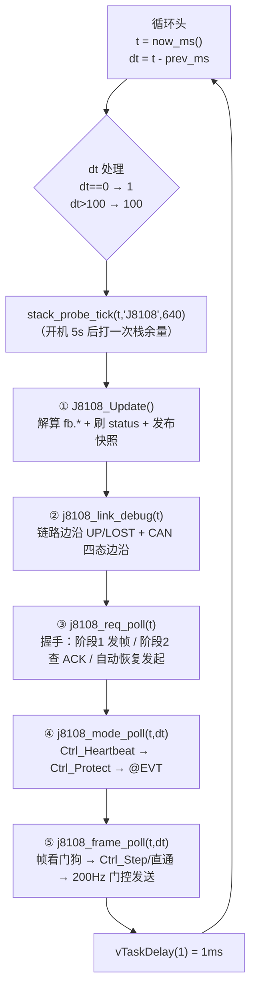
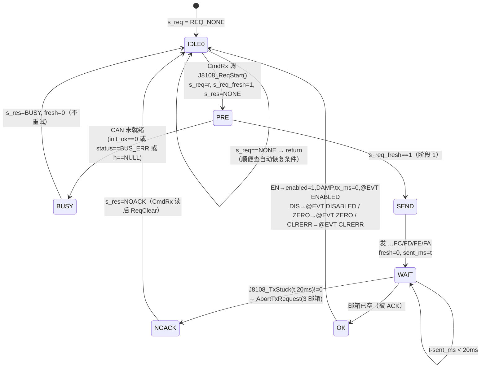
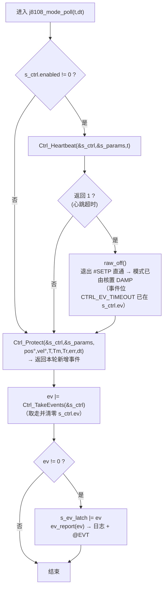
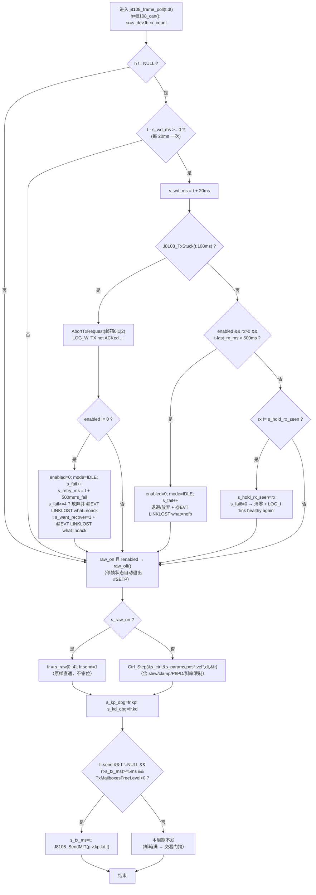
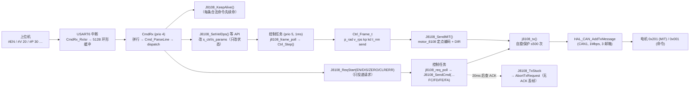
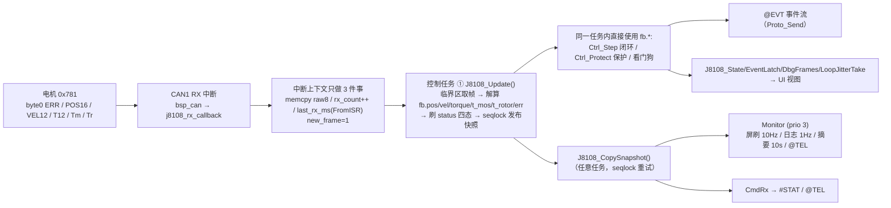

# 05 · 控制任务与帧生成（`Task/Src/J8108_Task.c`）

> **范围**：只读源码写的代码级文档。本文件覆盖 `Task/Src/J8108_Task.c`（677 行 / 31 个函数）与 `Task/Inc/J8108_Task.h`（70 行 / 22 个声明）。
> **交叉参考**（只讲"怎么被调用、参数怎么传进去"，不讲内部实现）：
> `mcu_bsp/ctrl/ctrl_core.{c,h}`（外环控制核，纯逻辑）、`mcu_bsp/Motor/motor_8108.{c,h}`（CAN 驱动 + 单位换算唯一收口）、`Task/Src/CmdRx_Task.c`（命令端）、`Task/Src/Monitor_Task.c`（显示/日志/遥测端）。
> **固件版本**：`FW_VERSION_STR = "v0.1.60-dev"`（`mcu_bsp/version/version.h:16`）。
> **依据**：`docs/1_规则（既定事实）/协议_串口控制_v1.md`（协议/任务划分/实机修复记录）、`docs/1_规则（既定事实）/测试手册_8108串口控制.md`、`docs/2_方案（定稿设计）/设计_8108监护界面与单键交互.md`、`docs/code/_函数地图.md`（覆盖核对）。
> **纪律**：本文所有函数名、宏名、行号均 grep/read 自当前工作区源码；未改任何源码、未编译。

---

## 0. 一句话职责

`J8108_Task` 是**本工程唯一往 CAN 发帧的地方**：以**最高优先级 prio 5、1ms 轮询 / 200Hz 控制帧**把 `ctrl_core` 算出的帧参数（`p_rad,v_rps,kp,kd,t_nm`）经 `motor_8108` 发给关节电机；同时在同一处集中完成 **使能/失能/零点/清错握手（发帧→等 20ms→查 ACK→无 ACK 主动丢帧）**、**心跳看门狗**、**保护动作（跟随误差/堵转/过温/电机报错 → 退 DAMP）**、**TX 邮箱看门狗与掉线退避自动恢复**。

> 源码原话（`J8108_Task.c:12-13`）：
> "线程：本任务 prio 5（最高）保时；屏刷/日志/遥测在 Monitor（prio 3）——绝不在控制路径上。
> 说明：**本文件是唯一往 CAN 发帧的地方**（单线程访问，杜绝跨任务竞争）。"

---

## 1. 接口清单（对外 API）

### 1.1 任务与握手（`J8108_Task.h:41-46`）

| 函数 | 原型（`J8108_Task.h` 行） | 谁调用 | 作用 | 返回/副作用 |
|---|---|---|---|---|
| `J8108_Task_Init` | `void J8108_Task_Init(void)`（41） | `main.c:175`（`FEATURE_J8108` 内） | **先** `J8108_Init(&hcan1)` 做 CAN 注册（滤波器+启动），再建任务 | 无返回；失败打 `LOG_E`（任务不跑 = 电机不可控） |
| `J8108_ReqStart` | `void J8108_ReqStart(J8108_Req_e r, const char *why)`（44） | `CmdRx_Task.c:147`（`do_req()`）、`J8108_Task.c:218`（`J8108_StopHard`）、`J8108_Task.c:312`（自动恢复） | 覆盖式发起握手请求（置 `s_req`、`s_req_fresh=1`、清 `s_res`） | 只写状态位，**不碰 CAN**；`why` 仅进日志 |
| `J8108_ReqResult` | `J8108_Res_e J8108_ReqResult(void)`（45） | `CmdRx_Task.c:152`（2ms 轮询） | 读握手结果（`NONE`=进行中） | 返回值：`J8108_Res_e` |
| `J8108_ReqClear` | `void J8108_ReqClear(void)`（46） | `CmdRx_Task.c:158` | 清 `s_res` + `s_req`（让控制任务回到空闲） | 无返回 |

### 1.2 控制命令（`J8108_Task.h:49-61`；全部由 `CmdRx` 的 `dispatch()` 调用）

| 函数 | 原型（行） | 作用 | 关键副作用 |
|---|---|---|---|
| `J8108_KeepAlive` | `void J8108_KeepAlive(void)`（49） | 心跳续命（任何合法命令都算"上位机活着"） | `Ctrl_Ping(&s_ctrl, now_ms())`→刷新 `last_cmd_ms` |
| `J8108_IsEnabled` | `uint8_t J8108_IsEnabled(void)`（50） | 读使能态 | 无 |
| `J8108_IsSending` | `uint8_t J8108_IsSending(void)`（51） | `enabled && mode != IDLE` | 无 |
| `J8108_SetMode` | `uint8_t J8108_SetMode(Ctrl_Mode_e m)`（52） | 切模式 | **0=拒绝**（非 IDLE/DAMP 且未使能 → `@ERR 3`）；切模式即退出 `#SETP` 直通 |
| `J8108_SetPosDeg` | `void J8108_SetPosDeg(float deg)`（53） | 位置模式 + 目标角 | 先 `Ctrl_SetMode(POS, 当前实际角…)` 预置 `set_applied`（防猛冲） |
| `J8108_SetVelDps` | `void J8108_SetVelDps(float dps)`（54） | 速度模式 + 目标速度 | 速度设定点从 0 起按 `#RATE` 斜坡 |
| `J8108_SetVelTff` | `void J8108_SetVelTff(float tff)`（55） | 速度环前馈（N·m） | **不切模式**（`Ctrl_SetTff`） |
| `J8108_SetTorqueNm` | `void J8108_SetTorqueNm(float nm)`（56） | 力矩模式 + 目标力矩 | `Ctrl_SetMode(TORQUE,…)` + `Ctrl_SetTorque` |
| `J8108_SetImp` | `void J8108_SetImp(float kp, float kd, float tff)`（57） | 阻抗模式（参考角=当前角） | `Ctrl_SetMode(IMP,…)` + `Ctrl_SetImp` |
| `J8108_SetDampKd` | `void J8108_SetDampKd(float kd)`（58） | 阻尼系数 | `Ctrl_SetDamp`（内部 `clampf(kd,0,5)`） |
| `J8108_SetRawMIT` | `void J8108_SetRawMIT(float p_rad, float v_rps, float kp, float kd, float t_nm)`（59） | `#SETP` 原始直通（绕过外环，**不钳位**） | 置 `s_raw_on=1` + 打 `LOG_W`；解锁判据在 CmdRx（`setp_unlocked`） |
| `J8108_StopSoft` | `void J8108_StopSoft(void)`（60） | `#STOP` 软急停 | `Ctrl_Release` → DAMP（**保持使能，防坠**） |
| `J8108_StopHard` | `void J8108_StopHard(void)`（61） | `#ESTOP` 硬急停 | `Ctrl_Estop`（`enabled=0` 立即停发）+ `ReqStart(DIS,"estop")` + 置 `CTRL_EV_ESTOP` |

### 1.3 状态读取（`J8108_Task.h:64-68`；Monitor / CmdRx 只读）

| 函数 | 原型（行） | 用途 |
|---|---|---|
| `J8108_State` | `const Ctrl_State_t *J8108_State(void)`（64） | 控制状态只读指针（模式/使能/设定点/事件） |
| `J8108_Params` | `Ctrl_Params_t *J8108_Params(void)`（65） | **可写**参数指针（`#SET` / `#LIM` 用） |
| `J8108_EventLatch` | `uint32_t J8108_EventLatch(void)`（66） | 保护事件锁存位（`CTRL_EV_*`）给屏 P3 `EV 0x____` |
| `J8108_LoopJitterTake` | `uint32_t J8108_LoopJitterTake(void)`（67） | 取走并清零"控制循环最大间隔 ms"（饿死证据） |
| `J8108_DbgFrames` | `void J8108_DbgFrames(float *kp, float *kd)`（68） | 最近一帧的 Kp/Kd（屏上显示） |

### 1.4 内部静态函数（不对外）

`now_ms`(76)、`j8108_can`(81)、`raw_off`(126)、`ev_report`(255)、`j8108_req_poll`(303)、`j8108_mode_poll`(411)、`j8108_frame_poll`(440)、`j8108_link_debug`(542)、`j8108_task`(602)。

### 1.5 共享状态的读写约定（谁写谁读）

| 变量（行） | 写者 | 读者 | 说明 |
|---|---|---|---|
| `s_req` / `s_req_fresh`（57/59） | `CmdRx`（经 `J8108_ReqStart`，**volatile**） | 控制任务 | 请求是"投递"，执行永远在控制任务 |
| `s_res`（58，volatile） | 控制任务 | `CmdRx`（`J8108_ReqResult`） | 三态：`NONE`/`OK`/`NOACK`/`BUSY` |
| `s_ctrl` / `s_params`（48/49） | `CmdRx`（API 改字段）、控制任务（`enabled/mode/t_cmd/integ/事件`） | 控制任务、Monitor（只读） | 单字段 32 位对齐是原子的；跨字段瞬时不一致"最坏影响一个控制周期，接受"（协议文档 §14.4） |
| `s_dt_max_ms`（71，volatile） | 控制任务 | Monitor（`J8108_LoopJitterTake` 读后清零） | 10s 窗口内控制循环最大间隔 |
| `s_ev_latch`（54） | 控制任务（`\|=` 按位或） | Monitor（`J8108_EventLatch`，**只读不清**） | 事件锁存（屏上"曾经发生过什么"） |
| `s_kp_dbg` / `s_kd_dbg`（73/74） | 控制任务每周期 | Monitor（`J8108_DbgFrames`） | 显示 `float` 非原子读，仅画面用途 |

**为什么 `CmdRx` 不直接发 CAN**（`J8108_Task.h:9-15`）：① 单线程访问 CAN 外设/邮箱，杜绝跨任务竞争（HAL 的 TX 邮箱不是线程安全的写对象）；② "发帧→等 20ms→查 ACK" 必须与 200Hz 控制帧流**在同一任务上下文**里判，否则分不清邮箱被占是命令帧还是控制帧造成的；③ 失能握手要求**先停控制帧再发 …FD**（`j8108_req_poll` 里 `s_ctrl.enabled=0u`），这个时序只有帧发生器自己知道。

---

## 2. 主循环结构

### 2.1 每周期 5 步（`j8108_task`，`J8108_Task.c:628-656`）

```text
                     ┌───────────────────────────────────────────────┐
                     │           控制任务循环（prio 5, 1ms）          │
                     └───────────────────────────────────────────────┘
   t = now_ms()  ──►  dt = t - prev_ms;  prev_ms = t
                      ├─ 记录 s_dt_max_ms = max(s_dt_max_ms, dt)      ← 饿死证据
                      ├─ if (dt == 0) dt = 1                          ← 防 ×0
                      └─ if (dt > 100) dt = 100                       ← 抖动/长阻塞钳位
   ┌──────────────────────────────────────────────────────────────────────────────┐
   │ ① J8108_Update()          解算反馈 + 刷四态 + 发布 seqlock 快照（UI/协议读）    │
   │ ② j8108_link_debug(t)    链路边沿日志（UP/LOST）+ CAN 四态边沿 +（verbose）前10帧 │
   │ ③ j8108_req_poll(t)      握手状态机（含自动恢复发起）→ 发 …FC/FD/FE/FA + 查 ACK │
   │ ④ j8108_mode_poll(t,dt)  心跳看门狗 → 保护检查 → @EVT 事件上报                 │
   │ ⑤ j8108_frame_poll(t,dt) 20ms 帧看门狗 → 生成帧参数 → 200Hz 门控发送           │
   └──────────────────────────────────────────────────────────────────────────────┘
   vTaskDelay(1)  ──►  1 tick = 1ms（configTICK_RATE_HZ = 1000）  ──► 回到循环头
```

mermaid 版：



> 注意 `stack_probe_tick` 在 `prev_ms = t` **之前**（`633` 行）调用，`t` 是循环头采样的时刻；栈探针是 `static inline`（`Task/Inc/stack_probe.h:22`），每个 `.c` 各有一份 `done` 标志，**开机 5s 后打一条** `stack headroom: N words free of 640`。

### 2.2 `dt` 的计算与钳位

| 步骤 | 代码 | 为什么 |
|---|---|---|
| 取时基 | `t = now_ms()`（630）= `xTaskGetTickCount() * portTICK_PERIOD_MS`（`now_ms`，76-79） | 1ms tick，全文件统一时间口径（`uint32_t` 无符号差，天然处理回绕） |
| dt | `dt = t - prev_ms`（631） | 上个循环到本次的真实间隔 |
| 记录 | `if (dt > s_dt_max_ms) s_dt_max_ms = dt;`（636-639） | **饿死/长阻塞证据**，Monitor 每 10s 摘要把 `dtmax=` 打出来（`Monitor_Task.c:278`） |
| 防零 | `if (dt == 0u) dt = 1u;`（640-643） | 同一 tick 内跑两圈（tick 未推进）会让 `slew()` 的 `max_d = rate*0 = 0` → 设定点卡死；也给积分一个非零步长 |
| **上限 100ms** | `if (dt > 100u) dt = 100u;`（644-647） | 源码注释原话："调度抖动/长阻塞保护：dt 上限 100ms，避免积分与速率限制算飞"。`Ctrl_Step` 里 `slew()` 用 `rate*dt`、速度环积分用 `ki*e*dt`；若某次 dt = 2s（例如日志风暴/长自旋/LCD 阻塞），一次就能给出巨大的设定点跳变与积分冲量 → 关节猛冲。钳到 100ms 把最坏单步限制在 20 个正常周期的量级 |

### 2.3 200Hz 节拍如何保证

1. **优先级**：`J8108_TASK_PRIORITY = 5U`（35），`configMAX_PRIORITIES = 7`（`FreeRTOSConfig.h:69`）→ 已启用任务里的最高档（KeyTask/CmdRx 为 4，Monitor 3，LogTx 1）；`Led_Task` 也创建为 5（`Led_Task.c:143`，协议文档 §10.1 记的是 2，**以代码为准**），但它是 50ms 周期且每拍 `vTaskDelay(50ms)` 主动让出（`LED_TICK_MS`，`Led_Task.c:41/136`）；`MotorTest_Task`(5) 未创建（`main.c:146` 已注释），SdCard 任务在 `FEATURE_SD_CARD=0` 下不建。
2. **轮询粒度 1ms**：`vTaskDelay(1)`（655）+ `configTICK_RATE_HZ = 1000`（`FreeRTOSConfig.h:68`）→ 循环周期 ≈1ms。
3. **发帧门控 5ms**：`j8108_frame_poll` 里 `(t - s_tx_ms) >= J8108_CTRL_PERIOD_MS(5)`（533）→ 200Hz（日志里也按 `1000/5 = 200` 打印，619 行）。
4. **控制路径上没有任何阻塞 IO/日志**：本文件只在**边沿**打日志；屏刷（软 I2C，ms 级）在 Monitor（prio 3）；协议回包走 `Proto_Send` 互斥锁（有界等待 50ms，`proto_tx.c:18`）同样不在本任务里。
5. **能级联降速的只有总线**：邮箱无空位时不发（交给看门狗），绝不长自旋（见 §7.2）。

---

## 3. 三个子状态机

### 3.1 请求握手状态机（`j8108_req_poll`，303-408）

**两阶段**：阶段 1 = 发帧并记 `s_req_sent_ms`；阶段 2 = 20ms 后查 ACK（TX 邮箱是否仍被占）。



ASCII 时序（关键 20ms 窗口 + 阶段的时钟在哪）：

```text
 t=0        t+≤1ms                 t+21ms                 t+22ms              t+≈0.62s
  │            │                      │                      │                    │
CmdRx     控制任务阶段1           控制任务阶段2（判定）        下一周期          退避到点
ReqStart   发命令帧0x001          TxStuck(t,20ms)?        邮箱已空→判"不卡"    auto-resume
s_req=EN   sent_ms=t              ├ 是 → abort + NOACK      → 翻案为 OK(坑)     → ReqStart(EN)
s_res=NONE （邮箱被占，无限重传）  └ 否 → OK                （见 §4.2 坑 2）    （s_want_recover）
              │                                                    │
              └── 阶段 1 与 2 之间是「等 20ms」：1Mbps 单帧 ~130µs，20ms 极宽裕（38 行注释）
                  掉线后的自动恢复：看门狗在 ~100ms 判死 → s_retry_ms = t+500ms×s_fail
                  （第 1 次失败 → 约 0.6s 后自动重发 #EN；第 4 次失败 → 放弃，等人工 #EN）
```

**为什么必须有"主动丢帧"**：`Core/Src/can.c:50` 配了 `hcan1.Init.AutoRetransmission = ENABLE`（`AutoBusOff = ENABLE`）→ 没有节点 ACK 时帧会**无限重传**、TX 邮箱被永久占住；不丢弃会连带把后续控制帧也堵死。设计文档写得直白（`docs/2_方案（定稿设计）/设计_8108监护界面与单键交互.md:273-275`）：

> "因此动作层加了 **L3.5**：发帧后 20ms 检查 TX 邮箱是否已清空（=被某节点 ACK 过），若仍占着则 `HAL_CAN_AbortTxRequest()` **主动丢弃**…**不要**去掉这一层。"

**失败分支的回包**（`J8108_Task.h:35-39` + `CmdRx_Task.c:160-183`）：

| `J8108_Res_e` | 触发 | CmdRx 侧回包 |
|---|---|---|
| `J8108_RES_NONE`(0) | 进行中（20ms 窗口内） | 继续 2ms 轮询，直到 `CMD_REQ_WAIT_MS = 120ms` 超时 → `@ERR 8 timeout (control task busy?)` |
| `J8108_RES_OK`(1) | 邮箱已空 | `@OK EN … mode=DAMP frames=ON` / `@OK DIS done` 等 |
| `J8108_RES_NOACK`(2) | 20ms 仍占用 → 已 abort | `@ERR 5 … no ACK on bus: check 24V / CAN_H-L / 120R / CANID` |
| `J8108_RES_BUSY`(3) | `init_ok==0` 或 `status==BUS_ERR` 或 `h==NULL` | `@ERR 5 … CAN not ready (init fail / bus error)`；源码注释："**CAN 未就绪：直接失败（不重试，用户要求）**"（320） |

**自动恢复的发起条件**（309-313）：

```c
if ((s_want_recover != 0u) && (s_ctrl.enabled == 0u) &&
    ((int32_t)(t - s_retry_ms) >= 0) && (s_req == (uint8_t)J8108_REQ_NONE))
{
    J8108_ReqStart(J8108_REQ_EN, "auto-resume");
}
```
四个条件全满才发起：**曾掉线**（`s_want_recover`）、**当前未使能**、**退避时间到**（有符号比较，防 `uint32_t` 回绕）、**当前没有别的请求在跑**。

### 3.2 模式与保护（`j8108_mode_poll`，411-437）

```text
 j8108_mode_poll(t, dt)
   │
   ├─ enabled? ─是─► Ctrl_Heartbeat(s,p,t) ──返回1(超时)──► raw_off()   ◄ 模式已被核置 DAMP
   │        │                              └─返回0(正常)─┐            事件位 TIMEOUT 已在 s_ctrl.ev
   └────否───┴───────────────────────────────────────────┤
                                                          ▼
        Ctrl_Protect(s,p, pos°,vel°,T,Tm,Tr,err, dt)   ← **单一入口**，用最新反馈 + dt 累计
                                                          │ 返回"本轮新增"事件位
                                                          ▼
                       ev |= Ctrl_TakeEvents(&s_ctrl)     ← 取走累积位（含 Ctrl_Step 置的 LIMIT）
                                                          │
                                          ev != 0 ? ──是──► s_ev_latch |= ev;  ev_report(ev)
                                                                              （日志 + @EVT 文本）
                                                    └─否──► 什么都不做
```



要点：

* **心跳**只在使能时检查（`Ctrl_Heartbeat` 内部要求 `wd_ms != 0`）；超时行为是**退 DAMP 但不失能**——源码两处特意强调"本电机无抱闸，失能会自由坠落"（`J8108_Task.c:8`、`ctrl_core.c:238`）。
* **保护是单一入口**（425-430）：位置/速度/力矩/两路温度/报错位**全部用最新一帧反馈**（`s_dev->fb.*`，刚由 ① `J8108_Update` 解算），`dt` 用于累计时长（跟随 500ms / 堵转 1000ms / 去抖 1s）。
* `Ctrl_Protect` 返回的**新增**事件与 `Ctrl_TakeEvents` 取走的**累积**事件按位或合并 → 一次性上报，**同一事件不会重复打印**。
* `Ctrl_Step`（在 ⑤ 里跑）置的 `CTRL_EV_LIMIT` 位因为顺序关系，会被**下一周期**的 `Ctrl_TakeEvents` 取走 → 事件延迟 ≤1ms（可忽略，但排障时要知道"事件不是当拍打的"）。
* 事件上报的文本与细分见 §4.5（`ev_report`）与 §7.4。

### 3.3 帧生成 / 发送 / 看门狗（`j8108_frame_poll`，440-539）

```text
 j8108_frame_poll(t, dt)          h = j8108_can();  rx = s_dev->fb.rx_count
   │
   ├─① 帧看门狗（h != NULL；且 (int32_t)(t - s_wd_ms) >= 0 → 每 20ms 一次）
   │     ├─ J8108_TxStuck(t, 100ms)? ─是─► AbortTxRequest(0|1|2) + LOG_W
   │     │                                  └ enabled? ─是─► enabled=0; mode=IDLE; s_fail++
   │     │                                                 s_retry_ms = t + 500ms*s_fail
   │     │                                                 s_fail>=4 ? 放弃(LOG_E) : s_want_recover=1
   │     │                                                 @EVT LINKLOST what=noack
   │     ├─ 否则 enabled && rx>0 && (t-last_rx_ms) > 500ms ? ─是─► 同上（退避/放弃），what=nofb
   │     ├─ 否则 rx != s_hold_rx_seen ? ─是─► s_hold_rx_seen=rx；s_fail!=0 → 清零 + LOG_I
   │     └─ 都不是 → 跳过
   ├─② 生成帧参数（raw 优先，否则外环）
   │     raw_on && !enabled → raw_off()          ← 停帧状态下自动退出 #SETP 直通
   │     raw_on ? fr = s_raw[0..4], fr.send=1    ← 原样直通，**不钳位**
   │             : Ctrl_Step(s_ctrl,s_params,pos°,vel°,dt,&fr)   ← slew/clamp/PI/PD/斜率限制
   │     s_kp_dbg = fr.kp;  s_kd_dbg = fr.kd     ← 屏 P1 显示用
   └─③ 发送门控（200Hz）
         fr.send && h && (t - s_tx_ms) >= 5ms && HAL_CAN_GetTxMailboxesFreeLevel(h) > 0
              ─是─► s_tx_ms = t;  J8108_SendMIT(fr.p_rad, fr.v_rps, fr.kp, fr.kd, fr.t_nm)
              └─否─► 本周期不发（邮箱满/模式停帧 → 交给 ① 的看门狗与 abort）
```



每周期 `Kp/Kd/前馈` 的组合（由 `Ctrl_Step` 决定，`ctrl_core.c:423-512`；本任务只把 `fr` 原样传出去）：

| `Ctrl_Mode_e` | `p_rad` | `v_rps` | `kp` | `kd` | `t_nm` |
|---|---|---|---|---|---|
| `IDLE` / 未使能 | — | — | — | — | `fr.send = 0`（不发帧，只监听） |
| `DAMP` | 0 | 0 | 0 | `kd_damp` | 0（`t_cmd` 归零） |
| `SPEED` | 0 | 0 | 0 | `kd_damp`（压振荡） | 外环 PI：`kp_v*e + integ + tff + 库仑前馈(±tff_nm)`，经 `tmax` 限幅 + `trate_nm_s` 斜率限制 |
| `POS` | `set_applied*DEG2RAD` | 0 | `kp_pos` | `kd_pos` | 0（PD 由电机内环执行） |
| `TORQUE` | 0 | 0 | 0 | 0 | `set` 经限幅 + 斜率限制 |
| `IMP` | `imp_ref_deg*DEG2RAD` | 0 | `kp_imp` | `kd_imp` | `tff` 经限幅 + 斜率限制 |
| `#SETP` 直通（`s_raw_on`） | `s_raw[0]` | `s_raw[1]` | `s_raw[2]` | `s_raw[3]` | `s_raw[4]`（**完全绕过上表**） |

---

## 4. 逐函数详解

> 行号 = 当前工作区 `Task/Src/J8108_Task.c`（`J8108_Task.h` 单独标注）。"上行/下行"= 谁调用它 / 它调用了谁。

### 4.1 任务骨架

#### `now_ms`（76-79）

| 项 | 内容 |
|---|---|
| 原型 | `static uint32_t now_ms(void)` |
| 参数 | 无 |
| 返回 | `xTaskGetTickCount() * portTICK_PERIOD_MS`（ms，1ms 分辨率） |
| 上行 | 本文件（`J8108_KeepAlive` 137、`j8108_task` 604/630） |
| 下行 | `xTaskGetTickCount` |
| 坑 | `uint32_t` 回绕安全（仅用于差值比较）；1ms 分辨率意味着"200Hz 节拍"的抖动下限是 1ms |

#### `j8108_can`（81-84）

| 项 | 内容 |
|---|---|
| 原型 | `static CAN_HandleTypeDef *j8108_can(void)` |
| 返回 | `s_dev->can_instance->can_handle`（CAN1 句柄），实例为空时 `NULL` |
| 上行 | `j8108_req_poll`(305)、`j8108_frame_poll`(442) |
| 下行 | `motor_8108` 的 `J8108_t` 结构 |
| 步骤 | 三层判空：`s_dev`（由 `J8108_Get` 保证非 NULL）→ `can_instance` → `can_handle` |
| 坑 | 返回值 `NULL` 时两个调用者都**必须**提前返回（`h == NULL` 分支，328/447），否则会在 HAL 里解引用空指针 |

#### `j8108_task`（602-657）

| 项 | 内容 |
|---|---|
| 原型 | `static void j8108_task(void *arg)`（`arg` 未用） |
| 栈/优先级 | `J8108_TASK_STACK_WORDS = 640` words、`J8108_TASK_PRIORITY = 5` |
| 上行 | FreeRTOS 调度器（`xTaskCreate`，672） |
| 下行 | `now_ms`、`stack_probe_tick`、`J8108_Update`、`j8108_link_debug`、`j8108_req_poll`、`j8108_mode_poll`、`j8108_frame_poll`、`vTaskDelay`、`LOG_I` |
| 步骤 | ① 开机横幅 6 行日志（608-626）：版本、口径（`J8108_SCALE_OUTPUT_SIDE` 分支）、CAN ID/帧率/看门狗、限幅与增益、安全策略；② `for(;;)` 5 步 + 1ms 延时（§2.1） |
| 坑 | 横幅里 `s_params.wd_ms`、限幅/增益是**默认值**（`Ctrl_ParamsDefault`），后续 `#SET` 改参数不会重打横幅；口径分支由宏 `J8108_SCALE_OUTPUT_SIDE(1)` 决定，打印的是**输出端**口径（`P ±12.56rad`、不除 8） |

#### `J8108_Task_Init`（659-677）

| 项 | 内容 |
|---|---|
| 原型 | `void J8108_Task_Init(void)` |
| 上行 | `main.c:175`（`#if FEATURE_J8108` 块内，**在 `CmdRx_Task_Init()` 之前**） |
| 下行 | `J8108_Init(&hcan1)` → `J8108_Get()` → `Ctrl_ParamsDefault()` → `Ctrl_Init()` → `xTaskCreate` |
| 返回 | 无；`xTaskCreate` 失败打 `LOG_E("J8108","xTaskCreate FAILED (heap/stack?) -> MOTOR CONTROL DISABLED")` |
| 步骤 | 顺序不可换：**先 CAN 注册（滤波器 + 启动控制器），再建任务** |
| 坑（实机踩过） | 源码注释（663-665）："★ 必须先做 CAN 注册…否则状态恒为 INIT_FAIL、既收不到反馈帧也发不出帧 —— **2026-09-18 重写时漏掉这一步导致实机 INIT FAIL**"（协议文档 §14.5 记同一事件） |

### 4.2 请求握手

#### `J8108_ReqStart`（87-96）

| 名 | 类型 | 单位 | 谁填 |
|---|---|---|---|
| `r` | `J8108_Req_e` | — | `CmdRx`（`serial`）/ `J8108_StopHard`（`estop`）/ 自动恢复（`auto-resume`） |
| `why` | `const char *` | — | 同上，仅进日志（可传 `NULL`→打印 `-`） |

| 项 | 内容 |
|---|---|
| 返回 | 无 |
| 副作用 | `s_req = r`；`s_res = J8108_RES_NONE`（**清掉上一次结果**）；`s_req_fresh = 1`；`s_req_sent_ms = 0`；打 `LOG_I "request queued: ENABLE/DISABLE/ZERO (%s)"` |
| 坑 1 | **覆盖式**：上一次请求还没被控制任务执行完就再来一条，会直接顶掉（`CmdRx` 的 `do_req` 是阻塞等待 120ms 后才 `ReqClear`，正常路径不会撞车） |
| 坑 2 | 日志里 `CLRERR` 被归到 `else` 分支，打印成 **`"ZERO"`**（94-95 行的三元表达式只有 EN/DIS/其它两种），清错请求的 `queued:` 日志会误显示 `ZERO` —— 只是日志文案问题，功能不受影响 |

#### `J8108_ReqResult`（98-101）

| 项 | 内容 |
|---|---|
| 原型 | `J8108_Res_e J8108_ReqResult(void)` |
| 返回 | `(J8108_Res_e)s_res`：`NONE`=进行中/空闲，`OK`/`NOACK`/`BUSY`=已有结论 |
| 坑 | `NONE` 有两种含义（"空闲"与"进行中"）；调用方必须自己维护"我发过请求"的知识，`CmdRx` 用 `waited < 120ms` 循环区分（超时 → `@ERR 8`） |

#### `J8108_ReqClear`（103-107）

清 `s_res = NONE` + `s_req = NONE`。调用后控制任务回到"只有自动恢复才能发起请求"的状态。**必须调用**：否则残留的 `s_req` 会让 `j8108_req_poll` 反复走阶段 2（每次 20ms 都重判一次邮箱）。

#### `j8108_req_poll`（303-408）

| 名 | 类型 | 单位 | 谁填 |
|---|---|---|---|
| `t` | `uint32_t` | ms | `j8108_task` 循环头的 `now_ms()` |

| 项 | 内容 |
|---|---|
| 返回 | 无（结果写 `s_res`；`EN` 成功会改 `s_ctrl.*`） |
| 上行 | `j8108_task`（651） |
| 下行 | `J8108_ReqStart`（自动恢复）、`J8108_SendCmd`、`J8108_TxStuck`、`HAL_CAN_AbortTxRequest`、`Ctrl_SetMode`、`Ctrl_Ping`、`Proto_Send`、`J8108_StatusStr` |
| 步骤 | ① 自动恢复发起（309-313）；② `s_req==NONE` → 直接返回（315-318）；③ 就绪性检查：`init_ok==0` 或 `status==J8108_ST_BUS_ERR` → `RES_BUSY` + `LOG_E`（321-327），`h==NULL` → `RES_BUSY`（328-333）；④ 阶段 1（336-363）：按请求类型发帧并记 `sent_ms`；⑤ 阶段 2（366-407）：不足 20ms 返回；`TxStuck(t,20ms)` → abort + `RES_NOACK` + 排查清单日志；否则 `RES_OK` + 按请求类型收尾 |
| 各请求的**收尾动作** | `EN`：`enabled=1`、`estop=0`、`s_fail=0`、`s_want_recover=0`、`Ctrl_SetMode(DAMP, 当前位姿)`、`Ctrl_Ping`、`s_tx_ms=0`（下一轮立即发第一帧）+ `@EVT ENABLED mode=DAMP`；`DIS`：`s_want_recover=0` + `@EVT DISABLED`；`ZERO`：`@EVT ZERO`；`CLRERR`：`@EVT CLRERR err=0x%02X` |
| 坑 1 | **`DIS` 在阶段 1 就先把 `enabled=0; mode=IDLE`**（346-347，注释"立即停发控制帧，腾空邮箱给失能帧"）——这是"先停后失能"的硬时序 |
| 坑 2（重要） | **`NOACK` 判定会被下一周期"翻案"为 `OK`**：abort 之后邮箱已空，下一次进阶段 2 时 `J8108_TxStuck` 判"不卡"（`motor_8108.c:254-264`：只要 `FreeLevel==3` 就 `s_tx_busy=0` 返回 0），于是 `s_res` 被写成 `OK`。`CmdRx` 每 2ms 采样一次，NOACK 的存活窗口只有 ~1ms → **总线上真的没有电机时，`#EN` 有可能先回 `@OK`**，随后由帧看门狗（100ms）兜底报 `@EVT LINKLOST what=noack` 并进入退避重试。排障时以 `@EVT LINKLOST` 与屏 P0 四态为准，不要只看 `@OK`。（本坑由代码路径推演，未在实机抓取日志） |
| 坑 3 | 握手失败**不递增** `s_fail`、**不安排**自动重试——`s_fail` 的递增只发生在 `j8108_frame_poll` 的看门狗里（462/483），清零发生在 `EN` 成功（383）或链路恢复（504）；握手 NOACK 后必须人工 `#EN` 重来 |
| 坑 4 | `BUSY` 分支**不清 `s_req`**（324/331 行只清 `s_req_fresh`）→ 只要调用方还没 `ReqClear`，每个 1ms 周期都会重进就绪性检查并再打一条 `LOG_E "request rejected: CAN not ready"`。`CmdRx` 每 2ms 读一次结果并立刻 `ReqClear`，所以实际约 2 条；若换个慢调用方（等满 120ms）这里会变成上百条日志洪水 —— 新增调用方时注意 |

### 4.3 控制命令 API（全部由 `CmdRx.dispatch()` 调用；**均自动续心跳**）

| 函数（行） | 参数 | 动作与下游调用 | 坑 |
|---|---|---|---|
| `J8108_SetRawMIT`（114-124） | 5 个 float（`p_rad, v_rps, kp, kd, t_nm`，**电机/MIT 口径**） | 存 `s_raw[]`，`s_raw_on=1`，`LOG_W`（明确写 `NO clamping`） | 只做"存"；解锁由 CmdRx 的 `#SET SETP 1`（`setp_unlocked`）把关，未解锁回 `@ERR 4`（`CmdRx_Task.c:610-615`）。**不校验任何量程**：越界值由 `motor_8108.j8108_f2u` 钳到量程端点，超范围的语义会静默丢 |
| `raw_off`（126-133，static） | — | 若 `s_raw_on` 则清零 + `LOG_I "SETP raw passthrough OFF"` | 幂等（已在关状态不打印）；被 8 处调用：切模式/设目标/阻尼/硬急停/心跳超时/停帧 |
| `J8108_KeepAlive`（135-138） | — | `Ctrl_Ping(&s_ctrl, now_ms())` | 语义是"上位机活着"；`CmdRx` 在**每条合法命令**分派前调一次（`CmdRx_Task.c:829`）。心跳间隔由上位机决定，默认 `wd_ms=200ms` |
| `J8108_IsEnabled`（140-143） | — | 返回 `s_ctrl.enabled` | — |
| `J8108_IsSending`（145-148） | — | `enabled && mode != IDLE` | 与 `enabled` 的区别就是"当前是否真在发帧"（屏 P1 用） |
| `J8108_SetMode`（150-164） | `Ctrl_Mode_e m` | 未使能且非 IDLE/DAMP → **返回 0**（CmdRx → `@ERR 3`）；`raw_off()`；`IDLE` → 只改 `mode`（保持使能）；其它 → `Ctrl_SetMode(&s_ctrl, m, fb.pos*RAD2DEG, fb.vel*RAD2DEG)` | 传入的位姿单位是 **deg / dps**（输出端），`Ctrl_SetMode` 用它预置 `set_applied`（防跳变） |
| `J8108_SetPosDeg`（166-174） | `float deg` | `raw_off` → `Ctrl_SetMode(POS, 当前实际角…)` → `Ctrl_SetPos(deg)` | ★ 源码注释（169-171）：必须先 `Ctrl_SetMode` 把 `set_applied` 预置为**当前实际角**，否则会保留上一模式的值（如 DAMP 的 0），slew 从 0 起 → 与真实位置巨大 PD 误差 → **猛冲**（自审查抓到的安全问题，协议文档 §14.3-1） |
| `J8108_SetVelDps`（176-181） | `float dps` | `raw_off` → `Ctrl_SetMode(SPEED,…)` → `Ctrl_SetVel(dps)` | 速度设定点从 0 起、按 `#RATE` 斜坡（急启被限速） |
| `J8108_SetVelTff`（183-186） | `float tff`（N·m） | 只 `Ctrl_SetTff(&s_ctrl, tff)` | **不切模式**——`#V` 第 3 参的修复点（协议文档 §14.3-2：早期误用 `#IMP` 通道会切模式） |
| `J8108_SetTorqueNm`（188-193） | `float nm` | `Ctrl_SetMode(TORQUE,…)` → `Ctrl_SetTorque(nm)` | 力矩模式进入时 `set=0`（`Ctrl_SetMode` 内），随后立刻写入目标值 |
| `J8108_SetImp`（195-201） | `kp, kd, tff` | `Ctrl_SetMode(IMP, 当前角…)` → `Ctrl_SetImp(&s_ctrl,&s_params,kp,kd,tff)` | `Ctrl_SetImp` 内部钳位：`kp≤500`、`kd≤5`、`tff≤±tmax_nm`；参考角 = `set_applied`（即进入时的实际角） |
| `J8108_SetDampKd`（203-207） | `float kd` | `raw_off` → `Ctrl_SetDamp(&s_ctrl,&s_params,kd)` | `Ctrl_SetDamp` 内部 `clampf(kd,0,5)` 并切 DAMP、清积分 |
| `J8108_StopSoft`（209-212） | — | `Ctrl_Release(&s_ctrl)` | 软急停 = 阻尼（**保持使能，防坠**）；`#STOP` 的回包在 CmdRx（`@OK STOP mode=DAMP (still enabled)` + `@EVT STOP`） |
| `J8108_StopHard`（214-221） | — | `raw_off` → `Ctrl_Estop`（`enabled=0` → 立即停发）→ `J8108_ReqStart(DIS,"estop")` → `s_ev_latch \|= CTRL_EV_ESTOP` → `LOG_W "...shaft will be FREE - no brake!"` | **失能帧由控制任务在自己的上下文里发**（CmdRx 不碰 CAN）；`@EVT ESTOP mode=DISABLED` 由 `ev_report` 在下一周期打出（`Ctrl_Estop` 里置的 `ev` 位） |
| `J8108_State`（223-226） | — | `const Ctrl_State_t *` | 返回**内部状态指针**（非快照），字段可能撕裂；仅显示用（协议文档 §14.4 明确接受） |
| `J8108_Params`（228-231） | — | `Ctrl_Params_t *`（可写） | `#SET`/`#LIM` 直接改字段；跨字段半更新最坏影响一个控制周期（接受） |

### 4.4 可观测性 API

| 函数（行） | 内容 |
|---|---|
| `J8108_LoopJitterTake`（233-239） | 取 `s_dt_max_ms` 并**清零**（"读后清零：每个窗口独立统计"）。Monitor 每 10s 摘要打印 `dtmax=%lums`（`Monitor_Task.c:278`）；判据见测试手册 SMK-13："应为个位数 ms；出现 100ms 级 → 有饿死/长阻塞" |
| `J8108_EventLatch`（241-244） | 返回 `s_ev_latch`（**不清零**）。Monitor 放进 `Ui_Status_t.ev_flags`（`Monitor_Task.c:98`），屏 P3 第 6 行 `EV 0x____`（`Oled_Task.c:234`）。锁存语义 = "开机以来发生过哪些保护/事件" |
| `J8108_DbgFrames`（246-252） | 带 NULL 检查地回填 `s_kp_dbg/s_kd_dbg`（每周期在 `j8108_frame_poll` 里刷新，529-530）→ 屏 P1 显示**本帧** Kp/Kd（`Monitor_Task.c:120-121`） |

### 4.5 事件上报

#### `ev_report`（255-300）

| 名 | 类型 | 谁填 |
|---|---|---|
| `ev` | `uint16_t` | `j8108_mode_poll`（`Ctrl_Protect` 返回值 \| `Ctrl_TakeEvents`） |

按位依次处理（`ev == 0` 直接返回），每位的日志 + `@EVT` 文本：

| 事件位（`ctrl_core.h:33-39`） | 日志 | `@EVT` 文本（逐字） |
|---|---|---|
| `CTRL_EV_TIMEOUT`(1<<0) | `LOG_W "EVT TIMEOUT: no command for %ums -> back to DAMP (motor stays ENABLED)"`（`%u`=`s_params.wd_ms`） | `@EVT TIMEOUT mode=DAMP` |
| `CTRL_EV_LIMIT`(1<<1) | 无日志（避免刷屏） | `@EVT LIMIT what=%s`，`%s` 来自 `Ctrl_LimitWhat(&s_ctrl)`：`setpoint` / `torque` / `trate` / `none` |
| `CTRL_EV_FOLLOW`(1<<2) | `LOG_W "EVT FOLLOW: position error too large -> DAMP"` | `@EVT FOLLOW mode=DAMP` |
| `CTRL_EV_STALL`(1<<3) | `LOG_W "EVT STALL: high torque + low speed -> DAMP"` | `@EVT STALL mode=DAMP` |
| `CTRL_EV_TEMP`(1<<4) | `LOG_W "EVT TEMP: Tm=%.1f Tr=%.1f (warn %.0f / stop %.0f)"` | `@EVT TEMP Tm=%.1f Tr=%.1f warn=%.0f stop=%.0f` |
| `CTRL_EV_MOTERR`(1<<5) | `LOG_E "EVT MOTOR ERR: byte0=0x%02X (%s)"`（`J8108_ErrStr` 解码） | `@EVT ERR=0x%02X what=%s` |
| `CTRL_EV_ESTOP`(1<<6) | 无日志（`J8108_StopHard` 里已打） | `@EVT ESTOP mode=DISABLED` |

**`Ctrl_LimitWhat` 的细分含义**（`ctrl_core.c:515-534`）：

| `what=` | 含义 | 正常吗 |
|---|---|---|
| `setpoint` | 设定点被软限位（±`pmin/pmax`）或限速（`vmax_dps`）夹紧 | 说明给出的目标超界 |
| `torque` | 力矩撞 `tmax_nm` 上限 | 说明真的顶到限（可能堵转/增益过大） |
| `trate` | 被**力矩斜率限制**（`trate_nm_s`）限速 | **正常 ramp**，不是故障（协议文档 §14.7-3 专门加的细分） |
| `none` | 无来源（已复位） | — |

**为什么不会刷屏**：`Ctrl_Protect`/`ctrl_lim_update` 里是"**边沿锁存 + 消退去抖**"（受限条件必须连续消失 ≥ `CTRL_EV_CLEAR_MS = 1000ms` 才允许下一次算新事件），详见 §7.4。

#### `raw_off`（126-133）

见 §4.3。被调用的 6 个外部触发点：`J8108_SetMode`(156)、`SetPosDeg`(168)、`SetVelDps`(178)、`SetTorqueNm`(190)、`SetImp`(197)、`SetDampKd`(205)、`StopHard`(216)、`j8108_mode_poll` 心跳超时(420)、`j8108_frame_poll` 停帧自退(513)。

### 4.6 链路日志

#### `j8108_link_debug`（542-599）

| 项 | 内容 |
|---|---|
| 原型 | `static void j8108_link_debug(uint32_t t)` |
| 上行 | `j8108_task`（650），每周期 1ms |
| 返回 | 无 |
| 步骤 | ① **链路新鲜度边沿**（544-563）：`rx_count>0 && (t-last_rx_ms) < J8108_FB_FRESH_MS(200)` → `now_ok`；与 `s_link_ok` 比较，**只在边沿**打 `LOG_I "CAN feedback link UP (rx=%lu) -> motor powered AND enabled"` 或 `LOG_W "CAN feedback link LOST last_dt=%lums (motor disabled/power off/wiring)"`；② **CAN 四态边沿**（565-585）：`status` 变化时按 `INIT_FAIL/INIT_OK/READY/BUS_ERR` 打对应日志（BUS_ERR 带 `HAL err=0x%04lX` 与"check ACK/wiring/120R"）；③ **（`FEATURE_VERBOSE_LOG`）前 10 帧原始字节**（587-598）：`rx_count<=10` 且计数变化 → `LOG_D` 打 8 字节 raw + 解算值 |
| 坑 1 | 状态/链路都是 `uint8_t` 缓存比较（`s_link_ok`/`s_status_dbg`），**不做去抖**——CAN `status` 在 READY↔INIT_OK 之间随反馈间隔抖动（`motor_8108.c:210-218` 用 200ms 门槛判 READY），短暂抖动会各打一条边沿日志（不是刷屏，但会看到成对出现） |
| 坑 2 | verbose 前 10 帧是**开发期**噪声（`FEATURE_VERBOSE_LOG=1`）；`BSP_LOG_LEVEL = LOG_LEVEL_DEBUG`（`bsp_log.h:26`）时才真正输出 |
| 坑 3 | 所有文本**必须 ASCII**（`feature_config.h` 头注释："串口终端下中文会乱码"） |

**日志级别与本文件的用法**（`bsp_log.h:20-26`，当前 `BSP_LOG_LEVEL = LOG_LEVEL_DEBUG`）：

| 级别宏 | 本文件用在哪些事件 | 关键文本（节选） |
|---|---|---|
| `LOG_E`（错误） | 握手被拒 / 电机报错 / 放弃重试 / 建任务失败 | `request rejected: CAN not ready (status=…)`、`EVT MOTOR ERR: byte0=0x%02X (%s)`、`no ACK %u times -> give up retrying; send #EN to try again`、`no feedback %u times -> stopped; …`、`CAN status -> INIT FAIL (no retry by design)`、`xTaskCreate FAILED (heap/stack?) -> MOTOR CONTROL DISABLED` |
| `LOG_W`（警告） | 无 ACK / 链路丢 / 保护触发 / 直通开启 / 硬急停 | `no ACK in %ums -> TX aborted. check 24V / CAN_H-L / 120R / CANID=0x%02X`、`TX not ACKed (mailbox stuck %ums) -> aborted; …`、`link lost (no ACK) -> will retry ENABLE in %ums (%u/%u)`、`no feedback for %ums -> retry ENABLE in %ums (%u/%u)`、`CAN feedback link LOST last_dt=%lums …`、`EVT TIMEOUT/FOLLOW/STALL/TEMP …`、`SETP raw passthrough ON …`、`HARD ESTOP: frames off + DISABLE queued (output shaft will be FREE - no brake!)` |
| `LOG_I`（信息） | 开机横幅、握手各阶段、链路/四态恢复、直通关闭、失败计数清零 | `request queued: %s (%s)`、`-> ENABLE frame (0x%03X id, data ...FC) \| wait %ums for ACK`、`ENABLE ok -> mode=DAMP, control frames ON (200Hz) -> feedback should stream now`、`CAN feedback link UP (rx=%lu) -> motor powered AND enabled`、`link healthy again (rx=%lu) -> failure counter reset`、`stack headroom: …`（`stack_probe.h`） |
| `LOG_D`（调试，受 `FEATURE_VERBOSE_LOG` 门控） | 仅前 10 帧反馈原始字节 + 解算值 | `fb#%lu raw %02X … \| pos=… vel=… T=… Tm=… Tr=… err=0x%02X` |

---

## 5. 关键宏常量表

### 5.1 本文件（`J8108_Task.c:34-44`）

| 宏 | 值 | 行 | 含义 / 为什么是这个值 |
|---|---|---|---|
| `J8108_TASK_PRIORITY` | `5U` | 35 | 全工程最高（`configMAX_PRIORITIES=7`），保 200Hz 节拍 |
| `J8108_TASK_STACK_WORDS` | `640U` | 36 | 640 words = 2560B；含 `snprintf` 浮点 + `char b[96]`；开机 5s 由 `stack_probe_tick` 报余量 |
| `J8108_CTRL_PERIOD_MS` | `5U` | 37 | **控制帧周期 200Hz**；也是发送门控 `(t - s_tx_ms) >= 5` |
| `J8108_EN_ACK_MS` | `20U` | 38 | 命令帧后等 ACK 的时长（"1Mbps 单帧 ~130µs，20ms 极宽裕"）；**同时是阶段 2 的 TxStuck 判据上限** |
| `J8108_WD_POLL_MS` | `20U` | 39 | 帧/链路看门狗轮询周期（`s_wd_ms` 步进） |
| `J8108_TX_STUCK_MS` | `100U` | 40 | TX 邮箱"**连续**占用"超此值 = 无人 ACK（迟滞判据，避免把"正在发送的 130µs"误判为卡死） |
| `J8108_FB_LOST_MS` | `500U` | 41 | 反馈超时 = 链路丢（仅在"使能中且曾经收到过帧"时才判） |
| `J8108_FB_FRESH_MS` | `200U` | 42 | 数据新鲜门槛（屏/日志/遥测统一 200ms，与 `MON_FRESH_MS` 一致） |
| `J8108_RETRY_MS` | `500U` | 43 | 自动恢复退避基数（第 n 次失败等 `n×500ms`） |
| `J8108_RETRY_MAX` | `4U` | 44 | 连续失败上限：超过则放弃并提示（用户 `#EN` 重来） |

### 5.2 相关外部常量（引用处已核对）

| 宏 | 值 | 定义处 | 在本文件的作用 |
|---|---|---|---|
| `CTRL_EV_*`（7 位） | `1<<0 … 1<<6` | `ctrl_core.h:33-39` | 事件位与 `s_ev_latch`、`@EVT` 文本一一对应 |
| `CTRL_EV_CLEAR_MS` | `1000u` | `ctrl_core.h:49` | 事件"消退去抖"时间（防 @EVT 刷屏） |
| `Ctrl_Params_t::wd_ms` | 默认 `200u` | `ctrl_core.c:77` | 心跳超时（0=关，台架测试 `#WD 0`） |
| `J8108_CMD_ID / MIT_ID / FB_ID` | `0x001 / 0x201 / 0x781` | `motor_8108.h:54-57` | 命令帧/MIT 帧/反馈帧 ID（`J8108_CAN_ID=0x01`） |
| `J8108_RAD2DEG` | `57.29578f` | `motor_8108.h:50` | 反馈 rad→deg（本文件 19 处调用） |
| `J8108_ERR_*` | `0x80/0x40/0x20/0x10/0x08/0x04` | `motor_8108.h:67-72` | 报错位解码（经 `J8108_ErrStr`） |
| `CAN_TX_MAILBOX0/1/2` | HAL 宏 | `stm32f4xx_hal_can.h` | `HAL_CAN_AbortTxRequest(h, 0\|1\|2)`（372、455） |
| `CMD_REQ_WAIT_MS` | `120u` | `CmdRx_Task.c:40` | CmdRx 侧握手等待上限（>20ms 握手窗口，留 6 倍余量） |
| `MON_FRESH_MS` | `200u` | `Monitor_Task.c:39` | 屏/日志/遥测新鲜度（"与 J8108 一致"） |
| `configTICK_RATE_HZ` | `1000` | `FreeRTOSConfig.h:68` | `vTaskDelay(1)` = 1ms；`portTICK_PERIOD_MS = 1` |
| `configTOTAL_HEAP_SIZE` | `32768` | `FreeRTOSConfig.h:71` | heap 紧张 → 建任务失败会静默不跑（本文件打 `LOG_E` 提示） |
| `FEATURE_VERBOSE_LOG` | `1u` | `feature_config.h` | 开启前 10 帧 raw 日志 |
| `BSP_LOG_LEVEL` | `LOG_LEVEL_DEBUG` | `bsp_log.h:26` | `LOG_D` 是否展开 |
| `PROTO_TX_WAIT_MS` | `50u` | `proto_tx.c:18` | `Proto_Send` 有界等待（本任务用 `Proto_Send` 发 `@EVT`） |

---

## 6. 端到端数据流

### 6.1 下行：串口命令 → 控制核 → 帧 → CAN



ASCII 版（谁在哪个任务上下文）：

```text
[PC] ──#V 20──► USART6 ISR ──► CmdRx(prio4) ──J8108_SetVelDps()──► s_ctrl.set=20
                                              └─J8108_KeepAlive()──► last_cmd_ms=t
                                                       │（只是改内存）
[控制任务 prio5, 1ms 循环] ◄───────────────────────────────┘
   ⑤ j8108_frame_poll: Ctrl_Step(s_ctrl,s_params, pos°,vel°,dt) ──► Ctrl_Frame_t fr
       └─ 门控: fr.send && h && (t-s_tx_ms>=5ms) && 邮箱有空位
             └─ J8108_SendMIT(fr.p_rad,fr.v_rps,fr.kp,fr.kd,fr.t_nm)
                   └─ j8108_tx(0x201, d[8]) → HAL_CAN_AddTxMessage → CAN1 ──► 电机
[PC] ──#EN──► CmdRx.do_req ──J8108_ReqStart(EN)──► s_req=EN,s_req_fresh=1
                控制任务 ③ j8108_req_poll 阶段1: J8108_SendCmd(0xFC) → 0x001
                                      阶段2(20ms 后): TxStuck? → OK / abort+NOACK
                CmdRx 2ms 轮询 J8108_ReqResult() → @OK / @ERR 5 → J8108_ReqClear()
```

### 6.2 上行：反馈 → 快照 → 日志/屏/遥测



要点：

* **中断只搬字节**：物理量解算全在控制任务（`motor_8108.c:55-66` 注释"中断上下文：只拷贝，不算数"）。
* **三层出口同源**（协议文档 §10.1）：屏/日志/遥测都从 `J8108_CopySnapshot()` 的**帧一致快照**取值，永不打架；`age > 200ms` 时统一显示 `LINK DOWN` 且**不打数值**。
* **本任务与 Monitor 的分工**：控制任务只做"控制 + 边沿日志 + `@EVT`"；周期性输出（屏/1Hz 日志/`@TEL`）全在 Monitor（prio 3），保证控制路径上没有阻塞 IO。

---

## 7. 与实机问题的对应（现象 → 现在的设计）

### 7.1 无 ACK / 总线上没有人

| 现象 | 现在的设计 | 证据 |
|---|---|---|
| 使能帧发出去没人应答（电机没上电/未接/ID 不对） | 发帧后**等 20ms** 查 TX 邮箱；仍被占 → `HAL_CAN_AbortTxRequest(0\|1\|2)` 主动丢帧 + `s_res=NOACK` + 日志给出排查清单 `check 24V / CAN_H-L / 120R / CANID=0x01` | `J8108_Task.c:366-376`；设计文档 §L3.5（`docs/2_方案（定稿设计）/设计_8108监护界面与单键交互.md:273-275`）明确"**不要**去掉这一层" |
| 控制帧流持续无人 ACK | 帧看门狗（20ms 轮询 × `J8108_TX_STUCK_MS=100ms`）→ abort + `enabled=0; mode=IDLE` + `s_fail++` + 退避 + `@EVT LINKLOST what=noack` | `J8108_Task.c:446-478` |
| 用户想知道"到底是谁不应答" | `@ERR 5`（CmdRx 侧）+ `@EVT LINKLOST` + 屏 P0 四态（`INIT FAIL/INIT OK/READY/BUS ERR`）+ `rx/tx` 计数 | `CmdRx_Task.c:172-176`、`Oled_Task.c:74-83` |
| 使能成功但电机还没回流 | `@EVT ENABLED mode=DAMP` 后监控任务按**新鲜度**判断，feedback 未到前屏显示 `AGE never`、日志不打数值 | 协议文档 §14.7-2 |

### 7.2 邮箱占死（AutoRetransmission 无限重传）

| 现象 | 现在的设计 |
|---|---|
| 总线无应答时 HAL 会**无限重传**同一帧 → TX 邮箱被永久占住，后续帧发不出去，`j8108_tx` 里的 `while(FreeLevel==0)` 若长自旋会**抢光 CPU**（prio 5 最高）→ 串口回包/屏幕/LED 全被饿死，现场表现"板子卡死" | ① **短自旋保护**：`j8108_tx` 最多空转 `500` 次（≈50µs）就放弃本帧并 `s_dev.tx_dropped++`（`motor_8108.c:29-40`；测试手册 v0.1.59 条目把它从"10 万次"收紧到 500 次）；② **邮箱空位门控**：`HAL_CAN_GetTxMailboxesFreeLevel(h) > 0` 才发（`J8108_Task.c:534`）；③ **看门狗 abort**：连续占用 100ms 就丢光 3 个邮箱（`453-455`）；④ 丢帧计数可观测（`tx_dropped`，屏/摘要） |
| 判据误判（"邮箱非全空"当成卡死） | **迟滞判据** `J8108_TxStuck(now, limit)`：只有**连续**占用 ≥limit 才算无人 ACK；1Mbps 下正常发一帧占邮箱 ~130µs，采样点撞上不算（`motor_8108.c:244-265`；设计文档记录了这个 bug："根因：判据写成'TX 邮箱非全空（<3）'；而 1Mbps 下发一帧本身就要占用邮箱 ~130µs，采样点撞上就是误判"） |

### 7.3 抖动 / 饿死（控制节拍被破坏）

| 现象 | 现在的设计 | 证据 |
|---|---|---|
| 200Hz 节拍被低级任务的长阻塞拖垮 | 控制帧只在 prio 5（最高）任务里生成；屏刷（软 I2C，ms 级）/日志/遥测全在 Monitor（prio 3）；本文件控制路径**零阻塞 IO**、日志只在边沿 | `J8108_Task.c:12`、协议文档 §10.1 "三条硬约定" |
| 循环偶发被拉长（长自旋/日志风暴/总线卡死） | `dt` 双重防护：`dt==0→1`、**`dt>100→100`**；并记录 10s 窗口内 `s_dt_max_ms` | `J8108_Task.c:636-647` |
| 事后无从取证"是不是被饿死" | `J8108_LoopJitterTake()` 读后清零 → Monitor 10s 摘要 `dtmax=%lums`；判据 SMK-13："应为个位数 ms；出现 100ms 级 → 有饿死/长阻塞" | `J8108_Task.c:233-239`、`Monitor_Task.c:278`、测试手册 SMK-13 |
| 栈溢出（无 MMU，静默踩内存） | 开机 5s `stack_probe_tick(t,"J8108",640)` 打 `stack headroom: N words free of 640`；配合 `configCHECK_FOR_STACK_OVERFLOW=2` 的钩子 + 复位后 `report_previous_fault()` | `J8108_Task.c:633`、`Task/Inc/stack_probe.h`、协议文档 §14.8 |

### 7.4 `@EVT` 刷屏（事件洪泛把串口占满）

| 现象 | 根因（协议文档 §14.6-2/§14.7-1 记录） | 现在的设计 |
|---|---|---|
| `#V 20` 后 200ms 内几十条 `@EVT LIMIT` | "持续为真"的事件没有边沿锁存：`Ctrl_TakeEvents` 清位后下一周期又置位 → 每 5ms 一条 | 锁存标志 `lim_latched` / `temp_warn_latched`（带 5℃ 滞回）/ `moterr_latched`，**只在"未夹紧→夹紧"跳变时报一次** |
| `#SET KP_V 0.01` 后 `@EVT LIMIT what=torque` 仍刷屏 | 力矩**斜率限制（TRATE）**会"时紧时松"抖：某拍未受限 → 解锁 → 下拍又受限 → 重报 | **消退去抖**：受限条件必须**连续消失 ≥1s**（`CTRL_EV_CLEAR_MS=1000`）才允许下一次算新事件 |
| 不知道被谁夹紧 | — | `what=` 细分 `setpoint`（软限位/限速）/ `torque`（撞 TMAX）/ `trate`（正常 ramp） |
| 日志层也不能刷屏 | 早前版本按键/UI 每 2s 摘要、长按 500ms 进度都在刷 | `feature_config.h` 注释："高频噪声已移除（用户要求'只打事件'）"；本文件只在**边沿**打链路/四态日志 |

### 7.5 起步慢（静摩擦 / 黏滑）

| 现象 | 归因 & 现在的设计 |
|---|---|
| `#V 10` 空载：轴要静止好几秒、`T` 从 0.03 慢慢爬到 0.26 才起转（黏滑纹波 4~18 dps） | 协议文档 §14.9 结论：**物理（库仑摩擦）问题，不是控制代码 bug**；控制侧正解 = **前馈摩擦补偿**：`#SET TFF <N·m>`（按速度设定点方向自动取号，`Ctrl_Step` 里 `tff + (±tff_nm)`）、`#SET KI_V` 加快、`#SET TRATE` 放开力矩斜率 |
| 本文件在这条链上的角色 | ① `J8108_SetVelTff` / `Ctrl_SetTff` 提供"一次性显式前馈"（`#V` 第 3 参，**不切模式**）；② `j8108_frame_poll` 把 `fr.t_nm` **原样**交给 `J8108_SendMIT`，不做任何二次限幅/取整（定点编码在 `motor_8108.j8108_f2u`）；③ `#SETP` 直通给"完全绕过外环"的调试通道 |
| 起步/切模式的另两个安全点 | `Ctrl_SetMode` 预置 `set_applied`=当前实际角（防猛冲，`J8108_SetPosDeg` 的 ★ 注释）；`EN` 成功后 `s_tx_ms = 0` → **下一轮立即发第一帧**（不留 5ms 空窗，`387`） |

---

## 8. 覆盖核对（对照 `docs/code/_函数地图.md`）

### 8.1 `Task/Src/J8108_Task.c`：地图 27 → 本文覆盖 27/27，另补 4 个地图漏扫（实际 31 函数）

| # | 函数（行） | 地图有? | 本文位置 |
|---|---|---|---|
| 1 | `now_ms`(76) | ✅ | §4.1 |
| 2 | `j8108_can`(81) | ➕ 漏扫 | §4.1 |
| 3 | `J8108_ReqStart`(87) | ✅ | §1.1 / §4.2 |
| 4 | `J8108_ReqResult`(98) | ➕ 漏扫 | §1.1 / §4.2 |
| 5 | `J8108_ReqClear`(103) | ✅ | §1.1 / §4.2 |
| 6 | `J8108_SetRawMIT`(114) | ✅ | §4.3 |
| 7 | `raw_off`(126) | ✅ | §4.3 / §4.5 |
| 8 | `J8108_KeepAlive`(135) | ✅ | §4.3 |
| 9 | `J8108_IsEnabled`(140) | ✅ | §4.3 |
| 10 | `J8108_IsSending`(145) | ✅ | §4.3 |
| 11 | `J8108_SetMode`(150) | ✅ | §4.3 |
| 12 | `J8108_SetPosDeg`(166) | ✅ | §4.3 |
| 13 | `J8108_SetVelDps`(176) | ✅ | §4.3 |
| 14 | `J8108_SetVelTff`(183) | ✅ | §4.3 |
| 15 | `J8108_SetTorqueNm`(188) | ✅ | §4.3 |
| 16 | `J8108_SetImp`(195) | ✅ | §4.3 |
| 17 | `J8108_SetDampKd`(203) | ✅ | §4.3 |
| 18 | `J8108_StopSoft`(209) | ✅ | §4.3 |
| 19 | `J8108_StopHard`(214) | ✅ | §4.3 |
| 20 | `J8108_State`(223) | ➕ 漏扫 | §1.3 / §4.3 |
| 21 | `J8108_Params`(228) | ➕ 漏扫 | §1.3 / §4.3 |
| 22 | `J8108_LoopJitterTake`(233) | ✅ | §4.4 |
| 23 | `J8108_EventLatch`(241) | ✅ | §4.4 |
| 24 | `J8108_DbgFrames`(246) | ✅ | §4.4 |
| 25 | `ev_report`(255) | ✅ | §4.5 |
| 26 | `j8108_req_poll`(303) | ✅ | §3.1 / §4.2 |
| 27 | `j8108_mode_poll`(411) | ✅ | §3.2 / §4.5 |
| 28 | `j8108_frame_poll`(440) | ✅ | §3.3 / §6.1 |
| 29 | `j8108_link_debug`(542) | ✅ | §4.6 |
| 30 | `j8108_task`(602) | ✅ | §2.1 / §4.1 |
| 31 | `J8108_Task_Init`(659) | ✅ | §4.1 |

**地图漏扫的 4 个**（`j8108_can`、`J8108_ReqResult`、`J8108_State`、`J8108_Params`）都已在本文覆盖；它们共同特征是需要看返回类型（返回指针 / 非 `void`）或签名跨行，地图的简单文本扫描没识别到。

### 8.2 `Task/Inc/J8108_Task.h`：地图 19 个声明 → 头文件实际 22 个

地图漏了 `J8108_ReqResult`(45)、`J8108_State`(64)、`J8108_Params`(65)；三个都在 §1 的接口清单里。

### 8.3 相关函数（被本文引用，但不属于本文件；已在各自文档/地图中）

| 函数 | 位置 | 本文用到的语义 |
|---|---|---|
| `J8108_Update` / `J8108_CopySnapshot` / `J8108_TxStuck` / `J8108_SendMIT` / `J8108_SendCmd` / `J8108_Get` / `J8108_Init` / `J8108_ErrStr` / `J8108_StatusStr` / `j8108_tx` / `j8108_rx_callback` / `j8108_f2u` | `mcu_bsp/Motor/motor_8108.c` | §6 数据流、§3.3 看门狗、§7.2 邮箱 |
| `Ctrl_Step` / `Ctrl_Heartbeat` / `Ctrl_Protect` / `Ctrl_TakeEvents` / `Ctrl_SetMode` / `Ctrl_SetPos/Vel/Torque/Tff/Imp/Damp` / `Ctrl_Release` / `Ctrl_Estop` / `Ctrl_Ping` / `Ctrl_ParamsDefault` / `Ctrl_Init` / `Ctrl_LimitWhat` | `mcu_bsp/ctrl/ctrl_core.c` | §3.2 保护、§3.3 帧参数组合、§4.3 命令语义 |
| `do_req` / `dispatch` / `J8108_KeepAlive` 调用点 | `Task/Src/CmdRx_Task.c` | §3.1 握手对端 |
| `Monitor_FormatTel` / `ui_fill` / `monitor_task` | `Task/Src/Monitor_Task.c` | §4.4 可观测性、§7.3 `dtmax` |
| `Proto_Send` | `mcu_bsp/proto/proto_tx.c` | `@EVT` 出口（互斥锁 + 有界等待 50ms） |
| `stack_probe_tick` | `Task/Inc/stack_probe.h` | §2.1 / §7.3 |

### 8.4 本文使用的关键行号索引（便于复核）

| 内容 | 行 |
|---|---|
| 任务参数宏 | 35-44 |
| 静态状态变量 | 46-74 |
| 主循环 | 628-656 |
| 步骤 ①-⑤ 调用 | 649-653 |
| `vTaskDelay(1)` | 655 |
| `dt` 钳位 | 636-647 |
| 握手阶段 1 / 阶段 2 | 336-363 / 366-407 |
| 自动恢复发起 | 309-313 |
| 帧看门狗 | 446-508 |
| 发送门控 | 533-538 |
| 心跳/保护 | 416-436 |
| 事件文本 | 261-299 |
| 链路边沿日志 | 551-585 |
| `J8108_Task_Init` | 659-677 |

---

> **文档产出说明**：本文只读代码，未修改任何源码、未触发编译。所有常量/函数/行号可在当前工作区逐条 grep 复核（中文路径下请用 `terminal` 的 `grep`/`read_file`，`search_files`/`rg` 在本机中文路径会报 os error 3）。
