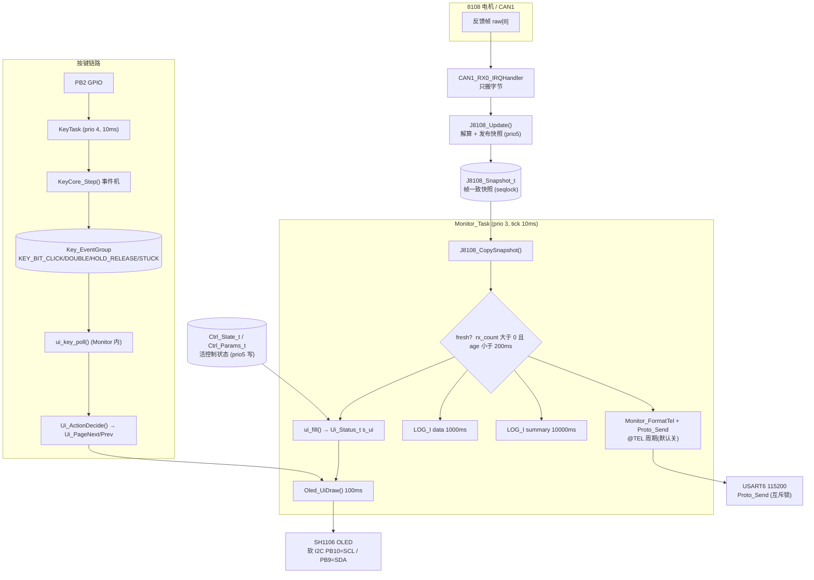

# 06 · 显示按键与监控（Monitor 任务 / OLED 四页 / 按键事件机 / UI 策略）

- 代码基线：`FW_VERSION_STR = v0.1.60-dev`（`mcu_bsp/version/version.h`）
- 覆盖文件（**只读**，本文件不修改任何源码）：
  `Task/Src/Monitor_Task.c` · `Task/Inc/Monitor_Task.h` · `Task/Inc/ui_status.h` ·
  `Task/Src/Oled_Task.c` · `Task/Inc/Oled_Task.h` ·
  `mcu_bsp/oled/OLED.{c,h}` · `mcu_bsp/key/bsp_key.{c,h}` · `mcu_bsp/key/key_core.{c,h}` ·
  `mcu_bsp/Motor/ui_action.h`
- 关联文档：`docs/1_规则（既定事实）/协议_串口控制_v1.md`（§5.5 遥测 / §10.1 任务表 / §13 按键与屏幕职责）、
  `docs/2_方案（定稿设计）/设计_8108监护界面与单键交互.md`（设计初稿；**注意其中"单页 8 行 + 光标 + 长按执行动作"是 v2 旧方案，已废弃**，
  落地版本是本节描述的"4 页 + 按键纯翻页"）。
- 所有函数名 / 字段名 / 显示字符串均为 grep 核验后的原文；渲染示例是按**代码里的格式串**推出来的样子，
  不是从硬件抓的实机截图（数值为示意）。文中标注"估算"的数字都给了算式与假设。

---

## 0. 一句话职责

**Monitor_Task（prio 3）一个任务、三个出口——屏刷 10Hz / 数据日志 1Hz / 10s 摘要 / 协议遥测 `@TEL`（默认关）——
全部从 J8108 的"帧一致快照"读同一份数据；按键（PB2）在 KeyTask（prio 4）里被判定成单击/双击/长按/卡死，
经事件标志组交给 Monitor 消费，只做 UI 翻页，绝不发电机指令。**

---

## 1. 接口清单

### 1.1 Monitor（`Task/Inc/Monitor_Task.h`，实现 `Task/Src/Monitor_Task.c`）

| 原型 | 行 | 调用者 | 说明 |
|---|---|---|---|
| `void Monitor_Task_Init(void)` | .h:16 / .c:315 | `Core/Src/main.c:165`（`FEATURE_OLED_UI && FEATURE_MONITOR_TASK`） | 创建 `"Monitor"` 任务，prio 3，栈 640 words |
| `void Monitor_SetTelPeriod(uint16_t ms)` | .h:19 / .c:46 | `CmdRx_Task.c`（`#TEL`） | 遥测周期设置；`ms<2 → 0`（关） |
| `uint16_t Monitor_GetTelPeriod(void)` | .h:20 / .c:51 | 无调用者（对外预留） | 读当前遥测周期 |
| `void Monitor_FormatTel(char *buf, uint32_t bufsz)` | .h:21 / .c:67 | `Monitor_Task.c:297`（周期发送）、`CmdRx_Task.c:748`（`#TEL 1` 单次） | 生成一行 `"@TEL ..."` |
| `const Ui_Status_t *Monitor_Ui(void)` | .h:24 / .c:56 | **当前无调用者**（调试预留） | 返回任务内 `s_ui` 只读指针 |

### 1.2 OLED 渲染器（`Task/Inc/Oled_Task.h`）

| 原型 | 行 | 调用者 | 说明 |
|---|---|---|---|
| `void Oled_UiDraw(uint8_t page, const J8108_Snapshot_t *sn, const Ui_Status_t *ui)` | .h:15 / .c:87 | `Monitor_Task.c:250` | **渲染器，不建任务**；内部做局部刷新，页切换整屏重画 |

### 1.3 按键驱动 + 事件分发（`mcu_bsp/key/bsp_key.h`）

| 原型 | 行 | 调用者 | 说明 |
|---|---|---|---|
| `void Key_Init(void)` | .h:40 / .c:26 | `Key_Task_Init()` 内部；幂等 | GPIO(PB2) + 事件组 + `KeyCore_Init` |
| `void Key_Task_Init(void)` | .h:41 / .c:156 | `main.c:182`（`FEATURE_KEY`） | 创建 `"KeyTask"`，prio 4，栈 256 words |
| `EventGroupHandle_t Key_EventGroup(void)` | .h:43 / .c:172 | `Monitor_Task.c:150,154` | 唯一消费者是 Monitor |
| `uint8_t Key_IsPressed(void)` | .h:44 / .c:177 | 无（预留：进度条/调试） | 已消抖的按下状态 |
| `uint32_t Key_GetHoldMs(void)` | .h:45 / .c:182 | 无（预留） | 当前按住累计 ms |
| `uint8_t Key_GetRawLevel(void)` | .h:47 / .c:187 | 无（实测电平方向用） | GPIO 原始电平 |
| `void Key_GetCore(KeyCore_t *out)` | .h:47 / .c:192 | 无（统计显示预留） | 拷贝事件机统计 |
| `void Key_GetLastMsg(KeyCore_Msg_t *out, uint32_t *ms)` | .h:48 / .c:200 | `Monitor_Task.c:171` | 最近一次事件快照（取 `hold_ms`） |

关键宏（`bsp_key.h`）：`KEY_GPIO_PORT=GPIOB`、`KEY_GPIO_PIN=GPIO_PIN_2`、`KEY_GPIO_PULL=GPIO_PULLUP`、
**`KEY_ACTIVE_LEVEL=1u`（高有效，A 板 2026-09-15 实测）**、`KEY_SCAN_TICK_MS=10`、
`KEY_TASK_PRIORITY=4`、`KEY_TASK_STACK_WORDS=256`、
事件位 `KEY_BIT_CLICK=(1<<0)`、`KEY_BIT_DOUBLE=(1<<1)`、`KEY_BIT_HOLD_RELEASE=(1<<2)`、`KEY_BIT_STUCK=(1<<3)`。

### 1.4 事件机核心（`mcu_bsp/key/key_core.h`）

| 原型 | 行 | 说明 |
|---|---|---|
| `void KeyCore_Init(KeyCore_t *k, uint8_t active_level, uint8_t tick_ms)` | .h:74 / .c:7 | 清零 + 记录有效电平/时基；`raw_last=0xFF`（未知→首 tick 采样一次） |
| `uint8_t KeyCore_Step(KeyCore_t *k, uint8_t raw_level, KeyCore_Msg_t *msg)` | .h:80 / .c:17 | 每 tick 喂一次原始电平；**有事件返回 1 并填 `*msg`（一次最多一个事件）** |

时间参数（`key_core.h:23-28`，单位 ms，集中调手感）：
`KEYC_DEBOUNCE_MS=30`（消抖）、`KEYC_CLICK_MIN_MS=40`、`KEYC_CLICK_MAX_MS=400`、
`KEYC_GAP_MIN_MS=80`、`KEYC_GAP_MAX_MS=300`、`KEYC_STUCK_MS=10000`。

### 1.5 UI 策略（`mcu_bsp/Motor/ui_action.h`，全 `static inline` 纯逻辑）

| 原型 | 行 | 说明 |
|---|---|---|
| `Ui_Action_t Ui_ActionDecide(Ui_Gesture_e ges, uint32_t hold_ms, uint32_t home_ms)` | :35 | 手势 → 动作；HOLD 且 `hold_ms>=home_ms` 才回主页；STUCK/其它 → `UI_ACT_NONE` |
| `uint8_t Ui_PageNext(uint8_t cur, uint8_t count)` | :52 | `+1` 取模；`count<=1` 返回 0 |
| `uint8_t Ui_PagePrev(uint8_t cur, uint8_t count)` | :59 | `+count-1` 取模；`count<=1` 返回 0 |
| `const char *Ui_ActionStr(Ui_Action_t a)` | :66 | 动作名（**当前无调用者**） |

`UI_HOME_HOLD_MS = 2000u`（:33）。枚举：手势 `UI_GES_CLICK/DOUBLE/HOLD/STUCK`，动作 `UI_ACT_NONE/PAGE_NEXT/PAGE_PREV/PAGE_HOME`。

### 1.6 OLED 驱动（`mcu_bsp/oled/OLED.h`）——本项目**实际调用**的子集

| 原型 | 调用者 |
|---|---|
| `void OLED_Init(void)` | `main.c:162` |
| `void OLED_Clear(void)` | `Oled_Task.c:102`（页切换时） |
| `void OLED_Update(void)` | `Oled_Task.c:240`、`OLED.c:358`（Init 内清屏） |
| `void OLED_ShowString(uint8_t X, uint8_t Y, const char *String, uint8_t FontSize)` | `Oled_Task.c:67`（`rfmt` 内） |
| `OLED_ShowChar` / `OLED_ShowImage` | 仅被 `OLED_ShowString` 逐字符内部调用 |

### 1.7 UI 状态视图（`Task/Inc/ui_status.h`）

`UI_PAGE_COUNT=4`、`UI_LAST_CMD_LEN=14`、页号宏 `UI_PAGE_LINK=0 / UI_PAGE_MOTION=1 / UI_PAGE_SERIAL=2 / UI_PAGE_SYSTEM=3`、
结构体 `Ui_Status_t`（字段见 §5）。

### 1.8 Monitor 只读消费的其它模块接口

| 接口 | 位置 | 取到什么 |
|---|---|---|
| `void J8108_CopySnapshot(J8108_Snapshot_t *out)` | `motor_8108.c:150` | 帧一致快照（seqlock 读侧） |
| `const Ctrl_State_t *J8108_State(void)` | `J8108_Task.c:223` | **活**控制状态指针（mode/enabled/set/set_applied/inpos/last_cmd_ms） |
| `Ctrl_Params_t *J8108_Params(void)` | `J8108_Task.c:228` | 参数（只读用 `wd_ms`） |
| `uint8_t J8108_IsSending(void)` | `J8108_Task.c:145` | `enabled && mode!=IDLE` → P1 行 7 的 `SEND` |
| `uint32_t J8108_EventLatch(void)` | `J8108_Task.c:241` | 保护事件锁存位 `CTRL_EV_*` → P3 行 5 |
| `uint32_t J8108_LoopJitterTake(void)` | `J8108_Task.c:233` | **读后清零**的控制循环最大间隔 ms（10s 摘要用） |
| `void J8108_DbgFrames(float *kp, float *kd)` | `J8108_Task.c:246` | 本帧 Kp/Kd → P1 行 5 |
| `const char *J8108_ErrStr(uint8_t err)` | `motor_8108.c:268` | `OK/OVERLOAD/T-COIL/T-MOS/OVERCUR/OVERVOLT/UNDERVOLT/ERR?` |
| `CmdRx_RxLines/RxBytes/LastCmd/LastErr` | `CmdRx_Task.c:870/875/880/885` | 协议计数与最近命令名/错误码 |
| `Proto_TxLines/Proto_TxBusyDrops/Proto_Send` | `proto_tx.h` / `proto_tx.c:77/82/37` | 发送统计与统一发送口 |
| `stack_probe_tick(t_ms, tag, words)` | `Task/Inc/stack_probe.h:22`（static inline） | 开机 5s 后打一次栈余量 |
| `Ctrl_ModeStr(Ctrl_Mode_e)` | `ctrl_core.c:536` | `IDLE/DAMP/SPEED/POS/TORQUE/IMP/?` |

---

## 2. 框图

### 2.1 数据面（快照 → `Ui_Status_t` → 三个出口）

```
   8108 电机                 J8108 控制任务 (prio 5, 200Hz)
      │  CAN1 反馈帧 @1kHz            │
      ▼                              ▼
 CAN1_RX0_IRQ ──── raw[8] ───▶  J8108_Update() 解算物理量
 (只搬字节)                     │  写 s_dev.fb / s_dev.status
                                │
                                ▼  seqlock 发布（seq 奇数→写→偶数）
                     ┌──────────────────────────────────────┐
                     │  J8108_Snapshot_t  （64 字节）        │
                     │  valid/status/err/bus_err/rx_count/   │
                     │  tx_cnt/frame_age_ms/raw[8]/pos_deg/  │
                     │  vel_dps/torque/t_mos/t_rotor ...     │
                     └───────────────┬──────────────────────┘
                                     │  J8108_CopySnapshot()（读侧重试）
   ┌─────────────────────────────────┼──────────────────────────────────┐
   │                  Monitor 任务 (prio 3, 10ms 节拍)                    │
   │  J8108_CopySnapshot(&sn)  ──▶  fresh = (rx_count>0 && age<200ms)     │
   │  Ctrl_State_t* 活状态  ──▶  ui_fill(&s_ui, &sn, fb_hz) ──▶ Ui_Status_t│
   │                                                                      │
   │   出口①  100ms  ──▶ Oled_UiDraw(page, &sn, &s_ui)  ──▶ 软 I2C 屏     │
   │   出口②  1000ms ──▶ LOG_I("Monitor","data: ...")（fresh 才打数值）   │
   │   出口③  10000ms──▶ LOG_I("Monitor","summary: ...")（含 jitter 取走） │
   │   出口④  @TEL 周期(默认关) ──▶ Monitor_FormatTel() ──▶ Proto_Send()   │
   └──────────────────────────────────────────────────────────────────────┘
            三个出口读的是**同一份** sn / s_ui → 屏/日志/遥测永不打架
```

### 2.2 按键面（GPIO → 事件机 → 事件位 → Monitor 消费 → 翻页）

```
   PB2 (高有效, 内部上拉兜底)
     │
     ▼
  KeyTask (prio 4, 10ms)  key_scan_once()
     │   raw_level = HAL_GPIO_ReadPin()
     ▼
  KeyCore_Step()  纯逻辑事件机（无 HAL/FreeRTOS 依赖，可宿主机穷举测试）
     │   去抖 30ms → 按下/松手跳变 → 短按[40,400]ms 计数 → 连击窗口 300ms
     │   → 长按(>400ms) 松手报 HOLD → 持续 ≥10s 报 STUCK（该次按下作废）
     ▼
  xEventGroupSetBits(Key_EventGroup, KEY_BIT_*)
     │
     ▼
  Monitor 每 10ms：ui_key_poll()  xEventGroupWaitBits(4 位, clear, 0 等待)
     │
     ▼
  Ui_ActionDecide()  →  PAGE_NEXT / PAGE_PREV / PAGE_HOME / NONE
     │
     ▼
  s_ui.page ──▶ Oled_UiDraw 检测 page 变化 → OLED_Clear + 整屏重画
     ✗ 无 Proto_Send / 无 CAN 发送 / 无控制状态写入
```

### 2.3 mermaid 流程图（同 2.1 + 2.2 合并）



---

## 3. 逐函数详解

### 3.1 `Task/Src/Monitor_Task.c`

#### 3.1.1 常量与静态量（.c:33-44）

| 宏 / 变量 | 值 | 说明 |
|---|---|---|
| `MON_TASK_PRIORITY` | 3 | 低优先级：软 I2C 刷屏 ms 级阻塞，绝不能挤进 prio 5 的 200Hz 控制帧发生器 |
| `MON_TASK_STACK_WORDS` | 640 | snprintf 浮点 + 渲染缓冲（注释原文："snprintf 浮点 + 渲染缓冲"） |
| `MON_TICK_MS` | 10 | 任务节拍（`vTaskDelay`） |
| `MON_UI_MS` | 100 | 屏刷 10Hz |
| `MON_LOG_MS` | 1000 | 数据日志 1Hz |
| `MON_SUM_MS` | 10000 | 状态摘要 10s |
| `MON_FRESH_MS` | 200 | 新鲜门槛，**与 J8108 的 READY 判定同值**（`motor_8108.c:213`） |
| `MON_DEF_TEL_MS` | 0 | 遥测默认**关** |
| `static TaskHandle_t s_task` | — | 任务句柄（唯一赋值点 `xTaskCreate`） |
| `static volatile uint16_t s_tel_period_ms` | 0 | 被 CmdRx 任务写、Monitor 读 → `volatile` |
| `static Ui_Status_t s_ui` | — | UI 状态视图（**唯一填充者 = `ui_fill`**） |

#### 3.1.2 `Monitor_SetTelPeriod` / `Monitor_GetTelPeriod`（.c:46 / .c:51）

- 原型：`void Monitor_SetTelPeriod(uint16_t ms)` / `uint16_t Monitor_GetTelPeriod(void)`
- 参数：`ms` — 遥测周期，`<2` 一律归一为 0（关）
- 返回：无 / 当前周期
- 上行：`CmdRx_Task.c` 的 `#TEL` 分支（`case CMD_TEL`，.c:735）
- 下行：`monitor_task` 主循环的出口④条件 `s_tel_period_ms >= 2u`
- 步骤：`s_tel_period_ms = (ms < 2u) ? 0u : ms;`（一行赋值，写入是 16 位原子）
- 坑：
  - 命令侧另有一层范围校验 `#TEL > 1000 → @ERR 2`（"period 2..1000 ms (115200 baud limit)"，`CmdRx_Task.c`），
    本函数**不做**上限裁剪——绕过 CmdRx 直接调用可设任意值，屏上会显示 `TEL <ms>ms`。
  - 改周期不清零 `t_last_tel`：从关→开时不会立即发一条（最坏等一个周期）。

#### 3.1.3 `Monitor_Ui`（.c:56）

- 原型：`const Ui_Status_t *Monitor_Ui(void)` → 返回 `&s_ui`
- 上行：无（grep 全工程仅此定义处）
- 坑：**当前是死接口**；它返回的是任务内静态结构体的指针，调用者必须按只读使用（无锁，字段可能被 `ui_fill` 改到一半）。

#### 3.1.4 `now_ms`（.c:61，static）

- 原型：`static uint32_t now_ms(void)` → `xTaskGetTickCount() * portTICK_PERIOD_MS`
- 全文件时间统一用它（10ms 节拍下 tick 粒度即 1ms）
- 坑：所有周期判断都写成 `(uint32_t)(t - t_last_x) >= PERIOD` 的**回绕安全**减法；不要把某个 `t_last_x` 初始化为
  非 0 的"未来值"，否则会等满一个回绕周期（这里是 49.7 天）。

#### 3.1.5 `Monitor_FormatTel`（.c:67）

- 原型：`void Monitor_FormatTel(char *buf, uint32_t bufsz)`
- 参数表：

| 参数 | 类型 | 含义 | 约束 |
|---|---|---|---|
| `buf` | `char *` | 输出缓冲 | `NULL` → 直接 return（不写） |
| `bufsz` | `uint32_t` | 缓冲长度 | 0 → 直接 return；Monitor 传 160，CmdRx 传 256 |

- 返回：无（无返回值；失败静默）
- 上行：`monitor_task`（.c:297，周期 ≥2ms 且 fresh）、`CmdRx_Task.c:748`（`#TEL 1`）
- 下行：`J8108_CopySnapshot()`（数值）+ `J8108_State()`（模式/使能/设定点）、`Ctrl_ModeStr()`、`snprintf`
- 格式串（代码原文）：
  `"@TEL ms=%lu mode=%s en=%u pos=%.2f vel=%.1f T=%.3f Tm=%.1f Tr=%.1f err=0x%02X set=%.2f age=%lu"`
- 字段来源：

| 字段 | 来源 | 备注 |
|---|---|---|
| `ms` | `now_ms()` | A 板时基，回绕 |
| `mode` | `Ctrl_ModeStr(st->mode)` | **活状态**，非快照 |
| `en` | `st->enabled` | 活状态 |
| `pos` | `sn.pos_deg` | 快照（输出端 deg） |
| `vel` | `sn.vel_dps` | 快照（%.1f） |
| `T` | `sn.torque` | 快照（%.3f） |
| `Tm` / `Tr` | `sn.t_mos` / `sn.t_rotor` | 快照（MOS / 线圈 ℃） |
| `err` | `sn.err` | 反馈帧 byte0 |
| `set` | `st->set` | **活状态原始设定点**（与屏上 `set_applied` 不同，见 §9.4-⑦） |
| `age` | `sn.frame_age_ms` | 新鲜度 |

- 示例（按格式串重建）：`@TEL ms=123456 mode=POS en=1 pos=12.34 vel=0.50 T=0.120 Tm=40.4 Tr=29.4 err=0x00 set=12.00 age=5`
- 坑：
  - **最坏长度 ≈114 字节**（`ms=4294967295`/`mode=TORQUE`/`err=0xFF`/`age=999999` 时实测拼接长度 114），
    仍在 `PROTO_LINE_MAX=127` 以内（`proto_tx.c:20`，超出会被静默截断到 127）；
    Monitor 传的是 `char b[160]`，比协议上限大，属于有意的余量。
  - 它同时读"快照"和"活状态"两个来源 → `mode/en/set` 与 `pos/vel/T` 理论上可差一帧（≤5ms，200Hz）。
    这是**有意**的：模式/使能不是逐帧量，读活状态最新值更准；数值必须帧一致，所以只能走快照。
  - `J8108_State()` 返回的是活结构体指针（`J8108_Task.c:225 return &s_ctrl;`），读侧无锁。
    Cortex-M4 上 8/32 位对齐字段不会撕裂，但**跨字段**不保证同一时刻（例如 mode 已切、set 还是旧值）。
  - `#TEL 1` 单次遥测是在 **CmdRx 任务上下文**执行的：`Proto_Send` 会取 TX 锁（有界等待 50ms），
    与 Monitor 的周期遥测共用一个出口，互斥锁保证整行原子（`proto_tx.h` 头注释）。

#### 3.1.6 `ui_fill`（.c:85，static；任务描述里的"fill_ui_status"即此函数）

- 原型：`static void ui_fill(Ui_Status_t *ui, const J8108_Snapshot_t *sn, uint16_t fb_hz)`
- 参数表：

| 参数 | 含义 |
|---|---|
| `ui` | 待填充的 UI 视图（Monitor 传 `&s_ui`）；`page/page_cnt` 由本函数**之外**维护 |
| `sn` | 本轮的帧一致快照 |
| `fb_hz` | 1s 窗口内新到的反馈帧数（主循环算好传入，本函数不重复算） |

- 返回：无
- 上行：`monitor_task`（.c:244，每轮都调，**不按 100ms 门控**——保证遥测/日志拿到的也是最新视图）
- 下行：`J8108_State()`、`J8108_Params()`、`J8108_IsSending()`、`J8108_EventLatch()`、`J8108_DbgFrames()`、
  `CmdRx_RxLines/RxBytes/LastErr/LastCmd`、`Proto_TxLines`、`xTaskGetTickCount`、`xPortGetFreeHeapSize`、
  `uxTaskGetNumberOfTasks`
- 步骤（按代码顺序）：
  1. 控制态/链路态：`mode`、`enabled`、`frames_on=J8108_IsSending()`、`inpos`、`ev_flags=J8108_EventLatch()`、`fb_hz`
  2. **三设定点清零后按模式填一个**：POS→`set_deg=st->set_applied`；SPEED→`set_dps=set_applied`；
     TORQUE/IMP→`set_nm=st->set`；IDLE/DAMP→三个都保持 0.0f
  3. `J8108_DbgFrames(&kp,&kd)` → `kp_now/kd_now`
  4. 心跳剩余：`wd_ms!=0 && enabled` 时 `wd_left = wd_ms - (now - st->last_cmd_ms)`（下溢夹 0）；
     否则 `wd_left = 0`
  5. 协议计数与最近命令：`rx_lines/tx_lines/rx_bytes/err_code`，`last_cmd` 用
     `snprintf(ui->last_cmd, sizeof(ui->last_cmd), "%s", CmdRx_LastCmd())`（缓冲 14 → 最多 13 字符）
  6. `tel_period_ms = s_tel_period_ms`
  7. 系统：`uptime_s = tick / configTICK_RATE_HZ`、`free_heap`、`task_cnt`
- 坑：
  - `wd_left_ms` 是 16 位，`wd_ms` 上限也按 16 位处理；`(uint16_t)wd_left` 处若 `wd_ms>65535` 会截断（参数默认远小）。
  - P2 上 `WD LEFT 0ms` **无法区分**"看门狗关闭（wd_ms=0）"与"已超时/未使能"——三种情况都显示 0。
  - `last_cmd` 初值为空串 → P2 渲染成 `LAST #-`（`Oled_Task.c:203` 有 `!= '\0'` 兜底）。
  - 本函数**不碰** `page/page_cnt`：页号只在初始化（.c:216-218）与 `ui_key_poll` 里改，避免翻页被数据刷新覆盖。

#### 3.1.7 `ui_key_poll`（.c:144，static）

- 原型：`static void ui_key_poll(Ui_Status_t *ui)`
- 参数：`ui` — 只改 `ui->page`
- 返回：无
- 上行：`monitor_task`（.c:243，每 10ms 一轮）
- 下行：`Key_EventGroup()`、`xEventGroupWaitBits`、`Key_GetLastMsg`、`Ui_ActionDecide`、`Ui_PageNext/Prev`、`LOG_I`
- 步骤：
  1. 事件组未建成（heap 失败）→ 直接 return（**不阻塞、不崩**）
  2. 非阻塞等待 4 个位：`xEventGroupWaitBits(group, CLICK|DOUBLE|HOLD_RELEASE|STUCK, pdTRUE /*出组即清*/, pdFALSE /*任一满足*/, 0)`
  3. 位为 0 → return
  4. 按**固定优先级**翻译成手势：STUCK → `UI_GES_STUCK`；HOLD_RELEASE → 用 `Key_GetLastMsg(&msg,NULL)` 取
     `msg.hold_ms` 再 `UI_GES_HOLD`；DOUBLE → `UI_GES_DOUBLE`；否则 `UI_GES_CLICK`
  5. `Ui_ActionDecide(gesture, hold_ms, UI_HOME_HOLD_MS)` → 动作
  6. 动作分派：下一页 / 上一页 / 回 P0（`ui->page=0u`），各打一条 `LOG_I("Monitor","key: page -> %u/%u" 或 "key: page -> home (1/%u)")`；
     `UI_ACT_NONE` **静默**（含卡死作废，不刷日志）
- 坑（真实语义，值得知道）：
  - `xEventGroupWaitBits(..., xClearOnExit=pdTRUE, ...)` 会清掉**所有**匹配的置位位，不只是满足条件的那一位
    → 若 10ms 内同时来了两个手势（如 STUCK 与 CLICK），只有优先级最高的那个被处理，另一个被**一并清掉**。
  - `hold_ms` 走的是"最近一次事件快照"旁路（事件组只传位、不传参）。理论竞态：KeyTask 在
    `Key_GetLastMsg` 之前写入更新的 `s_last_msg`（例如紧随的 CLICK），长按就按错误的 hold_ms 判定 →
    只会表现成"该次长按不回主页"或（若 hold_ms 偏大）"提前回主页"。10ms 级窗口，概率极低；
    要根除需把 hold_ms 也放进事件投递通道（队列）。
  - 卡死路径固定传 `hold_ms=0`，`Ui_ActionDecide` 对 `UI_GES_STUCK` 直接返回 NONE，所以**卡死永远零副作用**。

#### 3.1.8 `monitor_task`（.c:204，static，任务体）

- 原型：`static void monitor_task(void *arg)`（`arg` 未用）
- 局部状态：`t_last_ui / t_last_log / t_last_sum / t_last_tel`（周期基准，初值 0）、
  `hz_win_ms / hz_win_cnt`（帧率窗口）、`fb_hz`
- 启动期：清 `s_ui` → `page=UI_PAGE_LINK(0)`、`page_cnt=UI_PAGE_COUNT(4)` → 两条 `LOG_I`：
  - `"task up: screen 10Hz / log 1Hz / telemetry(period=%ums) - all from the SAME snapshot"`
  - `"pages: 0=LINK 1=MOTION 2=SERIAL 3=SYSTEM | key: click=next dbl=prev hold=home (UI ONLY, no motor action)"`
- 主循环（每轮，代码原文顺序）：
  1. `stack_probe_tick(t, "Monitor", MON_TASK_STACK_WORDS)` — 开机 **5s 后打一次**栈余量
     （`uxTaskGetStackHighWaterMark(NULL)`，记在 `stack_probe.h`）
  2. `J8108_CopySnapshot(&sn)` — 读帧一致快照
  3. `fresh = (rx_count>0 && frame_age_ms<MON_FRESH_MS)`
  4. **帧率统计**：距上次统计 ≥1000ms 时 `fb_hz = sn.rx_count - hz_win_cnt`（差值窗口），更新窗口基准
  5. `ui_key_poll(&s_ui)` → 先按键、后填表（翻页动作立即反映到本轮的 `page`）
  6. `ui_fill(&s_ui, &sn, fb_hz)`
  7. 出口①屏刷：`(t-t_last_ui) >= 100` → `Oled_UiDraw(s_ui.page, &sn, &s_ui)`
  8. 出口②数据日志：`(t-t_last_log) >= 1000` → **fresh 才打**
     `"data: pos=%.2fdeg vel=%.1fdps T=%.3fNm Tm=%.1f Tr=%.1f err=0x%02X mode=%s en=%u set=%.2f age=%lums"`
     （`set` 按模式取 `set_deg/set_dps/set_nm`）；不新鲜 → **静默**（LOST 边沿由控制任务打，这里绝不重播旧数值）
  9. 出口③摘要：`(t-t_last_sum) >= 10000` → fresh 打
     `"summary: link=UP mode=%s en=%u rx=%lu tx=%lu hz=%u uptime=%lus heap=%lu txdrop=%lu dtmax=%lums"`
     （`dtmax` = `J8108_LoopJitterTake()`，**读后清零**，每个 10s 窗口独立）；
     否则打 `"summary: link=DOWN (no fresh frame for %lums) mode=%s en=%u rx=%lu tx=%lu | stale values not printed on purpose"`
  10. 出口④遥测：`s_tel_period_ms>=2 && (t-t_last_tel)>=period` → fresh 用 `Monitor_FormatTel(b,160)+Proto_Send`；
      不新鲜只报状态行 `"@TEL ms=%lu mode=%s en=%u link=DOWN age=%lu"`
  11. `vTaskDelay(pdMS_TO_TICKS(10))`
- 坑：
  - 出口①②③④ **互不替代**：屏刷不打断日志、日志不打断遥测；同一轮里可能既刷屏又打日志（最坏叠加，见 §3.1.9 预算）。
  - `fresh` 判据用 `rx_count>0`，Oled 内部用 `valid!=0`（`motor_8108.c:223` 二者同源等价），写法不统一但语义一致。
  - 不新鲜时屏上仍会画 `RX/TX/ERR/模式` 等**非数值态**（它们不需要新鲜度），只有"数值类"降级成 `----`/`LINK DOWN`。

#### 3.1.9 `Monitor_Task_Init`（.c:315）

- 原型：`void Monitor_Task_Init(void)`
- 上行：`main.c:165`（`FEATURE_OLED_UI && FEATURE_MONITOR_TASK`，且在 `Proto_TxInit()` 之后 —— 遥测发不出去才是问题）
- 下行：`xTaskCreate(monitor_task, "Monitor", 640, NULL, 3, &s_task)`
- 失败路径：`LOG_E("Monitor","xTaskCreate FAILED (heap/stack?) -> SCREEN/LOG/TELEMETRY DISABLED")`
- 坑：32KB heap 紧张，任务创建失败是**静默不跑**（只留一条 E 日志） → 上电日志里没有
  `task up: screen 10Hz...` 就说明 Monitor 没起来。

**周期与预算小结（本节所有数字都有出处）**

| 出口 | 周期 | 备注 |
|---|---|---|
| 屏刷 | 100ms（10Hz） | 局部刷新只省"格式化 + 显存写入"；`OLED_Update()` 仍是整帧推送（详见 §7.6） |
| 数据日志 | 1000ms | 约 90 字节/行 @115200 ≈ 8ms 串口时间 |
| 摘要 | 10000ms | 一条 |
| `@TEL` | 默认关；`#TEL 1..1000ms` | 20Hz 时 ≈96 字节×20 ≈ 2KB/s ≈ 17% 带宽 |
| 任务节拍 | 10ms | 每轮都做 CopySnapshot(64B) + ui_fill + 按键轮询 |

### 3.2 `Task/Src/Oled_Task.c`（渲染器，不建任务）

#### 3.2.1 静态量（.c:28-32）

`UI_COLS=21`（6×8 字体 21×6=126px ≤ 128 列）、`UI_ROWS=8`（8 行 ×8px = 64 行）、
`static char s_last[UI_ROWS][UI_COLS+1]`（**上次每行内容**，用于比较）、
`static uint8_t s_page = 0xFFu`（0xFF = 从未画过 → 强制全刷）。

#### 3.2.2 `rfmt`（.c:35，static，可变参数）

- 原型：`static void rfmt(uint8_t row, int force, const char *fmt, ...)`
- 参数表：

| 参数 | 含义 |
|---|---|
| `row` | 行号 0..7（≥8 直接忽略） |
| `force` | 非 0 = 忽略比较强制重画（页切换/首帧用） |
| `fmt` | printf 风格格式串（行内容按 21 列设计，见 §4） |
| `...` | 变参（浮点靠 vsnprintf 处理） |

- 返回：无
- 下行：`vsnprintf(tmp[64])` → 截断/补空格到 21 列 → `memcmp` →（有变化才）`OLED_ShowString(0, row*8, out, OLED_6X8)`
- 步骤：
  1. `row>=UI_ROWS` 直接 return
  2. `vsnprintf` 到内部 `char tmp[64]`（**超过 63 字符的格式结果在这里先被切掉**）
  3. `n=strlen(tmp)`；`n>21 → n=21`（**静默截断到 21 列**）
  4. 从 `n` 到 21 补空格，`out[21]='\0'`（**补空格的原因**：旧行长于新行时，如果只写新串，屏幕会残留上一次的尾巴；
     补满 21 列后 `OLED_ShowString` 覆盖整行 126px）
  5. `force==0 && memcmp(out, s_last[row], 21)==0` → **不刷**（省的是显存写入与后续 I2C）
  6. 变化时 `memcpy(s_last[row], out, 21)` 并写 `OLED_ShowString`（只对显存数组操作，**不等于上屏**）
- 坑：
  - `s_last` 与显存是两套状态：**只要 `OLED_Update()` 没被调用，变化就停在显存里**（本文件末尾无条件调用，见 3.2.4）。
  - 输出宽度 >21 的行会被无提示截断（如 P3 行 0 在 uptime 极大时），排查"屏上少几个字符"要想到 `rfmt` 的 21 列钳位。

#### 3.2.3 `bus_state_str`（.c:70，static）

- 原型：`static const char *bus_state_str(uint8_t status)` → `"INIT FAIL" / "INIT OK WAIT" / "READY" / "BUS ERR" / "?"`
- 输入：`sn->status`（`J8108_Status_e`）
- 坑：与 `motor_8108.c:289` 的 `J8108_StatusStr()` **是两份独立实现**，且字符串不一致
  （这里 `J8108_ST_INIT_OK → "INIT OK WAIT"`，那边是 `"INIT OK"`）。屏幕里显示的永远是本文件的版本。

#### 3.2.4 `Oled_UiDraw`（.c:87）

- 原型：`void Oled_UiDraw(uint8_t page, const J8108_Snapshot_t *sn, const Ui_Status_t *ui)`
- 参数表：

| 参数 | 含义 | 约束 |
|---|---|---|
| `page` | 页号 | `>=UI_PAGE_COUNT` → 归 0（画 P0） |
| `sn` | 帧一致快照 | `NULL` → 直接 return |
| `ui` | UI 视图 | `NULL` → 直接 return |

- 返回：无
- 上行：`monitor_task`（10Hz）
- 下行：`OLED_Clear/OLED_ShowString(via rfmt)/OLED_Update`、`Ctrl_ModeStr`、`J8108_ErrStr`、`hcan1.Instance->ESR`
- 步骤：
  1. 空指针/页号兜底
  2. `force = (page != s_page)`；变了 → 记住新页号、`OLED_Clear()`、`memset(s_last,0)` → 全行强制重画（**页切换 = 整屏重画**，
     避免上一页残留的字）
  3. `have = sn->valid; fresh = (have && sn->frame_age_ms < 200u)`（**硬编码 200**，不是 `MON_FRESH_MS` 常量）
  4. `switch(page)` 逐行 `rfmt`（内容见 §4）
  5. **无条件 `OLED_Update()`**：把显存 8×128 字节整帧推给屏（见 §7.6 的观察项）
- 坑：
  - `OLED_Clear()` 只清显存数组，真正清屏靠紧随其后的 `OLED_Update()`；本函数把 Update 放在末尾统一提交，
    所以**页切换那一次是全屏 I2C 流量**，明显比稳态（理论上只改几行）重。
  - 本文件不发任何 CAN 帧、不写控制状态（头注释明写"只读快照/只读状态视图"）——这是"渲染器与执行器分离"的落点。

### 3.3 `mcu_bsp/key/bsp_key.c`（GPIO + 扫描任务 + 事件分发）

| 函数（行） | 要点 |
|---|---|
| `Key_Init`（26） | 建事件组（heap 失败 → `LOG_E` "Key events will not be delivered"）；**幂等**（`s_core.tick_ms!=0` 直接 return）；`__HAL_RCC_GPIOB_CLK_ENABLE()` **自备时钟**（CubeMX 未配 PB2）；`GPIO_MODE_INPUT` + `KEY_GPIO_PULL`；`KeyCore_Init(&s_core, KEY_ACTIVE_LEVEL, KEY_SCAN_TICK_MS)`；读一次原始电平并打日历式自检日志（`idle raw level=%u (expect %u)`，若空闲电平==有效电平则 `LOG_W` 提示可能反相/开机就被按） |
| `key_evt_name`（68） | 事件名转字符串（`CLICK/DOUBLE/HOLD/STUCK/NONE`）；**当前无调用者**（死代码，注释先行） |
| `key_scan_once`（85） | 读 PB2 → `KeyCore_Step` → 事件→位映射（CLICK→bit0 / DOUBLE→bit1 / HOLD_RELEASE→bit2 / STUCK→bit3）→ 每种事件一条 `LOG_I`/`LOG_E`（含 `hold_ms/gap_ms/clicks` 与累计计数）→ `xEventGroupSetBits` → 保存 `s_last_msg` 与 `s_last_msg_ms` |
| `key_task`（138） | 先 `Key_Init()` 再循环 `key_scan_once() + vTaskDelay(10ms)`；**不用 `vTaskDelayUntil`**：`INCLUDE_vTaskDelayUntil=0`（CubeMX 生成区不改），±5% 抖动对 2s 长按/300ms 连击无实质影响 |
| `Key_Task_Init`（156） | 先 `Key_Init()`（消费者可能先跑）再 `xTaskCreate("KeyTask", 256, prio 4, &s_key_task)`；失败 → `LOG_E` "KEY DISABLED" |
| `Key_EventGroup`（172） | 返回事件组句柄（Monitor 唯一消费者） |
| `Key_IsPressed`（177） | `s_core.stable_pressed`（已消抖） |
| `Key_GetHoldMs`（182） | `s_hold_ms`（扫描时同步，供进度条之类的功能用） |
| `Key_GetRawLevel`（187） | `s_raw_level`（实测电平方向用） |
| `Key_GetCore`（192） | 拷贝整个 `KeyCore_t`（含 `cnt_click/cnt_double/cnt_hold/cnt_stuck/cnt_ignored`） |
| `Key_GetLastMsg`（200） | 拷贝最近一次事件 + 时刻；`out`/`ms` 允许 `NULL` |

**电平极性说明**：`KEY_ACTIVE_LEVEL=1u`（`bsp_key.h:22`）＝**按下为高**。A 板实测：PB2 空闲为低、按下为高。
引脚配置为 `GPIO_MODE_INPUT + GPIO_PULLUP`（上拉是兜底，不改变高有效判定）；`KeyCore_Step` 判的是
`raw_level == active_level`。换板/改电路时看开机日志 `idle raw level`，若空闲电平等于有效电平会打 W 级告警。

### 3.4 `mcu_bsp/key/key_core.c`（纯逻辑事件机）

#### 3.4.1 `KeyCore_Init`（.c:7）

- `memset(k,0,sizeof)` → `active_level = active_level?1:0` → `tick_ms = tick_ms?tick_ms:10`（0 兜底成 10）
  → `raw_last = 0xFF`（**未知电平**，让第一个 tick 触发一次"跳变"采样）→ `raw_same=0`、`stable_pressed=0`
- 坑：初始化会把统计计数清零，所以只能在开机时调用一次（`Key_Init` 里用 `tick_ms!=0` 做幂等闸）。

#### 3.4.2 `KeyCore_Step`（.c:17）

- 原型：`uint8_t KeyCore_Step(KeyCore_t *k, uint8_t raw_level, KeyCore_Msg_t *msg)`
- 参数：`k` 事件机；`raw_level` 本 tick 的 GPIO 电平（0/1）；`msg` 出参，可为 `NULL`（只要返回值）

| 返回 | 含义 |
|---|---|
| 0 | 本 tick 无事件（`*msg` 被清成 NONE 并 return） |
| 1 | 有事件，`*msg` 已填（一次最多一个事件） |

- 五个阶段（顺序即代码顺序，**同一 tick 内后面的阶段会被 `out==0u` 挡住**，保证"一个 tick 一个事件"）：

| 阶段 | 代码 | 行为 |
|---|---|---|
| 1 去抖 | `raw_level != raw_last → raw_last=raw_level, raw_same=0`；否则 `raw_same++`（封顶 0xFF） | 只有"连续相同"累积到 `debounce_ticks=KEYC_DEBOUNCE_MS/tick_ms`（=3）才认可电平变化 |
| 2 计时 | 按下时 `hold_ms+=tick_ms`，否则 `gap_ms+=tick_ms` | 松手态走的是"连击窗口计时" |
| 3 连击分派 | `!stable_pressed && click_cnt>0 && gap_ms>=KEYC_GAP_MAX_MS(300)` → `clicks>=2 ? DOUBLE : CLICK`；计数入 `cnt_double/cnt_click`；`click_cnt=0`；`out=1` | **单击动作最多延迟 300ms**（等连击窗口）；`hold_ms` 取 `last_hold`（末次短按时长） |
| 4 电平稳定跳变 | `raw_same>=debounce_ticks && pressed_now!=stable_pressed` | 按下：`gap_ms ∈ (0, KEYC_GAP_MIN_MS=80)` → `ignore_press=1` 且 `cnt_ignored++`（判抖动丢弃）；否则记录 `last_gap`，若 `gap_ms>300` 则 `click_cnt=0` 重新计数；同时 `hold_ms=0`、`stuck_reported=0`。<br>松手：`held=hold_ms`；**若本次按下曾报过 STUCK → `click_cnt=0`，既不产 CLICK 也不产 HOLD_RELEASE（整次手势作废）**；否则 `ignore_press` 时什么都不产出；`held∈[40,400]ms` → `last_hold=held, click_cnt++`（等窗口分派）；`held>400ms` → `last_hold=held`，若本 tick 尚无事件则报 `HOLD_RELEASE`（带 `hold_ms`、`last_gap`、当前 `click_cnt`）并 `click_cnt=0`（长按后不与后续短按组成连击） |
| 5 卡死检测 | `stable_pressed && !stuck_reported && hold_ms>=10000` | 置 `stuck_reported=1`、`cnt_stuck++`，若本 tick 尚无事件则报 `KEYC_EVT_STUCK`（带 `hold_ms`） |

- 坑：
  - **"长按多少秒才算数"不在本文件**：`>400ms` 一律报 `HOLD_RELEASE`，阈值（2s）由策略层
    `ui_action.h` 的 `UI_HOME_HOLD_MS` 决定 —— 分层点，改阈值不用动事件机。
  - 卡死是"一次性"的：`stuck_reported` 期间不再重复报，松手时该次按下**整体作废**（防止"按键卡死后松手"误触发动作）。
  - 长按与卡死都在**松手/超时**时才产生事件 → 长按回主页的手感是"松手才生效"，按住期间屏上没有进度提示
    （设计稿里的进度条属于旧方案，未实现）。

### 3.5 `mcu_bsp/Motor/ui_action.h`（手势 → UI 动作，纯策略）

| 手势 | `Ui_ActionDecide` 返回 | Monitor 侧效果 |
|---|---|---|
| `UI_GES_CLICK` | `UI_ACT_PAGE_NEXT` | `Ui_PageNext(page,4)`：P0→P1→P2→P3→P0 |
| `UI_GES_DOUBLE` | `UI_ACT_PAGE_PREV` | `Ui_PagePrev`：P0→P3→P2→P1→P0 |
| `UI_GES_HOLD` | `hold_ms>=2000 ? PAGE_HOME : NONE` | 回 P0（不足 2s 松手 = 什么都不做） |
| `UI_GES_STUCK` / 其它 | `UI_ACT_NONE` | 静默 |

**"按键绝不发电机指令"的实现约束（可静态验证）**：
① `ui_action.h` 里只有 4 个动作枚举，没有任何电机/协议接口（头注释明写"本文件不存在任何电机动作"）；
② `ui_key_poll` 是**唯一**消费 `KEY_BIT_*` 的地方（grep 全工程：`KEY_BIT_*` 只出现在 `bsp_key.c/.h` 与
`Monitor_Task.c`，没有任何其它任务等待这些位）；
③ `bsp_key.c` 不包含 CAN/协议头，仅 `LOG_I`；
④ `J8108_Task.c:23` 只借用 `UI_HOME_HOLD_MS` 常量，不调用任何 UI 动作函数。

### 3.6 `mcu_bsp/oled/OLED.c` —— 被本项目实际用到的 API 详解

#### 3.6.1 `OLED_Delay_us`（.c:110，static）

- `DWT->CTRL & DWT_CTRL_CYCCNTENA_Msk` 未使能时：`CoreDebug->DEMCR |= TRCENA` → `DWT->CYCCNT=0` → 使能 CYCCNT
- `ticks = us * (SystemCoreClock/1000000)`；`while ((uint32_t)(DWT->CYCCNT - start) < ticks) {}`
- 本机 `SystemCoreClock = 168MHz`（`main.c:310-312`：HSE 12MHz / PLLM=6 / PLLN=168 / PLLP=2）→ **168 周期/µs**
- **为什么不用 `HAL_Delay`**：① 源码注释记录了一个实机事故——`OLED_GPIO_Init` 在**调度器启动前**被调用，
  此时先前 `xTaskCreate` 留下的 `uxCriticalNesting=0xaaaaaaaa` 导致 BASEPRI 无法恢复、SysTick 被屏蔽，
  `HAL_Delay` 会**永久卡死**（实测整板冻结），故上电 100ms 等电也用 DWT 忙等；
  ② `HAL_Delay` 依赖中断/SysTick，在临界区里不可靠；DWT 是纯读计数器，临界区内外都安全；
  ③ 两次采样做**无符号减法**，天然处理 CYCCNT 回绕

#### 3.6.2 引脚与位操作

| 函数 | 行 | 行为 |
|---|---|---|
| `OLED_W_SCL(BitValue)` | 134 | `HAL_GPIO_WritePin(GPIOB, GPIO_PIN_10, BitValue)` + `OLED_Delay_us(2)` |
| `OLED_W_SDA(BitValue)` | 151 | `HAL_GPIO_WritePin(GPIOB, GPIO_PIN_9, BitValue)` + `OLED_Delay_us(2)` |
| `OLED_GPIO_Init(void)` | 167 | DWT 忙等 100ms 等供电稳定 → `LOG_I` → 使能 GPIOB 时钟 → **PB10/PB9 配成 `GPIO_MODE_OUTPUT_OD` + `GPIO_NOPULL` + `SPEED_FREQ_HIGH`**（开漏，上拉靠外部硬件）→ 释放两条线（都写 1） |

**开漏的意义**：写 1 时引脚处于高阻，由外部上拉把线拉高，同时 `IDR` 能回读总线真实电平——这正是
`OLED_I2C_SendByte` 第 9 个时钟读 ACK 的原理（写 0 = 强下拉）。

#### 3.6.3 I2C 时序原语

| 函数 | 行 | 序列 |
|---|---|---|
| `OLED_I2C_Start` | 206 | SDA=1 → SCL=1 → **SDA=0（SCL 高期间拉低 = 起始）** → SCL=0（占用总线，便于拼接） |
| `OLED_I2C_Stop` | 219 | SDA=0 → SCL=1 → **SDA=1（SCL 高期间释放 = 停止）** |
| `OLED_I2C_SendByte(Byte)` | 231 | 8 位循环：`SDA = !!(Byte & (0x80>>i))` → SCL=1（从机读）→ SCL=0（备下一位）；第 9 拍 `SDA=1` → `SCL=1` → 读 `HAL_GPIO_ReadPin(SDA)`，非 RESET（=1）判 NACK 并**只打一次** `LOG_E("oled","I2C no ACK: check wiring(SCL=PB10/SDA=PB9)/pullup/power/addr(0x78)")`，再 SCL=0 |
| `OLED_WriteCommand(cmd)` | 266 | START → `0x78` → `0x00`（控制字节：命令）→ cmd → STOP；**首次调用打一条 `LOG_I`** |
| `OLED_WriteData(data,count)` | 287 | START → `0x78` → `0x40`（控制字节：数据）→ count 字节连续写 → STOP |

从机地址 `0x78`（7 位 0x3C 左移 1 位后的写地址；部分模块为 0x7A），宏 `OLED_I2C_ADDRESS`（.c:38）。

#### 3.6.4 `OLED_Init`（.c:313）

`OLED_GPIO_Init()` → `LOG_I` → 21 条命令：`0xAE`(关显示) / `0xD5 0x80`(时钟分频) / `0xA8 0x3F`(多路复用 1/64) /
`0xD3 0x00`(显示偏移) / `0x40`(起始行) / `0xA1`(左右正常) / `0xC8`(上下正常) / `0xDA 0x12`(COM 配置) /
`0x81 0xCF`(对比度) / `0xD9 0xF1`(预充电) / `0xDB 0x30`(VCOMH) / `0xA4`(全程显示跟随 RAM) / `0xA6`(正常不反色) /
`0x8D 0x14`(**充电泵开**) / `0xAF`(开显示) → `OLED_Clear()` + `OLED_Update()`（清屏防花屏）→ `LOG_I`。
注释明写这是 **SH1106** 的序列（1.3 寸 132 列芯片，故 `OLED_SetCursor` 会 `X += 2` 补偿起始列偏移）。

#### 3.6.5 显存与刷新

| 函数 | 行 | 行为 | 本项目用法 |
|---|---|---|---|
| `OLED_DisplayBuf[8][128]` | 101（全局） | 显存数组，1KB RAM，纵向 8 点/页、高位在下 | 所有显示函数的唯一落点 |
| `OLED_SetCursor(Page,X)` | 369 | `X += 2`；`0xB0|Page` + 列地址高/低 4 位 | 由 Update 调用 |
| `OLED_Update()` | 474 | `for j=0..7 { SetCursor(j,0); WriteData(OLED_DisplayBuf[j],128); }` | **整帧 1024 字节**（+每页 3 条命令） |
| `OLED_Clear()` | 528 | 8×128 全写 0 | 页切换时 |
| `OLED_ShowString(X,Y,String,FS)` | 650 | 逐字符 `OLED_ShowChar(X+i*FS, Y, ...)` | `rfmt` 每行一次（21 字符 → X 从 0 到 120） |
| `OLED_ShowChar(X,Y,'c',OLED_6X8)` | 625 | 取 `OLED_F6x8[c-' ']`（6×8 字模）→ `OLED_ShowImage(X,Y,6,8,...)` | 只支持 ASCII（6×8 字库无汉字；`OLED_ShowChinese` 需 UTF-8 索引，本项目未用） |

---

## 4. 四页逐行显示表

> 格式串是 `rfmt` 里的原文；"示例"是按格式串重建的样子（**非实机截图**）。
> 每页 8 行 × 21 列，行高 8px（`OLED_6X8`），坐标 `Y = row*8`，X 恒为 0。

### 4.1 P0 `LINK`（`UI_PAGE_LINK=0`，`Oled_Task.c:113-157`）

| 行 | 格式串 | 示例 | 数据来源 | 降级/边界 |
|---|---|---|---|---|
| 0 | `"LINK %u/%u %s"` | `LINK 1/4 READY` | page+1、`ui->page_cnt`、`bus_state_str(sn->status)` | 状态串 `INIT FAIL/INIT OK WAIT/READY/BUS ERR/?` |
| 1 | `"RX %lu TX %lu"` | `RX 12345 TX 960` | `sn->rx_count`（收到的反馈帧数）/`sn->tx_cnt`（发出的控制帧数） | 0 也照打 |
| 2 | err==0 → `"ERR OK (%s)"`；否则 `"ERR 0x%02X %s"` | `ERR OK (OK)` / `ERR 0x40 T-MOS` | `sn->err` + `J8108_ErrStr()` | 无错时字符串是 `ERR OK (OK)`（`J8108_ErrStr(0)="OK"`） |
| 3 | bus_err≠0 → `"TEC%3lu REC%3lu LEC%lu"`；否则 `"BUS OK (HAL 0x%04lX)"` | `TEC  0 REC  0 LEC0` / `BUS OK (HAL 0x0000)` | `hcan1.Instance->ESR` 的 TEC/REC/LEC 位域；`sn->bus_err & 0xFFFF` | 总线故障时才显示计数，否则只显示 HAL 错误码 |
| 4 | rx_count==0 → `"AGE never  LINK DOWN"`；fresh → `"AGE %lums  %uHz"`；否则 `"AGE %lums  LINK DOWN"` | `AGE 5ms  200Hz` | `sn->frame_age_ms` + `ui->fb_hz` | **从未收帧 = `AGE never`（不是"年龄 0ms"）**；不新鲜时不显示 Hz，改 `LINK DOWN` |
| 5 | `"MODE %s EN %u"` | `MODE DAMP EN 0` | `ui->mode`（`Ctrl_ModeStr`）/`ui->enabled` | 活状态，不需新鲜度 |
| 6 | `"SET %8.2f %s"` | `SET    12.00 deg` | **恒为 `ui->set_deg`** + 字面量 `"deg"` | 非 POS 模式时 `set_deg=0` → 显示 `SET     0.00 deg`（见 §9.4-⑦） |
| 7 | `"KEY CLK=next DBL=prev"` | 同 | 静态提示 | 固定 |

### 4.2 P1 `MOTION`（`UI_PAGE_MOTION=1`，`Oled_Task.c:160-198`）

| 行 | 格式串 | 示例 | 数据来源 | 降级（不新鲜/未收帧） |
|---|---|---|---|---|
| 0 | `"MOTION %u/%u %s"` | `MOTION 2/4 POS` | page+1、page_cnt、`Ctrl_ModeStr(ui->mode)` | — |
| 1 | `"POS %9.2f deg"` | `POS     12.34 deg` | `sn->pos_deg` | `POS      ---- deg` |
| 2 | `"VEL %9.2f dps"` | `VEL      0.50 dps` | `sn->vel_dps` | `VEL      ---- dps` |
| 3 | `"T   %9.3f Nm"` | `T       0.120 Nm` | `sn->torque` | `T        ---- Nm` |
| 4 | POS→`"SET %9.2f deg"`；SPEED→`"SET %9.2f dps"`；TORQUE/IMP→`"SET %9.3f Nm"`；其它→`"SET      ---- "` | `SET     12.00 deg` | `ui->set_deg` / `set_dps` / `set_nm`（按 `ui->mode`） | IDLE/DAMP 显示 `SET      ---- `（**不以新鲜度降级，只看模式**） |
| 5 | `"KP %5.1f KD %5.2f"` | `KP  25.0 KD  0.50` | `ui->kp_now/kd_now`（`J8108_DbgFrames`，本帧实际下发的 Kp/Kd） | — |
| 6 | `"Tm %4.1fC Tr %4.1fC"` | `Tm 40.4C Tr 29.4C` | `sn->t_mos` / `sn->t_rotor` | `Tm   --.-C Tr  --.-C` |
| 7 | `"EN %u SEND %u INPOS %u"` | `EN 1 SEND 1 INPOS 0` | `ui->enabled` / `ui->frames_on` / `ui->inpos` | — |

### 4.3 P2 `SERIAL`（`UI_PAGE_SERIAL=2`，`Oled_Task.c:201-225`）

| 行 | 格式串 | 示例 | 数据来源 | 备注 |
|---|---|---|---|---|
| 0 | `"SERIAL %u/%u"` | `SERIAL 3/4` | page+1 / page_cnt | — |
| 1 | `"LAST #%s"` | `LAST #V` | `ui->last_cmd`（空串 → 打 `-`） | 命令名来自 `CmdRx`，最长 13 字符 |
| 2 | `"RX %luL %luB TX %luL"` | `RX 42L 512B TX 43L` | `ui->rx_lines` / `rx_bytes` / `tx_lines` | `L`=行、`B`=字节；行数是**累计值**，行宽可能被 21 列截断 |
| 3 | `"WD LEFT %5ums"` | `WD LEFT   198ms` | `ui->wd_left_ms`（`wd_ms - (now-last_cmd_ms)`，未使能/未开看门狗时为 0） | `0ms` 三种含义不可区分（见 §3.1.6 坑） |
| 4 | `"MOTOR ERR 0x%02X"` | `MOTOR ERR 0x00` | `sn->err` | **不按新鲜度降级**（最后一帧的报错位仍有参考价值） |
| 5 | 0 → `"PROTO ERR 0 (none)"`；否则 `"PROTO ERR %u"` | `PROTO ERR 0 (none)` | `ui->err_code`（`CmdRx_LastErr`，最近一次 `@ERR` 码） | 协议错误码表见协议文档 §7.1 |
| 6 | 0 → `"TEL off"`；否则 `"TEL %ums"` | `TEL off` | `ui->tel_period_ms` | 与 `#TEL` 设置联动 |
| 7 | `"#EN #V #P #STOP"` | 同 | 静态提示 | 给现场用的常用命令速查 |

### 4.4 P3 `SYSTEM`（`UI_PAGE_SYSTEM=3` / default 分支，`Oled_Task.c:228-237`）

| 行 | 格式串 | 示例 | 数据来源 | 备注 |
|---|---|---|---|---|
| 0 | `"SYSTEM %u/%u UP %lus"` | `SYSTEM 4/4 UP 123s` | page+1 / page_cnt / `ui->uptime_s` | uptime 极大时被 21 列截断 |
| 1 | `"FW %s"` | `FW v0.1.60-dev` | `FW_VERSION_STR`（version.h） | 测试版号，每次交付前 bump |
| 2 | `"PROTO v1 %s"` | `PROTO v1 serial` | 字面量 `"serial"` | 标明当前是串口协议一期 |
| 3 | `"HEAP %lu B"` | `HEAP 21856 B` | `ui->free_heap`（`xPortGetFreeHeapSize`） | 32KB 总堆，创建任务失败会静默 |
| 4 | `"TASKS %lu"` | `TASKS 9` | `ui->task_cnt`（`uxTaskGetNumberOfTasks`） | 含 IDLE |
| 5 | `"EV 0x%04lX"` | `EV 0x0000` | `ui->ev_flags & 0xFFFF`（`CTRL_EV_TIMEOUT/LIMIT/FOLLOW/STALL/TEMP/MOTERR/ESTOP`） | **只取低 16 位**；未消退的去抖由控制任务负责 |
| 6 | `"PMAX %.0f deg"` | `PMAX 720 deg` | `J8108_P_HI * J8108_RAD2DEG` = 12.56 × 57.29578 ≈ 719.63 → `%.0f` → `720` | 口径随 `J8108_SCALE_OUTPUT_SIDE` 变化（=1 时为 ±12.56 rad） |
| 7 | `"KEY: UI ONLY (no motor)"` | 同 | 静态提示 | 明示"按键不碰电机"的安全约定 |

### 4.5 显示降级总表（"数据不新鲜时屏上会怎样"）

| 页 / 行 | 不新鲜（`age≥200ms`） | 从未收到过反馈（`rx_count==0`） |
|---|---|---|
| P0 行 4 | `AGE <age>ms  LINK DOWN` | `AGE never  LINK DOWN` |
| P0 行 1/2/3/5/6 | 照常（计数、ERR、总线、模式不需要新鲜度） | 照常 |
| P1 行 1/2/3/6 | `POS ---- deg` / `VEL ---- dps` / `T ---- Nm` / `Tm --.-C Tr --.-C` | 同上 |
| P1 行 4/5/7 | 照常（模式、Kp/Kd、EN/SEND/INPOS 是状态量） | 照常 |
| P2 全部 | 照常（协议侧数据不依赖 CAN 反馈） | 照常 |
| P3 全部 | 照常 | 照常 |
| 日志（1Hz） | **静默**（不重播旧数值） | 静默 |
| 摘要（10s） | `summary: link=DOWN (no fresh frame for %lums) ... \| stale values not printed on purpose` | 同（age=0 时显示 `no fresh frame for 0ms`） |
| `@TEL` | `@TEL ms=.. mode=.. en=.. link=DOWN age=..`（不含数值字段） | 同上 |

---

## 5. `Ui_Status_t` 字段表（`Task/Inc/ui_status.h:21-52`）

> 填充者唯一：`Monitor_Task.c: ui_fill()`（初始化清零在 `monitor_task`）；消费者：`Oled_Task.c`（只读）。
> 无动态内存，`s_ui` 是任务内静态结构体。

| 字段 | 类型 | 含义 | 来源（真实出处） | 用在哪 | 坑 |
|---|---|---|---|---|---|
| `page` | `uint8_t` | 当前页 0..3 | 初值 `UI_PAGE_LINK`；`ui_key_poll` 改写 | `Oled_UiDraw(page,...)` | `ui_fill` 不碰它 |
| `page_cnt` | `uint8_t` | 页数 =4 | 初值 `UI_PAGE_COUNT` | 各页页眉 `%u/%u` | 常量，运行期不变 |
| `mode` | `uint8_t` | `Ctrl_Mode_e` | `J8108_State()->mode` | P0 行 5 / P1 行 0,4 / 日志 / `@TEL` | 强转回 `Ctrl_Mode_e` 后过 `Ctrl_ModeStr` |
| `enabled` | `uint8_t` | 1=已使能 | `J8108_State()->enabled` | P0/P1/P2 多处 | — |
| `frames_on` | `uint8_t` | 1=正在发控制帧 | `J8108_IsSending()` = `enabled && mode!=IDLE` | P1 行 7 `SEND` | 与 `enabled` 不同：使能但 IDLE 时 `SEND 0` |
| `inpos` | `uint8_t` | 位置模式到位 | `J8108_State()->inpos` | P1 行 7 `INPOS` | 非位置模式无意义 |
| `set_deg` | `float` | 位置设定点 (deg) | POS 时 `set_applied`，否则 0.0f | P0 行 6（**恒用它**）、P1 行 4 | 用 `set_applied`（经过速率限制的实际值），不是 `set` |
| `set_dps` | `float` | 速度设定点 (deg/s) | SPEED 时 `set_applied` | P1 行 4 | 同上 |
| `set_nm` | `float` | 力矩设定点 (N·m) | TORQUE/IMP 时 `st->set`（**不是** `set_applied`） | P1 行 4 | 与上面两个口径不同（力矩的"已应用值"在 `t_cmd`，未暴露到 UI） |
| `kp_now` | `float` | 本帧 Kp | `J8108_DbgFrames` | P1 行 5 | 是**实际下发**的帧参数 |
| `kd_now` | `float` | 本帧 Kd | 同上 | P1 行 5 | — |
| `wd_left_ms` | `uint16_t` | 心跳剩余 ms | `wd_ms - (now - last_cmd_ms)`，仅在 `wd_ms!=0 && enabled` 时非 0 | P2 行 3 | 0 有三种含义（关/未使能/已超时） |
| `ev_flags` | `uint32_t` | `CTRL_EV_*` 锁存位 | `J8108_EventLatch()` | P3 行 5（低 16 位） | 未在 UI 上做文字解码 |
| `fb_hz` | `uint16_t` | 实测反馈帧率 | 主循环 1s 差值窗口（`rx_count` 增量） | P0 行 4 | 窗口刚翻转时可能瞬时不准 |
| `err_code` | `uint8_t` | 最近 `@ERR` 码 | `CmdRx_LastErr()` | P2 行 5 | 0=无错；不会自动清除 |
| `rx_lines` | `uint32_t` | 累计命令行数 | `CmdRx_RxLines()` | P2 行 2 | — |
| `tx_lines` | `uint32_t` | 累计发出的 `@` 行 | `Proto_TxLines()` | P2 行 2 | 统计成功发送（锁超时丢弃的不计） |
| `rx_bytes` | `uint32_t` | 累计原始字节 | `CmdRx_RxBytes()` | P2 行 2 | 诊断"没字节" vs "有字节没换行" |
| `last_cmd[14]` | `char[]` | 最近命令名（大写 ASCII） | `CmdRx_LastCmd()`，`snprintf` 拷入 | P2 行 1 | 最多 13 字符 + NUL |
| `tel_period_ms` | `uint16_t` | 遥测周期，0=关 | `s_tel_period_ms`（CmdRx 通过 `Monitor_SetTelPeriod` 改） | P2 行 6 | 屏上不显示"已关"以外的原因 |
| `uptime_s` | `uint32_t` | 运行秒数 | `xTaskGetTickCount()/configTICK_RATE_HZ` | P3 行 0 | tick → 秒取整 |
| `free_heap` | `uint32_t` | 剩余堆 (B) | `xPortGetFreeHeapSize()` | P3 行 3 | 只减不增（无 `free` 路径） |
| `task_cnt` | `uint32_t` | 任务数 | `uxTaskGetNumberOfTasks()` | P3 行 4 | 含 IDLE/定时器任务 |

---

## 6. 按键事件机状态图

> **实现说明（务必知道）**：`key_core.c` 是**计数器式**实现（`stable_pressed` + `hold_ms` + `gap_ms` +
> `click_cnt` + `ignore_press` + `stuck_reported`），并没有显式状态枚举。下面的状态图是从代码逻辑
> **推导**出来的等价视图，便于理解和做仿真测试设计；引用时请以 §3.4.2 的五个阶段为准。

### 6.1 mermaid 状态图

```mermaid
stateDiagram-v2
    [*] --> IDLE
    IDLE --> DEBOUNCE_DOWN: raw 等于有效电平，需连续 3 拍一致
    DEBOUNCE_DOWN --> PRESSED: 电平稳定，hold_ms 清零，stuck_reported 清零
    DEBOUNCE_DOWN --> IDLE: 电平未稳，抖动
    PRESSED --> IDLE: 松手且 held 小于 40ms，按抖动丢弃
    PRESSED --> WAIT_GAP_1: 松手且 held 在 40~400ms，click_cnt 等于 1
    PRESSED --> STUCK_REPORTED: 按住达到 10000ms，一次性报 STUCK
    STUCK_REPORTED --> IDLE: 松手，该次按下一律作废
    PRESSED --> HOLD_EVENT: 松手且 held 大于 400ms，报 HOLD_RELEASE 带 hold_ms
    HOLD_EVENT --> IDLE: click_cnt 清零，长按不与后续短按连击
    WAIT_GAP_1 --> PRESSED: 间隔在 80~300ms 内再按下，下一拍计数
    WAIT_GAP_1 --> IGNORE_PRESS: 间隔不超过 80ms 再按下，判抖动
    IGNORE_PRESS --> IDLE: 松手，不产任何事件
    WAIT_GAP_1 --> CLICK: 静默超过 300ms，窗口超时派发 CLICK
    CLICK --> IDLE
    WAIT_GAP_1 --> DOUBLE: 第二次松手后静默超过 300ms，派发 DOUBLE
    DOUBLE --> IDLE
```

> `间隔不超过 80ms 再按下` 与 `静默超过 300ms` 走的是同一条"松手后计时"路径；为可读性上图把它画成两个分支，
> 代码里由阶段 3（连击分派）与阶段 4（电平跳变）按 `gap_ms` 的数值判定。

### 6.2 ASCII 等价图

```
                        ┌──────────────────────────────────────────────────────┐
   (上电) ─────────────▶│ IDLE  空闲：gap_ms 累加，click_cnt=0                 │
                        └──────┬───────────────────────────────▲──────────────┘
                  raw==active  │ 需连续 3 拍（30ms）一致        │ 松手/作废/分派完毕
                               ▼                               │
                        ┌──────────────┐  电平又变 ──▶ 回 IDLE│
                        │ DEBOUNCE_DOWN│                       │
                        └──────┬───────┘                       │
                               │ 稳定按下：hold_ms=0           │
                               ▼                               │
                        ┌──────────────┐                       │
             ┌─────────▶│   PRESSED    │ hold_ms += 10ms/拍    │
             │          └──┬───┬───┬───┘                       │
   gap∈(80,300] 再按        │   │   │                           │
             │       held<40│   │   │held>400ms                 │
             │             ▼   │   ▼                           │
             │       [抖动丢弃]│  ┌──────────────┐              │
             │             │   │  │ HOLD_RELEASE │──▶ 位置层判  │
             │             │   │  │  + hold_ms   │   ≥2000ms?   │
             │             │   │  └──────┬───────┘              │
             │   held∈[40,400]  │         │ click_cnt=0          │
             │             ▼   │         └──────────────────────┤
             │      ┌──────────────┐                            │
             └──────│ WAIT_GAP(clk)│ gap_ms += 10ms/拍          │
                    └───┬──────┬───┘                            │
              gap>300ms │      │ 按住 ≥10000ms（在 PRESSED 期）│
                        ▼      ▼                                │
                ┌────────────┐ ┌──────────┐                    │
                │ CLICK(×1)  │ │  STUCK   │ 一次性告警          │
                │ DOUBLE(≥2) │ │ (作废)   │────────────────────┤
                └────────────┘ └──────────┘                    │
                        └──────────────────────────────────────┘
   输出：单击=下一页 · 双击=上一页 · 长按≥2s=回 P0 · 卡死=作废（全部零电机副作用）
```

---

## 7. OLED 软 I2C 时序要点

### 7.1 物理层

| 项 | 值 | 出处 |
|---|---|---|
| SCL | **PB10** | `OLED.c:33` |
| SDA | **PB9** | `OLED.c:35` |
| 模式 | `GPIO_MODE_OUTPUT_OD` + `GPIO_NOPULL` + `SPEED_FREQ_HIGH`（开漏，外部上拉） | `OLED.c:183-185` |
| 从机地址 | `0x78`（7 位 0x3C 左移 1；部分模块 0x7A） | `OLED.c:38` |
| 控制字节 | 命令 `0x00`、数据 `0x40` | `OLED.c:276,293` |
| 半周期 | `OLED_I2C_HALF_PERIOD_US = 2` → SCL ≈ **250kHz**（SH1106 上限 400kHz） | `OLED.c:43` |
| 显存 | `OLED_DisplayBuf[8][128]`（1KB，页=8 像素纵向，LSB 在上） | `OLED.c:101` |
| 屏 | SH1106（132 列，故 `X+=2` 补偿） | `OLED.c:369-375` |

### 7.2 时序帧型

```
起始: SDA ─┐(SCL 高期间)        停止: SDA ──┐(SCL 高期间)
      SCL ─┘                        SCL ────┘

字节:  SDA 每位在 SCL 低电平期间变化，SCL 高电平期间由从机读取
      bit7 … bit0，然后第 9 拍：SDA=1(释放)，SCL=1，主机读回电平
        读回 0 = ACK（屏在线）      读回 1 = NACK → 只打一次 LOG_E

写命令帧: START + 0x78 + 0x00 + CMD  + STOP
写数据帧: START + 0x78 + 0x40 + DATA×N + STOP     （N=128 一页）
```

- 开漏回读 ACK 的前提：写 SDA=1 时引脚高阻，`IDR` 反映真实总线电平（`OLED.c:246-257` 注释原文解释）。
- 每次引脚翻转后都插 `OLED_Delay_us(2)`，一条 SCL 周期 = 4µs = 250kHz。
- 首次 `OLED_WriteCommand` 会打一条 `LOG_I("oled","software-I2C first command sent (Command=0x%02X)")`，
  排查"屏一点不动"时先看这条与 ACK 告警有没有出现。

### 7.3 初始化时序的特殊点（两个真实事故的补丁）

1. `OLED_GPIO_Init` 里**先 DWT 忙等 100ms** 等 OLED 供电稳定，再配引脚；
   注释记录：该函数在调度器启动前运行，`xTaskCreate` 之后的 `uxCriticalNesting=0xaaaaaaaa` 会屏蔽 SysTick
   → `HAL_Delay` **永久卡死**（实测整板冻结），所以用 DWT。日志也被刻意放在延时之后。
2. `OLED_Delay_us` 首次调用自动使能 `DWT->CYCCNT`（`DEMCR.TRCENA` + `CTRL.CYCCNTENA`）；
   168MHz 下 1µs = 168 周期；用无符号差值比较，天然支持计数器回绕。

### 7.4 显存 → 屏 的提交模型

```
OLED_ShowString/OLED_Clear/...  ──▶  只改 OLED_DisplayBuf（RAM）
                                        │
                              OLED_Update()  （或 UpdateArea 局部）
                                        ▼
                          软 I2C 逐页 128 字节 → 屏上才变
```

所以：**只调显示函数不调 `OLED_Update()` 屏上什么都不变**；`Oled_UiDraw` 的策略是"逐行写显存 → 末尾统一提交一次"。

### 7.5 时序预算（按 250kHz 估算，假设 DWT 延时是唯一瓶颈）

| 动作 | 字节数（含 START/地址/控制） | SCL 周期 | 估算耗时 |
|---|---|---|---|
| 单字节（8 数据位 + ACK） | 1 | 9 | 36µs |
| 一条命令（`OLED_WriteCommand`） | 5 | 45 | 180µs |
| 一页数据（SetCursor 3 命令 + 128 字节） | 15 + 132 | 1323 | ≈5.3ms |
| **整帧 `OLED_Update()`（8 页）** | — | ≈10584 | **≈42ms** |

真实值会比这更大（`HAL_GPIO_WritePin` 调用开销、函数调用、`for` 循环开销都叠在 2µs 延时之上），
本节数字只作量级参考；**没有做过实测**（本文档未上板）。

### 7.6 两个与"局部刷新"有关的观察（详见 §9.4-①）

- `rfmt` 的 `memcmp` 确实避免了"无变化就重写显存"，但 `Oled_UiDraw` 末尾的 `OLED_Update()` 是**整帧推送**，
  所以稳态下每秒 10 次整帧 I2C（≈0.4s/s）——头注释里"整屏软 I2C ≈10ms / 局部 1~2 行 ≈1.3~2.6ms / 2.6% CPU"
  与代码路径不一致（10ms 整屏相当于 ≈1MHz SCL，超过 SH1106 上限）。
  真要省，应改用 `OLED_UpdateArea(0, row*8, 128, 8)`（已实现、当前**无人调用**）或维护脏页位图。
- 该开销不影响控制环（Monitor prio 3，I2C 里没有临界区，prio 5/4 任务可随时抢占）——影响的是 CPU 占用率与
  屏刷上限，属于"预算问题"不是"安全问题"。

---

## 8. 端到端数据流

### 8.1 反馈帧 → 快照 → 屏 / 日志 / 遥测

```
① 电机 → CAN1 反馈帧
      ID 0x781（J8108_FB_ID=0x780+0x01），8 字节
      │
② CAN1_RX0_IRQHandler（stm32f4xx_it.c）→ j8108_rx_callback（motor_8108.c:56）
      只把 8 字节搬进 s_dev.fb.raw[8] 并置 new_frame=1（不解析、不打日志）
      │
③ J8108 控制任务（prio 5，200Hz 循环）J8108_Update()（motor_8108.c:170）
      taskENTER_CRITICAL() 取走 raw[8] → 解算 pos/vel/torque/t_mos/t_rotor
      → 刷新 status（init_ok/200ms 内有帧=READY/BUS_ERR）
      → seqlock 发布快照：seq++（奇数）→ 写 s_snap.* → seq++（偶数）
      │
④ Monitor 任务（prio 3，10ms 节拍）J8108_CopySnapshot(&sn)（motor_8108.c:150）
      读侧重试：seq 奇数 → 重试；拷贝后 seq 变了 → 重来 → 得到"帧一致"的 64 字节视图
      fresh = (rx_count>0 && frame_age_ms<200)
      │
      ├─ ui_fill(&s_ui,&sn,fb_hz)  → Ui_Status_t（唯一填充者）
      │        │
      │        ├─▶ 出口① 100ms：Oled_UiDraw(page,&sn,&s_ui)
      │        │        rfmt×8 → 变化行 OLED_ShowString（显存）→ OLED_Update（整帧 I2C）→ SH1106
      │        │        关键行降级：P1 数值行 `----`；P0 行4 `LINK DOWN` / `AGE never`
      │        │
      │        ├─▶ 出口② 1000ms：LOG_I("Monitor","data: ...")   ← 只在 fresh 时打数值
      │        │
      │        ├─▶ 出口③ 10000ms：LOG_I("Monitor","summary: link=UP/DOWN ...")
      │        │        （含 Proto_TxBusyDrops 与 J8108_LoopJitterTake 读后清零）
      │        │
      │        └─▶ 出口④ @TEL（默认关，`#TEL <ms>` 开）：
      │                 Monitor_FormatTel(b,160) → Proto_Send（取 TX 互斥锁，整行原子）→ USART6 @115200
      │                 不新鲜 → 只发 `@TEL ms=.. mode=.. en=.. link=DOWN age=..`
      ▼
⑤ 上位机：读 `@TEL`（含 age 判新鲜）/ 读屏上的同一份数据 → 三层一致，不会互相打架
```

### 8.2 按键 → 翻页（与数据面完全解耦）

```
① 手指按下 PB2（高有效）
② KeyTask（prio 4，10ms）key_scan_once → HAL_GPIO_ReadPin → KeyCore_Step
③ 事件机判定（去抖 30ms / 短按 40..400ms / 连击窗口 300ms / 长按 >400ms 报 HOLD / ≥10s 报 STUCK）
④ xEventGroupSetBits(Key_EventGroup, KEY_BIT_*)
⑤ Monitor（10ms）ui_key_poll：xEventGroupWaitBits(0 等待, 出组即清)
⑥ Ui_ActionDecide → PAGE_NEXT / PAGE_PREV / PAGE_HOME / NONE  → 改 s_ui.page
⑦ 同轮或下一轮 10Hz 屏刷：Oled_UiDraw 发现 page != s_page → OLED_Clear + 整屏重画
⑧ LOG_I("Monitor","key: page -> 2/4")
   ✗ 全链路无 CAN 发送、无控制状态写入、无 Proto_Send（"按键绝不发电机指令"）
```

**与电机控制的边界**：按键链路的安全兜底不在这里 —— 本地没有按键急停（协议 §13 明确）：
① A 板心跳看门狗 200ms 未续命 → 控制任务自动退 DAMP；② 拔电机 24V；③ A 板复位。

---

## 9. 覆盖核对

### 9.1 本文件详述的函数 ↔ `docs/code/_函数地图.md`

| 文件 | 地图函数数 | 本文件覆盖 | 说明 |
|---|---|---|---|
| `Task/Src/Monitor_Task.c` | 8（地图） | **9**（地图漏 `Monitor_Ui`） | §3.1 全部逐函数 |
| `Task/Src/Oled_Task.c` | 3 | 3（`rfmt`/`bus_state_str`/`Oled_UiDraw`） | §3.2 |
| `mcu_bsp/key/bsp_key.c` | 11 | 11 | §3.3 表格逐项（`Key_Init`…`Key_GetLastMsg`） |
| `mcu_bsp/key/key_core.c` | 2 | 2（`KeyCore_Init`/`KeyCore_Step`） | §3.4 |
| `mcu_bsp/Motor/ui_action.h` | 3（地图） | **4**（地图漏 `Ui_ActionDecide`；另 `Ui_ActionStr` 已列未调用） | §3.5 |
| `mcu_bsp/oled/OLED.c` | 38 | 详述 15 + 表格带过 23 | §3.6 / §9.2 |
| 头文件（Monitor_Task.h / Oled_Task.h / ui_status.h / bsp_key.h / key_core.h / OLED.h） | — | 接口清单 + 字段表 | §1 / §5 |

**地图本身的缺口（本文件已补）**：
- `_函数地图.md` 的 `Task/Src/Monitor_Task.c` 一节只有 8 个函数，**缺 `Monitor_Ui`（.c:56）**。
- `mcu_bsp/Motor/ui_action.h` 一节只有 3 个函数，**缺 `Ui_ActionDecide`（:35）**（同为 `static inline`，
  地图生成脚本只识别到了另外三个 inline，规则不一致，属地图侧问题）。

### 9.2 `OLED.c` 未详述函数清单（38 − 15 详述 = 23，及不用的原因）

| 函数（行） | 一句话 | 为什么不用 |
|---|---|---|
| `OLED_Pow`（396） | 整数次方，供 `OLED_ShowNum` 取位 | 本项目不做数字绘制（数值统一走 `snprintf`） |
| `OLED_pnpoly`（413） | 多边形内点判定，供 `OLED_DrawTriangle` | 不画图形 |
| `OLED_IsInAngle`（437） | 角度区间判定，供 `OLED_DrawArc` | 不画圆弧 |
| `OLED_UpdateArea`（501） | **局部**更新（指定 X/Y/W/H） | 已实现且性能更好，但 `Oled_Task.c` 未改用它（见 §7.6） |
| `OLED_ClearArea`（549） | 区域清 0 | 用不到（全清即可） |
| `OLED_Reverse`（574） | 全屏反色 | 用不到 |
| `OLED_ReverseArea`（595） | **区域反色** | 设计/协议文档曾计划用它做"ERR 置位反色"（设计稿 §3.1、协议 §13），**实现里未接线**（全工程 0 调用） |
| `OLED_ShowNum`（672） | 十进制定长数字 | 用 `rfmt` + `%lu` 代替 |
| `OLED_ShowSignedNum`（696） | 带符号数字 | 同上 |
| `OLED_ShowHexNum`（733） | 十六进制 | 同上（`%02X` 更灵活） |
| `OLED_ShowBinNum`（768） | 二进制 | 不用 |
| `OLED_ShowFloatNum`（793） | 浮点数字（整数位+小数位定长） | 同上（`%9.2f`） |
| `OLED_ShowChinese`（834） | 汉字（UTF-8 索引 `OLED_CF16x16`） | 本界面只用 6×8 ASCII；中文在 6×8 字库无字模，日志也刻意全 ASCII |
| `OLED_ShowImage`（878） | 位图 | 只被 `ShowChar` 内部调用 |
| `OLED_Printf`（925） | 带 X/Y/FontSize 的 printf | 用 `rfmt` 统一管控（截断/补空格/比较） |
| `OLED_DrawPoint`（942） / `OLED_GetPoint`（958） | 点读写 | 不画图形 |
| `OLED_DrawLine`（982） | 直线（Bresenham） | 不画图形 |
| `OLED_DrawRectangle`（1096） | 矩形（可填充） | 不画图形 |
| `OLED_DrawTriangle`（1143） | 三角形 | 不画图形 |
| `OLED_DrawCircle`（1198） | 圆 | 不画图形 |
| `OLED_DrawEllipse`（1282） | 椭圆 | 不画图形 |
| `OLED_DrawArc`（1395） | 圆弧 | 不画图形 |

> 结论：本项目只用到 OLED 驱动的"初始化 / 清屏 / 显示字符串 / 整帧提交"四条能力，
> 其余 23 个函数是江协科技驱动的完整图形库，属于**可用但未接线**（不影响编译与运行）。

### 9.3 本文件已核验的"存在性"清单（防编造）

`Monitor_SetTelPeriod` / `Monitor_GetTelPeriod` / `Monitor_Ui` / `Monitor_FormatTel` / `ui_fill` / `ui_key_poll` /
`monitor_task` / `Monitor_Task_Init` / `now_ms`（Monitor_Task.c）；
`rfmt` / `bus_state_str` / `Oled_UiDraw`（Oled_Task.c）；
`Key_Init` / `key_evt_name` / `key_scan_once` / `key_task` / `Key_Task_Init` / `Key_EventGroup` / `Key_IsPressed` /
`Key_GetHoldMs` / `Key_GetRawLevel` / `Key_GetCore` / `Key_GetLastMsg`（bsp_key.c）；
`KeyCore_Init` / `KeyCore_Step`（key_core.c）；`Ui_ActionDecide` / `Ui_PageNext` / `Ui_PagePrev` / `Ui_ActionStr`（ui_action.h）；
`OLED_Delay_us` / `OLED_W_SCL` / `OLED_W_SDA` / `OLED_GPIO_Init` / `OLED_I2C_Start` / `OLED_I2C_Stop` /
`OLED_I2C_SendByte` / `OLED_WriteCommand` / `OLED_WriteData` / `OLED_Init` / `OLED_SetCursor` / `OLED_Update` /
`OLED_Clear` / `OLED_ShowChar` / `OLED_ShowString`（OLED.c）；
`J8108_CopySnapshot` / `J8108_Update` / `J8108_ErrStr` / `J8108_StatusStr`（motor_8108.c）；
`J8108_State` / `J8108_Params` / `J8108_IsSending` / `J8108_EventLatch` / `J8108_LoopJitterTake` / `J8108_DbgFrames`（J8108_Task.c）；
`CmdRx_RxLines` / `CmdRx_RxBytes` / `CmdRx_LastCmd` / `CmdRx_LastErr`（CmdRx_Task.c）；
`Proto_Send` / `Proto_TxLines` / `Proto_TxBusyDrops`（proto_tx.c）；`stack_probe_tick`（stack_probe.h）；`Ctrl_ModeStr`（ctrl_core.c）。
显示字符串：`LINK/RX/ERR/BUS OK/AGE never  LINK DOWN/AGE %lums/MODE/EN/SET/KEY CLK=next DBL=prev`、
`MOTION/POS/VEL/T/SET/KP KD/Tm Tr/EN SEND INPOS`、`SERIAL/LAST #/RX L B TX L/WD LEFT/MOTOR ERR/PROTO ERR/TEL off/#EN #V #P #STOP`、
`SYSTEM/FW/PROTO v1/HEAP/TASKS/EV/PMAX/KEY: UI ONLY (no motor)` —— 全部出自 `Oled_Task.c` 的 `rfmt` 调用。

### 9.4 观察项（阅读源码时发现，**未改代码**；按影响排序）

| # | 观察 | 证据 | 影响 | 建议 |
|---|---|---|---|---|
| ① | **"局部刷新"名不副实**：`rfmt` 只省了显存写入，`Oled_UiDraw` 末尾无条件 `OLED_Update()` → 每次 10Hz 刷屏都整帧推 1024 字节（≈40ms 量级 @250kHz） | `Oled_Task.c:240`、`OLED.c:474-485`、`OLED.c:43` | CPU 占用远高于注释宣称的 2.6%；屏刷上限被 I2C 卡在 ~20Hz 以下 | 改用已实现的 `OLED_UpdateArea(0,row*8,128,8)`，或维护"脏页"位图后只推变化的页 |
| ② | **`J8108_CopySnapshot` 的 seqlock 重试有缺陷**：`do{ s1=seq; if(s1&1) continue; memcpy; s2=seq; }while(s1!=s2);` 首轮走 `continue` 时比较的是**未初始化的 `s2`**，若恰好相等就带着未填充的 `out` 返回 | `motor_8108.c:150-166` | 极低概率下 Monitor 会拿到"上一次调用残留/未定义"的快照（不是撕裂，而是没拷贝） | 改成 `for(;;){ s1=seq; if(s1&1) continue; memcpy(...); if(seq==s1) break; }`，或把 `s2` 初始化为 `s1-1u` |
| ③ | 遥测默认值与注释不一致：`Monitor_Task.h:6` 与 `feature_config.h` 写"遥测 20Hz"，协议 §5.5 也写"默认建议 20Hz"，但代码 `MON_DEF_TEL_MS=0u`（默认关） | `Monitor_Task.c:40` | 只看头文件的人会以为默认在发遥测 | 统一注释为"默认关，`#TEL <ms>` 开" |
| ④ | `ui_key_poll` 的 `xEventGroupWaitBits(..., xClearOnExit=pdTRUE, ...)` 会清掉**所有**匹配位；`hold_ms` 经 `Key_GetLastMsg` 旁路读取（非事件自带） | `Monitor_Task.c:154-173`、`bsp_key.c:200` | 10ms 内同时到达两个手势时，只处理优先级最高的一个，另一个被丢弃；理论上 `hold_ms` 会被紧随的新事件覆盖 | 若要严格，改为每事件一条队列消息（带参数） |
| ⑤ | 状态字符串两份实现：`Oled_Task.c` 的 `bus_state_str`（`"INIT OK WAIT"`）与 `motor_8108.c` 的 `J8108_StatusStr`（`"INIT OK"`） | `Oled_Task.c:70-85`、`motor_8108.c:289` | 日志与屏上文案可能不一致，长期维护易漂移 | 二选一，UI 直接调 `J8108_StatusStr` |
| ⑥ | 死代码/未接线：`key_evt_name`（bsp_key.c:68）、`Ui_ActionStr`（ui_action.h:66）、`Monitor_Ui`（Monitor_Task.c:56）、`OLED_UpdateArea` / `OLED_ReverseArea` 等 23 个图形函数 | grep 全工程 0 调用 | 不影响运行；但 `key_evt_name` 是 `static` 且无调用者，某些编译配置会报 unused-function 警告 | 保留（预留）或加注释说明 |
| ⑦ | P0 行 6 的 `SET` **恒用 `set_deg`**，非 POS 模式显示 `0.00 deg`；P1 行 4 则按模式显示 | `Oled_Task.c:155` vs `179-194` | P0 上的 SET 在 SPEED/TORQUE 下是"看起来像 0 的假值" | P0 也按模式取（`set_dps`/`set_nm`）或标注单位 |
| ⑧ | P2 `WD LEFT 0ms` 无法区分"看门狗关（`wd_ms=0`）/ 未使能 / 已超时" | `Monitor_Task.c:124-129`、`Oled_Task.c:206` | 现场排障易误判"心跳快超时了" | 显示 `WD off` / `WD --` / `WD 0ms(TIMEOUT)` |
| ⑨ | Oled 的新鲜门槛是硬编码 `200u`，Monitor 用 `MON_FRESH_MS`；判据一个用 `valid!=0` 一个用 `rx_count>0` | `Oled_Task.c:108` vs `Monitor_Task.c:233` | 语义当前等价；改一处忘另一处就会"屏和日志说法不一致" | 把常量提到 `ui_status.h` 共用 |

---

## 附：本文中所有"行号"的取法

- `Monitor_Task.c` / `Oled_Task.c` / `bsp_key.c` / `key_core.c` / `OLED.c` 行号取自函数定义行（grep `^void/^static ...`）。
- 与 `docs/code/_函数地图.md` 的行号一致（该表由脚本生成，Monitor_Task.c 标 324 行 / 本文档核对时文件 323 行，
  差 1 行属末尾换行差异，不影响函数定位）。

---

## 10. 屏幕抽象层（`mcu_bsp/disp/`，v0.1.67 起 · S1/S2）

> 本章是**后来补的一层**：把"页面逻辑"和"具体屏"解耦，为接 1.8" ST7735S 彩屏（128×160）铺路。
> 依据：`docs/2_方案（定稿设计）/编码方案_彩屏驱动与屏幕抽象层.md`（§11 S0–S5 分阶段）。

### 10.1 分层与文件

```
Task/Src/Oled_Task.c（页面层：4 页内容/门控/配色）   ← 只 include disp_port.h，只调 Disp_*
        │
mcu_bsp/disp/disp_port.h（契约：Disp_Info_t / Disp_* / 主题色 / 语义）
        ├── disp_sh1106_i2c.c（驱动 A：包装 mcu_bsp/oled/OLED.c，单色 128×64 软 I2C）
        └── disp_st7735s_spi.c（驱动 B：SPI1 + 40KB 显存 + 脏矩形行带，彩色 128×160）
                 ├── disp_st7735s_spi.h（私有：尺寸/朝向/偏移/行带/CS·RS 宏/字库地址）
                 └── disp_geom.{c,h}（纯逻辑：脏矩形并集与满屏升级、裁剪、位模取位、Bresenham）
```

选择哪个驱动 = `feature_config.h` **§4** 的两行宏（`FEATURE_DISP_SH1106_I2C` / `FEATURE_DISP_ST7735S_SPI`），
**恰好一个为 1**；两个 `.c` 各自被自己的宏从头包到尾 → 未选中者编成空对象。开机 `@BOOT` 横幅的 `disp=` 字段
与 `[disp] I: <型号> <w>x<h> selftest=<n> flush=<us>us` 是"烧的是哪块屏"的判据。

### 10.1b 启动架构（2026-09-19 重构，实测教训）

| 阶段 | 在哪 | 内容 | 耗时 |
|---|---|---|---|
| A | `main()` | `HAL_Init` + 时钟 + 各 `MX_*_Init` | ~30ms |
| B | `main()` | `Disp_Init()`：**只配引脚 + SPI，零延时** → `Disp_Task_Init()` 建任务 → `osKernelStart()` | ~5ms |
| C | **显示任务**（`Task/Src/Disp_Task.c`，prio 2） | `Disp_BringUp()`：上电稳定 120ms + 软复位/唤醒 240ms + 字库探测 + 自检/彩色体检（点灯期再叠速率扫描）；做完 `vTaskDelete` | 正常 ~0.4s / 点灯期 ~4s |
| D | 各业务任务 | UI/按键/串口/灯，与 C 并行；C 完成前页面层绘制靠驱动 `s_ready` 自动空操作 | — |

**为什么**：这些等待原本写在 `main()` 里 → 调度器启动被卡住 0.4~4s，期间日志任务与流水灯任务
都还没被调度，现象 = "开机几秒全静默，然后日志和灯同时突然开始"。**铁律：`Disp_Init()` 里不许有延时
（门禁 5 条断言钉死）**——长延时/自检属于任务，不属于 main。

### 10.2 契约语义（有争议以 `disp_port.h` 头注释为准）

| 约定 | 内容 |
|---|---|
| 坐标 | 原点左上；越界由驱动裁剪，不崩 |
| 颜色 | 彩屏 = RGB565；单色屏 = `color != 0` 即点亮 → 页面层只用 `DISP_C_*`，同一份配色两屏都能看 |
| 刷新 | 绘制只改显存/脏区；**只有 `Disp_Flush()` 上屏**；无变化则零 SPI/I2C 流量（彩屏；单色屏仍是整帧推） |
| 时间 | 绘制 < 5ms；禁用 `vTaskDelay`/无界自旋；重活只在 `Disp_Init` |
| 降级 | `Disp_Info()->w == 0` → 页面层全部绘制变空操作 |
| 自检 | `Disp_SelfTest()`：1=OK · 2=WARN（屏无应答/2s 没刷/字库没读到）· 3=FAIL；**驱动不许返回 0**（0 保留给 `#ST` 的"本模块未编译"） |
| 诊断 | `Disp_LastFlushUs()`（上次推屏耗时）+ `Disp_PushCount()`（累计推屏次数）。**成对看**：`flush=` 冻住时只有 `pushes` 增量能区分"画面没变化（正常）"与"推屏停了（故障）" |

### 10.3 驱动 A（SH1106）与改造前的对应关系（S1 回归判据 = 逐字一致）

| 契约 | 现成实现 |
|---|---|
| `Disp_Init` | `OLED_Init()` + **非破坏性 I2C 地址探测**（只发地址字节读 ACK，不发命令/数据）+ 横幅日志 |
| `Disp_Clear` | `OLED_Clear()`（`color != 0` 时再 `OLED_Reverse()` = 全亮） |
| `Disp_FillRect` | `OLED_ClearArea()`（黑）/ `OLED_DrawRectangle(FILLED)`（亮） |
| `Disp_Text` | `OLED_ShowString(..., OLED_6X8)`（SMALL）/ `OLED_8X16`（MED/BIG） |
| `Disp_Flush` | `OLED_Update()`（**S1 刻意不动**：仍整帧推 1024B，免得回归比对掺变量；DWT 计时给出 `flush=`） |
| `Disp_TextCn` | 不支持（`has_cn=0`）：静默不画，页面层据 `has_cn` 回落英文标签（汉字是 S4） |

### 10.4 驱动 B（ST7735S）要点与三个坑

- **初始化顺序**：GPIO/AF →（CS 先拉低）→ SPI1 配置 → ≥120ms 上电稳定 → `0x01 SWRESET`+120ms → 例程初始化表 → MADCTL → 自检画面 → 首帧整屏推（≈31ms）。
- **坑 ①（PB3=JTDO）**：F1 靠 `AFIO->MAPR` 的 SWJ_CFG 才能把 PB3 还给 GPIO；**F4 没有那个寄存器**（HAL 里也没有 `__HAL_AFIO_REMAP_SWJ_NOJTAG`），调试口是"AF0 复用"——把 PB3 配成 `GPIO_AF5_SPI1` 就等于摘掉调试功能；`PA13/PA14`（SWD）全程不碰。
- **坑 ②（CS 反相双从机）**：**低 = LCD、高 = 字库芯片**。显示事务全程 CS 低；读字库必须"进事务 → 0x03+24 位地址 → 连读 → **拉回 LCD**"，漏最后一步 = 之后的数据全写进字库 → 花屏。门禁 `V4` 专门断言成对。
- **坑 ③（调度器前没有 tick）**：`Disp_Init` 在 `main()` 里、调度器启动前被调用，此时 `uwTick` 被 `xTaskCreate` 留下的 BASEPRI 屏蔽冻住 → **`HAL_Delay` / `HAL_SPI_Transmit` 的超时都不可用**；本驱动一律 DWT 忙等 + DWT 限时自旋（100µs 兜底，超时置错并停机）。
- 刷新：脏矩形（并集，≥40% 屏幕面积升级整屏）→ 按 16 行行带 `CASET/RASET/RAMWR` 推显存；一页 ≈3.1ms、整屏 ≈31ms @10.5MHz。

### 10.5 门禁与测试（`make verify` / `make profiles`）

| 断言 | 抓什么 |
|---|---|
| V1 显示宏恰好一个 + 两宏在 `#ifndef` 里 | 驱动二选一；`-D` 可覆盖（否则组合矩阵编不到彩屏驱动） |
| V2 UI 层白名单 | `Oled_Task.c` 出现 `OLED_`/`HAL_GPIO`/`SPI1`/`hspi` 即 FAIL（换屏不改页面是机制，不是自觉） |
| V3 宏包住整文件 + **先 include 再 `#if`** | 反例：`#if` 写在 `#include` 之前 → 整文件静默空对象 → 链接期才报 `L6218E`（v0.1.67 实踩） |
| V4 CS 事务成对 | 防"忘记拉回 LCD"→ 花屏 |
| V5 MAP 对象证据 | `main.o → disp_*.o(.text.Disp_Init)`、`oled_task.o → disp_*.o`：契约绑定真的成立（不是"文件在工程里"就算数） |
| V7 宿主测试 `disp_geom` | 18 条：脏矩形并集/裁剪/满屏升级/位模取位/Bresenham 端点 |
| `profiles` 驱动变体 | `-DFEATURE_DISP_ST7735S_SPI=1` 单独扫一遍（彩屏驱动不属于任何 profile，不这样编不到） |
| "非空对象"检查 | 用 `-E -P` 预处理 + 断言只出现在函数体里的字符串 → 文件"被启用却编成空对象"当场 FAIL |

### 10.6 本层遗留（下一步）

1. **S3**：彩屏 4 页排版（128×160 有 20 行可用，现在仍按 8 行排在上半屏）+ 大字（字库 12×24）+ 配色复核。
2. **S4**：`disp_font.c`（读板载字库 ROM + 24 项缓存）→ `has_cn=1`，页面标签换中文；字库探测已就位（`font=<0|1>`）。
3. 驱动 A 的整帧推（§9.4 观察项 ①）可改用 `OLED_UpdateArea()` 只推行（与本层契约不冲突：`Disp_Flush` 内部策略由驱动自选）。
4. 彩屏方向/偏移标定（`DISP_ST7735S_MADCTL` / `XSTART` / `YSTART`）需要上机按 TM-D1 的"边框四边等宽"实测。
